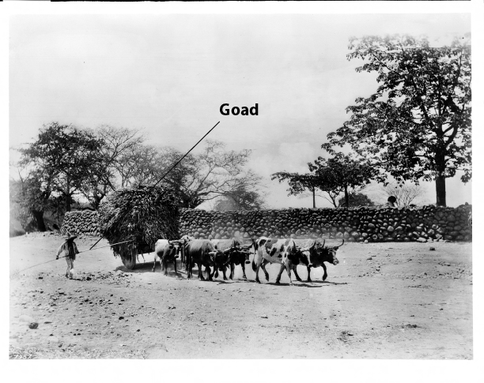

# Human-made Things in the Bible

## License Information

Human-made Things in the Bible © United Bible Societies, 2025. Adapted from: <cite>The Works of Their Hands: Man-made Things in the Bible</cite>, by Ray Pritz © 2009 United Bible Societies. This work is licensed under Creative Commons Attribution-ShareAlike 4.0 International (<a href="https://creativecommons.org/licenses/by-sa/4.0/">https://creativecommons.org/licenses/by-sa/4.0/</a>).

--------------------------------

## Goad (id: REALIA:1.1.2)

1\.1\.2 Goad
============

References:
-----------

Hebrew דָּרְבָן (darvan)

[1SA 13:21](https://ref.ly/1Sam13:21), [ECC 12:11](https://ref.ly/Eccl12:11)

Hebrew מַלְמַד (malmad)

[JDG 3:31](https://ref.ly/Judg3:31)

Greek κέντρον (kentron)

[ACT 26:14](https://ref.ly/Acts26:14), [SIR 38:25](https://ref.ly/Sir38:25), [4MA 14:19](https://ref.ly/4Macc14:19), [PSS 16:4](https://ref.ly/PssSol16:4)

Description:
------------

*Drawing of a man using a goad to spur on a team of oxen (© Unknown \- Wikimedia Commons)*

The goad was a stick, sometimes tipped with a metal point (*darvan*), used in driving draft animals or herds of domestic animals, such as sheep. The goad had to be long enough to reach the animal from the driver’s position, thus 1–2 meters (3–6 feet).

---

Usage:
------

The driver of a cart or other load stuck the point of the goad into the buttocks of an animal that was not pulling hard enough or in the right direction. The pain stimulus caused the animal to move or change direction.

---

Translation:
------------

Where draft animals are not known, “a goad” in [JDG 3:31](https://ref.ly/Judg3:31) may be translated “a pointed stick” or “a rod with a sharp metal point.” [ECC 12:11](https://ref.ly/Eccl12:11) may be expanded as follows: “The sayings of the wise are like the sharp sticks that shepherds use to guide sheep …” (GNT (Good News Translation (1992)); similarly the German common language translation \[GECL (German Common Language Version (Gute Nachricht Bibel))]) or “The words of experienced men are like goads that stimulate the spirit …” (French common language translation \[FRCL (French Common Language Version (Bible en français courant))]). Another possible rendering is “The words of wise men are sharp and pointed …” (Dutch common language translation \[DUCL (Dutch Common Language Version)]).

[ACT 26:14](https://ref.ly/Acts26:14): This is the only place in the New Testament where the word goad occurs. It is in the phrase “to kick against the goads” (RSV (Revised Standard Version (1952))), meaning to react against authority in such a way as to cause harm or suffering to yourself — to hurt yourself by reacting against a person or command. An alternative rendering for the last half of this verse is “Saul, why are you persecuting me? You are hurting yourself by your resistance.”

In [SIR 38:25](https://ref.ly/Sir38:25) the activity of the worker is in focus, so it is unnecessary to find a word to translate this object; for example, GNT (Good News Translation (1992)) has “How can a farm hand gain knowledge, when his only ambition is to drive the oxen and make them work …” Another possibility is “… to get the oxen to move when they want to stop pulling …?”

* **Associated Passages:** 1 Samuel 13:21; Ecclesiastes 12:11; Judges 3:31; Acts 26:14; Sirach 38:25; 4 Maccabees 14:19; Psalms of Solomon 16:4

