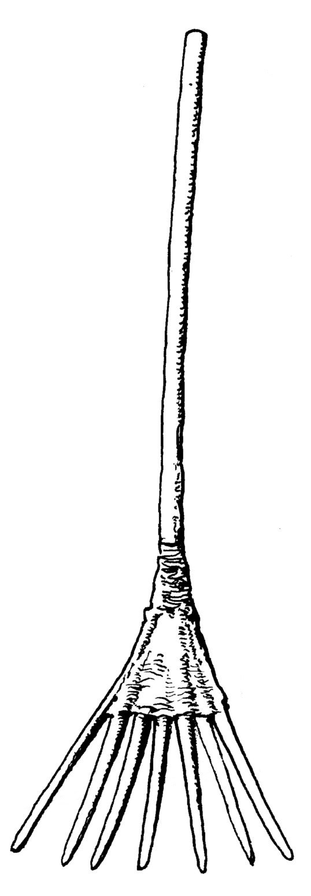

# Human-made Things in the Bible

## License Information

Human-made Things in the Bible © United Bible Societies, 2025. Adapted from: <cite>The Works of Their Hands: Man-made Things in the Bible</cite>, by Ray Pritz © 2009 United Bible Societies. This work is licensed under Creative Commons Attribution-ShareAlike 4.0 International (<a href="https://creativecommons.org/licenses/by-sa/4.0/">https://creativecommons.org/licenses/by-sa/4.0/</a>).

--------------------------------

## Winnowing fork (id: REALIA:1.1.8.3)

1\.1\.8\.3 Winnowing fork
=========================

References:
-----------

Hebrew זרה (zarah (verb))

[RUT 3:2](https://ref.ly/Ruth3:2), [PRO 20:8](https://ref.ly/Prov20:8), [PRO 20:26](https://ref.ly/Prov20:26), [ISA 30:24](https://ref.ly/Isa30:24), [ISA 41:16](https://ref.ly/Isa41:16), [JER 4:11](https://ref.ly/Jer4:11), [JER 15:7](https://ref.ly/Jer15:7), [JER 51:2](https://ref.ly/Jer51:2)

Hebrew מִזְרֶה (mizreh)

[ISA 30:24](https://ref.ly/Isa30:24), [JER 15:7](https://ref.ly/Jer15:7)

Hebrew רַחַת (rachath)

[ISA 30:24](https://ref.ly/Isa30:24)

Greek λικμάω (likmaō (verb))

[SIR 5:9](https://ref.ly/Sir5:9)

Greek πτύον (ptuon)

[MAT 3:12](https://ref.ly/Matt3:12), [LUK 3:17](https://ref.ly/Luke3:17)

Description:
------------

*(Image generated by ChatGPT using OpenAI technology)*

The winnowing fork was a wooden fork\-like implement, with five to seven prongs, for throwing threshed grain into the air so that the wind might separate the straw and chaff from the grain.

---

Usage:
------

See [1\.1\.8 Threshing and winnowing\<REALIA:1\.1\.8\>](#).

---

Translation:
------------

*A winnowing fork is used in separating grain from chaff (© Deutsche Bibelgesellschaft, Stuttgart by United Bible Societies)*

Where there is no receptor\-language term for a winnowing fork, translators may choose a descriptive phrase, for example, “a tool for throwing threshed grain into the air in order to let the chaff blow away.”

The Hebrew verb *zarah* means literally “to scatter.” It refers to a variety of operations in Scripture, including the process of winnowing.

*Wooden Spade, possibly used in winnowing (watercolor and graphite on paper, Archie Thompson, 1938\) (National Gallery of Art, CC0, via Wikimedia Commons)*

The Hebrew word *rachath* appears only once in Scripture at [ISA 30:24](https://ref.ly/Isa30:24), where its meaning is uncertain. It probably refers to a wooden implement with a long, flat blade attached to a long handle, similar to a spade but made of wood. The verse names two objects for performing the different stages of winnowing. The point of the verse is that even the food given to the animals will have been thoroughly prepared. Some translations eliminate the need to translate an implement by following the Septuagint; for example, CEV (Contemporary English Version) has “Even the oxen and donkeys that plow your fields will be fed the finest grain.”

In [SIR 5:9](https://ref.ly/Sir5:9) the activity of winnowing is used in a proverb. The literal text of the New Revised Standard Version (NRSV (New Revised Standard Version (1989))) says “Do not winnow in every wind, or follow every path,” but GNT (Good News Translation (1992)) restructures (and reverses the order of) verses 9 and 10 to give the meaning of the proverb: “Don’t try to please everyone or agree with everything people say.”

* **Associated Passages:** Ruth 3:2; Proverbs 20:8; Proverbs 20:26; Isaiah 30:24; Isaiah 41:16; Jeremiah 4:11; Jeremiah 15:7; Jeremiah 51:2; Sirach 5:9; Matthew 3:12; Luke 3:17

