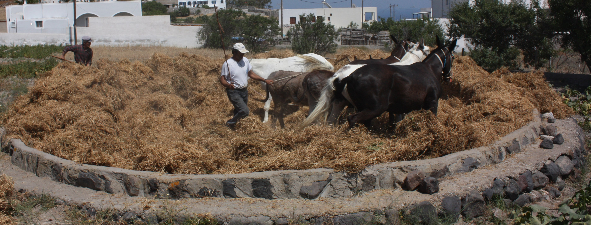

# Human-made Things in the Bible

## License Information

Human-made Things in the Bible © United Bible Societies, 2025. Adapted from: <cite>The Works of Their Hands: Man-made Things in the Bible</cite>, by Ray Pritz © 2009 United Bible Societies. This work is licensed under Creative Commons Attribution-ShareAlike 4.0 International (<a href="https://creativecommons.org/licenses/by-sa/4.0/">https://creativecommons.org/licenses/by-sa/4.0/</a>).

--------------------------------

## Threshing and winnowing (id: REALIA:1.1.8)

1\.1\.8 Threshing and winnowing
===============================

Threshing was the process of separating the grain from the straw by beating it with flails or having animals trample it or dragging a threshing board (see [1\.1\.8\.2 Threshing board, sledge\<REALIA:1\.1\.8\.2\>](#)) over it
--------------------------------------------------------------------------------------------------------------------------------------------------------------------------------------------------------------------------------

Winnowing consisted of throwing the straw, chaff, grain, and dust into the wind with a wooden winnowing fork (see [1\.1\.8\.3 Winnowing fork\<REALIA:1\.1\.8\.3\>](#)) or a winnowing basket (see [1\.1\.8\.4 Sieve, winnowing basket\<REALIA:1\.1\.8\.4\>](#)). The heavier grains would fall back on the threshing floor or into the basket, while the wind would carry away the dust, the chaff, and the straw. The stalks of grain, which had thus been cut and separated from the heads of grain, were used for fodder for the animals.

In the land of Israel the wind normally begins to blow about two o’clock in the afternoon and continues through the evening and into the night. It is important that the wind is not too strong or blustery, and this may explain why the evening was regarded as the best time for winnowing.

The final stage of winnowing consisted of sifting the remaining foreign bodies out of the grain. This was done with a kind of sieve made of a wooden hoop to the bottom of which was fixed a mesh of crisscrossed strips of cane, leather, tree bark, or straw.

Where a technical term for winnowing is lacking, it is sometimes possible to use a descriptive phrase, such as “shaking out the dirt from the grain,” “separating the grain from the chaff,” or “separating the grain from the leaves.”

## Threshing floor (id: REALIA:1.1.8.1)

1\.1\.8\.1 Threshing floor
==========================

References:
-----------

Aramaic אִדְּרֵי (’idar)

[DAN 2:35](https://ref.ly/Dan2:35)

Hebrew גֹּרֶן (goren)

[NUM 15:20](https://ref.ly/Num15:20), [NUM 18:27](https://ref.ly/Num18:27), [NUM 18:30](https://ref.ly/Num18:30), [DEU 15:14](https://ref.ly/Deut15:14), [DEU 16:13](https://ref.ly/Deut16:13), [JDG 6:37](https://ref.ly/Judg6:37), [RUT 3:2](https://ref.ly/Ruth3:2), [RUT 3:3](https://ref.ly/Ruth3:3), [RUT 3:6](https://ref.ly/Ruth3:6), [RUT 3:14](https://ref.ly/Ruth3:14), [1SA 23:1](https://ref.ly/1Sam23:1), [2SA 24:16](https://ref.ly/2Sam24:16), [2SA 24:18](https://ref.ly/2Sam24:18), [2SA 24:21](https://ref.ly/2Sam24:21), [2SA 24:24](https://ref.ly/2Sam24:24), [1KI 22:10](https://ref.ly/1Kgs22:10), [2KI 6:27](https://ref.ly/2Kgs6:27), [1CH 21:15](https://ref.ly/1Chr21:15), [1CH 21:18](https://ref.ly/1Chr21:18), [1CH 21:21](https://ref.ly/1Chr21:21), [1CH 21:22](https://ref.ly/1Chr21:22), [1CH 21:28](https://ref.ly/1Chr21:28), [2CH 3:1](https://ref.ly/2Chr3:1), [2CH 18:9](https://ref.ly/2Chr18:9), [JOB 39:12](https://ref.ly/Job39:12), [ISA 21:10](https://ref.ly/Isa21:10), [JER 2:25](https://ref.ly/Jer2:25), [JER 51:33](https://ref.ly/Jer51:33), [HOS 9:1](https://ref.ly/Hos9:1), [HOS 9:2](https://ref.ly/Hos9:2), [HOS 13:3](https://ref.ly/Hos13:3), [JOL 2:24](https://ref.ly/Joel2:24), [MIC 4:12](https://ref.ly/Mic4:12)

Greek ἅλων (halōn)

[MAT 3:12](https://ref.ly/Matt3:12), [LUK 3:17](https://ref.ly/Luke3:17)

Latin area

[2ES 4:30](https://ref.ly/2Esd4:30), [2ES 4:39](https://ref.ly/2Esd4:39), [2ES 9:17](https://ref.ly/2Esd9:17)

Description:
------------

*Threshing floor (© Klearchos Kapoutsis, CC BY 2\.0, via Wikimedia Commons)*

The threshing floor was a level, circular area about 7\.5 to 12 meters (25–40 feet) in diameter. It was usually located near the fields where the grain was grown, and if possible it was in an elevated area that was exposed to the breeze (see [1\.1\.8\.3 Winnowing fork\<REALIA:1\.1\.8\.3\>](#)). Where possible, the threshing floor was located near the village so that the grain could be guarded. The floor was either bedrock or earth that was packed down to make it hard. It was often bordered with rocks to hold in the grain.

---

Usage:
------

After grain has been cut, the individual kernels have to be separated from the stalk and the outer seed covering. The cut grain was laid out on the threshing floor. The process of separating the stalks and seed coverings from the kernels could be done by several methods: 1\) dragging a threshing sledge (see [1\.1\.8\.2 Threshing board, sledge\<REALIA:1\.1\.8\.2\>](#)) over the grain, 2\) having animals walk back and forth over it, or 3\) beating it with some implement.

---

Translation:
------------

In [JER 51:33](https://ref.ly/Jer51:33) and [MIC 4:12](https://ref.ly/Mic4:12) the threshing floor symbolizes judgment or punishment. Where threshing is unknown and the meaning would not be clear, it may be made explicit; for example, GNT (Good News Translation (1992)) renders [MIC 4:12](https://ref.ly/Mic4:12) b as follows: “They do not realize that they have been gathered together to be punished in the same way that grain is brought in to be threshed.” Compare also the alternative suggested by *A Handbook on The Gospel of Matthew* for [MAT 3:12](https://ref.ly/Matt3:12): “He is ready to judge and separate the good people from the bad, like the farmer who is ready to separate the grain from the chaff with his winnowing fork; he will keep safe the good, like the farmer puts wheat into his granary, and just as the farmer clears his threshing floor of the chaff and burns it in a fire, he will cause the bad people to burn in a fire that never goes out” (page 70\).

In [MAT 3:12](https://ref.ly/Matt3:12) and [LUK 3:17](https://ref.ly/Luke3:17) the meaning of *halōn* as “threshing floor” forms the basis for the figurative extension of meaning referring to the threshed grain still lying on the threshing floor. This meaning may be made clear by rendering the literal text “he will clear his threshing floor” as “he will thresh out completely all of the grain.” On the other hand, it is possible to interpret *halōn* in both New Testament references in a literal sense and translate “he will clean up his threshing floor,” that is, by gathering up the grain and getting rid of the straw and chaff.

* **Associated Passages:** Daniel 2:35; Numbers 15:20; Numbers 18:27; Numbers 18:30; Deuteronomy 15:14; Deuteronomy 16:13; Judges 6:37; Ruth 3:2; Ruth 3:3; Ruth 3:6; Ruth 3:14; 1 Samuel 23:1; 2 Samuel 24:16; 2 Samuel 24:18; 2 Samuel 24:21; 2 Samuel 24:24; 1 Kings 22:10; 2 Kings 6:27; 1 Chronicles 21:15; 1 Chronicles 21:18; 1 Chronicles 21:21; 1 Chronicles 21:22; 1 Chronicles 21:28; 2 Chronicles 3:1; 2 Chronicles 18:9; Job 39:12; Isaiah 21:10; Jeremiah 2:25; Jeremiah 51:33; Hosea 9:1; Hosea 9:2; Hosea 13:3; Joel 2:24; Micah 4:12; Matthew 3:12; Luke 3:17; 2 Esdras (Latin) 4:30; 2 Esdras (Latin) 4:39; 2 Esdras (Latin) 9:17

* **Associated ACAI Concepts:** Threshing Floor (ID: `realia:ThreshingFloor`)

## Threshing board, sledge (id: REALIA:1.1.8.2)

1\.1\.8\.2 Threshing board, sledge
==================================

References:
-----------

Hebrew חָרוּץ (charuts)

[JOB 41:22](https://ref.ly/Job41:22), [ISA 28:27](https://ref.ly/Isa28:27), [ISA 41:15](https://ref.ly/Isa41:15), [AMO 1:3](https://ref.ly/Amos1:3)

Hebrew מוֹרַג (morag)

[2SA 24:22](https://ref.ly/2Sam24:22), [1CH 21:23](https://ref.ly/1Chr21:23), [ISA 41:15](https://ref.ly/Isa41:15)

Hebrew עֲגָלָה (‘agalah, ‘eglah)

[ISA 28:27](https://ref.ly/Isa28:27), [ISA 28:28](https://ref.ly/Isa28:28)

Description:
------------

*Bottom of a threshing board (© Renyrt, CC BY\-SA 3\.0, via Wikimedia Commons)*

The threshing board was a flat wooden surface made of a single piece of wood or several boards attached side\-by\-side. It measured roughly 1\.5 by 1 meter (5 by 3 feet). On one surface a number of small holes were carved, and into these holes hard, sharp stones (flint or basalt) or metal pieces were tightly wedged.

---

Usage:
------

*Iron threshing board (© CarlosVdeHabsburgo, CC BY\-SA 4\.0, via Wikimedia Commons)*

The threshing board, with the stone side downward, was dragged over the stalks of grain by a draft animal, to which it was attached by ropes. To increase the weight (and the effectiveness) of the implement, the farmer might stand or sit on the board as it was pulled. As the board with its embedded stones passed over the grain, the kernels were separated from the stalks and the seed coverings, while the straw was cut into chaff. See [1\.1\.8 Threshing and winnowing\<REALIA:1\.1\.8\>](#) above.

---

Translation:
------------

*(Image generated by ChatGPT using OpenAI technology)*

[ISA 28:27](https://ref.ly/Isa28:27); [ISA 28:28](https://ref.ly/Isa28:28) uses several terms for instruments that performed basically the same function. The *‘agalah* /*‘eglah* was probably a sledge with sharp discs and a seat on top. The point of the agricultural reference in verse 27 is that the seeds mentioned, dill and cumin, are too small to be threshed in the same way as larger grains such as wheat and barley. The Hebrew word *charuts* probably indicates a threshing board with iron spikes instead of stones. The Hebrew word *’ofan* in verse 27 refers to the wheel of a cart (see [8\.3 Wheel\<REALIA:8\.3\>](#)).

[AMO 1:3](https://ref.ly/Amos1:3) speaks of “threshing sledges of iron” (RSV (Revised Standard Version (1952))). This does not mean that the platform was made of iron but rather that iron spikes were protruding from the wooden platform instead of the usual stones. This language in [AMO 1:3](https://ref.ly/Amos1:3) is probably figurative, and where that sense would be lost, the last half of this verse may be expanded to say “because they destroyed the people of Gilead like someone threshes grain with iron\-studded sledges.” Or it may be rendered nonfiguratively as in GNT (Good News Translation (1992)), which reads “They treated the people of Gilead with savage cruelty.”

* **Associated Passages:** Job 41:22; Isaiah 28:27; Isaiah 41:15; Amos 1:3; 2 Samuel 24:22; 1 Chronicles 21:23; Isaiah 28:28

* **Associated ACAI Concepts:** Threshing-Sledge (ID: `realia:Threshing-sledge`)

## Winnowing fork (id: REALIA:1.1.8.3)

1\.1\.8\.3 Winnowing fork
=========================

References:
-----------

Hebrew זרה (zarah (verb))

[RUT 3:2](https://ref.ly/Ruth3:2), [PRO 20:8](https://ref.ly/Prov20:8), [PRO 20:26](https://ref.ly/Prov20:26), [ISA 30:24](https://ref.ly/Isa30:24), [ISA 41:16](https://ref.ly/Isa41:16), [JER 4:11](https://ref.ly/Jer4:11), [JER 15:7](https://ref.ly/Jer15:7), [JER 51:2](https://ref.ly/Jer51:2)

Hebrew מִזְרֶה (mizreh)

[ISA 30:24](https://ref.ly/Isa30:24), [JER 15:7](https://ref.ly/Jer15:7)

Hebrew רַחַת (rachath)

[ISA 30:24](https://ref.ly/Isa30:24)

Greek λικμάω (likmaō (verb))

[SIR 5:9](https://ref.ly/Sir5:9)

Greek πτύον (ptuon)

[MAT 3:12](https://ref.ly/Matt3:12), [LUK 3:17](https://ref.ly/Luke3:17)

Description:
------------

*(Image generated by ChatGPT using OpenAI technology)*

The winnowing fork was a wooden fork\-like implement, with five to seven prongs, for throwing threshed grain into the air so that the wind might separate the straw and chaff from the grain.

---

Usage:
------

See [1\.1\.8 Threshing and winnowing\<REALIA:1\.1\.8\>](#).

---

Translation:
------------

*A winnowing fork is used in separating grain from chaff (© Deutsche Bibelgesellschaft, Stuttgart by United Bible Societies)*

Where there is no receptor\-language term for a winnowing fork, translators may choose a descriptive phrase, for example, “a tool for throwing threshed grain into the air in order to let the chaff blow away.”

The Hebrew verb *zarah* means literally “to scatter.” It refers to a variety of operations in Scripture, including the process of winnowing.

*Wooden Spade, possibly used in winnowing (watercolor and graphite on paper, Archie Thompson, 1938\) (National Gallery of Art, CC0, via Wikimedia Commons)*

The Hebrew word *rachath* appears only once in Scripture at [ISA 30:24](https://ref.ly/Isa30:24), where its meaning is uncertain. It probably refers to a wooden implement with a long, flat blade attached to a long handle, similar to a spade but made of wood. The verse names two objects for performing the different stages of winnowing. The point of the verse is that even the food given to the animals will have been thoroughly prepared. Some translations eliminate the need to translate an implement by following the Septuagint; for example, CEV (Contemporary English Version) has “Even the oxen and donkeys that plow your fields will be fed the finest grain.”

In [SIR 5:9](https://ref.ly/Sir5:9) the activity of winnowing is used in a proverb. The literal text of the New Revised Standard Version (NRSV (New Revised Standard Version (1989))) says “Do not winnow in every wind, or follow every path,” but GNT (Good News Translation (1992)) restructures (and reverses the order of) verses 9 and 10 to give the meaning of the proverb: “Don’t try to please everyone or agree with everything people say.”

* **Associated Passages:** Ruth 3:2; Proverbs 20:8; Proverbs 20:26; Isaiah 30:24; Isaiah 41:16; Jeremiah 4:11; Jeremiah 15:7; Jeremiah 51:2; Sirach 5:9; Matthew 3:12; Luke 3:17

* **Associated ACAI Concepts:** Winnowing Fork (ID: `realia:WinnowingFork`)

## Sieve, winnowing basket (id: REALIA:1.1.8.4)

1\.1\.8\.4 Sieve, winnowing basket
==================================

References:
-----------

Hebrew כְּבָרָה (kvarah)

[AMO 9:9](https://ref.ly/Amos9:9)

Hebrew נָפָה (nafah)

[ISA 30:28](https://ref.ly/Isa30:28)

Hebrew נוף (nuf)

[ISA 30:28](https://ref.ly/Isa30:28)

Greek κόσκινον (koskinon)

[SIR 27:4](https://ref.ly/Sir27:4)

Greek σινιάζω (siniazō (verb))

[LUK 22:31](https://ref.ly/Luke22:31)

Description:
------------

*Winnowing baskets or sieves for separating grain and chaff (© Israel Government Press Office)*

The second stage of winnowing was carried out with a shallow, flat circular kind of sieve. This sieve had a mesh bottom made of straw, cord, strips of bark, or reed. The fineness of the mesh varied according to the purpose for which it was intended.

---

Translation:
------------

Some languages may have a different word for an instrument that sifts dry things, like grains, and one that allows liquids to pass through but keeps the solids. In all of the references above it is the former instrument that is intended.

[ISA 30:28](https://ref.ly/Isa30:28): This verse comes in a context that describes the punishment and destruction of the nations, which is compared to shaking something back and forth in a sieve in the third line of this verse: “to sift the nations with the sieve of destruction” (NRSV (New Revised Standard Version (1989))). GECL (German Common Language Version (Gute Nachricht Bibel)) expands the four Hebrew words in this line to “He shakes the nations in his sieve and throws them out like worthless chaff.” In some languages even such an expansion will not give sufficient understanding, and it may be best to drop the image of the sieve. GNT (Good News Translation (1992)) drops both the picture of the sieve and the following one of putting a bit in the mouth of an animal and combines them into “It \[the wind] sweeps nations to destruction and puts an end to their evil plans.” Almost all translations consulted attempt to maintain the image of sifting. The Hebrew word *nafah* may indicate a finer sieve, more appropriate for something like flour.

*Woman sifting grain with a sieve (© Deutsche Bibelgesellschaft, Stuttgart by United Bible Societies)*

[AMO 9:9](https://ref.ly/Amos9:9): The Hebrew word for sieve here probably refers to a coarse type of sieve in which stones are kept while the grain passes through. The same type of sieve was also used by bricklayers, who separated the larger stones from the fine sand that they used for mortar. The picture used here could therefore be based on either grain or sand. It does not really matter which picture the translator chooses, since the important point is that not one of the stones gets through the sieve. They will all be caught and then discarded.

God is commanding the enemy to treat Israel like this; none of the sinners among the people of Israel will escape punishment, just as no stone gets through the sieve. It may be possible to translate “I will shake/sift the people of Israel like someone shakes sand \[or, grain] in a sieve, through which not a single stone falls to the ground. I will shake/sift them to remove the bad people from among them.”

While the physical object “sieve” is not mentioned in [LUK 22:31](https://ref.ly/Luke22:31), the act of sifting is. Some languages will find it more natural to speak of the instrument with which the action is performed; compare ITCL (Italian Common Language Version) “… to pass you all through a sieve, as is done with grain to separate it.”

* **Associated Passages:** Amos 9:9; Isaiah 30:28; Sirach 27:4; Luke 22:31

* **Associated ACAI Concepts:** Sieve (ID: `realia:Sieve`)
