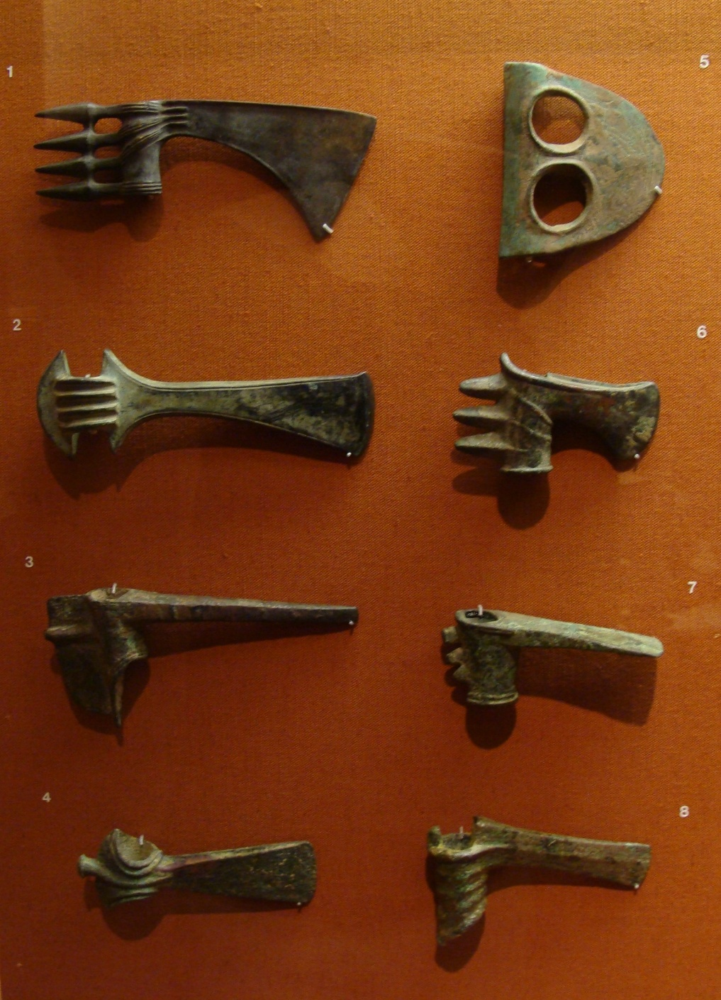

# Human-made Things in the Bible

## License Information

Human-made Things in the Bible © United Bible Societies, 2025. Adapted from: <cite>The Works of Their Hands: Man-made Things in the Bible</cite>, by Ray Pritz © 2009 United Bible Societies. This work is licensed under Creative Commons Attribution-ShareAlike 4.0 International (<a href="https://creativecommons.org/licenses/by-sa/4.0/">https://creativecommons.org/licenses/by-sa/4.0/</a>).

--------------------------------

## Axe, adze (id: REALIA:1.1.9.3)

1\.1\.9\.3 Axe, adze
====================

References:
-----------

Hebrew בַּרְזֶל (barzel)

[DEU 19:5](https://ref.ly/Deut19:5), [2KI 6:5](https://ref.ly/2Kgs6:5), [2KI 6:6](https://ref.ly/2Kgs6:6), [ISA 10:34](https://ref.ly/Isa10:34)

Hebrew גַּרְזֶן (garzen)

[DEU 19:5](https://ref.ly/Deut19:5), [DEU 20:19](https://ref.ly/Deut20:19), [1KI 6:7](https://ref.ly/1Kgs6:7), [ISA 10:15](https://ref.ly/Isa10:15)

Hebrew מַעֲצָד (ma‘atsad)

[JER 10:3](https://ref.ly/Jer10:3)

Hebrew קַרְדֹּם (qardom)

[JDG 9:48](https://ref.ly/Judg9:48), [1SA 13:20](https://ref.ly/1Sam13:20), [1SA 13:21](https://ref.ly/1Sam13:21), [PSA 74:5](https://ref.ly/Ps74:5), [JER 46:22](https://ref.ly/Jer46:22)

Greek ἀξίνη (axinē)

[MAT 3:10](https://ref.ly/Matt3:10), [LUK 3:9](https://ref.ly/Luke3:9)

Greek πέλεκυς (pelekus)

[LJE 1:13](https://ref.ly/EpJer1:13)

Description:
------------

*Adze with wooden handle (Metropolitan Museum of Art, CC0, via Wikimedia Commons)*

The axe or adze was an instrument with a metal, sharp\-edged head attached to a wooden handle about the length of a man’s arm. The handle was usually wedged tightly into a hole opposite the sharp blade, and it could be held more firmly in place by cords bound around the head and handle. The blade of the axe (*garzen*) was parallel to the handle, while the blade of the adze (*qardom*) was perpendicular to the handle.

---

Usage:
------

*Various bronze socketed axe and adze heads, Syria and Iran (2nd\-1st millenia BCE, San Antonio Museum of Art, Near Eastern collection) (© Zereshk, CC BY\-SA 3\.0, via Wikimedia Commons)*

It was used to cut down trees and woody plants as well as to chop them into smaller pieces. It could also serve as a carpenter’s tool for shaping wood.

---

Translation:
------------

It is likely that the axe mentioned in [LJE 1:13](https://ref.ly/EpJer1:13) is a kind of weapon rather than a work tool. While the general form of the implement was the same, some languages may make a distinction between the work tool and the weapon. It is also possible to translate the first half of this verse more generally; for example, “Sometimes they are holding weapons.”

* **Associated Passages:** Deuteronomy 19:5; 2 Kings 6:5; 2 Kings 6:6; Isaiah 10:34; Deuteronomy 20:19; 1 Kings 6:7; Isaiah 10:15; Jeremiah 10:3; Judges 9:48; 1 Samuel 13:20; 1 Samuel 13:21; Psalms 74:5; Jeremiah 46:22; Matthew 3:10; Luke 3:9; Letter of Jeremiah 1:13

