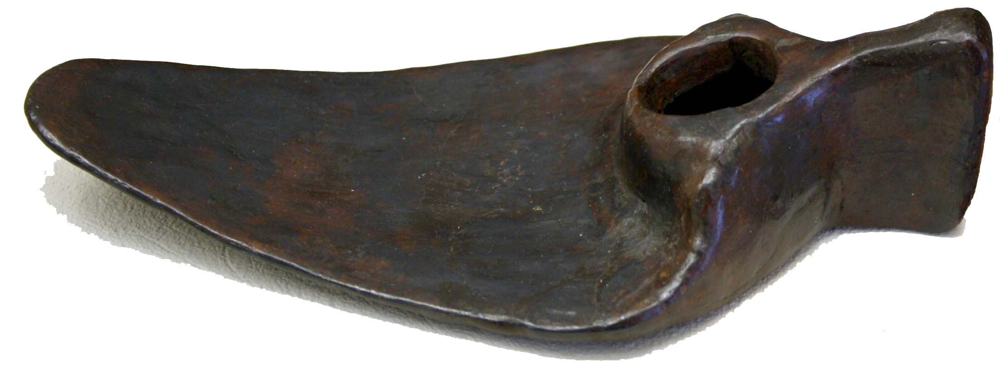
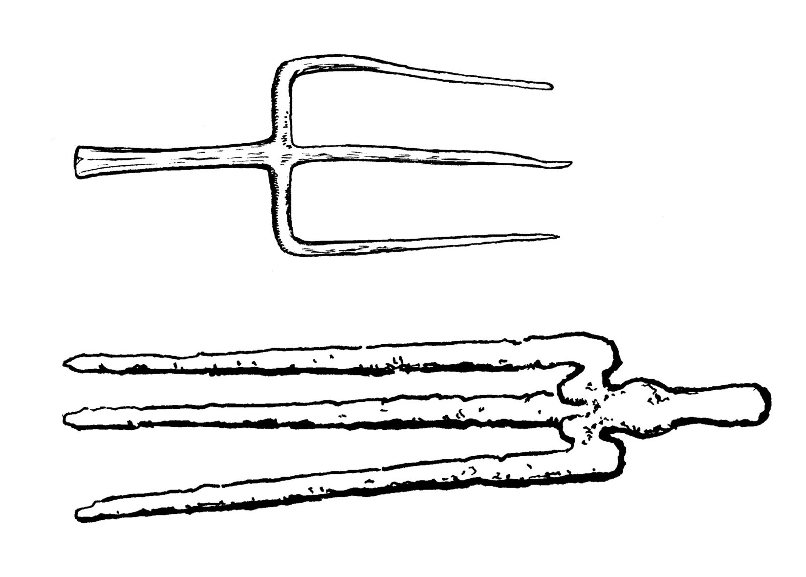
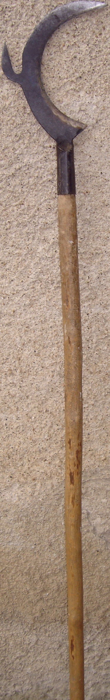

# Human-made Things in the Bible

## License Information

Human-made Things in the Bible © United Bible Societies, 2025. Adapted from: <cite>The Works of Their Hands: Man-made Things in the Bible</cite>, by Ray Pritz © 2009 United Bible Societies. This work is licensed under Creative Commons Attribution-ShareAlike 4.0 International (<a href="https://creativecommons.org/licenses/by-sa/4.0/">https://creativecommons.org/licenses/by-sa/4.0/</a>).

--------------------------------

## Iron tools (id: REALIA:1.1.9)

1\.1\.9 Iron tools
==================

[1SA 13:20](https://ref.ly/1Sam13:20); [1SA 13:21](https://ref.ly/1Sam13:21) presents a special problem to the translator, with a list of between five and seven different implements, depending on how the somewhat obscure Hebrew is interpreted. The following list is according to the translation order of RSV (Revised Standard Version (1952)):
------------------------------------------------------------------------------------------------------------------------------------------------------------------------------------------------------------------------------------------------------------------------------------------------------------------------------------------------------

“Plowshare” (*macharesheth*): Some commentators have suggested that this first word in the list is a general term, meaning “tools for working the soil.” What follow would then be separate instruments, including the *machareshah*, which appears in Hebrew with exactly the same consonants, made different only by the vowel points. This interpretation is, however, far from certain.

“Mattock” (*’eth*): This possibly means “plowshare” (see [1\.1\.5 Plow and plowshare\<REALIA:1\.1\.5\>](#)), although ancient mattocks (a kind of hoe) have been found.

“Axe” (*qardom*): This is translated also by the Septuagint as “axe” (*axinē* in Greek). More precisely, it was probably an axe\-like implement with a blade that was perpendicular to the handle. The implement served as a kind of hoe for loosening the soil or like an adze for shaping wood (see [1\.1\.9\.3 Axe, adze\<REALIA:1\.1\.9\.3\>](#)).

“Sickle” (*machareshah*): Here again RSV (Revised Standard Version (1952)) has followed the Septuagint in translating “sickle” (see [1\.1\.6 Sickle\<REALIA:1\.1\.6\>](#)). However, another ancient translator renders the word as a kind of small garden hoe used for loosening and weeding the soil, and this interpretation is preferred here (see [1\.1\.9\.1 Hoe\<REALIA:1\.1\.9\.1\>](#)).

“The charge was a pim” (*haptsirah fim*): See the discussion on *pim*[Pim\<REALIA:11\.1\.3\>](#)

“A third of a shekel” (*shlosh qilshon*): Here again the meaning of the Hebrew is uncertain. Many translations see this as a second (and lower) price for sharpening two of the smaller implements. This translation assumes that letters have been reversed in the Hebrew text (see Hebrew Old Testament Text Project \[HOTTP (Hebrew Old Testament Text Project (UBS))]). A number of commentators and translators prefer to see here another kind of farming implement, a kind of three\-pronged rake or fork on a wooden handle. If it was a rake, it was used to scrape together loose cuttings. However, more likely it was a fork, which would need its points sharpened from time to time. Such a fork was used to lift piles of cuttings.

“Goad” (*darvan*): See [1\.1\.2 Goad\<REALIA:1\.1\.2\>](#).

The general point of this passage is that the Israelites were forced to take their blunt farming implements to the Philistines for sharpening. Where a language lacks equivalent words for several of the implements, a translation may express the idea with a general statement by rendering verses 20–21 as follows: “The Israelites had to go to the Philistines to have their iron farming tools sharpened. The price varied according to the tool.” Another possible model is “… to sharpen their iron farming tools which had become blunted. The price varied according to the tool.” See also the comments on this passage in *A Handbook on the First and Second Books of Samuel*, pages 267–269\.

* **Associated Passages:** 1 Samuel 13:20; 1 Samuel 13:21

## Hoe (id: REALIA:1.1.9.1)

1\.1\.9\.1 Hoe
==============

References:
-----------

Hebrew מַחֲרֵשָׁה (machareshah)

[1SA 13:20](https://ref.ly/1Sam13:20), [1SA 13:20](https://ref.ly/1Sam13:20), [1SA 13:21](https://ref.ly/1Sam13:21)

Hebrew מַעְדֵּר (ma‘der)

[ISA 7:25](https://ref.ly/Isa7:25)

Description:
------------

*Man using a hoe (Metropolitan Museum of Art, CC0, MMA)*

The hoe was a flat metal blade, 10–20 centimeters (4–8 inches) wide, mounted on a wooden handle with the blade at a right angle to the handle. The illustration to the left shows the blade without a handle.

---

Usage:
------

This implement was used to loosen the soil, especially for weeding.

---

Translation:
------------

*Hoe blade (Roman) (© Giovanni Dall'Orto, Attribution, via Wikimedia Commons)*

See the note on [1SA 13:20](https://ref.ly/1Sam13:20); [1SA 13:21](https://ref.ly/1Sam13:21) at [1\.1\.9 Iron tools\<REALIA:1\.1\.9\>](#).

* **Associated Passages:** 1 Samuel 13:20; 1 Samuel 13:21; Isaiah 7:25

## Fork (id: REALIA:1.1.9.2)

1\.1\.9\.2 Fork
===============

Reference:
----------

Hebrew שְׁלֹשׁ קִלְּשֹׁון (shlosh qilshon)

[1SA 13:21](https://ref.ly/1Sam13:21)

Description:
------------

*Three\-pronged fork heads (© Deutsche Bibelgesellschaft, Stuttgart by United Bible Societies)*

The fork was an iron head consisting of two or three pointed prongs attached to the end of a wooden handle approximately 1–1\.3 meters (3–4 feet) in length.

---

Usage:
------

The fork was used by farmers and field workers to lift piles of cuttings.

---

Translation:
------------

See the discussion on [1SA 13:20](https://ref.ly/1Sam13:20); [1SA 13:21](https://ref.ly/1Sam13:21) above.

* **Associated Passages:** 1 Samuel 13:21; 1 Samuel 13:20

## Axe, adze (id: REALIA:1.1.9.3)

1\.1\.9\.3 Axe, adze
====================

References:
-----------

Hebrew בַּרְזֶל (barzel)

[DEU 19:5](https://ref.ly/Deut19:5), [2KI 6:5](https://ref.ly/2Kgs6:5), [2KI 6:6](https://ref.ly/2Kgs6:6), [ISA 10:34](https://ref.ly/Isa10:34)

Hebrew גַּרְזֶן (garzen)

[DEU 19:5](https://ref.ly/Deut19:5), [DEU 20:19](https://ref.ly/Deut20:19), [1KI 6:7](https://ref.ly/1Kgs6:7), [ISA 10:15](https://ref.ly/Isa10:15)

Hebrew מַעֲצָד (ma‘atsad)

[JER 10:3](https://ref.ly/Jer10:3)

Hebrew קַרְדֹּם (qardom)

[JDG 9:48](https://ref.ly/Judg9:48), [1SA 13:20](https://ref.ly/1Sam13:20), [1SA 13:21](https://ref.ly/1Sam13:21), [PSA 74:5](https://ref.ly/Ps74:5), [JER 46:22](https://ref.ly/Jer46:22)

Greek ἀξίνη (axinē)

[MAT 3:10](https://ref.ly/Matt3:10), [LUK 3:9](https://ref.ly/Luke3:9)

Greek πέλεκυς (pelekus)

[LJE 1:13](https://ref.ly/EpJer1:13)

Description:
------------

*Adze with wooden handle (Metropolitan Museum of Art, CC0, via Wikimedia Commons)*

The axe or adze was an instrument with a metal, sharp\-edged head attached to a wooden handle about the length of a man’s arm. The handle was usually wedged tightly into a hole opposite the sharp blade, and it could be held more firmly in place by cords bound around the head and handle. The blade of the axe (*garzen*) was parallel to the handle, while the blade of the adze (*qardom*) was perpendicular to the handle.

---

Usage:
------

*Various bronze socketed axe and adze heads, Syria and Iran (2nd\-1st millenia BCE, San Antonio Museum of Art, Near Eastern collection) (© Zereshk, CC BY\-SA 3\.0, via Wikimedia Commons)*

It was used to cut down trees and woody plants as well as to chop them into smaller pieces. It could also serve as a carpenter’s tool for shaping wood.

---

Translation:
------------

It is likely that the axe mentioned in [LJE 1:13](https://ref.ly/EpJer1:13) is a kind of weapon rather than a work tool. While the general form of the implement was the same, some languages may make a distinction between the work tool and the weapon. It is also possible to translate the first half of this verse more generally; for example, “Sometimes they are holding weapons.”

* **Associated Passages:** Deuteronomy 19:5; 2 Kings 6:5; 2 Kings 6:6; Isaiah 10:34; Deuteronomy 20:19; 1 Kings 6:7; Isaiah 10:15; Jeremiah 10:3; Judges 9:48; 1 Samuel 13:20; 1 Samuel 13:21; Psalms 74:5; Jeremiah 46:22; Matthew 3:10; Luke 3:9; Letter of Jeremiah 1:13

## Pruning knife (id: REALIA:1.1.9.4)

1\.1\.9\.4 Pruning knife
========================

References:
-----------

Hebrew מַזְמֵרָה (mazmerah)

[ISA 2:4](https://ref.ly/Isa2:4), [ISA 18:5](https://ref.ly/Isa18:5), [JOL 4:10](https://ref.ly/Joel4:10), [MIC 4:3](https://ref.ly/Mic4:3)

Description:
------------

*Pruning hook (Lax1, Public domain, via Wikimedia Commons)*

The pruning knife was a knife or metal blade, sometimes attached to a long wooden handle.

---

Usage:
------

The pruning process involved cutting away or cutting back unproductive branches so they could produce better.

---

Translation:
------------

All of the references, except [ISA 18:5](https://ref.ly/Isa18:5), are to making spears into pruning knives or vice versa. Where metal plows and pruning knives are not used as agricultural tools, some adjustment in this figure will be necessary. The essential point is that instruments of war and bloodshed will be replaced by instruments of peace and prosperity (or the opposite in [JOL 4:10](https://ref.ly/Joel4:10)). If iron instruments are not used in an area, it may not be possible to keep the idea that the weapons themselves are made into agricultural tools. In such a case, a translator can simply say that people will destroy their weapons and make tools for farming instead.

* **Associated Passages:** Isaiah 2:4; Isaiah 18:5; Joel 4:10; Micah 4:3

