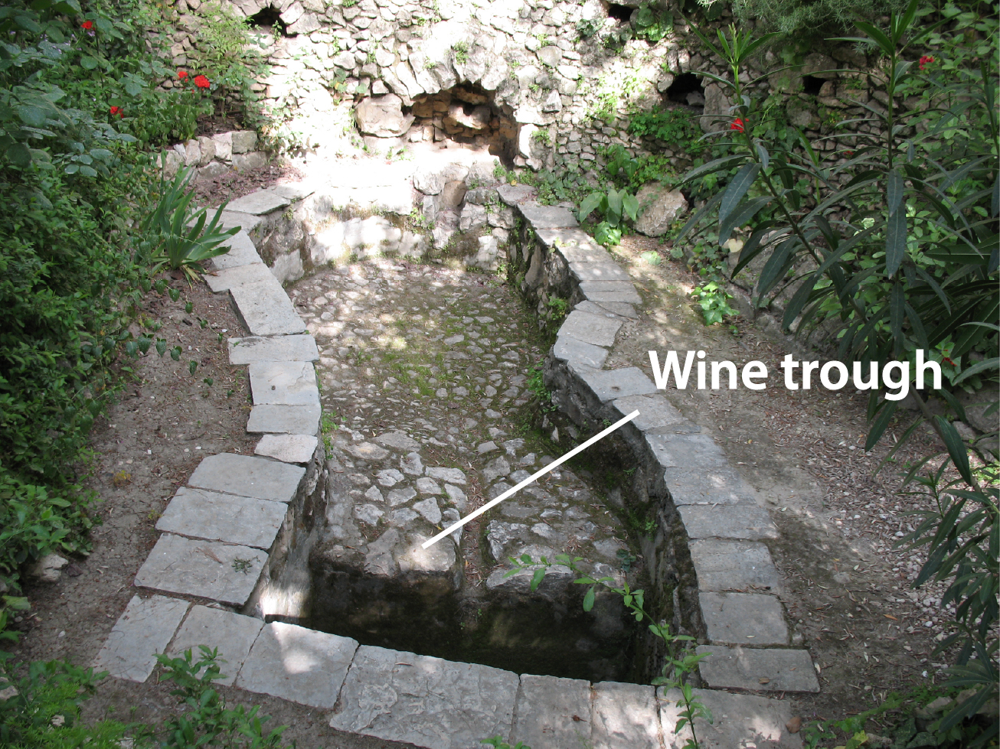

# Human-made Things in the Bible

## License Information

Human-made Things in the Bible © United Bible Societies, 2025. Adapted from: <cite>The Works of Their Hands: Man-made Things in the Bible</cite>, by Ray Pritz © 2009 United Bible Societies. This work is licensed under Creative Commons Attribution-ShareAlike 4.0 International (<a href="https://creativecommons.org/licenses/by-sa/4.0/">https://creativecommons.org/licenses/by-sa/4.0/</a>).

--------------------------------

## Wine press (id: REALIA:1.1.10)

1\.1\.10 Wine press
===================

References:
-----------

Hebrew גַּת (gath)

[JDG 6:11](https://ref.ly/Judg6:11), [NEH 13:15](https://ref.ly/Neh13:15), [ISA 63:2](https://ref.ly/Isa63:2), [LAM 1:15](https://ref.ly/Lam1:15), [JOL 4:13](https://ref.ly/Joel4:13)

Hebrew יֶקֶב (yeqev)

[NUM 18:27](https://ref.ly/Num18:27), [NUM 18:30](https://ref.ly/Num18:30), [DEU 15:14](https://ref.ly/Deut15:14), [DEU 16:13](https://ref.ly/Deut16:13), [JDG 7:25](https://ref.ly/Judg7:25), [2KI 6:27](https://ref.ly/2Kgs6:27), [JOB 24:11](https://ref.ly/Job24:11), [PRO 3:10](https://ref.ly/Prov3:10), [ISA 5:2](https://ref.ly/Isa5:2), [ISA 16:10](https://ref.ly/Isa16:10), [JER 48:33](https://ref.ly/Jer48:33), [HOS 9:2](https://ref.ly/Hos9:2), [JOL 2:24](https://ref.ly/Joel2:24), [JOL 4:13](https://ref.ly/Joel4:13), [HAG 2:16](https://ref.ly/Hag2:16), [ZEC 14:10](https://ref.ly/Zech14:10)

Hebrew פּוּרָה (purah)

[ISA 63:3](https://ref.ly/Isa63:3)

Greek ληνός (lēnos)

[MAT 21:33](https://ref.ly/Matt21:33), [REV 14:19](https://ref.ly/Rev14:19), [REV 14:20](https://ref.ly/Rev14:20), [REV 14:20](https://ref.ly/Rev14:20), [REV 19:15](https://ref.ly/Rev19:15), [SIR 33:17](https://ref.ly/Sir33:17)

Greek ὑπολήνιον (hupolēnion)

[MRK 12:1](https://ref.ly/Mark12:1)

The Greek word *hupolēnion* in [MRK 12:1](https://ref.ly/Mark12:1) refers to the wine trough/vat.
-------------------------------------------------------------------------------------------------

Description and usage:
----------------------

*Man in a winepress (© James Emery \- Wikimedia Commons)*

The wine press was a place for pressing out the juice of grapes for the making of wine (see [9\.1 Wine\<REALIA:9\.1\>](#)), vinegar, and grape honey. Ancient wine presses consisted of large treading floors on which the grapes were trampled in order to extract the juice. Depending on the topography, a wine press floor could be larger and shallower than the one depicted in the illustration below. Beneath the wine press floor was placed (or cut out of the rock) a trough or vat into which flowed the grape juice that had just been pressed out.

---

Translation:
------------

The Hebrew word *gath* usually indicates the treading floor or the entire installation, while *yeqev* is the collecting vat.

A descriptive equivalent of “wine press” may be “place where the juice of grapes was squeezed out” or “… pressed out” (similarly *Parole de Vie* \[PV] in [MRK 12:1](https://ref.ly/Mark12:1)). The Spanish common language translation (SPCL (Spanish Common Language Version (Dios Habla Hoy))) has “place where wine is made” ([JDG 6:11](https://ref.ly/Judg6:11)). For “wine trough,” translators may use a descriptive phrase, such as “place where the juice of the grapes was collected.”

The Hebrew word *purah* may refer to a measure of pressed juice or the act of pressing out the juice in a wine press. In [ISA 63:3](https://ref.ly/Isa63:3) most translations render it “wine press.” For the first line of this verse the New Jewish Publication Society Version (NJPSV (New Jewish Publication Society Version)) is more accurate with “I trod out a vintage alone.” Good models are GNT (Good News Translation (1992)) “I have trampled the nations like grapes” and CEV (Contemporary English Version) “I alone stomped the grapes!”

The Greek word *lēnos* means a depression, hole, trough, or pit. The operation of pressing grapes involved more than one such depression; there was one (in the land of Israel it was a flat surface) in which the grapes were placed and tread, and one or more into which the juice flowed. *Lēnos* can refer to either of these, and it will usually be sufficient to render it something like “pit to crush the grapes in” (CEV (Contemporary English Version); [MAT 21:33](https://ref.ly/Matt21:33)).

*Lēnos* is the word used in [MAT 21:33](https://ref.ly/Matt21:33). In the parallel passage in [MRK 12:1](https://ref.ly/Mark12:1) a different Greek word is used (*hupolēnion*), a word that means a pit which lies below the *lēnos*, that is, a “collection pit” into which the juice flowed from the upper surface where the grapes were crushed. translations render both words the same, usually “wine press” or its equivalent. Some translations (*Traduction œcuménique de la Bible* \[TOB (Traduction Oecuménique de la Bible (French, 1975))], NJB (New Jerusalem Bible (1985)), NRSV (New Revised Standard Version (1989)), New International Version \[NIV (New International Version (1984))], New American Standard Bible \[NASB (New American Standard Bible)]) use a different word or expression in Mark; for example, NASB (New American Standard Bible) has “vat under the wine press.”

* **Associated Passages:** Judges 6:11; Nehemiah 13:15; Isaiah 63:2; Lamentations 1:15; Joel 4:13; Numbers 18:27; Numbers 18:30; Deuteronomy 15:14; Deuteronomy 16:13; Judges 7:25; 2 Kings 6:27; Job 24:11; Proverbs 3:10; Isaiah 5:2; Isaiah 16:10; Jeremiah 48:33; Hosea 9:2; Joel 2:24; Haggai 2:16; Zechariah 14:10; Isaiah 63:3; Matthew 21:33; Revelation 14:19; Revelation 14:20; Revelation 19:15; Sirach 33:17; Mark 12:1

