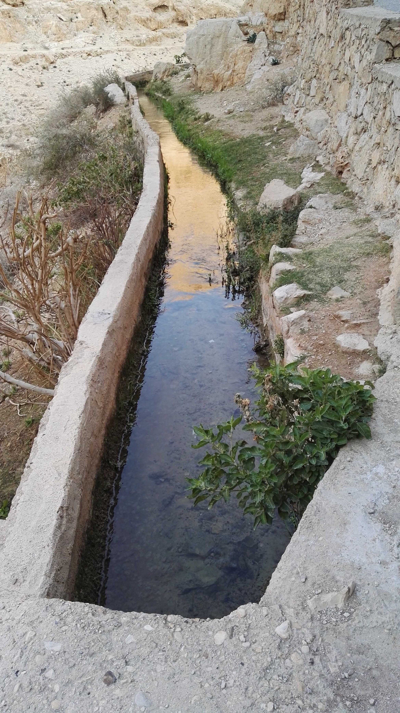

# Human-made Things in the Bible

## License Information

Human-made Things in the Bible © United Bible Societies, 2025. Adapted from: <cite>The Works of Their Hands: Man-made Things in the Bible</cite>, by Ray Pritz © 2009 United Bible Societies. This work is licensed under Creative Commons Attribution-ShareAlike 4.0 International (<a href="https://creativecommons.org/licenses/by-sa/4.0/">https://creativecommons.org/licenses/by-sa/4.0/</a>).

--------------------------------

## Irrigation channel, canal (id: REALIA:1.1.12)

1\.1\.12 Irrigation channel, canal
==================================

References:
-----------

Hebrew יְאֹר (y’or)

[EXO 7:19](https://ref.ly/Exod7:19), [EXO 8:1](https://ref.ly/Exod8:1)

Hebrew נָהָר (nahar)

[ISA 19:6](https://ref.ly/Isa19:6)

Greek διῶρυξ (diōrux)

[SIR 24:30](https://ref.ly/Sir24:30), [SIR 24:31](https://ref.ly/Sir24:31)

Greek ὑδραγωγός (udragōgos)

[SIR 24:30](https://ref.ly/Sir24:30)

Description and usage:
----------------------

*An irrigation channel that runs down from Wadi Kelt to Jericho (© Bukvoed, CC BY 4\.0, via Wikimedia Commons)*

The irrigation canal was a small channel cut into the rock or dug into the ground to transfer water from a larger source such as a river into a cultivated plot of ground. The reference in [SIR 24:30](https://ref.ly/Sir24:30) gives a good description of its function: “an irrigation canal bringing water from a river into a garden” (GNT (Good News Translation (1992))). Gardens could be watered by a system of smaller channels running off a larger channel and feeding into all parts of the garden, using gravity to deliver the water.

---

Translation:
------------

The Hebrew word *y’or* normally refers to the Nile River. However, most translations agree that in [EXO 7:19](https://ref.ly/Exod7:19) and [EXO 8:5](https://ref.ly/Exod8:5) (1\) it means “irrigation canal.” Similarly, the Hebrew word *nahar* normally means “river,” but in [ISA 19:6](https://ref.ly/Isa19:6), where it is plural in Hebrew, most translation render it “canals” (RSV (Revised Standard Version (1952))) or “channels” (NJPSV (New Jewish Publication Society Version)).

* **Associated Passages:** Exodus 7:19; Exodus 8:1; Isaiah 19:6; Sirach 24:30; Sirach 24:31; Exodus 8:5

