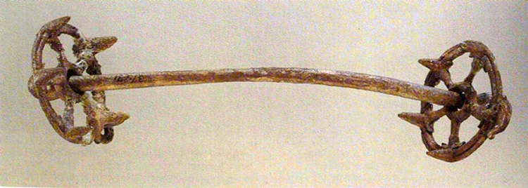

# Human-made Things in the Bible

## License Information

Human-made Things in the Bible © United Bible Societies, 2025. Adapted from: <cite>The Works of Their Hands: Man-made Things in the Bible</cite>, by Ray Pritz © 2009 United Bible Societies. This work is licensed under Creative Commons Attribution-ShareAlike 4.0 International (<a href="https://creativecommons.org/licenses/by-sa/4.0/">https://creativecommons.org/licenses/by-sa/4.0/</a>).

--------------------------------

## Bit and bridle (id: REALIA:1.2.6)

1\.2\.6 Bit and bridle
======================

References:
-----------

Hebrew מֶתֶג (metheg)

[2KI 19:28](https://ref.ly/2Kgs19:28), [PSA 32:9](https://ref.ly/Ps32:9), [PRO 26:3](https://ref.ly/Prov26:3), [ISA 37:29](https://ref.ly/Isa37:29)

Hebrew רֶסֶן (resen)

[JOB 41:5](https://ref.ly/Job41:5), [PSA 32:9](https://ref.ly/Ps32:9), [ISA 30:28](https://ref.ly/Isa30:28)

Greek χαλινός (chalinos)

[JAS 3:3](https://ref.ly/Jas3:3), [REV 14:20](https://ref.ly/Rev14:20)

Greek χρυσοχάλινος (chrusochalinos)

[2MA 10:29](https://ref.ly/2Macc10:29), [1ES 3:6](https://ref.ly/1Esd3:6)

Greek κόσμος (kosmos)

[2MA 5:3](https://ref.ly/2Macc5:3)

Greek σαγή (sagē)

[2MA 3:25](https://ref.ly/2Macc3:25)

Description:
------------

*Ancient bronze horse bit (© Deutsche Bibelgesellschaft, Stuttgart by United Bible Societies)*

The bit was a short bar, usually made of metal, placed in the mouth of a horse. Its ends, which projected from the mouth of the animal, were attached to ropes or leather straps that fitted over the head as the bridle.

---

Usage:
------

*Harness with bridle and bit fitted on the horse's head (© Gary Todd \- Wikimedia Commons)*

By pulling on the bridle straps to the right or left, the rider or driver of the wagon could control the actions of the horse.

---

Translation:
------------

*Horse and rider showing use of reins (© Wikimedia Commons)*

The Hebrew words *metheg* and *resen* respectively refer to the “bit” and “bridle” (although RSV (Revised Standard Version (1952)) has once rendered *metheg* as “bridle” in [PRO 26:3](https://ref.ly/Prov26:3)). The Greek words *chalinos* and *chrusochalinos* refer to both the bit and bridle. Where a bit or bridle as a piece of harness is unknown, translators can use a descriptive phrase, such as “something to guide a horse with” or “something to put in the mouth of a horse to guide it.”

The Hebrew word *mtsilah* in [ZEC 14:20](https://ref.ly/Zech14:20) probably refers to some sort of noise\-making decoration on the harness of a horse. The word occurs only here in the Bible.

In [REV 14:20](https://ref.ly/Rev14:20) the reference to “a horse’s bridle” (RSV (Revised Standard Version (1952))) is merely an indication of measurement. It refers to the height of the bridle from the ground, so we may render this measurement as “about a meter and a half” (FRCL (French Common Language Version (Bible en français courant))) or “about five feet” (GNT (Good News Translation (1992))).

The Greek word used in [2MA 10:29](https://ref.ly/2Macc10:29) and [1ES 3:6](https://ref.ly/1Esd3:6) indicates that the metal parts of the bridle were made of gold.

* **Associated Passages:** 2 Kings 19:28; Psalms 32:9; Proverbs 26:3; Isaiah 37:29; Job 41:5; Isaiah 30:28; James 3:3; Revelation 14:20; 2 Maccabees 10:29; 1 Esdras (Greek) 3:6; 2 Maccabees 5:3; 2 Maccabees 3:25; Zechariah 14:20

* **Associated ACAI Concepts:** Bit and Bridle (ID: `realia:BitAndBridle`)
