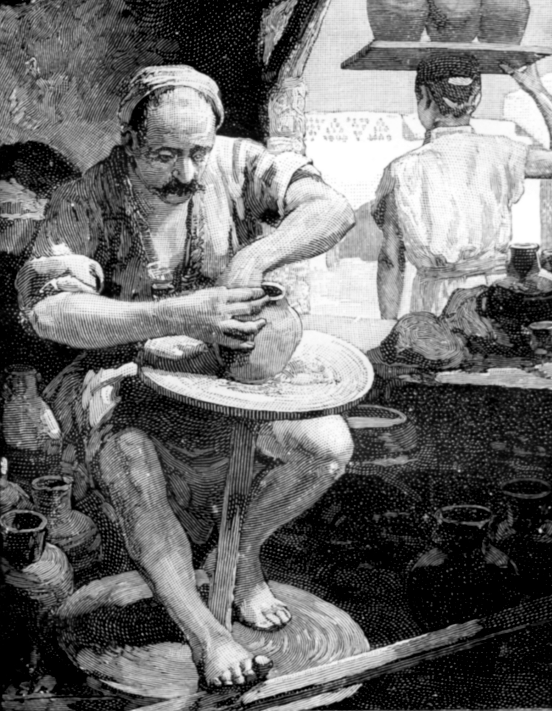

# Human-made Things in the Bible

## License Information

Human-made Things in the Bible © United Bible Societies, 2025. Adapted from: <cite>The Works of Their Hands: Man-made Things in the Bible</cite>, by Ray Pritz © 2009 United Bible Societies. This work is licensed under Creative Commons Attribution-ShareAlike 4.0 International (<a href="https://creativecommons.org/licenses/by-sa/4.0/">https://creativecommons.org/licenses/by-sa/4.0/</a>).

--------------------------------

## Potter’s wheel (id: REALIA:1.5.1.1)

1\.5\.1\.1 Potter’s wheel
=========================

References:
-----------

Hebrew אָבְנַיִם (’ovnayim)

[JER 18:3](https://ref.ly/Jer18:3)

Greek τροχός (trochos)

[SIR 38:29](https://ref.ly/Sir38:29)

Description:
------------

*Potter's wheel (Old Testament times) (© Deutsche Bibelgesellschaft, Stuttgart by United Bible Societies)*

In Old Testament times the potter’s wheel was a flat, horizontal wheel made of stone. On the underside of the stone there was a pointed projection. This projection sat in an indentation on a stationary lower stone and served as an axis around which the upper stone turned. The stone was turned by hand or perhaps by a person other than the potter. In intertestamental and New Testament times the construction was different. An upper wheel, made of wood, was connected by a shaft to a second, larger wheel situated below. The upper wheel was at a height convenient for the potter to work when seated.

---

Usage:
------

*Potter turning wheel with his foot (New Testament times) (The Pictorial New Testament, The Religious Tract Society 1881, Public domain)*

Clay was placed in the center of the upper wheel. The wheel was turned by hand or by foot. In the latter period, the spinning of the lower, heavier wheel caused the upper one to spin also. The potter used his fingers to form the spinning clay into the desired shape. See [SIR 38:29](https://ref.ly/Sir38:29): “It is the same with the potter, sitting at his wheel and turning it with his feet …” (GNT (Good News Translation (1992))).

---

Translation:
------------

The context of [JER 18:1](https://ref.ly/Jer18:1); [JER 18:2](https://ref.ly/Jer18:2); [JER 18:3](https://ref.ly/Jer18:3); [JER 18:4](https://ref.ly/Jer18:4) makes it clear that the potter is using the “wheel” to help him make clay pots. However, if it is felt that “wheel” would be misleading, translators may say “work table.”

* **Associated Passages:** Jeremiah 18:3; Sirach 38:29; Jeremiah 18:1; Jeremiah 18:2; Jeremiah 18:4

