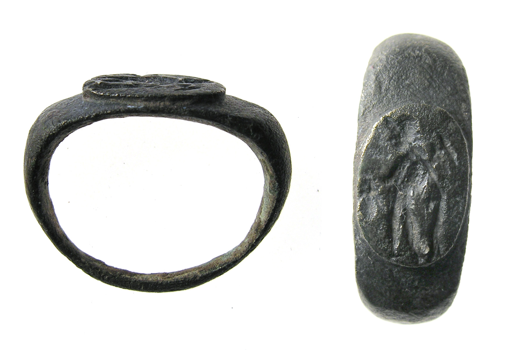

# Human-made Things in the Bible

## License Information

Human-made Things in the Bible © United Bible Societies, 2025. Adapted from: <cite>The Works of Their Hands: Man-made Things in the Bible</cite>, by Ray Pritz © 2009 United Bible Societies. This work is licensed under Creative Commons Attribution-ShareAlike 4.0 International (<a href="https://creativecommons.org/licenses/by-sa/4.0/">https://creativecommons.org/licenses/by-sa/4.0/</a>).

--------------------------------

## Engraver, woodcarver (id: REALIA:1.5.2)

1\.5\.2 Engraver, woodcarver
============================

## Engraving, carving (id: REALIA:1.5.2.1)

1\.5\.2\.1 Engraving, carving
=============================

References:
-----------

Hebrew חרשׁ, חָרָשׁ (charash)

[EXO 28:11](https://ref.ly/Exod28:11), [EXO 35:35](https://ref.ly/Exod35:35), [EXO 38:23](https://ref.ly/Exod38:23), [JER 17:1](https://ref.ly/Jer17:1)

Hebrew חֲרֹשֶׁת (charosheth)

[EXO 31:5](https://ref.ly/Exod31:5), [EXO 31:5](https://ref.ly/Exod31:5), [EXO 35:33](https://ref.ly/Exod35:33), [EXO 35:33](https://ref.ly/Exod35:33)

Hebrew פתח (pathach (verb))

[EXO 28:9](https://ref.ly/Exod28:9), [EXO 28:11](https://ref.ly/Exod28:11), [EXO 28:36](https://ref.ly/Exod28:36), [EXO 39:6](https://ref.ly/Exod39:6), [1KI 7:36](https://ref.ly/1Kgs7:36), [2CH 2:6](https://ref.ly/2Chr2:6), [2CH 2:13](https://ref.ly/2Chr2:13), [2CH 3:7](https://ref.ly/2Chr3:7), [ZEC 3:9](https://ref.ly/Zech3:9)

Hebrew פִּתּוּחַ (pituach)

[EXO 28:11](https://ref.ly/Exod28:11), [EXO 28:21](https://ref.ly/Exod28:21), [EXO 28:36](https://ref.ly/Exod28:36), [EXO 39:6](https://ref.ly/Exod39:6), [EXO 39:14](https://ref.ly/Exod39:14), [EXO 39:30](https://ref.ly/Exod39:30), [2CH 2:6](https://ref.ly/2Chr2:6), [2CH 2:13](https://ref.ly/2Chr2:13), [PSA 74:6](https://ref.ly/Ps74:6), [ZEC 3:9](https://ref.ly/Zech3:9)

Hebrew קלע, מִקְלַעַת (qala‘ (verb), miqla‘ath)

[1KI 6:18](https://ref.ly/1Kgs6:18), [1KI 6:29](https://ref.ly/1Kgs6:29), [1KI 6:29](https://ref.ly/1Kgs6:29), [1KI 6:32](https://ref.ly/1Kgs6:32), [1KI 6:32](https://ref.ly/1Kgs6:32), [1KI 6:35](https://ref.ly/1Kgs6:35), [1KI 7:31](https://ref.ly/1Kgs7:31)

Greek γλύμμα (glumma)

[SIR 38:27](https://ref.ly/Sir38:27), [SIR 45:11](https://ref.ly/Sir45:11)

Greek γλυφή (glufē)

[WIS 18:24](https://ref.ly/Wis18:24)

Greek γλύφω (glufō (verb))

[WIS 13:13](https://ref.ly/Wis13:13), [SIR 38:27](https://ref.ly/Sir38:27)

Greek ἐγγλύφω (egglufō (verb))

[1MA 13:29](https://ref.ly/1Macc13:29)

Greek κολάπτω (kolaptō (verb))

[SIR 45:11](https://ref.ly/Sir45:11), [3MA 2:27](https://ref.ly/3Macc2:27)

Description:
------------

*Engraving on a ring (© The Portable Antiquities Scheme/ The Trustees of the British Museum, CC BY\-SA 2\.0, via Wikimedia Commons)*

An engraving was a picture or words made by scratching lines in a hard surface such as stone, metal, or gems. A carving was a figure usually made out of wood, using a knife or another sharp implement.

---

Translation:
------------

In some languages it may be necessary to choose a verb for “engrave” according to the surface that is being used.

The Hebrew word *charosheth* is used in [EXO 31:5](https://ref.ly/Exod31:5) and [EXO 35:33](https://ref.ly/Exod35:33) to describe both engraving and carving.

The specific action described in [SIR 38:27](https://ref.ly/Sir38:27) is “engrave seals” (NJB (New Jerusalem Bible (1985)); compare the even more precise RSV (Revised Standard Version (1952)) rendering “cut the signets of seals”; see also the discussion at [10\.2 Seal, signet ring, ring\<REALIA:10\.2\>](#)). The point of the passage is the diligence and precision with which the engraver works. Where there is no exact equivalent of signets or seals, it is possible to refer to some other craftsman’s work that requires precision and can be done in great variety.

* **Associated Passages:** Exodus 28:11; Exodus 35:35; Exodus 38:23; Jeremiah 17:1; Exodus 31:5; Exodus 35:33; Exodus 28:9; Exodus 28:36; Exodus 39:6; 1 Kings 7:36; 2 Chronicles 2:6; 2 Chronicles 2:13; 2 Chronicles 3:7; Zechariah 3:9; Exodus 28:21; Exodus 39:14; Exodus 39:30; Psalms 74:6; 1 Kings 6:18; 1 Kings 6:29; 1 Kings 6:32; 1 Kings 6:35; 1 Kings 7:31; Sirach 38:27; Sirach 45:11; Wisdom of Solomon 18:24; Wisdom of Solomon 13:13; 1 Maccabees 13:29; 3 Maccabees 2:27

* **Associated ACAI Concepts:** Craftsman (ID: `realia:Craftsman`)
