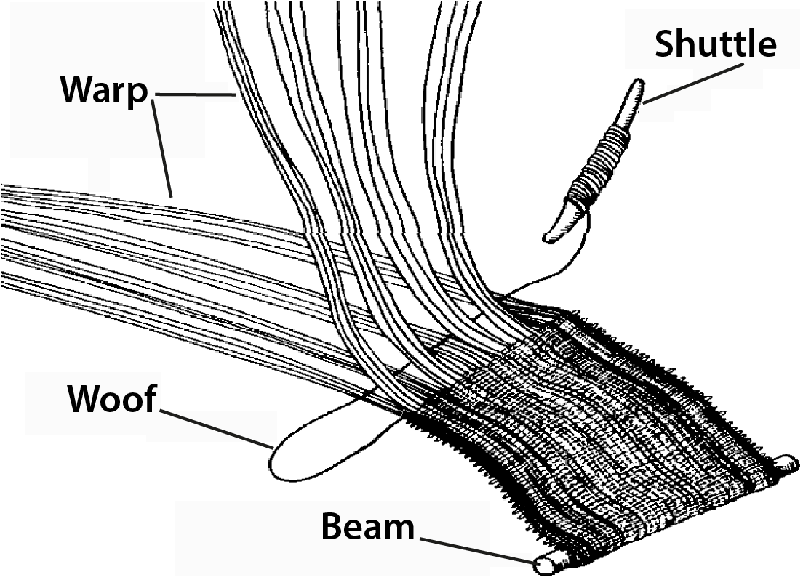
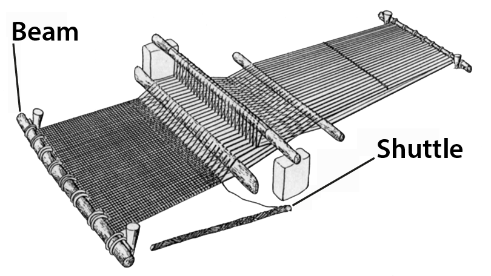

# Human-made Things in the Bible

## License Information

Human-made Things in the Bible © United Bible Societies, 2025. Adapted from: <cite>The Works of Their Hands: Man-made Things in the Bible</cite>, by Ray Pritz © 2009 United Bible Societies. This work is licensed under Creative Commons Attribution-ShareAlike 4.0 International (<a href="https://creativecommons.org/licenses/by-sa/4.0/">https://creativecommons.org/licenses/by-sa/4.0/</a>).

--------------------------------

## Cloth manufacture (id: REALIA:1.5.3)

1\.5\.3 Cloth manufacture
=========================

*Weaving (Source unknown)*

*Loom (Source unknown)*

Weaving was the art of making cloth. First the thread was prepared from the unspun fibers. This was done by attaching a piece of the fiber to a short, pointed piece of wood (the **spindle**) and then spinning it while drawing out the fiber into thin, spun thread. The thread thus spun was wound onto the spindle. After the threads were prepared, it was necessary to interlace them at right angles. The **loom** was a device designed to weave cloth in this manner. In the horizontal loom, a series of threads were wound around a thick wooden beam and then tied to another beam. These threads, called the warp, were slightly separated and kept under tension. From the side of the warp another thread (called the woof or weft) was inserted, over the first warp thread, then under the next, and so on until it was passed through the entire warp. To aid this process, the woof thread was attached to a small flat piece of wood or bone, called the **shuttle**. The shuttle, with the woof thread attached, was passed successively back and forth through the warp to form the interwoven cloth.

