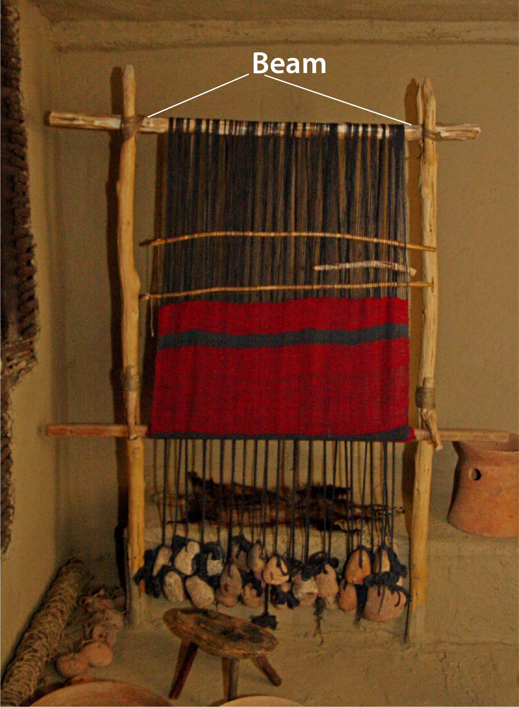

# Human-made Things in the Bible

## License Information

Human-made Things in the Bible © United Bible Societies, 2025. Adapted from: <cite>The Works of Their Hands: Man-made Things in the Bible</cite>, by Ray Pritz © 2009 United Bible Societies. This work is licensed under Creative Commons Attribution-ShareAlike 4.0 International (<a href="https://creativecommons.org/licenses/by-sa/4.0/">https://creativecommons.org/licenses/by-sa/4.0/</a>).

--------------------------------

## Weaver’s beam (id: REALIA:1.5.3.3)

1\.5\.3\.3 Weaver’s beam
========================

References:
-----------

Hebrew מָנוֹר, ארג (mnor ’orgim)

[1SA 17:7](https://ref.ly/1Sam17:7), [2SA 21:19](https://ref.ly/2Sam21:19), [1CH 11:23](https://ref.ly/1Chr11:23), [1CH 20:5](https://ref.ly/1Chr20:5)

Greek ἱστός (histos)

[ODA 11:12](https://ref.ly/Odes11:12)

Description:
------------

*Vertical loom (© CristianChirita, CC BY\-SA 3\.0, via Wikimedia Commons)*

The weaver’s beam was a wooden rod approximately 5–6 centimeters (2–2\.5 inches) in diameter. The length could vary. Around this beam the warp threads were attached, and the cloth was rolled on it as it grew in length.

---

Usage:
------

See [1\.5\.3 Cloth manufacture\<REALIA:1\.5\.3\>](#).

---

Translation:
------------

In the Old Testament references, it is the exceptional size of each giant’s spear that is in focus. In [1SA 17:7](https://ref.ly/1Sam17:7)CEV (Contemporary English Version) has taken into account that weaving on a hand loom is little known today in western English\-speaking countries, so it has omitted reference to the weaver’s beam by saying “and his spear was so big ….” Where hand weaving is not commonly known, translators may want to follow this pattern. Another possible model is “and the shaft of his spear was twice as thick as an ordinary spear ….”

The Greek word *histos* in [ODA 11:12](https://ref.ly/Odes11:12) may refer to either the beam or the entire loom. It is usually not necessary to render this word literally; compare NRSV (New Revised Standard Version (1989)) “a piece she had woven” or NJB (New Jerusalem Bible (1985)) “a piece of work.”

* **Associated Passages:** 1 Samuel 17:7; 2 Samuel 21:19; 1 Chronicles 11:23; 1 Chronicles 20:5; Odae/Odes 11:12

