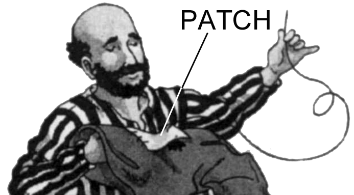

# Human-made Things in the Bible

## License Information

Human-made Things in the Bible © United Bible Societies, 2025. Adapted from: <cite>The Works of Their Hands: Man-made Things in the Bible</cite>, by Ray Pritz © 2009 United Bible Societies. This work is licensed under Creative Commons Attribution-ShareAlike 4.0 International (<a href="https://creativecommons.org/licenses/by-sa/4.0/">https://creativecommons.org/licenses/by-sa/4.0/</a>).

--------------------------------

## Patch (id: REALIA:1.5.3.12)

1\.5\.3\.12 Patch
=================

References:
-----------

Hebrew טלא (tala’ (verb))

[JOS 9:5](https://ref.ly/Josh9:5)

Greek ἐπίβλημα (epiblēma)

[MAT 9:16](https://ref.ly/Matt9:16), [MRK 2:21](https://ref.ly/Mark2:21), [LUK 5:36](https://ref.ly/Luke5:36), [LUK 5:36](https://ref.ly/Luke5:36)

Greek πλήρωμα (plērōma)

[MAT 9:16](https://ref.ly/Matt9:16), [MRK 2:21](https://ref.ly/Mark2:21)

Greek ῥάκος (rhakos)

[MAT 9:16](https://ref.ly/Matt9:16), [MRK 2:21](https://ref.ly/Mark2:21)

Description and usage:
----------------------

*Patches sewn on an old waterskin (Gary Todd, Israel Museum, CC0, via Wikimedia Commons)*

The patch was a piece of cloth or leather sewed on clothing or shoes to repair a hole or tear.

---

Translation:
------------

[JOS 9:5](https://ref.ly/Josh9:5): The shoes of the Gibeonite messengers had been “patched” many times, that is, repaired with pieces of leather.

[MAT 9:16](https://ref.ly/Matt9:16) and [MRK 2:21](https://ref.ly/Mark2:21): The statement that “No one patches up an old coat with a piece of new cloth” (GNT (Good News Translation (1992))) seems almost preposterous or incredible in some societies, since people habitually repair old clothing by putting on patches of new cloth, sometimes to the point where it is difficult to determine what was the original fabric. However, the Greek phrase *rhakous agnafou*, often translated “new cloth,” is literally “unshrunken cloth,” that is, cloth that has not been washed several times to shrink it (DUCL (Dutch Common Language Version) “patch that has never been shrunken”; similarly RSV (Revised Standard Version (1952)), REB (Revised English Bible (1989)), NJB (New Jerusalem Bible (1985))).

* **Associated Passages:** Joshua 9:5; Matthew 9:16; Mark 2:21; Luke 5:36

