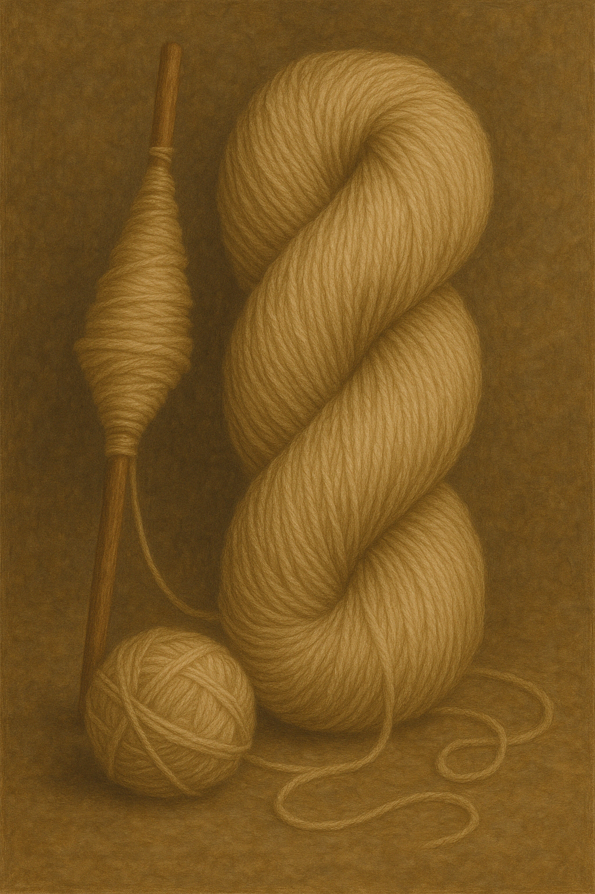
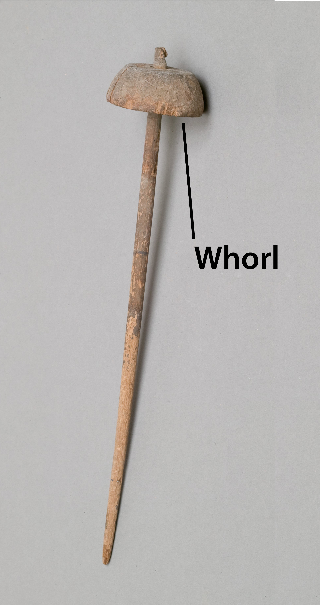

# Human-made Things in the Bible

## License Information

Human-made Things in the Bible © United Bible Societies, 2025. Adapted from: <cite>The Works of Their Hands: Man-made Things in the Bible</cite>, by Ray Pritz © 2009 United Bible Societies. This work is licensed under Creative Commons Attribution-ShareAlike 4.0 International (<a href="https://creativecommons.org/licenses/by-sa/4.0/">https://creativecommons.org/licenses/by-sa/4.0/</a>).

--------------------------------

## Cloth manufacture (id: REALIA:1.5.3)

1\.5\.3 Cloth manufacture
=========================

*Weaving (Source unknown)*

*Loom (Source unknown)*

Weaving was the art of making cloth. First the thread was prepared from the unspun fibers. This was done by attaching a piece of the fiber to a short, pointed piece of wood (the **spindle**) and then spinning it while drawing out the fiber into thin, spun thread. The thread thus spun was wound onto the spindle. After the threads were prepared, it was necessary to interlace them at right angles. The **loom** was a device designed to weave cloth in this manner. In the horizontal loom, a series of threads were wound around a thick wooden beam and then tied to another beam. These threads, called the warp, were slightly separated and kept under tension. From the side of the warp another thread (called the woof or weft) was inserted, over the first warp thread, then under the next, and so on until it was passed through the entire warp. To aid this process, the woof thread was attached to a small flat piece of wood or bone, called the **shuttle**. The shuttle, with the woof thread attached, was passed successively back and forth through the warp to form the interwoven cloth.

## Thread, string, yarn (id: REALIA:1.5.3.1)

1\.5\.3\.1 Thread, string, yarn
===============================

References:
-----------

Hebrew חוּט (chut)

[GEN 14:23](https://ref.ly/Gen14:23), [JOS 2:18](https://ref.ly/Josh2:18), [JDG 16:12](https://ref.ly/Judg16:12), [ECC 4:12](https://ref.ly/Eccl4:12), [SNG 4:3](https://ref.ly/Song4:3)

Hebrew פָּתִיל (pathil)

[GEN 38:18](https://ref.ly/Gen38:18), [GEN 38:25](https://ref.ly/Gen38:25), [EXO 28:28](https://ref.ly/Exod28:28), [EXO 28:37](https://ref.ly/Exod28:37), [EXO 39:3](https://ref.ly/Exod39:3), [EXO 39:21](https://ref.ly/Exod39:21), [EXO 39:31](https://ref.ly/Exod39:31), [NUM 15:38](https://ref.ly/Num15:38), [NUM 19:15](https://ref.ly/Num19:15), [JDG 16:9](https://ref.ly/Judg16:9), [EZK 40:3](https://ref.ly/Ezek40:3)

Description:
------------

*A piece of string (Image generated by ChatGPT using OpenAI technology)*

Thread or yarn for weaving was made by twisting fibers on a spindle (see [1\.5\.3 Cloth manufacture\<REALIA:1\.5\.3\>](#)). A single strand of thread made in this way was not particularly strong, but cloth made by interweaving many of these thin strands together was strong enough for many uses. See also [1\.14 Rope, cord\<REALIA:1\.14\>](#).

---

Translation:
------------

The essential difference between “thread” or “string” and “cord” or “rope” was less in its thickness than in its composition. A rope or cord was made of two or more single strands twisted or braided together. All the occurrences of the Hebrew word *pathil* are listed here, but in one or two of the passages the translator may consider that a heavier cord is intended.

In [EXO 39:3](https://ref.ly/Exod39:3) the Hebrew word *pathil* is used to refer to fine “threads” (RSV (Revised Standard Version (1952)), CEV (Contemporary English Version)) or “strands” (NIV (New International Version (1984))) made of gold. Some languages may have a separate word for such a “filament” made of metal.

* **Associated Passages:** Genesis 14:23; Joshua 2:18; Judges 16:12; Ecclesiastes 4:12; Song of Songs 4:3; Genesis 38:18; Genesis 38:25; Exodus 28:28; Exodus 28:37; Exodus 39:3; Exodus 39:21; Exodus 39:31; Numbers 15:38; Numbers 19:15; Judges 16:9; Ezekiel 40:3

* **Associated ACAI Concepts:** Thread (ID: `realia:Thread`); Measuring Reed (ID: `realia:MeasuringReed`)

## Spindle (id: REALIA:1.5.3.2)

1\.5\.3\.2 Spindle
==================

References:
-----------

### **Spindle**:

Hebrew כִּישׁוֹר (kishor)

[PRO 31:19](https://ref.ly/Prov31:19)

Hebrew פֶּלֶךְ (pelek)

[2SA 3:29](https://ref.ly/2Sam3:29), [PRO 31:19](https://ref.ly/Prov31:19)

**Whorl**:

Description and usage:
----------------------

*Spindle (Metropolitan Museum of Art, CC0, MMA)*

After the fibers had been drawn out, one end of the fibers was attached to the spindle, which was a short, oblong stick with a weight on the top (the whorl). The spindle was suspended in the air and spun, thus spinning the attached fibers into a thread. As the thread grew longer, it was then wrapped around the middle of the spindle until all of the fiber had been drawn out and spun.

The action of the spindle resulted in a strong “spun thread.” The Hebrew word for this spun or twisted thread is *shazar* (always appearing in the form *moshzar*) in [PRO 31:19](https://ref.ly/Prov31:19), [EXO 26:31](https://ref.ly/Exod26:31), [EXO 26:36](https://ref.ly/Exod26:36); [EXO 27:9](https://ref.ly/Exod27:9), [EXO 27:16](https://ref.ly/Exod27:16), [EXO 27:18](https://ref.ly/Exod27:18); [EXO 28:6](https://ref.ly/Exod28:6), [EXO 28:8](https://ref.ly/Exod28:8), [EXO 28:15](https://ref.ly/Exod28:15); [EXO 36:8](https://ref.ly/Exod36:8), [EXO 36:35](https://ref.ly/Exod36:35), [EXO 36:37](https://ref.ly/Exod36:37); [EXO 38:9](https://ref.ly/Exod38:9), [EXO 38:16](https://ref.ly/Exod38:16), [EXO 38:18](https://ref.ly/Exod38:18); [EXO 39:2](https://ref.ly/Exod39:2), [EXO 39:5](https://ref.ly/Exod39:5), [EXO 39:8](https://ref.ly/Exod39:8), [EXO 39:24](https://ref.ly/Exod39:24), [EXO 39:28](https://ref.ly/Exod39:28); [EXO 39:29](https://ref.ly/Exod39:29), and the Greek word is *klōthō* in [SIR 45:10](https://ref.ly/Sir45:10).

---

Translation:
------------

*Woman using a spindle (© Rita Willaert, CC BY 2\.0, via Wikimedia Commons)*

[PRO 31:19](https://ref.ly/Prov31:19): The literal RSV (Revised Standard Version (1952)) translation of this verse reads “She puts her hands to the distaff, and her hands hold the spindle,” but this will communicate little to modern readers in most cultures. Common\-language translations generally describe the activity of the woman rather than the specific instruments she is using. GNT (Good News Translation (1992)) has “She spins her own thread and weaves her own cloth.” NCV (New Century Version) goes one step further, describing the act of spinning: “She makes thread with her hands and weaves her own cloth.” CEV (Contemporary English Version) has attempted to simplify this verse even further but has probably gone too far with “She spins her own cloth”; a person does not “spin” cloth, even if the intended audience understands the operation of spinning.

* **Associated Passages:** Proverbs 31:19; 2 Samuel 3:29; Exodus 26:31; Exodus 26:36; Exodus 27:9; Exodus 27:16; Exodus 27:18; Exodus 28:6; Exodus 28:8; Exodus 28:15; Exodus 36:8; Exodus 36:35; Exodus 36:37; Exodus 38:9; Exodus 38:16; Exodus 38:18; Exodus 39:2; Exodus 39:5; Exodus 39:8; Exodus 39:24; Exodus 39:28; Exodus 39:29; Sirach 45:10

* **Associated ACAI Concepts:** Spindle (ID: `realia:Spindle`)

## Weaver’s beam (id: REALIA:1.5.3.3)

1\.5\.3\.3 Weaver’s beam
========================

References:
-----------

Hebrew מָנוֹר, ארג (mnor ’orgim)

[1SA 17:7](https://ref.ly/1Sam17:7), [2SA 21:19](https://ref.ly/2Sam21:19), [1CH 11:23](https://ref.ly/1Chr11:23), [1CH 20:5](https://ref.ly/1Chr20:5)

Greek ἱστός (histos)

[ODA 11:12](https://ref.ly/Odes11:12)

Description:
------------

*Vertical loom (© CristianChirita, CC BY\-SA 3\.0, via Wikimedia Commons)*

The weaver’s beam was a wooden rod approximately 5–6 centimeters (2–2\.5 inches) in diameter. The length could vary. Around this beam the warp threads were attached, and the cloth was rolled on it as it grew in length.

---

Usage:
------

See [1\.5\.3 Cloth manufacture\<REALIA:1\.5\.3\>](#).

---

Translation:
------------

In the Old Testament references, it is the exceptional size of each giant’s spear that is in focus. In [1SA 17:7](https://ref.ly/1Sam17:7)CEV (Contemporary English Version) has taken into account that weaving on a hand loom is little known today in western English\-speaking countries, so it has omitted reference to the weaver’s beam by saying “and his spear was so big ….” Where hand weaving is not commonly known, translators may want to follow this pattern. Another possible model is “and the shaft of his spear was twice as thick as an ordinary spear ….”

The Greek word *histos* in [ODA 11:12](https://ref.ly/Odes11:12) may refer to either the beam or the entire loom. It is usually not necessary to render this word literally; compare NRSV (New Revised Standard Version (1989)) “a piece she had woven” or NJB (New Jerusalem Bible (1985)) “a piece of work.”

* **Associated Passages:** 1 Samuel 17:7; 2 Samuel 21:19; 1 Chronicles 11:23; 1 Chronicles 20:5; Odae/Odes 11:12

* **Associated ACAI Concepts:** Weavers Beam (ID: `realia:WeaversBeam`); Spear (ID: `realia:Spear`)

## Shuttle (id: REALIA:1.5.3.4)

1\.5\.3\.4 Shuttle
==================

References:
-----------

Hebrew אֶרֶג (’ereg)

[JDG 16:14](https://ref.ly/Judg16:14), [JOB 7:6](https://ref.ly/Job7:6)

Description and usage:
----------------------

The shuttle was the small device used by the weaver to carry the “woof” (or “weft”) thread from one side of the loom to the other. The shuttle darted quickly across the loom, between the “warp” threads, leaving the woof thread stretched behind. The warp threads then closed over and under the woof thread, holding it in place. In this way another line of thread was added to form the cloth. A skilled weaver caused this to happen quite rapidly, with the shuttle moving back and forth constantly, until a whole piece of cloth was formed. See [1\.5\.3 Cloth manufacture\<REALIA:1\.5\.3\>](#) and the illustrations there.

---

Translation:
------------

When Samson was startled from sleep in [JDG 16:13](https://ref.ly/Judg16:13); [JDG 16:14](https://ref.ly/Judg16:14), he tore apart the various elements of the makeshift loom Delilah had prepared for weaving his hair. These included the “pin,” the “shuttle,” and the “fabric,” into which she had woven Samson’s hair. Some translations (RSV (Revised Standard Version (1952)), NIV (New International Version (1984))) inaccurately render the Hebrew word *’ereg* as “loom” here.

In [JOB 7:6](https://ref.ly/Job7:6) one day is compared to one swift movement of the shuttle.

* **Associated Passages:** Judges 16:14; Job 7:6; Judges 16:13

* **Associated ACAI Concepts:** Shuttle (ID: `realia:Shuttle`)

## Beater, batten, pin (id: REALIA:1.5.3.5)

1\.5\.3\.5 Beater, batten, pin
==============================

Reference:
----------

Hebrew יָתֵד (yathed)

[JDG 16:14](https://ref.ly/Judg16:14), [JDG 16:14](https://ref.ly/Judg16:14)

Description and translation:
----------------------------

The Hebrew word *yathed*, which appears twice in [JDG 16:14](https://ref.ly/Judg16:14), has been understood in various ways. It is possible that Delilah tried to anchor Samson’s hair to the ground with a kind of tent peg, which is the normal meaning of the word (see [3\.2\.2 Tent peg, stake\<REALIA:3\.2\.2\>](#)). However, it seems more likely that *yathed* here refers to part of the weaving equipment used by Delilah. One possibility is that it was a peg in the wall from which were hung the vertical threads. This possibility is given in the CEV (Contemporary English Version) rendering, which reads “While Samson was asleep, Delilah wove his braids into the threads on a loom and nailed the loom to a wall. Then she shouted, ‘Samson, the Philistines are attacking!’ Samson woke up and pulled the loom free from its posts in the ground and from the nails in the wall. Then he pulled his hair free from the woven cloth.” It is perhaps most likely that *yathed* here refers to a kind of bar that was used to push the woof threads down tight (along with Samson’s hair). This is reflected in the rendering of RSV (Revised Standard Version (1952)), which has “So while he slept, Delilah took the seven locks of his head and wove them into the web. And she made them tight with the pin, and said to him, ‘The Philistines are upon you, Samson!’ But he awoke from his sleep, and pulled away the pin, the loom, and the web.”

* **Associated Passages:** Judges 16:14

## Woven or knitted material (id: REALIA:1.5.3.6)

1\.5\.3\.6 Woven or knitted material
====================================

References:
-----------

Hebrew דַּלָּה (dalah)

[ISA 38:12](https://ref.ly/Isa38:12)

Hebrew עֵרֶב (‘erev)

[EXO 12:38](https://ref.ly/Exod12:38), [LEV 13:48](https://ref.ly/Lev13:48), [LEV 13:49](https://ref.ly/Lev13:49), [LEV 13:51](https://ref.ly/Lev13:51), [LEV 13:52](https://ref.ly/Lev13:52), [LEV 13:53](https://ref.ly/Lev13:53), [LEV 13:56](https://ref.ly/Lev13:56), [LEV 13:57](https://ref.ly/Lev13:57), [LEV 13:58](https://ref.ly/Lev13:58), [LEV 13:59](https://ref.ly/Lev13:59), [NEH 13:3](https://ref.ly/Neh13:3), [JER 25:20](https://ref.ly/Jer25:20), [JER 50:37](https://ref.ly/Jer50:37), [EZK 30:5](https://ref.ly/Ezek30:5)

Hebrew שְׁתִי (shthi)

[LEV 13:48](https://ref.ly/Lev13:48), [LEV 13:49](https://ref.ly/Lev13:49), [LEV 13:51](https://ref.ly/Lev13:51), [LEV 13:52](https://ref.ly/Lev13:52), [LEV 13:53](https://ref.ly/Lev13:53), [LEV 13:56](https://ref.ly/Lev13:56), [LEV 13:57](https://ref.ly/Lev13:57), [LEV 13:58](https://ref.ly/Lev13:58), [LEV 13:59](https://ref.ly/Lev13:59), [ECC 10:17](https://ref.ly/Eccl10:17)

Description and usage:
----------------------

*Woven cloth (Source unknown)*

See [1\.5\.3 Cloth manufacture\<REALIA:1\.5\.3\>](#).

---

Translation:
------------

The following is adapted from *A Handbook on Leviticus* at [LEV 13:48](https://ref.ly/Lev13:48) (page 200\): Older translations such as the King James Version (KJV (King James Version (1611))) and RSV (Revised Standard Version (1952)) translated the Hebrew words *shthi* and *‘erev* as “warp” and “woof,” and this is the meaning that the words of the text have taken in modern Hebrew. Such a rendering indicates the threads going in different directions in the cloth. However, it is highly unlikely that this is the meaning of the text. It is difficult to see how the threads going in one direction could be affected by the mildew without affecting those running at right angles to them. The requirement that the affected part be torn out does not make sense either (verse 56\), because this would destroy the whole garment. While the interpretation is far from certain, the meaning of these words is probably “woven or knitted material,” as in NAB (New American Bible (1970)), TOB (Traduction Oecuménique de la Bible (French, 1975)) and NIV (New International Version (1984)) (similarly American Translation \[AT (American Translation (Goodspeed, 1935))]). GNT (Good News Translation (1992)) has reduced this to “piece \[of clothing],” but such a reduction should probably be avoided in the receptor language, if possible.

In [ISA 38:12](https://ref.ly/Isa38:12) Hezekiah is complaining that his life is to be cut short. He uses a weaving metaphor to say that his life is like cloth cut off from the warp, the vertical threads of the loom.

* **Associated Passages:** Isaiah 38:12; Exodus 12:38; Leviticus 13:48; Leviticus 13:49; Leviticus 13:51; Leviticus 13:52; Leviticus 13:53; Leviticus 13:56; Leviticus 13:57; Leviticus 13:58; Leviticus 13:59; Nehemiah 13:3; Jeremiah 25:20; Jeremiah 50:37; Ezekiel 30:5; Ecclesiastes 10:17

* **Associated ACAI Concepts:** Woven or Knitted Material (ID: `realia:WovenOrKnittedMaterial`)

## Linen (id: REALIA:1.5.3.7)

1\.5\.3\.7 Linen
================

References:
-----------

Hebrew אֵטוּן (’etun)

[PRO 7:16](https://ref.ly/Prov7:16)

Hebrew בַּד (bad)

[EXO 28:42](https://ref.ly/Exod28:42), [EXO 39:28](https://ref.ly/Exod39:28), [LEV 6:3](https://ref.ly/Lev6:3), [LEV 6:3](https://ref.ly/Lev6:3), [LEV 16:4](https://ref.ly/Lev16:4), [LEV 16:4](https://ref.ly/Lev16:4), [LEV 16:4](https://ref.ly/Lev16:4), [LEV 16:4](https://ref.ly/Lev16:4), [LEV 16:23](https://ref.ly/Lev16:23), [LEV 16:32](https://ref.ly/Lev16:32), [1SA 2:18](https://ref.ly/1Sam2:18), [1SA 22:18](https://ref.ly/1Sam22:18), [2SA 6:14](https://ref.ly/2Sam6:14), [1CH 15:27](https://ref.ly/1Chr15:27), [EZK 9:3](https://ref.ly/Ezek9:3), [EZK 9:3](https://ref.ly/Ezek9:3), [EZK 9:11](https://ref.ly/Ezek9:11), [EZK 10:2](https://ref.ly/Ezek10:2), [EZK 10:6](https://ref.ly/Ezek10:6), [EZK 10:7](https://ref.ly/Ezek10:7), [DAN 10:5](https://ref.ly/Dan10:5), [DAN 12:6](https://ref.ly/Dan12:6), [DAN 12:7](https://ref.ly/Dan12:7)

Hebrew בּוּץ (buts)

[1CH 4:21](https://ref.ly/1Chr4:21), [1CH 15:27](https://ref.ly/1Chr15:27), [2CH 2:13](https://ref.ly/2Chr2:13), [2CH 3:14](https://ref.ly/2Chr3:14), [2CH 5:12](https://ref.ly/2Chr5:12), [EST 1:6](https://ref.ly/Esth1:6), [EST 8:15](https://ref.ly/Esth8:15), [EZK 27:16](https://ref.ly/Ezek27:16)

Hebrew סָדִין (sadin (see )

[JDG 14:12](https://ref.ly/Judg14:12), [JDG 14:13](https://ref.ly/Judg14:13), [PRO 31:24](https://ref.ly/Prov31:24), [ISA 3:23](https://ref.ly/Isa3:23)

Hebrew פֵּשֶׁת (pishteh)

[LEV 13:47](https://ref.ly/Lev13:47), [LEV 13:48](https://ref.ly/Lev13:48), [LEV 13:52](https://ref.ly/Lev13:52), [LEV 13:59](https://ref.ly/Lev13:59), [DEU 22:11](https://ref.ly/Deut22:11), [JER 13:1](https://ref.ly/Jer13:1), [EZK 40:3](https://ref.ly/Ezek40:3), [EZK 44:17](https://ref.ly/Ezek44:17), [EZK 44:18](https://ref.ly/Ezek44:18), [EZK 44:18](https://ref.ly/Ezek44:18)

Hebrew שֵׁשׁ (shesh)

[GEN 41:42](https://ref.ly/Gen41:42), [EXO 25:4](https://ref.ly/Exod25:4), [EXO 26:1](https://ref.ly/Exod26:1), [EXO 26:31](https://ref.ly/Exod26:31), [EXO 26:36](https://ref.ly/Exod26:36), [EXO 27:9](https://ref.ly/Exod27:9), [EXO 27:16](https://ref.ly/Exod27:16), [EXO 27:18](https://ref.ly/Exod27:18), [EXO 28:6](https://ref.ly/Exod28:6), [EXO 28:8](https://ref.ly/Exod28:8), [EXO 28:15](https://ref.ly/Exod28:15), [EXO 28:39](https://ref.ly/Exod28:39), [EXO 28:39](https://ref.ly/Exod28:39), [EXO 35:6](https://ref.ly/Exod35:6), [EXO 35:23](https://ref.ly/Exod35:23), [EXO 35:25](https://ref.ly/Exod35:25), [EXO 35:35](https://ref.ly/Exod35:35), [EXO 36:8](https://ref.ly/Exod36:8), [EXO 36:35](https://ref.ly/Exod36:35), [EXO 36:37](https://ref.ly/Exod36:37), [EXO 38:9](https://ref.ly/Exod38:9), [EXO 38:16](https://ref.ly/Exod38:16), [EXO 38:18](https://ref.ly/Exod38:18), [EXO 38:23](https://ref.ly/Exod38:23), [EXO 39:3](https://ref.ly/Exod39:3), [EXO 39:5](https://ref.ly/Exod39:5), [EXO 39:8](https://ref.ly/Exod39:8), [EXO 39:27](https://ref.ly/Exod39:27), [EXO 39:28](https://ref.ly/Exod39:28), [EXO 39:28](https://ref.ly/Exod39:28), [EXO 39:28](https://ref.ly/Exod39:28), [EXO 39:29](https://ref.ly/Exod39:29), [PRO 31:22](https://ref.ly/Prov31:22), [EZK 16:10](https://ref.ly/Ezek16:10), [EZK 16:13](https://ref.ly/Ezek16:13), [EZK 27:7](https://ref.ly/Ezek27:7)

Greek βύσσινος (bussinos)

[REV 18:12](https://ref.ly/Rev18:12), [REV 18:16](https://ref.ly/Rev18:16), [REV 19:8](https://ref.ly/Rev19:8), [REV 19:8](https://ref.ly/Rev19:8), [REV 19:14](https://ref.ly/Rev19:14), [1ES 3:6](https://ref.ly/1Esd3:6)

Greek βύσσος (bussos)

[LUK 16:19](https://ref.ly/Luke16:19)

Greek λίνον, λινοῦς (linon, linous)

[REV 15:6](https://ref.ly/Rev15:6), [JDT 16:8](https://ref.ly/Jdt16:8)

Greek ὀθόνιον (othonion)

[LUK 24:12](https://ref.ly/Luke24:12), [JHN 19:40](https://ref.ly/John19:40), [JHN 20:5](https://ref.ly/John20:5), [JHN 20:6](https://ref.ly/John20:6), [JHN 20:7](https://ref.ly/John20:7)

Greek σινδών (sindōn)

[MAT 27:59](https://ref.ly/Matt27:59), [MRK 14:51](https://ref.ly/Mark14:51), [MRK 14:52](https://ref.ly/Mark14:52), [MRK 15:46](https://ref.ly/Mark15:46), [MRK 15:46](https://ref.ly/Mark15:46), [LUK 23:53](https://ref.ly/Luke23:53)

Description:
------------

*Lazarus lying in the tomb wrapped in linen cloth (Image generated by ChatGPT using OpenAI technology)*

Linen is a high quality cloth made from the stems of the flax plant. It was known for its strength and coolness.

---

Usage:
------

Most flax in Israel was imported from Egypt and used for a wide range of products. The Bible mentions bed coverings, sails of ships, garments for the priests, furnishings for the tabernacle, burial clothes, and other things. See also *Plants and Trees in the Bible*, [5\.1\.7 Flax (linen)\<FLORA:5\.1\.7\>](#).

---

Translation:
------------

In a number of languages there is no term for “linen,” and though a word for “linen” may be borrowed, what is important in many contexts is primarily the quality of the cloth, not the material from which it was made. Accordingly, many translators have used an expression such as “fine \[white] cloth” or “good cloth.” In some cases it will be possible to say “cloth made from the fibers of a plant.” It may be necessary to add an explanatory footnote.

In several passages the important characteristic of linen is that it causes less perspiration than other cloths (see [EXO 39:27](https://ref.ly/Exod39:27); [EXO 39:28](https://ref.ly/Exod39:28); [EXO 39:29](https://ref.ly/Exod39:29); [LEV 6:10](https://ref.ly/Lev6:10); [LEV 16:4](https://ref.ly/Lev16:4); [EZK 44:17](https://ref.ly/Ezek44:17); [EZK 44:18](https://ref.ly/Ezek44:18)). Where linen is not known, translators should choose a cloth with a similar characteristic.

In [MAT 27:59](https://ref.ly/Matt27:59); [MRK 15:46](https://ref.ly/Mark15:46); and [LUK 23:53](https://ref.ly/Luke23:53), the Greek word *sindōn* describes the cloth with which Jesus’ body was wrapped for burial. This is also true for the Greek word *othonion* in [LUK 24:12](https://ref.ly/Luke24:12); [JHN 19:40](https://ref.ly/John19:40); [JHN 20:5](https://ref.ly/John20:5); [JHN 20:6](https://ref.ly/John20:6); [JHN 20:7](https://ref.ly/John20:7). Where a language has a special word for such a “burial cloth” or “shroud,” it should be used.

* **Associated Passages:** Proverbs 7:16; Exodus 28:42; Exodus 39:28; Leviticus 6:3; Leviticus 16:4; Leviticus 16:23; Leviticus 16:32; 1 Samuel 2:18; 1 Samuel 22:18; 2 Samuel 6:14; 1 Chronicles 15:27; Ezekiel 9:3; Ezekiel 9:11; Ezekiel 10:2; Ezekiel 10:6; Ezekiel 10:7; Daniel 10:5; Daniel 12:6; Daniel 12:7; 1 Chronicles 4:21; 2 Chronicles 2:13; 2 Chronicles 3:14; 2 Chronicles 5:12; Esther 1:6; Esther 8:15; Ezekiel 27:16; Judges 14:12; Judges 14:13; Proverbs 31:24; Isaiah 3:23; Leviticus 13:47; Leviticus 13:48; Leviticus 13:52; Leviticus 13:59; Deuteronomy 22:11; Jeremiah 13:1; Ezekiel 40:3; Ezekiel 44:17; Ezekiel 44:18; Genesis 41:42; Exodus 25:4; Exodus 26:1; Exodus 26:31; Exodus 26:36; Exodus 27:9; Exodus 27:16; Exodus 27:18; Exodus 28:6; Exodus 28:8; Exodus 28:15; Exodus 28:39; Exodus 35:6; Exodus 35:23; Exodus 35:25; Exodus 35:35; Exodus 36:8; Exodus 36:35; Exodus 36:37; Exodus 38:9; Exodus 38:16; Exodus 38:18; Exodus 38:23; Exodus 39:3; Exodus 39:5; Exodus 39:8; Exodus 39:27; Exodus 39:29; Proverbs 31:22; Ezekiel 16:10; Ezekiel 16:13; Ezekiel 27:7; Revelation 18:12; Revelation 18:16; Revelation 19:8; Revelation 19:14; 1 Esdras (Greek) 3:6; Luke 16:19; Revelation 15:6; Judith 16:8; Luke 24:12; John 19:40; John 20:5; John 20:6; John 20:7; Matthew 27:59; Mark 14:51; Mark 14:52; Mark 15:46; Luke 23:53; Leviticus 6:10

* **Associated ACAI Concepts:** Linen (ID: `realia:Linen`)

## Wool (id: REALIA:1.5.3.8)

1\.5\.3\.8 Wool
===============

References:
-----------

Hebrew צֶמֶר (tsemer)

[LEV 13:48](https://ref.ly/Lev13:48), [LEV 13:52](https://ref.ly/Lev13:52), [LEV 13:59](https://ref.ly/Lev13:59), [DEU 22:11](https://ref.ly/Deut22:11), [ISA 51:8](https://ref.ly/Isa51:8), [EZK 44:17](https://ref.ly/Ezek44:17)

Greek ἔριον (erion)

[HEB 9:19](https://ref.ly/Heb9:19)

Description:
------------

Wool is the soft wavy hair of sheep and certain other animals. It was used to weave a fabric from which clothing was made.

---

Translation:
------------

In some languages translators may have to render “wool” as “cloth made from the hair of a sheep.”

* **Associated Passages:** Leviticus 13:48; Leviticus 13:52; Leviticus 13:59; Deuteronomy 22:11; Isaiah 51:8; Ezekiel 44:17; Hebrews 9:19

* **Associated ACAI Concepts:** Wool (ID: `realia:Wool`)

## Silk (id: REALIA:1.5.3.9)

1\.5\.3\.9 Silk
===============

References:
-----------

Hebrew מֶשִׁי (meshi)

[EZK 16:10](https://ref.ly/Ezek16:10), [EZK 16:13](https://ref.ly/Ezek16:13)

Greek σιρικόν (sirikon)

[REV 18:12](https://ref.ly/Rev18:12)

Description:
------------

Silk was a fine, expensive cloth made from the fiber produced by the silkworm in making its cocoon.

---

Translation:
------------

Translations and commentaries vary on the translation of the Hebrew word *meshi* in [EZK 16:10](https://ref.ly/Ezek16:10); [EZK 16:13](https://ref.ly/Ezek16:13). The traditional translation has been “silk,” which is still followed by many versions (KJV (King James Version (1611)), RSV (Revised Standard Version (1952)), GNT (Good News Translation (1992)), NCV (New Century Version)). Others consider this to be unlikely in the time of Ezekiel, when silk was not yet known in the Middle East. It has been suggested that the word indicates a kind of veil worn by the woman, hiding her face from others but allowing her to see out. Translations that reject “silk” as the proper translation usually find a more general term. Compare CEV (Contemporary English Version) “most expensive robes,” NRSV (New Revised Standard Version (1989)) “rich fabric,” GECL (German Common Language Version (Gute Nachricht Bibel)) “a beautiful, woven robe,” TOB (Traduction Oecuménique de la Bible (French, 1975)) “expensive cloth,” and REB (Revised English Bible (1989)) “fine linen.”

In the first\-century A.D. setting of [REV 18:12](https://ref.ly/Rev18:12), it is quite possible to speak of proper silk. However, it cannot be determined from the context of this verse whether the Greek word *sirikos* refers simply to cloth or to garments made of silk.

* **Associated Passages:** Ezekiel 16:10; Ezekiel 16:13; Revelation 18:12

* **Associated ACAI Concepts:** Silk (ID: `realia:Silk`)

## Purple cloth (id: REALIA:1.5.3.10)

1\.5\.3\.10 Purple cloth
========================

References:
-----------

Hebrew אַרְגְּוָן (’argewan)

[2CH 2:6](https://ref.ly/2Chr2:6), [DAN 5:7](https://ref.ly/Dan5:7), [DAN 5:16](https://ref.ly/Dan5:16), [DAN 5:29](https://ref.ly/Dan5:29)

Hebrew אַרְגָּמָן (’argaman)

[EXO 25:4](https://ref.ly/Exod25:4), [EXO 26:1](https://ref.ly/Exod26:1), [EXO 26:31](https://ref.ly/Exod26:31), [EXO 26:36](https://ref.ly/Exod26:36), [EXO 27:16](https://ref.ly/Exod27:16), [EXO 28:6](https://ref.ly/Exod28:6), [EXO 28:8](https://ref.ly/Exod28:8), [EXO 28:15](https://ref.ly/Exod28:15), [EXO 28:33](https://ref.ly/Exod28:33), [EXO 35:6](https://ref.ly/Exod35:6), [EXO 35:23](https://ref.ly/Exod35:23), [EXO 35:25](https://ref.ly/Exod35:25), [EXO 35:35](https://ref.ly/Exod35:35), [EXO 36:8](https://ref.ly/Exod36:8), [EXO 36:35](https://ref.ly/Exod36:35), [EXO 36:37](https://ref.ly/Exod36:37), [EXO 38:18](https://ref.ly/Exod38:18), [EXO 38:23](https://ref.ly/Exod38:23), [EXO 39:3](https://ref.ly/Exod39:3), [EXO 39:8](https://ref.ly/Exod39:8), [EXO 39:24](https://ref.ly/Exod39:24), [EXO 39:29](https://ref.ly/Exod39:29), [NUM 4:13](https://ref.ly/Num4:13), [JDG 8:26](https://ref.ly/Judg8:26), [2CH 2:13](https://ref.ly/2Chr2:13), [2CH 3:14](https://ref.ly/2Chr3:14), [EST 1:6](https://ref.ly/Esth1:6), [EST 8:15](https://ref.ly/Esth8:15), [PRO 31:22](https://ref.ly/Prov31:22), [SNG 3:10](https://ref.ly/Song3:10), [SNG 7:6](https://ref.ly/Song7:6), [JER 10:9](https://ref.ly/Jer10:9), [EZK 27:7](https://ref.ly/Ezek27:7), [EZK 27:16](https://ref.ly/Ezek27:16)

Hebrew חָמוּץ (chamuts)

[ISA 63:1](https://ref.ly/Isa63:1)

Hebrew כַּרְמִיל (karmil)

[2CH 2:6](https://ref.ly/2Chr2:6), [2CH 2:13](https://ref.ly/2Chr2:13), [2CH 3:14](https://ref.ly/2Chr3:14)

Hebrew שָׁנִי (shani)

[GEN 38:28](https://ref.ly/Gen38:28), [GEN 38:30](https://ref.ly/Gen38:30), [JOS 2:18](https://ref.ly/Josh2:18), [JOS 2:21](https://ref.ly/Josh2:21), [2SA 1:24](https://ref.ly/2Sam1:24), [PRO 31:21](https://ref.ly/Prov31:21), [SNG 4:3](https://ref.ly/Song4:3), [ISA 1:18](https://ref.ly/Isa1:18), [JER 4:30](https://ref.ly/Jer4:30)

Hebrew תלע (tala‘)

[NAM 2:4](https://ref.ly/Nah2:4)

Hebrew תּוֹלָע (tola‘)

[ISA 1:18](https://ref.ly/Isa1:18), [LAM 4:5](https://ref.ly/Lam4:5)

Hebrew תּוֹלַעַת, שָׁנִי (tola‘ath shani, shni tola‘ath)

[EXO 25:4](https://ref.ly/Exod25:4), [EXO 26:1](https://ref.ly/Exod26:1), [EXO 26:31](https://ref.ly/Exod26:31), [EXO 26:36](https://ref.ly/Exod26:36), [EXO 27:16](https://ref.ly/Exod27:16), [EXO 28:6](https://ref.ly/Exod28:6), [EXO 28:6](https://ref.ly/Exod28:6), [EXO 28:8](https://ref.ly/Exod28:8), [EXO 28:15](https://ref.ly/Exod28:15), [EXO 28:33](https://ref.ly/Exod28:33), [EXO 35:6](https://ref.ly/Exod35:6), [EXO 35:23](https://ref.ly/Exod35:23), [EXO 35:25](https://ref.ly/Exod35:25), [EXO 35:35](https://ref.ly/Exod35:35), [EXO 36:8](https://ref.ly/Exod36:8), [EXO 36:35](https://ref.ly/Exod36:35), [EXO 36:37](https://ref.ly/Exod36:37), [EXO 38:18](https://ref.ly/Exod38:18), [EXO 38:23](https://ref.ly/Exod38:23), [EXO 39:3](https://ref.ly/Exod39:3), [EXO 39:3](https://ref.ly/Exod39:3), [EXO 39:5](https://ref.ly/Exod39:5), [EXO 39:8](https://ref.ly/Exod39:8), [EXO 39:24](https://ref.ly/Exod39:24), [EXO 39:29](https://ref.ly/Exod39:29), [LEV 14:4](https://ref.ly/Lev14:4), [LEV 14:6](https://ref.ly/Lev14:6), [LEV 14:49](https://ref.ly/Lev14:49), [LEV 14:51](https://ref.ly/Lev14:51), [LEV 14:52](https://ref.ly/Lev14:52), [NUM 4:8](https://ref.ly/Num4:8), [NUM 19:6](https://ref.ly/Num19:6)

Hebrew תְּכֵלֶת (tekeleth)

[EXO 25:4](https://ref.ly/Exod25:4), [EXO 26:1](https://ref.ly/Exod26:1), [EXO 26:4](https://ref.ly/Exod26:4), [EXO 26:31](https://ref.ly/Exod26:31), [EXO 26:36](https://ref.ly/Exod26:36), [EXO 27:16](https://ref.ly/Exod27:16), [EXO 28:6](https://ref.ly/Exod28:6), [EXO 28:8](https://ref.ly/Exod28:8), [EXO 28:15](https://ref.ly/Exod28:15), [EXO 28:28](https://ref.ly/Exod28:28), [EXO 28:31](https://ref.ly/Exod28:31), [EXO 28:33](https://ref.ly/Exod28:33), [EXO 28:37](https://ref.ly/Exod28:37), [EXO 38:18](https://ref.ly/Exod38:18), [EXO 38:23](https://ref.ly/Exod38:23), [EXO 39:3](https://ref.ly/Exod39:3), [EXO 39:5](https://ref.ly/Exod39:5), [EXO 39:8](https://ref.ly/Exod39:8), [EXO 39:22](https://ref.ly/Exod39:22), [EXO 39:24](https://ref.ly/Exod39:24), [EXO 39:29](https://ref.ly/Exod39:29), [EXO 39:31](https://ref.ly/Exod39:31), [NUM 4:7](https://ref.ly/Num4:7), [NUM 4:9](https://ref.ly/Num4:9), [NUM 4:11](https://ref.ly/Num4:11), [NUM 4:12](https://ref.ly/Num4:12), [NUM 15:38](https://ref.ly/Num15:38), [2CH 2:6](https://ref.ly/2Chr2:6), [2CH 2:13](https://ref.ly/2Chr2:13), [2CH 3:14](https://ref.ly/2Chr3:14), [EST 1:6](https://ref.ly/Esth1:6), [EST 8:15](https://ref.ly/Esth8:15), [JER 10:9](https://ref.ly/Jer10:9), [EZK 23:6](https://ref.ly/Ezek23:6), [EZK 27:7](https://ref.ly/Ezek27:7), [EZK 27:24](https://ref.ly/Ezek27:24)

Greek κόκκινος (kokkinos)

[MAT 27:28](https://ref.ly/Matt27:28), [HEB 9:19](https://ref.ly/Heb9:19), [REV 17:4](https://ref.ly/Rev17:4), [REV 18:12](https://ref.ly/Rev18:12), [REV 18:16](https://ref.ly/Rev18:16)

Greek κόκκος (kokkos)

[SIR 45:10](https://ref.ly/Sir45:10)

Greek πορφύρα (porfura)

[MRK 15:17](https://ref.ly/Mark15:17), [MRK 15:20](https://ref.ly/Mark15:20), [LUK 16:19](https://ref.ly/Luke16:19), [REV 18:12](https://ref.ly/Rev18:12), [JDT 10:21](https://ref.ly/Jdt10:21), [SIR 45:10](https://ref.ly/Sir45:10), [LJE 1:71](https://ref.ly/EpJer1:71), [1MA 4:23](https://ref.ly/1Macc4:23), [1MA 8:14](https://ref.ly/1Macc8:14), [1MA 10:20](https://ref.ly/1Macc10:20), [1MA 10:62](https://ref.ly/1Macc10:62), [1MA 10:64](https://ref.ly/1Macc10:64), [1MA 11:58](https://ref.ly/1Macc11:58), [1MA 14:43](https://ref.ly/1Macc14:43), [1MA 14:44](https://ref.ly/1Macc14:44), [2MA 4:38](https://ref.ly/2Macc4:38), [1ES 3:6](https://ref.ly/1Esd3:6)

Greek πορφυροῦς (porfurous)

[JHN 19:2](https://ref.ly/John19:2), [JHN 19:5](https://ref.ly/John19:5), [REV 17:4](https://ref.ly/Rev17:4), [REV 18:16](https://ref.ly/Rev18:16), [LJE 1:11](https://ref.ly/EpJer1:11)

Greek πορφυρόπωλις (porfuropōlis)

[ACT 16:14](https://ref.ly/Acts16:14)

Greek ὑακίνθινος (huakinthinos)

[SIR 6:30](https://ref.ly/Sir6:30), [SIR 40:4](https://ref.ly/Sir40:4)

Greek ὑάκινθος (huakinthos)

[SIR 45:10](https://ref.ly/Sir45:10), [1MA 4:23](https://ref.ly/1Macc4:23)

Description:
------------

Purple cloth was a reddish\-purple cloth dyed with substances obtained from several natural sources. The primary source was the murex shellfish. Another source (referred to in the Hebrew words with the root *tla‘*) was a small worm. The dying process could yield a variety of colors, ranging from a dark red through purple to blue. (see [1\.5\.3\.14 Dye\<REALIA:1\.5\.3\.14\>](#).)

---

Usage:
------

The relatively limited source for the purple color and the complicated process for its production made purple cloth extremely expensive and thus available only to kings and the richest families. In time the color came to be associated with royalty, although only several centuries after biblical times did legislation actually forbid its use by people outside the royal family.

---

Translation:
------------

In a number of languages there is no special color term for reddish\-purple, since the color in question is sometimes classified as a kind of blue and in other instances it is related to black. Sometimes it may be described as “dark red” or even “bluish red.” However, in all languages it is possible to be somewhat more precise about color terms by likening the color to that of a local flower, bird, or something else.

In many verses in Exodus (for example, [EXO 25:4](https://ref.ly/Exod25:4)), three colors in this range are mentioned together. Many translations have “blue,” “purple,” and “scarlet/red.” Where possible the translator should find three colors within this range. *A Handbook on Exodus* (page 582\) has the following helpful comments on [EXO 25:4](https://ref.ly/Exod25:4): “It may be difficult to distinguish between the three colors, or they are all various shades of a mixture of red and blue. The difference between the words for **blue** and **purple** seems to be that the first has more blue and the second has more red. But both colors were purple. NJB (New Jerusalem Bible (1985)) translates these tow terms as ‘violet\-purple’ and ‘red\-purple.’ ” For guidelines on translating the color purple, see *A Handbook on The Gospel of Mark*, page 482\.

In many of the references to purple cloth, the important element is not the color but the high rank implied by cloth of that color. Translators may prefer to make this information explicit. For example, at [1MA 10:64](https://ref.ly/1Macc10:64) for the literal clause “saw him clothed in purple” (RSV (Revised Standard Version (1952))), GNT (Good News Translation (1992)) has “saw him clothed in royal robes.”

If it is necessary to designate what kind of cloth was dyed purple, translators should, where possible, choose a cloth that indicates high rank or dignity.

* **Associated Passages:** 2 Chronicles 2:6; Daniel 5:7; Daniel 5:16; Daniel 5:29; Exodus 25:4; Exodus 26:1; Exodus 26:31; Exodus 26:36; Exodus 27:16; Exodus 28:6; Exodus 28:8; Exodus 28:15; Exodus 28:33; Exodus 35:6; Exodus 35:23; Exodus 35:25; Exodus 35:35; Exodus 36:8; Exodus 36:35; Exodus 36:37; Exodus 38:18; Exodus 38:23; Exodus 39:3; Exodus 39:8; Exodus 39:24; Exodus 39:29; Numbers 4:13; Judges 8:26; 2 Chronicles 2:13; 2 Chronicles 3:14; Esther 1:6; Esther 8:15; Proverbs 31:22; Song of Songs 3:10; Song of Songs 7:6; Jeremiah 10:9; Ezekiel 27:7; Ezekiel 27:16; Isaiah 63:1; Genesis 38:28; Genesis 38:30; Joshua 2:18; Joshua 2:21; 2 Samuel 1:24; Proverbs 31:21; Song of Songs 4:3; Isaiah 1:18; Jeremiah 4:30; Nahum 2:4; Lamentations 4:5; Exodus 39:5; Leviticus 14:4; Leviticus 14:6; Leviticus 14:49; Leviticus 14:51; Leviticus 14:52; Numbers 4:8; Numbers 19:6; Exodus 26:4; Exodus 28:28; Exodus 28:31; Exodus 28:37; Exodus 39:22; Exodus 39:31; Numbers 4:7; Numbers 4:9; Numbers 4:11; Numbers 4:12; Numbers 15:38; Ezekiel 23:6; Ezekiel 27:24; Matthew 27:28; Hebrews 9:19; Revelation 17:4; Revelation 18:12; Revelation 18:16; Sirach 45:10; Mark 15:17; Mark 15:20; Luke 16:19; Judith 10:21; Letter of Jeremiah 1:71; 1 Maccabees 4:23; 1 Maccabees 8:14; 1 Maccabees 10:20; 1 Maccabees 10:62; 1 Maccabees 10:64; 1 Maccabees 11:58; 1 Maccabees 14:43; 1 Maccabees 14:44; 2 Maccabees 4:38; 1 Esdras (Greek) 3:6; John 19:2; John 19:5; Letter of Jeremiah 1:11; Acts 16:14; Sirach 6:30; Sirach 40:4

* **Associated ACAI Concepts:** Purple Cloth (ID: `realia:PurpleCloth`); Linen (ID: `realia:Linen`)

## Embroidered cloth, needlework (id: REALIA:1.5.3.11)

1\.5\.3\.11 Embroidered cloth, needlework
=========================================

References:
-----------

Hebrew מַעֲשֶׂה, רקם (ma‘aseh roqem)

[EXO 26:36](https://ref.ly/Exod26:36), [EXO 27:16](https://ref.ly/Exod27:16), [EXO 28:39](https://ref.ly/Exod28:39), [EXO 36:37](https://ref.ly/Exod36:37), [EXO 38:18](https://ref.ly/Exod38:18), [EXO 39:29](https://ref.ly/Exod39:29)

Hebrew רִקְמָה (riqmah)

[JDG 5:30](https://ref.ly/Judg5:30), [JDG 5:30](https://ref.ly/Judg5:30), [PSA 45:15](https://ref.ly/Ps45:15), [EZK 16:10](https://ref.ly/Ezek16:10), [EZK 16:13](https://ref.ly/Ezek16:13), [EZK 16:18](https://ref.ly/Ezek16:18), [EZK 26:16](https://ref.ly/Ezek26:16), [EZK 27:7](https://ref.ly/Ezek27:7), [EZK 27:16](https://ref.ly/Ezek27:16), [EZK 27:24](https://ref.ly/Ezek27:24)

Greek ποικιλτής (poikiltēs)

[SIR 45:10](https://ref.ly/Sir45:10)

Description:
------------

*Linen cloth embroidered with wool (© EgyArt, via Wikimedia Commons)*

Embroidered cloth was cloth into which decorative patterns or figures were sewn by hand. Because of the extra work that went into it, embroidered cloth was expensive.

---

Translation:
------------

Where there is no word for “embroidery,” it is possible to use a descriptive expression; for example, in [EXO 26:36](https://ref.ly/Exod26:36)NCV (New Century Version) has “Someone who can sew well is to sew designs on it,” and in [EZK 27:7](https://ref.ly/Ezek27:7) it says “linen with designs sewed on it.” Where even this is difficult to express in the receptor language, translators may say simply “fancy linen” or “decorated cloth.”

* **Associated Passages:** Exodus 26:36; Exodus 27:16; Exodus 28:39; Exodus 36:37; Exodus 38:18; Exodus 39:29; Judges 5:30; Psalms 45:15; Ezekiel 16:10; Ezekiel 16:13; Ezekiel 16:18; Ezekiel 26:16; Ezekiel 27:7; Ezekiel 27:16; Ezekiel 27:24; Sirach 45:10

* **Associated ACAI Concepts:** Embroidered Cloth (ID: `realia:EmbroideredCloth`)

## Patch (id: REALIA:1.5.3.12)

1\.5\.3\.12 Patch
=================

References:
-----------

Hebrew טלא (tala’ (verb))

[JOS 9:5](https://ref.ly/Josh9:5)

Greek ἐπίβλημα (epiblēma)

[MAT 9:16](https://ref.ly/Matt9:16), [MRK 2:21](https://ref.ly/Mark2:21), [LUK 5:36](https://ref.ly/Luke5:36), [LUK 5:36](https://ref.ly/Luke5:36)

Greek πλήρωμα (plērōma)

[MAT 9:16](https://ref.ly/Matt9:16), [MRK 2:21](https://ref.ly/Mark2:21)

Greek ῥάκος (rhakos)

[MAT 9:16](https://ref.ly/Matt9:16), [MRK 2:21](https://ref.ly/Mark2:21)

Description and usage:
----------------------

*Patches sewn on an old waterskin (Gary Todd, Israel Museum, CC0, via Wikimedia Commons)*

The patch was a piece of cloth or leather sewed on clothing or shoes to repair a hole or tear.

---

Translation:
------------

[JOS 9:5](https://ref.ly/Josh9:5): The shoes of the Gibeonite messengers had been “patched” many times, that is, repaired with pieces of leather.

[MAT 9:16](https://ref.ly/Matt9:16) and [MRK 2:21](https://ref.ly/Mark2:21): The statement that “No one patches up an old coat with a piece of new cloth” (GNT (Good News Translation (1992))) seems almost preposterous or incredible in some societies, since people habitually repair old clothing by putting on patches of new cloth, sometimes to the point where it is difficult to determine what was the original fabric. However, the Greek phrase *rhakous agnafou*, often translated “new cloth,” is literally “unshrunken cloth,” that is, cloth that has not been washed several times to shrink it (DUCL (Dutch Common Language Version) “patch that has never been shrunken”; similarly RSV (Revised Standard Version (1952)), REB (Revised English Bible (1989)), NJB (New Jerusalem Bible (1985))).

* **Associated Passages:** Joshua 9:5; Matthew 9:16; Mark 2:21; Luke 5:36

* **Associated ACAI Concepts:** Patch (ID: `realia:Patch`)

## Linen cloth, sheet (id: REALIA:1.5.3.13)

1\.5\.3\.13 Linen cloth, sheet
==============================

References:
-----------

Greek ὀθόνη (othonē)

[ACT 10:11](https://ref.ly/Acts10:11), [ACT 11:5](https://ref.ly/Acts11:5)

Description:
------------

The sheet was a large piece of cloth, usually of linen (see [1\.5\.3\.7 Linen\<REALIA:1\.5\.3\.7\>](#)).

---

Translation:
------------

The Greek word *othonē* is a general term for a piece of linen cloth that was used for a variety of objects, including a cloth that a person could wrap around himself as clothing or a sail for a boat. In its context in Acts, it has four corners and is large enough to hold a large number of animals. In translation it will not normally be necessary to indicate that the “cloth” or “sheet” was made of linen.

* **Associated Passages:** Acts 10:11; Acts 11:5

* **Associated ACAI Concepts:** Linen Cloth (ID: `realia:LinenCloth`)

## Dye (id: REALIA:1.5.3.14)

1\.5\.3\.14 Dye
===============

References:
-----------

Hebrew אדם (m’adam)

[EXO 25:5](https://ref.ly/Exod25:5), [EXO 26:14](https://ref.ly/Exod26:14), [EXO 35:7](https://ref.ly/Exod35:7), [EXO 35:23](https://ref.ly/Exod35:23), [EXO 36:19](https://ref.ly/Exod36:19), [EXO 39:34](https://ref.ly/Exod39:34)

Hebrew צֶבַע (tseva‘)

[JDG 5:30](https://ref.ly/Judg5:30), [JDG 5:30](https://ref.ly/Judg5:30), [JDG 5:30](https://ref.ly/Judg5:30)

Description and usage:
----------------------

Dye was a substance used to color materials, especially textiles. Dyes came from minerals, plants, insects (for example, all those based on the Hebrew root *tla‘* were from a small worm), and sea animals (in particular, certain mollusks).

---

Translation:
------------

Translators and commentators differ concerning the exact meaning of the Hebrew word *m’adam*. Most understand it to mean that the rams’ skins or sheep­skins (which it always modifies) have been “dyed red” (GNT (Good News Translation (1992)), NIV (New International Version (1984)), NJB (New Jerusalem Bible (1985))) or “colored red” (FRCL (French Common Language Version (Bible en français courant)), PV). However, RSV (Revised Standard Version (1952)), CEV (Contemporary English Version), and REB (Revised English Bible (1989)) say “tanned” (see [1\.13 Leather\<REALIA:1\.13\>](#)).

* **Associated Passages:** Exodus 25:5; Exodus 26:14; Exodus 35:7; Exodus 35:23; Exodus 36:19; Exodus 39:34; Judges 5:30

