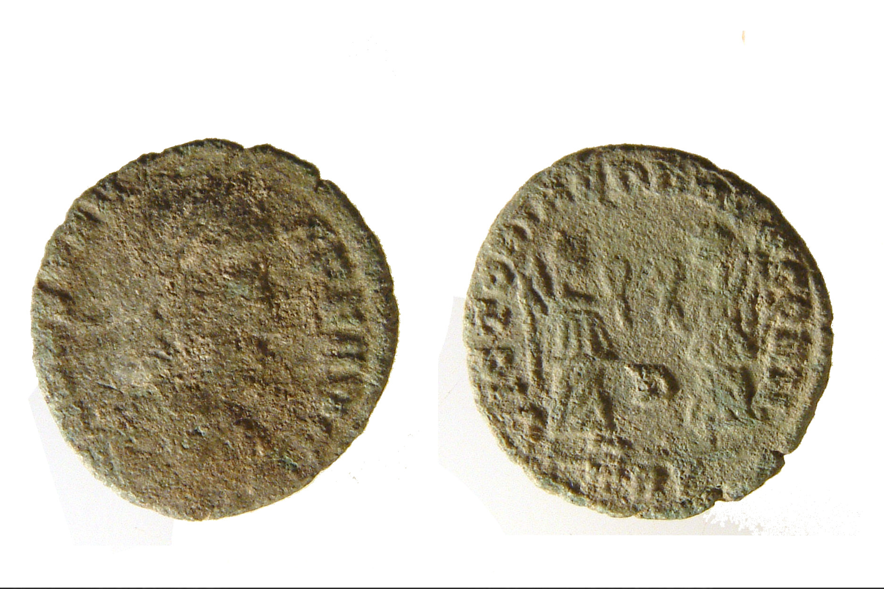
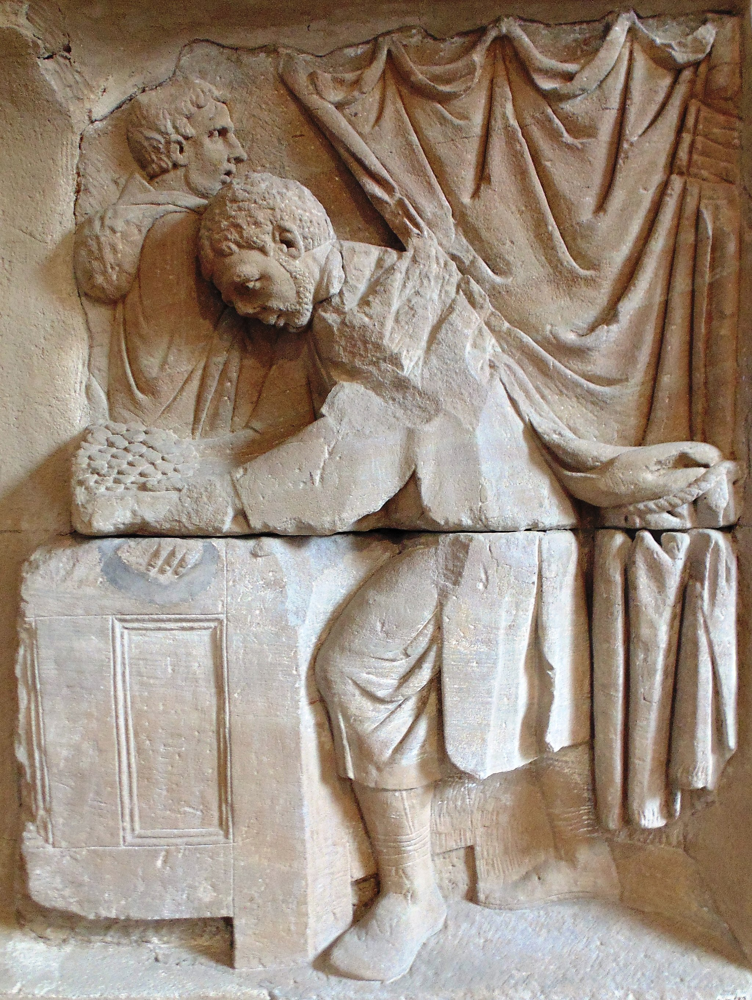

# Human-made Things in the Bible

## License Information

Human-made Things in the Bible © United Bible Societies, 2025. Adapted from: <cite>The Works of Their Hands: Man-made Things in the Bible</cite>, by Ray Pritz © 2009 United Bible Societies. This work is licensed under Creative Commons Attribution-ShareAlike 4.0 International (<a href="https://creativecommons.org/licenses/by-sa/4.0/">https://creativecommons.org/licenses/by-sa/4.0/</a>).

--------------------------------

## Commerce (id: REALIA:1.6)

1\.6 Commerce
=============

## Balance scales (id: REALIA:1.6.1)

1\.6\.1 Balance scales
======================

References:
-----------

Hebrew מֹאזְנַיִם (m’oznayim)

[LEV 19:36](https://ref.ly/Lev19:36), [JOB 6:2](https://ref.ly/Job6:2), [JOB 31:6](https://ref.ly/Job31:6), [PSA 62:10](https://ref.ly/Ps62:10), [PRO 11:1](https://ref.ly/Prov11:1), [PRO 16:11](https://ref.ly/Prov16:11), [PRO 20:23](https://ref.ly/Prov20:23), [ISA 40:12](https://ref.ly/Isa40:12), [ISA 40:15](https://ref.ly/Isa40:15), [JER 32:10](https://ref.ly/Jer32:10), [EZK 5:1](https://ref.ly/Ezek5:1), [EZK 45:10](https://ref.ly/Ezek45:10), [HOS 12:8](https://ref.ly/Hos12:8), [AMO 8:5](https://ref.ly/Amos8:5), [MIC 6:11](https://ref.ly/Mic6:11)

Aramaic מֹאזְנֵא (mo’zne’)

[DAN 5:27](https://ref.ly/Dan5:27)

Hebrew פֶּלֶס (peles)

[PRO 16:11](https://ref.ly/Prov16:11), [ISA 40:12](https://ref.ly/Isa40:12)

Hebrew קָנֶה (qaneh)

[ISA 46:6](https://ref.ly/Isa46:6)

Greek ζυγός (zugos)

[REV 6:5](https://ref.ly/Rev6:5), [SIR 21:25](https://ref.ly/Sir21:25), [SIR 28:25](https://ref.ly/Sir28:25), [SIR 42:4](https://ref.ly/Sir42:4)

Greek πλάστιγξ (plastigx)

[WIS 11:22](https://ref.ly/Wis11:22), [2MA 9:8](https://ref.ly/2Macc9:8)

Greek ῥοπή (rhopē)

[SIR 1:22](https://ref.ly/Sir1:22)

Greek σταθμός (stathmion, stathmos)

[SIR 6:15](https://ref.ly/Sir6:15), [SIR 26:15](https://ref.ly/Sir26:15), [SIR 28:25](https://ref.ly/Sir28:25)

Latin statera

[2ES 3:34](https://ref.ly/2Esd3:34), [2ES 4:36](https://ref.ly/2Esd4:36)

Description:
------------

*Balance scales (Gary Todd, Israel Museum, CC0, via Wikimedia Commons)*

The balance scales were an instrument for weighing objects. Ancient balance scales often consisted of a rod held by a cord or a chain in the middle and with pans attached to both ends.

---

Usage:
------

Weights were placed in one pan, while the items to be weighed were placed in the other. When the rod was parallel to the ground, then the items in the two pans were of equal weight.

---

Translation:
------------

“Balance scales” may be rendered in some languages as “tool for weighing” or “instrument for knowing how much something weighs.” The translator should avoid using an anachronistic word for modern types of scales, such as a spring scale or a hydraulic scale.

*Balance scales (Image generated by ChatGPT using OpenAI technology)*

Weights (and also measures of volume) from different time periods have been uncovered in various archaeological sites. The weights generally were made of stone, were spherical in shape, and were identified by having their names engraved on them. Because of their rustic manufacture, they were not “accurate” or “just” in a precise modern sense. However, they served as normative standards in a given period and region, although they differed according to time and place. For this reason the equivalents in terms of modern weights are only approximate.

Because the ancient scale compared the relative weights of two objects, in the intertestamental period it became a symbol for considering the relative value or right and wrong of two activities or choices. Compare the English idiom “weigh his actions.” This figurative usage appears in [SIR 1:22](https://ref.ly/Sir1:22); [SIR 21:25](https://ref.ly/Sir21:25); [SIR 28:25](https://ref.ly/Sir28:25); and to a slightly lesser extent in [DAN 5:27](https://ref.ly/Dan5:27). Translators will often prefer to abandon the physical object and translate according to the meaning; compare GNT (Good News Translation (1992)) at [SIR 21:25](https://ref.ly/Sir21:25), which reads “the wise will consider the consequences of what they say.” Similarly, at [SIR 1:22](https://ref.ly/Sir1:22), instead of the literal text “a man’s anger tips the scale to his ruin” (RSV (Revised Standard Version (1952))), GNT (Good News Translation (1992)) has “it \[anger] can bring about your downfall.”

* **Associated Passages:** Leviticus 19:36; Job 6:2; Job 31:6; Psalms 62:10; Proverbs 11:1; Proverbs 16:11; Proverbs 20:23; Isaiah 40:12; Isaiah 40:15; Jeremiah 32:10; Ezekiel 5:1; Ezekiel 45:10; Hosea 12:8; Amos 8:5; Micah 6:11; Daniel 5:27; Isaiah 46:6; Revelation 6:5; Sirach 21:25; Sirach 28:25; Sirach 42:4; Wisdom of Solomon 11:22; 2 Maccabees 9:8; Sirach 1:22; Sirach 6:15; Sirach 26:15; 2 Esdras (Latin) 3:34; 2 Esdras (Latin) 4:36

* **Associated ACAI Concepts:** Balance (ID: `realia:Balance`)

## Stone weights (id: REALIA:1.6.2)

1\.6\.2 Stone weights
=====================

References:
-----------

Hebrew אֶבֶן (’even)

[LEV 19:36](https://ref.ly/Lev19:36), [DEU 25:13](https://ref.ly/Deut25:13), [DEU 25:13](https://ref.ly/Deut25:13), [DEU 25:15](https://ref.ly/Deut25:15), [2SA 14:26](https://ref.ly/2Sam14:26), [PRO 11:1](https://ref.ly/Prov11:1), [PRO 16:11](https://ref.ly/Prov16:11), [PRO 20:10](https://ref.ly/Prov20:10), [PRO 20:10](https://ref.ly/Prov20:10), [PRO 20:23](https://ref.ly/Prov20:23), [PRO 20:23](https://ref.ly/Prov20:23), [MIC 6:11](https://ref.ly/Mic6:11)

Greek σταθμίον (stathmion)

[SIR 42:4](https://ref.ly/Sir42:4)

Description and usage:
----------------------

*Stone weights (© Chamberi, CC BY\-SA 3\.0, via Wikimedia Commons)*

Stones of various sizes and weights were used on balance scales to determine the price of produce being sold (see [1\.6\.1 Balance scales\<REALIA:1\.6\.1\>](#)). The stones were usually marked with their weights.

---

Translation:
------------

In most of the references above, the weights are a means of determining the amount to be paid for something; that is, they are a tool for conducting business dealings. So in some of the passages the reference to weights may be left implied; for example, in [PRO 16:11](https://ref.ly/Prov16:11)CEV (Contemporary English Version) has “The LORD doesn’t like it when we cheat in business.”

While the Hebrew word *’even* literally means “stone,” in the references listed above, where the translator decides to indicate the physical object, it will normally be best to translate *’even* as “weight.”

* **Associated Passages:** Leviticus 19:36; Deuteronomy 25:13; Deuteronomy 25:15; 2 Samuel 14:26; Proverbs 11:1; Proverbs 16:11; Proverbs 20:10; Proverbs 20:23; Micah 6:11; Sirach 42:4

## Money, coins (id: REALIA:1.6.3)

1\.6\.3 Money, coins
====================

References:
-----------

Hebrew כֶּסֶף (kesef)

[GEN 13:2](https://ref.ly/Gen13:2), [GEN 17:13](https://ref.ly/Gen17:13), [GEN 17:23](https://ref.ly/Gen17:23), [GEN 17:27](https://ref.ly/Gen17:27), [GEN 20:16](https://ref.ly/Gen20:16), [GEN 23:9](https://ref.ly/Gen23:9), [GEN 23:13](https://ref.ly/Gen23:13), [GEN 23:15](https://ref.ly/Gen23:15), [GEN 23:16](https://ref.ly/Gen23:16), [GEN 23:16](https://ref.ly/Gen23:16), [GEN 24:35](https://ref.ly/Gen24:35), [GEN 31:15](https://ref.ly/Gen31:15), [GEN 37:28](https://ref.ly/Gen37:28), [GEN 42:25](https://ref.ly/Gen42:25), [GEN 42:27](https://ref.ly/Gen42:27), [GEN 42:28](https://ref.ly/Gen42:28), [GEN 42:35](https://ref.ly/Gen42:35), [GEN 42:35](https://ref.ly/Gen42:35), [GEN 43:12](https://ref.ly/Gen43:12), [GEN 43:12](https://ref.ly/Gen43:12), [GEN 43:15](https://ref.ly/Gen43:15), [GEN 43:18](https://ref.ly/Gen43:18), [GEN 43:21](https://ref.ly/Gen43:21), [GEN 43:21](https://ref.ly/Gen43:21), [GEN 43:22](https://ref.ly/Gen43:22), [GEN 43:22](https://ref.ly/Gen43:22), [GEN 43:23](https://ref.ly/Gen43:23), [GEN 44:1](https://ref.ly/Gen44:1), [GEN 44:2](https://ref.ly/Gen44:2), [GEN 44:8](https://ref.ly/Gen44:8), [GEN 44:8](https://ref.ly/Gen44:8), [GEN 45:22](https://ref.ly/Gen45:22), [GEN 47:14](https://ref.ly/Gen47:14), [GEN 47:14](https://ref.ly/Gen47:14), [GEN 47:15](https://ref.ly/Gen47:15), [GEN 47:15](https://ref.ly/Gen47:15), [GEN 47:16](https://ref.ly/Gen47:16), [GEN 47:18](https://ref.ly/Gen47:18), [EXO 12:44](https://ref.ly/Exod12:44), [EXO 21:11](https://ref.ly/Exod21:11), [EXO 21:21](https://ref.ly/Exod21:21), [EXO 21:32](https://ref.ly/Exod21:32), [EXO 21:34](https://ref.ly/Exod21:34), [EXO 21:35](https://ref.ly/Exod21:35), [EXO 22:6](https://ref.ly/Exod22:6), [EXO 22:16](https://ref.ly/Exod22:16), [EXO 22:24](https://ref.ly/Exod22:24), [EXO 25:3](https://ref.ly/Exod25:3), [EXO 30:16](https://ref.ly/Exod30:16), [EXO 35:5](https://ref.ly/Exod35:5), [EXO 35:24](https://ref.ly/Exod35:24), [EXO 38:25](https://ref.ly/Exod38:25), [EXO 38:27](https://ref.ly/Exod38:27), [LEV 5:15](https://ref.ly/Lev5:15), [LEV 22:11](https://ref.ly/Lev22:11), [LEV 25:37](https://ref.ly/Lev25:37), [LEV 25:50](https://ref.ly/Lev25:50), [LEV 25:51](https://ref.ly/Lev25:51), [LEV 27:3](https://ref.ly/Lev27:3), [LEV 27:6](https://ref.ly/Lev27:6), [LEV 27:6](https://ref.ly/Lev27:6), [LEV 27:15](https://ref.ly/Lev27:15), [LEV 27:16](https://ref.ly/Lev27:16), [LEV 27:18](https://ref.ly/Lev27:18), [LEV 27:19](https://ref.ly/Lev27:19), [NUM 3:48](https://ref.ly/Num3:48), [NUM 3:49](https://ref.ly/Num3:49), [NUM 3:50](https://ref.ly/Num3:50), [NUM 3:51](https://ref.ly/Num3:51), [NUM 18:16](https://ref.ly/Num18:16), [NUM 22:18](https://ref.ly/Num22:18), [NUM 24:13](https://ref.ly/Num24:13), [NUM 31:22](https://ref.ly/Num31:22), [DEU 2:6](https://ref.ly/Deut2:6), [DEU 2:6](https://ref.ly/Deut2:6), [DEU 2:28](https://ref.ly/Deut2:28), [DEU 2:28](https://ref.ly/Deut2:28), [DEU 8:13](https://ref.ly/Deut8:13), [DEU 14:25](https://ref.ly/Deut14:25), [DEU 14:25](https://ref.ly/Deut14:25), [DEU 14:26](https://ref.ly/Deut14:26), [DEU 17:17](https://ref.ly/Deut17:17), [DEU 21:14](https://ref.ly/Deut21:14), [DEU 22:19](https://ref.ly/Deut22:19), [DEU 22:29](https://ref.ly/Deut22:29), [DEU 23:20](https://ref.ly/Deut23:20), [JOS 6:19](https://ref.ly/Josh6:19), [JOS 6:24](https://ref.ly/Josh6:24), [JOS 7:21](https://ref.ly/Josh7:21), [JOS 7:21](https://ref.ly/Josh7:21), [JOS 7:22](https://ref.ly/Josh7:22), [JOS 7:24](https://ref.ly/Josh7:24), [JOS 22:8](https://ref.ly/Josh22:8), [JDG 5:19](https://ref.ly/Judg5:19), [JDG 9:4](https://ref.ly/Judg9:4), [JDG 16:5](https://ref.ly/Judg16:5), [JDG 16:18](https://ref.ly/Judg16:18), [JDG 17:2](https://ref.ly/Judg17:2), [JDG 17:2](https://ref.ly/Judg17:2), [JDG 17:3](https://ref.ly/Judg17:3), [JDG 17:3](https://ref.ly/Judg17:3), [JDG 17:4](https://ref.ly/Judg17:4), [JDG 17:4](https://ref.ly/Judg17:4), [JDG 17:10](https://ref.ly/Judg17:10), [1SA 2:36](https://ref.ly/1Sam2:36), [1SA 9:8](https://ref.ly/1Sam9:8), [2SA 8:11](https://ref.ly/2Sam8:11), [2SA 18:11](https://ref.ly/2Sam18:11), [2SA 18:12](https://ref.ly/2Sam18:12), [2SA 21:4](https://ref.ly/2Sam21:4), [2SA 24:24](https://ref.ly/2Sam24:24), [1KI 7:51](https://ref.ly/1Kgs7:51), [1KI 10:22](https://ref.ly/1Kgs10:22), [1KI 10:27](https://ref.ly/1Kgs10:27), [1KI 10:29](https://ref.ly/1Kgs10:29), [1KI 15:15](https://ref.ly/1Kgs15:15), [1KI 15:18](https://ref.ly/1Kgs15:18), [1KI 15:19](https://ref.ly/1Kgs15:19), [1KI 16:24](https://ref.ly/1Kgs16:24), [1KI 20:3](https://ref.ly/1Kgs20:3), [1KI 20:5](https://ref.ly/1Kgs20:5), [1KI 20:7](https://ref.ly/1Kgs20:7), [1KI 20:39](https://ref.ly/1Kgs20:39), [1KI 21:2](https://ref.ly/1Kgs21:2), [1KI 21:6](https://ref.ly/1Kgs21:6), [1KI 21:15](https://ref.ly/1Kgs21:15), [2KI 5:5](https://ref.ly/2Kgs5:5), [2KI 5:22](https://ref.ly/2Kgs5:22), [2KI 5:23](https://ref.ly/2Kgs5:23), [2KI 5:26](https://ref.ly/2Kgs5:26), [2KI 6:25](https://ref.ly/2Kgs6:25), [2KI 6:25](https://ref.ly/2Kgs6:25), [2KI 7:8](https://ref.ly/2Kgs7:8), [2KI 12:5](https://ref.ly/2Kgs12:5), [2KI 12:5](https://ref.ly/2Kgs12:5), [2KI 12:5](https://ref.ly/2Kgs12:5), [2KI 12:5](https://ref.ly/2Kgs12:5), [2KI 12:8](https://ref.ly/2Kgs12:8), [2KI 12:9](https://ref.ly/2Kgs12:9), [2KI 12:10](https://ref.ly/2Kgs12:10), [2KI 12:11](https://ref.ly/2Kgs12:11), [2KI 12:11](https://ref.ly/2Kgs12:11), [2KI 12:12](https://ref.ly/2Kgs12:12), [2KI 12:14](https://ref.ly/2Kgs12:14), [2KI 12:16](https://ref.ly/2Kgs12:16), [2KI 12:17](https://ref.ly/2Kgs12:17), [2KI 12:17](https://ref.ly/2Kgs12:17), [2KI 15:19](https://ref.ly/2Kgs15:19), [2KI 15:20](https://ref.ly/2Kgs15:20), [2KI 15:20](https://ref.ly/2Kgs15:20), [2KI 16:8](https://ref.ly/2Kgs16:8), [2KI 18:14](https://ref.ly/2Kgs18:14), [2KI 18:15](https://ref.ly/2Kgs18:15), [2KI 20:13](https://ref.ly/2Kgs20:13), [2KI 22:4](https://ref.ly/2Kgs22:4), [2KI 22:7](https://ref.ly/2Kgs22:7), [2KI 22:9](https://ref.ly/2Kgs22:9), [2KI 23:33](https://ref.ly/2Kgs23:33), [2KI 23:35](https://ref.ly/2Kgs23:35), [2KI 23:35](https://ref.ly/2Kgs23:35), [2KI 23:35](https://ref.ly/2Kgs23:35), [1CH 18:11](https://ref.ly/1Chr18:11), [1CH 19:6](https://ref.ly/1Chr19:6), [1CH 21:22](https://ref.ly/1Chr21:22), [1CH 21:24](https://ref.ly/1Chr21:24), [1CH 29:3](https://ref.ly/1Chr29:3), [1CH 29:7](https://ref.ly/1Chr29:7), [2CH 1:15](https://ref.ly/2Chr1:15), [2CH 1:17](https://ref.ly/2Chr1:17), [2CH 5:1](https://ref.ly/2Chr5:1), [2CH 9:14](https://ref.ly/2Chr9:14), [2CH 9:27](https://ref.ly/2Chr9:27), [2CH 15:18](https://ref.ly/2Chr15:18), [2CH 16:2](https://ref.ly/2Chr16:2), [2CH 16:3](https://ref.ly/2Chr16:3), [2CH 17:11](https://ref.ly/2Chr17:11), [2CH 21:3](https://ref.ly/2Chr21:3), [2CH 24:5](https://ref.ly/2Chr24:5), [2CH 24:11](https://ref.ly/2Chr24:11), [2CH 24:11](https://ref.ly/2Chr24:11), [2CH 24:14](https://ref.ly/2Chr24:14), [2CH 25:6](https://ref.ly/2Chr25:6), [2CH 25:24](https://ref.ly/2Chr25:24), [2CH 27:5](https://ref.ly/2Chr27:5), [2CH 32:27](https://ref.ly/2Chr32:27), [2CH 34:9](https://ref.ly/2Chr34:9), [2CH 34:14](https://ref.ly/2Chr34:14), [2CH 34:17](https://ref.ly/2Chr34:17), [2CH 36:3](https://ref.ly/2Chr36:3), [EZR 1:4](https://ref.ly/Ezra1:4), [EZR 2:69](https://ref.ly/Ezra2:69), [EZR 3:7](https://ref.ly/Ezra3:7), [EZR 8:25](https://ref.ly/Ezra8:25), [EZR 8:26](https://ref.ly/Ezra8:26), [EZR 8:28](https://ref.ly/Ezra8:28), [EZR 8:30](https://ref.ly/Ezra8:30), [EZR 8:33](https://ref.ly/Ezra8:33), [NEH 5:4](https://ref.ly/Neh5:4), [NEH 5:10](https://ref.ly/Neh5:10), [NEH 5:11](https://ref.ly/Neh5:11), [NEH 5:15](https://ref.ly/Neh5:15), [NEH 7:70](https://ref.ly/Neh7:70), [NEH 7:71](https://ref.ly/Neh7:71), [EST 3:9](https://ref.ly/Esth3:9), [EST 3:11](https://ref.ly/Esth3:11), [EST 4:7](https://ref.ly/Esth4:7), [JOB 3:15](https://ref.ly/Job3:15), [JOB 22:25](https://ref.ly/Job22:25), [JOB 27:16](https://ref.ly/Job27:16), [JOB 27:17](https://ref.ly/Job27:17), [JOB 28:15](https://ref.ly/Job28:15), [JOB 31:39](https://ref.ly/Job31:39), [PSA 15:5](https://ref.ly/Ps15:5), [PSA 68:31](https://ref.ly/Ps68:31), [PSA 105:37](https://ref.ly/Ps105:37), [PSA 119:72](https://ref.ly/Ps119:72), [PRO 2:4](https://ref.ly/Prov2:4), [PRO 3:14](https://ref.ly/Prov3:14), [PRO 7:20](https://ref.ly/Prov7:20), [PRO 8:10](https://ref.ly/Prov8:10), [PRO 8:19](https://ref.ly/Prov8:19), [PRO 10:20](https://ref.ly/Prov10:20), [PRO 16:16](https://ref.ly/Prov16:16), [PRO 22:1](https://ref.ly/Prov22:1), [ECC 2:8](https://ref.ly/Eccl2:8), [ECC 5:9](https://ref.ly/Eccl5:9), [ECC 5:9](https://ref.ly/Eccl5:9), [ECC 7:12](https://ref.ly/Eccl7:12), [ECC 10:19](https://ref.ly/Eccl10:19), [SNG 8:11](https://ref.ly/Song8:11), [ISA 2:7](https://ref.ly/Isa2:7), [ISA 7:23](https://ref.ly/Isa7:23), [ISA 13:17](https://ref.ly/Isa13:17), [ISA 39:2](https://ref.ly/Isa39:2), [ISA 43:24](https://ref.ly/Isa43:24), [ISA 46:6](https://ref.ly/Isa46:6), [ISA 52:3](https://ref.ly/Isa52:3), [ISA 55:1](https://ref.ly/Isa55:1), [ISA 55:1](https://ref.ly/Isa55:1), [ISA 55:2](https://ref.ly/Isa55:2), [ISA 60:9](https://ref.ly/Isa60:9), [JER 32:9](https://ref.ly/Jer32:9), [JER 32:9](https://ref.ly/Jer32:9), [JER 32:10](https://ref.ly/Jer32:10), [JER 32:25](https://ref.ly/Jer32:25), [JER 32:44](https://ref.ly/Jer32:44), [JER 52:19](https://ref.ly/Jer52:19), [LAM 5:4](https://ref.ly/Lam5:4), [EZK 7:19](https://ref.ly/Ezek7:19), [EZK 7:19](https://ref.ly/Ezek7:19), [EZK 28:4](https://ref.ly/Ezek28:4), [EZK 38:13](https://ref.ly/Ezek38:13), [DAN 11:38](https://ref.ly/Dan11:38), [DAN 11:43](https://ref.ly/Dan11:43), [HOS 2:10](https://ref.ly/Hos2:10), [HOS 3:2](https://ref.ly/Hos3:2), [JOL 4:5](https://ref.ly/Joel4:5), [AMO 2:6](https://ref.ly/Amos2:6), [AMO 8:6](https://ref.ly/Amos8:6), [MIC 3:11](https://ref.ly/Mic3:11), [NAM 2:10](https://ref.ly/Nah2:10), [ZEP 1:11](https://ref.ly/Zeph1:11), [ZEP 1:18](https://ref.ly/Zeph1:18), [HAG 2:8](https://ref.ly/Hag2:8), [ZEC 6:11](https://ref.ly/Zech6:11), [ZEC 9:3](https://ref.ly/Zech9:3), [ZEC 11:12](https://ref.ly/Zech11:12), [ZEC 11:13](https://ref.ly/Zech11:13), [ZEC 14:14](https://ref.ly/Zech14:14)

Greek ἀργύριον (argurion)

[MAT 25:18](https://ref.ly/Matt25:18), [MAT 25:27](https://ref.ly/Matt25:27), [MAT 26:15](https://ref.ly/Matt26:15), [MAT 27:3](https://ref.ly/Matt27:3), [MAT 27:6](https://ref.ly/Matt27:6), [MAT 27:9](https://ref.ly/Matt27:9), [MAT 28:12](https://ref.ly/Matt28:12), [MAT 28:15](https://ref.ly/Matt28:15), [MRK 14:11](https://ref.ly/Mark14:11), [LUK 9:3](https://ref.ly/Luke9:3), [LUK 19:15](https://ref.ly/Luke19:15), [LUK 19:23](https://ref.ly/Luke19:23), [LUK 22:5](https://ref.ly/Luke22:5), [ACT 3:6](https://ref.ly/Acts3:6), [ACT 7:16](https://ref.ly/Acts7:16), [ACT 8:20](https://ref.ly/Acts8:20), [ACT 19:19](https://ref.ly/Acts19:19), [ACT 20:33](https://ref.ly/Acts20:33), [1PE 1:18](https://ref.ly/1Pet1:18), [TOB 1:14](https://ref.ly/Tob1:14), [TOB 4:1](https://ref.ly/Tob4:1), [TOB 4:20](https://ref.ly/Tob4:20), [TOB 5:2](https://ref.ly/Tob5:2), [TOB 5:3](https://ref.ly/Tob5:3), [TOB 5:19](https://ref.ly/Tob5:19), [TOB 5:19](https://ref.ly/Tob5:19), [TOB 9:2](https://ref.ly/Tob9:2), [TOB 10:2](https://ref.ly/Tob10:2), [TOB 10:10](https://ref.ly/Tob10:10), [TOB 12:3](https://ref.ly/Tob12:3), [JDT 2:18](https://ref.ly/Jdt2:18), [JDT 5:9](https://ref.ly/Jdt5:9), [JDT 8:7](https://ref.ly/Jdt8:7), [ESG 3:9](https://ref.ly/EsthGr3:9), [ESG 3:11](https://ref.ly/EsthGr3:11), [SIR 28:24](https://ref.ly/Sir28:24), [SIR 29:10](https://ref.ly/Sir29:10), [SIR 40:25](https://ref.ly/Sir40:25), [SIR 47:18](https://ref.ly/Sir47:18), [SIR 51:25](https://ref.ly/Sir51:25), [SIR 51:28](https://ref.ly/Sir51:28), [BAR 1:6](https://ref.ly/Bar1:6), [BAR 1:10](https://ref.ly/Bar1:10), [BAR 1:10](https://ref.ly/Bar1:10), [BAR 3:17](https://ref.ly/Bar3:17), [BAR 3:18](https://ref.ly/Bar3:18), [LJE 1:9](https://ref.ly/EpJer1:9), [LJE 1:57](https://ref.ly/EpJer1:57), [1MA 1:23](https://ref.ly/1Macc1:23), [1MA 2:18](https://ref.ly/1Macc2:18), [1MA 3:29](https://ref.ly/1Macc3:29), [1MA 3:31](https://ref.ly/1Macc3:31), [1MA 3:41](https://ref.ly/1Macc3:41), [1MA 4:23](https://ref.ly/1Macc4:23), [1MA 6:1](https://ref.ly/1Macc6:1), [1MA 8:3](https://ref.ly/1Macc8:3), [1MA 8:26](https://ref.ly/1Macc8:26), [1MA 8:28](https://ref.ly/1Macc8:28), [1MA 10:40](https://ref.ly/1Macc10:40), [1MA 10:42](https://ref.ly/1Macc10:42), [1MA 10:60](https://ref.ly/1Macc10:60), [1MA 11:24](https://ref.ly/1Macc11:24), [1MA 13:15](https://ref.ly/1Macc13:15), [1MA 13:16](https://ref.ly/1Macc13:16), [1MA 13:17](https://ref.ly/1Macc13:17), [1MA 13:18](https://ref.ly/1Macc13:18), [1MA 15:26](https://ref.ly/1Macc15:26), [1MA 15:31](https://ref.ly/1Macc15:31), [1MA 16:11](https://ref.ly/1Macc16:11), [1MA 16:19](https://ref.ly/1Macc16:19), [2MA 3:11](https://ref.ly/2Macc3:11), [2MA 4:8](https://ref.ly/2Macc4:8), [2MA 4:19](https://ref.ly/2Macc4:19), [2MA 4:24](https://ref.ly/2Macc4:24), [2MA 10:20](https://ref.ly/2Macc10:20), [2MA 10:21](https://ref.ly/2Macc10:21), [2MA 12:43](https://ref.ly/2Macc12:43), [3MA 3:28](https://ref.ly/3Macc3:28), [1ES 1:34](https://ref.ly/1Esd1:34), [1ES 2:4](https://ref.ly/1Esd2:4), [1ES 2:6](https://ref.ly/1Esd2:6), [1ES 4:18](https://ref.ly/1Esd4:18), [1ES 4:19](https://ref.ly/1Esd4:19), [1ES 5:44](https://ref.ly/1Esd5:44), [1ES 5:53](https://ref.ly/1Esd5:53), [1ES 8:13](https://ref.ly/1Esd8:13), [1ES 8:14](https://ref.ly/1Esd8:14), [1ES 8:16](https://ref.ly/1Esd8:16), [1ES 8:19](https://ref.ly/1Esd8:19), [1ES 8:55](https://ref.ly/1Esd8:55), [1ES 8:56](https://ref.ly/1Esd8:56), [1ES 8:57](https://ref.ly/1Esd8:57), [1ES 8:59](https://ref.ly/1Esd8:59), [1ES 8:61](https://ref.ly/1Esd8:61)

Greek ἄργυρος (arguros)

[MAT 10:9](https://ref.ly/Matt10:9)

Greek κέρμα (kerma)

[JHN 2:15](https://ref.ly/John2:15)

Greek νόμισμα (nomisma)

[MAT 22:19](https://ref.ly/Matt22:19), [1MA 15:6](https://ref.ly/1Macc15:6)

Greek κόμμα (komma)

[1MA 15:6](https://ref.ly/1Macc15:6)

Greek χαλκός (chalkos)

[MAT 10:9](https://ref.ly/Matt10:9), [MRK 6:8](https://ref.ly/Mark6:8), [MRK 12:41](https://ref.ly/Mark12:41), [LJE 1:34](https://ref.ly/EpJer1:34)

Greek χρῆμα (chrēma)

[MRK 10:23](https://ref.ly/Mark10:23), [LUK 18:24](https://ref.ly/Luke18:24), [ACT 4:37](https://ref.ly/Acts4:37), [ACT 8:18](https://ref.ly/Acts8:18), [ACT 8:20](https://ref.ly/Acts8:20), [ACT 24:26](https://ref.ly/Acts24:26), [SIR 21:8](https://ref.ly/Sir21:8), [SIR 29:5](https://ref.ly/Sir29:5), [SIR 29:6](https://ref.ly/Sir29:6), [SIR 31:3](https://ref.ly/Sir31:3), [SIR 33:20](https://ref.ly/Sir33:20), [SIR 34:20](https://ref.ly/Sir34:20), [SIR 37:6](https://ref.ly/Sir37:6), [SIR 40:13](https://ref.ly/Sir40:13), [SIR 40:26](https://ref.ly/Sir40:26), [SIR 46:19](https://ref.ly/Sir46:19), [1MA 14:32](https://ref.ly/1Macc14:32), [2MA 1:14](https://ref.ly/2Macc1:14), [2MA 3:6](https://ref.ly/2Macc3:6), [2MA 3:7](https://ref.ly/2Macc3:7), [2MA 3:7](https://ref.ly/2Macc3:7), [2MA 4:1](https://ref.ly/2Macc4:1), [2MA 4:23](https://ref.ly/2Macc4:23), [2MA 4:27](https://ref.ly/2Macc4:27), [2MA 4:45](https://ref.ly/2Macc4:45), [2MA 8:25](https://ref.ly/2Macc8:25), [3MA 2:32](https://ref.ly/3Macc2:32), [4MA 3:20](https://ref.ly/4Macc3:20), [4MA 4:3](https://ref.ly/4Macc4:3), [4MA 4:4](https://ref.ly/4Macc4:4), [4MA 4:6](https://ref.ly/4Macc4:6), [4MA 4:10](https://ref.ly/4Macc4:10)

Description:
------------

*Jewish and Roman coins (© Salisbury and South Wiltshire Museum, Katie Hinds \- Wikimedia Commons)*

Before the time of the Persians, money took the form of unstamped pieces of a precious metal such as silver or gold. Coins were only invented in the eighth century B.C., and they did not come into common use in the land of Israel until near the end of the Old Testament period. Coins were small disks made of various kinds of metal. They were stamped or minted with words, symbols, likenesses of leaders, and so on, as a means of identifying their origin and relative values.

---

Translation:
------------

Only in a few later writings of the Old Testament ([1CH 29:7](https://ref.ly/1Chr29:7); [EZR 2:69](https://ref.ly/Ezra2:69); [NEH 5:15](https://ref.ly/Neh5:15); [NEH 7:70](https://ref.ly/Neh7:70); [NEH 7:71](https://ref.ly/Neh7:71); [NEH 7:72](https://ref.ly/Neh7:72)) are actual coins in view. It will be necessary in translation to avoid the anachronism of having coins in the narrative at a time when they still had not been invented. While many translations may be technically correct to say “pieces of money,” avoiding the anachronistic mention of “coins,” this is perhaps not the best solution; the average reader will not understand “pieces of money” as meaning anything other than “coins.” In this case it may be better to stay with the literal expression “pieces of silver.” A translation should never use a word that indicates paper money, which did not exist in biblical times.

Where a generic term is lacking for the means of payment locally in use (such as certain seashells in some cultures), a generic plural of a commonly accepted local coin may be possible.

Part of the Greek text of [1MA 15:6](https://ref.ly/1Macc15:6) is literally “to make your own coinage” (an activity usually reserved for a sovereign power). GNT (Good News Translation (1992)) “to mint your own coins” takes advantage of a special word in English for this operation. Not all languages have a word for coining or minting money. It is possible to follow the Greek fairly literally and make good sense in many cases. A possible model is “to produce your own coins.”

* **Associated Passages:** Genesis 13:2; Genesis 17:13; Genesis 17:23; Genesis 17:27; Genesis 20:16; Genesis 23:9; Genesis 23:13; Genesis 23:15; Genesis 23:16; Genesis 24:35; Genesis 31:15; Genesis 37:28; Genesis 42:25; Genesis 42:27; Genesis 42:28; Genesis 42:35; Genesis 43:12; Genesis 43:15; Genesis 43:18; Genesis 43:21; Genesis 43:22; Genesis 43:23; Genesis 44:1; Genesis 44:2; Genesis 44:8; Genesis 45:22; Genesis 47:14; Genesis 47:15; Genesis 47:16; Genesis 47:18; Exodus 12:44; Exodus 21:11; Exodus 21:21; Exodus 21:32; Exodus 21:34; Exodus 21:35; Exodus 22:6; Exodus 22:16; Exodus 22:24; Exodus 25:3; Exodus 30:16; Exodus 35:5; Exodus 35:24; Exodus 38:25; Exodus 38:27; Leviticus 5:15; Leviticus 22:11; Leviticus 25:37; Leviticus 25:50; Leviticus 25:51; Leviticus 27:3; Leviticus 27:6; Leviticus 27:15; Leviticus 27:16; Leviticus 27:18; Leviticus 27:19; Numbers 3:48; Numbers 3:49; Numbers 3:50; Numbers 3:51; Numbers 18:16; Numbers 22:18; Numbers 24:13; Numbers 31:22; Deuteronomy 2:6; Deuteronomy 2:28; Deuteronomy 8:13; Deuteronomy 14:25; Deuteronomy 14:26; Deuteronomy 17:17; Deuteronomy 21:14; Deuteronomy 22:19; Deuteronomy 22:29; Deuteronomy 23:20; Joshua 6:19; Joshua 6:24; Joshua 7:21; Joshua 7:22; Joshua 7:24; Joshua 22:8; Judges 5:19; Judges 9:4; Judges 16:5; Judges 16:18; Judges 17:2; Judges 17:3; Judges 17:4; Judges 17:10; 1 Samuel 2:36; 1 Samuel 9:8; 2 Samuel 8:11; 2 Samuel 18:11; 2 Samuel 18:12; 2 Samuel 21:4; 2 Samuel 24:24; 1 Kings 7:51; 1 Kings 10:22; 1 Kings 10:27; 1 Kings 10:29; 1 Kings 15:15; 1 Kings 15:18; 1 Kings 15:19; 1 Kings 16:24; 1 Kings 20:3; 1 Kings 20:5; 1 Kings 20:7; 1 Kings 20:39; 1 Kings 21:2; 1 Kings 21:6; 1 Kings 21:15; 2 Kings 5:5; 2 Kings 5:22; 2 Kings 5:23; 2 Kings 5:26; 2 Kings 6:25; 2 Kings 7:8; 2 Kings 12:5; 2 Kings 12:8; 2 Kings 12:9; 2 Kings 12:10; 2 Kings 12:11; 2 Kings 12:12; 2 Kings 12:14; 2 Kings 12:16; 2 Kings 12:17; 2 Kings 15:19; 2 Kings 15:20; 2 Kings 16:8; 2 Kings 18:14; 2 Kings 18:15; 2 Kings 20:13; 2 Kings 22:4; 2 Kings 22:7; 2 Kings 22:9; 2 Kings 23:33; 2 Kings 23:35; 1 Chronicles 18:11; 1 Chronicles 19:6; 1 Chronicles 21:22; 1 Chronicles 21:24; 1 Chronicles 29:3; 1 Chronicles 29:7; 2 Chronicles 1:15; 2 Chronicles 1:17; 2 Chronicles 5:1; 2 Chronicles 9:14; 2 Chronicles 9:27; 2 Chronicles 15:18; 2 Chronicles 16:2; 2 Chronicles 16:3; 2 Chronicles 17:11; 2 Chronicles 21:3; 2 Chronicles 24:5; 2 Chronicles 24:11; 2 Chronicles 24:14; 2 Chronicles 25:6; 2 Chronicles 25:24; 2 Chronicles 27:5; 2 Chronicles 32:27; 2 Chronicles 34:9; 2 Chronicles 34:14; 2 Chronicles 34:17; 2 Chronicles 36:3; Ezra 1:4; Ezra 2:69; Ezra 3:7; Ezra 8:25; Ezra 8:26; Ezra 8:28; Ezra 8:30; Ezra 8:33; Nehemiah 5:4; Nehemiah 5:10; Nehemiah 5:11; Nehemiah 5:15; Nehemiah 7:70; Nehemiah 7:71; Esther 3:9; Esther 3:11; Esther 4:7; Job 3:15; Job 22:25; Job 27:16; Job 27:17; Job 28:15; Job 31:39; Psalms 15:5; Psalms 68:31; Psalms 105:37; Psalms 119:72; Proverbs 2:4; Proverbs 3:14; Proverbs 7:20; Proverbs 8:10; Proverbs 8:19; Proverbs 10:20; Proverbs 16:16; Proverbs 22:1; Ecclesiastes 2:8; Ecclesiastes 5:9; Ecclesiastes 7:12; Ecclesiastes 10:19; Song of Songs 8:11; Isaiah 2:7; Isaiah 7:23; Isaiah 13:17; Isaiah 39:2; Isaiah 43:24; Isaiah 46:6; Isaiah 52:3; Isaiah 55:1; Isaiah 55:2; Isaiah 60:9; Jeremiah 32:9; Jeremiah 32:10; Jeremiah 32:25; Jeremiah 32:44; Jeremiah 52:19; Lamentations 5:4; Ezekiel 7:19; Ezekiel 28:4; Ezekiel 38:13; Daniel 11:38; Daniel 11:43; Hosea 2:10; Hosea 3:2; Joel 4:5; Amos 2:6; Amos 8:6; Micah 3:11; Nahum 2:10; Zephaniah 1:11; Zephaniah 1:18; Haggai 2:8; Zechariah 6:11; Zechariah 9:3; Zechariah 11:12; Zechariah 11:13; Zechariah 14:14; Matthew 25:18; Matthew 25:27; Matthew 26:15; Matthew 27:3; Matthew 27:6; Matthew 27:9; Matthew 28:12; Matthew 28:15; Mark 14:11; Luke 9:3; Luke 19:15; Luke 19:23; Luke 22:5; Acts 3:6; Acts 7:16; Acts 8:20; Acts 19:19; Acts 20:33; 1 Peter 1:18; Tobit 1:14; Tobit 4:1; Tobit 4:20; Tobit 5:2; Tobit 5:3; Tobit 5:19; Tobit 9:2; Tobit 10:2; Tobit 10:10; Tobit 12:3; Judith 2:18; Judith 5:9; Judith 8:7; Esther Greek 3:9; Esther Greek 3:11; Sirach 28:24; Sirach 29:10; Sirach 40:25; Sirach 47:18; Sirach 51:25; Sirach 51:28; Baruch 1:6; Baruch 1:10; Baruch 3:17; Baruch 3:18; Letter of Jeremiah 1:9; Letter of Jeremiah 1:57; 1 Maccabees 1:23; 1 Maccabees 2:18; 1 Maccabees 3:29; 1 Maccabees 3:31; 1 Maccabees 3:41; 1 Maccabees 4:23; 1 Maccabees 6:1; 1 Maccabees 8:3; 1 Maccabees 8:26; 1 Maccabees 8:28; 1 Maccabees 10:40; 1 Maccabees 10:42; 1 Maccabees 10:60; 1 Maccabees 11:24; 1 Maccabees 13:15; 1 Maccabees 13:16; 1 Maccabees 13:17; 1 Maccabees 13:18; 1 Maccabees 15:26; 1 Maccabees 15:31; 1 Maccabees 16:11; 1 Maccabees 16:19; 2 Maccabees 3:11; 2 Maccabees 4:8; 2 Maccabees 4:19; 2 Maccabees 4:24; 2 Maccabees 10:20; 2 Maccabees 10:21; 2 Maccabees 12:43; 3 Maccabees 3:28; 1 Esdras (Greek) 1:34; 1 Esdras (Greek) 2:4; 1 Esdras (Greek) 2:6; 1 Esdras (Greek) 4:18; 1 Esdras (Greek) 4:19; 1 Esdras (Greek) 5:44; 1 Esdras (Greek) 5:53; 1 Esdras (Greek) 8:13; 1 Esdras (Greek) 8:14; 1 Esdras (Greek) 8:16; 1 Esdras (Greek) 8:19; 1 Esdras (Greek) 8:55; 1 Esdras (Greek) 8:56; 1 Esdras (Greek) 8:57; 1 Esdras (Greek) 8:59; 1 Esdras (Greek) 8:61; Matthew 10:9; John 2:15; Matthew 22:19; 1 Maccabees 15:6; Mark 6:8; Mark 12:41; Letter of Jeremiah 1:34; Mark 10:23; Luke 18:24; Acts 4:37; Acts 8:18; Acts 24:26; Sirach 21:8; Sirach 29:5; Sirach 29:6; Sirach 31:3; Sirach 33:20; Sirach 34:20; Sirach 37:6; Sirach 40:13; Sirach 40:26; Sirach 46:19; 1 Maccabees 14:32; 2 Maccabees 1:14; 2 Maccabees 3:6; 2 Maccabees 3:7; 2 Maccabees 4:1; 2 Maccabees 4:23; 2 Maccabees 4:27; 2 Maccabees 4:45; 2 Maccabees 8:25; 3 Maccabees 2:32; 4 Maccabees 3:20; 4 Maccabees 4:3; 4 Maccabees 4:4; 4 Maccabees 4:6; 4 Maccabees 4:10; Nehemiah 7:72

* **Associated ACAI Concepts:** Money (ID: `realia:Money`)

## Bank, table (id: REALIA:1.6.4)

1\.6\.4 Bank, table
===================

References:
-----------

Greek τράπεζα (trapeza)

[MAT 21:12](https://ref.ly/Matt21:12), [MRK 11:15](https://ref.ly/Mark11:15), [LUK 19:23](https://ref.ly/Luke19:23), [JHN 2:15](https://ref.ly/John2:15)

Description:
------------

*Moneychanger or banker at a table (O.Mustafin, CC0, via Wikimedia Commons)*

A small table was used by people for conducting money transactions. This was most likely a table at which someone could sit, not a low table where people reclined to eat (see [5\.7 Table for eating\<REALIA:5\.7\>](#)).

---

Translation:
------------

When Jesus confronted the moneychangers in the Temple ([MAT 21:12](https://ref.ly/Matt21:12); [MRK 11:15](https://ref.ly/Mark11:15); [JHN 2:15](https://ref.ly/John2:15)), he literally overturned the tables where they were transacting business. Just as the English word “bank” comes from a word for table or “bench,” so also in Greek the word *trapeza* came to mean a place for financial dealings. In [LUK 19:23](https://ref.ly/Luke19:23) the master asks the servant why he had not put the money “on a table.” Some translations have “in\[to] the bank” (RSV (Revised Standard Version (1952)), GNT (Good News Translation (1992))), while others say “on deposit” (NIV (New International Version (1984)), REB (Revised English Bible (1989))).

* **Associated Passages:** Matthew 21:12; Mark 11:15; Luke 19:23; John 2:15

* **Associated ACAI Concepts:** Temple (ID: `realia:Temple`)
