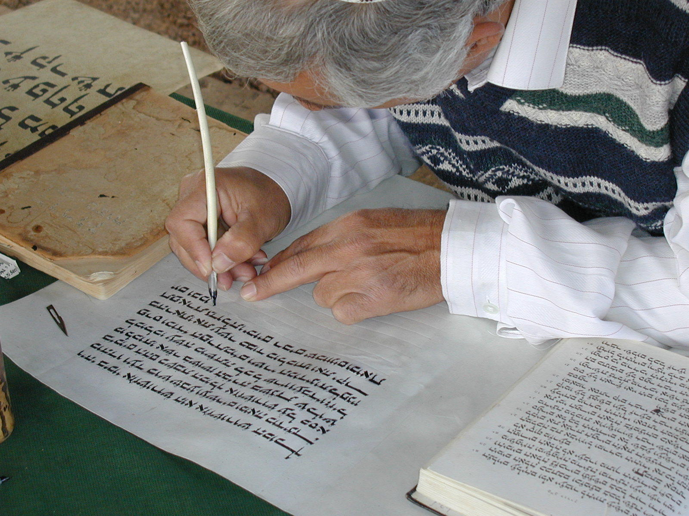

# Human-made Things in the Bible

## License Information

Human-made Things in the Bible © United Bible Societies, 2025. Adapted from: <cite>The Works of Their Hands: Man-made Things in the Bible</cite>, by Ray Pritz © 2009 United Bible Societies. This work is licensed under Creative Commons Attribution-ShareAlike 4.0 International (<a href="https://creativecommons.org/licenses/by-sa/4.0/">https://creativecommons.org/licenses/by-sa/4.0/</a>).

--------------------------------

## Ink (id: REALIA:1.7.2)

1\.7\.2 Ink
===========

References:
-----------

Hebrew דְּיוֹ (dyow)

[JER 36:18](https://ref.ly/Jer36:18)

Greek μέλας (melas)

[2CO 3:3](https://ref.ly/2Cor3:3), [2JN 1:12](https://ref.ly/2John1:12), [3JN 1:13](https://ref.ly/3John1:13)

Description:
------------

*A scribe copying Scripture with a reed pen (© Ray Pritz by United Bible Societies)*

Ink was a dark liquid used in writing or marking. Because it was difficult to store liquids for any length of time in the dry conditions of the Middle East, ink was sometimes made from black charcoal carbon. This was mixed with gum or oil and then dried. When the scribe was ready to write, he dipped his pen tip in water and then rubbed it on the ink block. The water dissolved a small amount of the carbon, forming the ink.

---

Translation:
------------

The use of ink is so universal at the present time that some term or expression for it is almost inevitable in all languages. In some cases the equivalent is a descriptive phrase, for example, “black stain” or “writing mark.”

* **Associated Passages:** Jeremiah 36:18; 2 Corinthians 3:3; 2 John 1:12; 3 John 1:13

