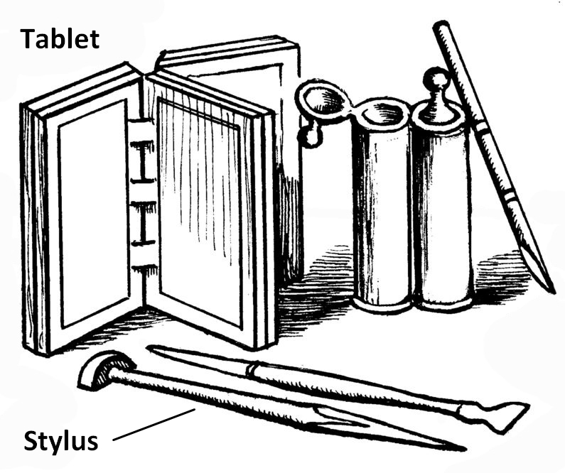

# Human-made Things in the Bible

## License Information

Human-made Things in the Bible © United Bible Societies, 2025. Adapted from: <cite>The Works of Their Hands: Man-made Things in the Bible</cite>, by Ray Pritz © 2009 United Bible Societies. This work is licensed under Creative Commons Attribution-ShareAlike 4.0 International (<a href="https://creativecommons.org/licenses/by-sa/4.0/">https://creativecommons.org/licenses/by-sa/4.0/</a>).

--------------------------------

## Stylus (id: REALIA:1.7.5)

1\.7\.5 Stylus
==============

References:
-----------

Hebrew חֶרֶט (cheret)

[ISA 8:1](https://ref.ly/Isa8:1)

Hebrew עֵט, בַּרְזֶל (‘et barzel)

[JOB 19:24](https://ref.ly/Job19:24), [JER 17:1](https://ref.ly/Jer17:1)

Description and usage:
----------------------

*Tablet and stylus (© Deutsche Bibelgesellschaft, Stuttgart by United Bible Societies)*

The stylus was a short, sharp piece of iron.

It was held in the hand and the point was used to engrave marks, usually writing or drawing, on stone or metal.

---

Translation:
------------

It is not clear if [JOB 19:24](https://ref.ly/Job19:24) speaks of an engraving tool made of iron or of an iron surface on which the engraving took place. For the first half of this verse, HOTTP (Hebrew Old Testament Text Project (UBS)) suggests “on tablets of iron and lead” or “with a stylus and lead \[meaning melted lead placed into the spaces of the inscription].”

The Hebrew phrase *cheret ’enosh* in [ISA 8:1](https://ref.ly/Isa8:1) has been the subject of much debate. Some translations choose to preserve the implement used (KJV (King James Version (1611)) “man’s pen”; NIV (New International Version (1984)) “ordinary pen”; NJB (New Jerusalem Bible (1985)) “ordinary stylus”), while others prefer a rendering that focuses on the words being written (RSV (Revised Standard Version (1952)) “common characters”; CEV (Contemporary English Version) “big clear letters”; NLT (New Living Translation) “clearly write”).

* **Associated Passages:** Isaiah 8:1; Job 19:24; Jeremiah 17:1

