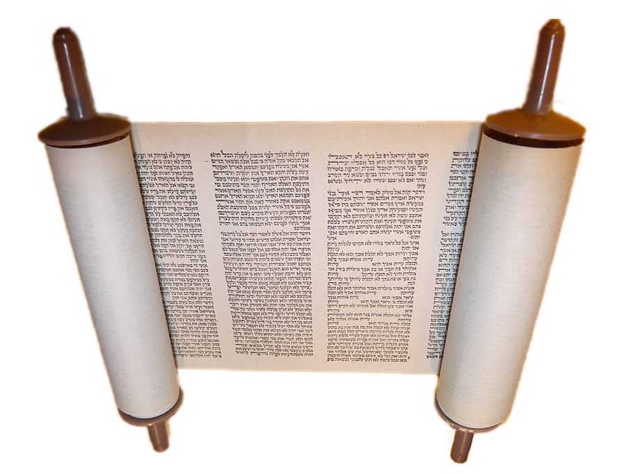
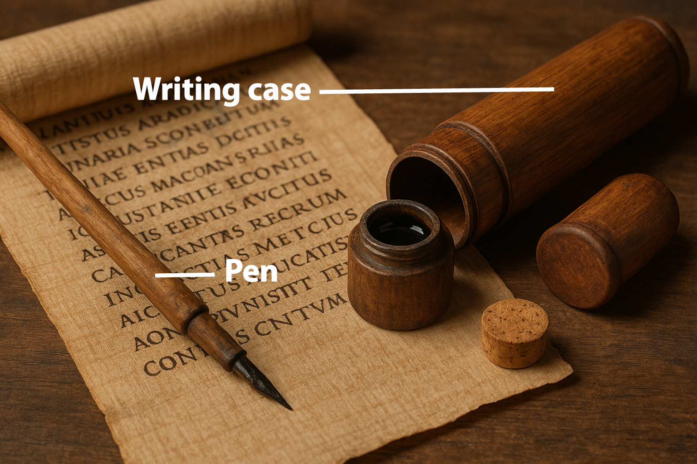

# Human-made Things in the Bible

## License Information

Human-made Things in the Bible © United Bible Societies, 2025. Adapted from: <cite>The Works of Their Hands: Man-made Things in the Bible</cite>, by Ray Pritz © 2009 United Bible Societies. This work is licensed under Creative Commons Attribution-ShareAlike 4.0 International (<a href="https://creativecommons.org/licenses/by-sa/4.0/">https://creativecommons.org/licenses/by-sa/4.0/</a>).

--------------------------------

## Scribes (id: REALIA:1.7)

1\.7 Scribes
============

## Scroll, book (id: REALIA:1.7.1)

1\.7\.1 Scroll, book
====================

References:
-----------

Hebrew מְגִלָּה (mgilah)

[EZR 6:2](https://ref.ly/Ezra6:2), [JER 36:6](https://ref.ly/Jer36:6), [JER 36:14](https://ref.ly/Jer36:14), [JER 36:14](https://ref.ly/Jer36:14), [JER 36:21](https://ref.ly/Jer36:21), [JER 36:23](https://ref.ly/Jer36:23), [JER 36:25](https://ref.ly/Jer36:25), [JER 36:29](https://ref.ly/Jer36:29), [JER 36:32](https://ref.ly/Jer36:32), [EZK 3:1](https://ref.ly/Ezek3:1), [EZK 3:2](https://ref.ly/Ezek3:2), [EZK 3:3](https://ref.ly/Ezek3:3), [ZEC 5:1](https://ref.ly/Zech5:1), [ZEC 5:2](https://ref.ly/Zech5:2)

Hebrew מְגִלָּה, סֵפֶר (mgilath sefer)

[PSA 40:8](https://ref.ly/Ps40:8), [JER 36:2](https://ref.ly/Jer36:2), [JER 36:4](https://ref.ly/Jer36:4), [EZK 2:9](https://ref.ly/Ezek2:9)

Hebrew סֵפֶר (sefer)

[GEN 5:1](https://ref.ly/Gen5:1), [EXO 17:14](https://ref.ly/Exod17:14), [EXO 24:7](https://ref.ly/Exod24:7), [EXO 32:32](https://ref.ly/Exod32:32), [EXO 32:33](https://ref.ly/Exod32:33), [NUM 5:23](https://ref.ly/Num5:23), [NUM 21:14](https://ref.ly/Num21:14), [DEU 17:18](https://ref.ly/Deut17:18), [DEU 24:1](https://ref.ly/Deut24:1), [DEU 24:3](https://ref.ly/Deut24:3), [DEU 28:58](https://ref.ly/Deut28:58), [DEU 28:61](https://ref.ly/Deut28:61), [DEU 29:19](https://ref.ly/Deut29:19), [DEU 29:20](https://ref.ly/Deut29:20), [DEU 29:26](https://ref.ly/Deut29:26), [DEU 30:10](https://ref.ly/Deut30:10), [DEU 31:24](https://ref.ly/Deut31:24), [DEU 31:26](https://ref.ly/Deut31:26), [JOS 1:8](https://ref.ly/Josh1:8), [JOS 8:31](https://ref.ly/Josh8:31), [JOS 8:34](https://ref.ly/Josh8:34), [JOS 10:13](https://ref.ly/Josh10:13), [JOS 18:9](https://ref.ly/Josh18:9), [JOS 23:6](https://ref.ly/Josh23:6), [JOS 24:26](https://ref.ly/Josh24:26), [1SA 10:25](https://ref.ly/1Sam10:25), [2SA 1:18](https://ref.ly/2Sam1:18), [2SA 11:14](https://ref.ly/2Sam11:14), [2SA 11:15](https://ref.ly/2Sam11:15), [1KI 11:41](https://ref.ly/1Kgs11:41), [1KI 14:19](https://ref.ly/1Kgs14:19), [1KI 14:29](https://ref.ly/1Kgs14:29), [1KI 15:7](https://ref.ly/1Kgs15:7), [1KI 15:23](https://ref.ly/1Kgs15:23), [1KI 15:31](https://ref.ly/1Kgs15:31), [1KI 16:5](https://ref.ly/1Kgs16:5), [1KI 16:14](https://ref.ly/1Kgs16:14), [1KI 16:20](https://ref.ly/1Kgs16:20), [1KI 16:27](https://ref.ly/1Kgs16:27), [1KI 21:8](https://ref.ly/1Kgs21:8), [1KI 21:8](https://ref.ly/1Kgs21:8), [1KI 21:8](https://ref.ly/1Kgs21:8), [1KI 21:9](https://ref.ly/1Kgs21:9), [1KI 21:11](https://ref.ly/1Kgs21:11), [1KI 22:39](https://ref.ly/1Kgs22:39), [1KI 22:46](https://ref.ly/1Kgs22:46), [2KI 1:18](https://ref.ly/2Kgs1:18), [2KI 5:5](https://ref.ly/2Kgs5:5), [2KI 5:6](https://ref.ly/2Kgs5:6), [2KI 5:6](https://ref.ly/2Kgs5:6), [2KI 5:7](https://ref.ly/2Kgs5:7), [2KI 8:23](https://ref.ly/2Kgs8:23), [2KI 10:1](https://ref.ly/2Kgs10:1), [2KI 10:2](https://ref.ly/2Kgs10:2), [2KI 10:6](https://ref.ly/2Kgs10:6), [2KI 10:7](https://ref.ly/2Kgs10:7), [2KI 10:34](https://ref.ly/2Kgs10:34), [2KI 12:20](https://ref.ly/2Kgs12:20), [2KI 13:8](https://ref.ly/2Kgs13:8), [2KI 13:12](https://ref.ly/2Kgs13:12), [2KI 14:6](https://ref.ly/2Kgs14:6), [2KI 14:15](https://ref.ly/2Kgs14:15), [2KI 14:18](https://ref.ly/2Kgs14:18), [2KI 14:28](https://ref.ly/2Kgs14:28), [2KI 15:6](https://ref.ly/2Kgs15:6), [2KI 15:11](https://ref.ly/2Kgs15:11), [2KI 15:15](https://ref.ly/2Kgs15:15), [2KI 15:21](https://ref.ly/2Kgs15:21), [2KI 15:26](https://ref.ly/2Kgs15:26), [2KI 15:31](https://ref.ly/2Kgs15:31), [2KI 15:36](https://ref.ly/2Kgs15:36), [2KI 16:19](https://ref.ly/2Kgs16:19), [2KI 19:14](https://ref.ly/2Kgs19:14), [2KI 20:12](https://ref.ly/2Kgs20:12), [2KI 20:20](https://ref.ly/2Kgs20:20), [2KI 21:17](https://ref.ly/2Kgs21:17), [2KI 21:25](https://ref.ly/2Kgs21:25), [2KI 22:8](https://ref.ly/2Kgs22:8), [2KI 22:8](https://ref.ly/2Kgs22:8), [2KI 22:10](https://ref.ly/2Kgs22:10), [2KI 22:11](https://ref.ly/2Kgs22:11), [2KI 22:13](https://ref.ly/2Kgs22:13), [2KI 22:13](https://ref.ly/2Kgs22:13), [2KI 22:16](https://ref.ly/2Kgs22:16), [2KI 23:2](https://ref.ly/2Kgs23:2), [2KI 23:3](https://ref.ly/2Kgs23:3), [2KI 23:21](https://ref.ly/2Kgs23:21), [2KI 23:24](https://ref.ly/2Kgs23:24), [2KI 23:28](https://ref.ly/2Kgs23:28), [2KI 24:5](https://ref.ly/2Kgs24:5), [1CH 9:1](https://ref.ly/1Chr9:1), [2CH 16:11](https://ref.ly/2Chr16:11), [2CH 17:9](https://ref.ly/2Chr17:9), [2CH 20:34](https://ref.ly/2Chr20:34), [2CH 24:27](https://ref.ly/2Chr24:27), [2CH 25:4](https://ref.ly/2Chr25:4), [2CH 25:26](https://ref.ly/2Chr25:26), [2CH 27:7](https://ref.ly/2Chr27:7), [2CH 28:26](https://ref.ly/2Chr28:26), [2CH 32:17](https://ref.ly/2Chr32:17), [2CH 32:32](https://ref.ly/2Chr32:32), [2CH 34:14](https://ref.ly/2Chr34:14), [2CH 34:15](https://ref.ly/2Chr34:15), [2CH 34:15](https://ref.ly/2Chr34:15), [2CH 34:16](https://ref.ly/2Chr34:16), [2CH 34:18](https://ref.ly/2Chr34:18), [2CH 34:21](https://ref.ly/2Chr34:21), [2CH 34:21](https://ref.ly/2Chr34:21), [2CH 34:24](https://ref.ly/2Chr34:24), [2CH 34:30](https://ref.ly/2Chr34:30), [2CH 34:31](https://ref.ly/2Chr34:31), [2CH 35:12](https://ref.ly/2Chr35:12), [2CH 35:27](https://ref.ly/2Chr35:27), [2CH 36:8](https://ref.ly/2Chr36:8), [NEH 7:5](https://ref.ly/Neh7:5), [NEH 8:1](https://ref.ly/Neh8:1), [NEH 8:3](https://ref.ly/Neh8:3), [NEH 8:5](https://ref.ly/Neh8:5), [NEH 8:8](https://ref.ly/Neh8:8), [NEH 8:18](https://ref.ly/Neh8:18), [NEH 9:3](https://ref.ly/Neh9:3), [NEH 12:23](https://ref.ly/Neh12:23), [NEH 13:1](https://ref.ly/Neh13:1), [EST 1:22](https://ref.ly/Esth1:22), [EST 2:23](https://ref.ly/Esth2:23), [EST 3:13](https://ref.ly/Esth3:13), [EST 6:1](https://ref.ly/Esth6:1), [EST 8:5](https://ref.ly/Esth8:5), [EST 8:10](https://ref.ly/Esth8:10), [EST 9:20](https://ref.ly/Esth9:20), [EST 9:25](https://ref.ly/Esth9:25), [EST 9:30](https://ref.ly/Esth9:30), [EST 9:32](https://ref.ly/Esth9:32), [EST 10:2](https://ref.ly/Esth10:2), [JOB 19:23](https://ref.ly/Job19:23), [JOB 31:35](https://ref.ly/Job31:35), [PSA 69:29](https://ref.ly/Ps69:29), [PSA 139:16](https://ref.ly/Ps139:16), [ECC 12:12](https://ref.ly/Eccl12:12), [ISA 29:11](https://ref.ly/Isa29:11), [ISA 29:11](https://ref.ly/Isa29:11), [ISA 29:11](https://ref.ly/Isa29:11), [ISA 29:12](https://ref.ly/Isa29:12), [ISA 29:12](https://ref.ly/Isa29:12), [ISA 29:12](https://ref.ly/Isa29:12), [ISA 29:18](https://ref.ly/Isa29:18), [ISA 30:8](https://ref.ly/Isa30:8), [ISA 34:4](https://ref.ly/Isa34:4), [ISA 34:16](https://ref.ly/Isa34:16), [ISA 37:14](https://ref.ly/Isa37:14), [ISA 39:1](https://ref.ly/Isa39:1), [ISA 50:1](https://ref.ly/Isa50:1), [JER 3:8](https://ref.ly/Jer3:8), [JER 25:13](https://ref.ly/Jer25:13), [JER 29:1](https://ref.ly/Jer29:1), [JER 29:25](https://ref.ly/Jer29:25), [JER 29:29](https://ref.ly/Jer29:29), [JER 30:2](https://ref.ly/Jer30:2), [JER 32:10](https://ref.ly/Jer32:10), [JER 32:11](https://ref.ly/Jer32:11), [JER 32:12](https://ref.ly/Jer32:12), [JER 32:12](https://ref.ly/Jer32:12), [JER 32:14](https://ref.ly/Jer32:14), [JER 32:14](https://ref.ly/Jer32:14), [JER 32:14](https://ref.ly/Jer32:14), [JER 32:16](https://ref.ly/Jer32:16), [JER 32:44](https://ref.ly/Jer32:44), [JER 36:8](https://ref.ly/Jer36:8), [JER 36:10](https://ref.ly/Jer36:10), [JER 36:11](https://ref.ly/Jer36:11), [JER 36:13](https://ref.ly/Jer36:13), [JER 36:18](https://ref.ly/Jer36:18), [JER 36:32](https://ref.ly/Jer36:32), [JER 45:1](https://ref.ly/Jer45:1), [JER 51:60](https://ref.ly/Jer51:60), [JER 51:63](https://ref.ly/Jer51:63), [DAN 1:4](https://ref.ly/Dan1:4), [DAN 1:17](https://ref.ly/Dan1:17), [DAN 9:2](https://ref.ly/Dan9:2), [DAN 12:1](https://ref.ly/Dan12:1), [DAN 12:4](https://ref.ly/Dan12:4), [NAM 1:1](https://ref.ly/Nah1:1), [MAL 3:16](https://ref.ly/Mal3:16)

Greek βιβλαρίδιον (biblaridion)

[REV 10:2](https://ref.ly/Rev10:2), [REV 10:9](https://ref.ly/Rev10:9), [REV 10:10](https://ref.ly/Rev10:10)

Greek βιβλίον (biblion)

[MAT 19:7](https://ref.ly/Matt19:7), [MRK 10:4](https://ref.ly/Mark10:4), [LUK 4:17](https://ref.ly/Luke4:17), [LUK 4:17](https://ref.ly/Luke4:17), [LUK 4:20](https://ref.ly/Luke4:20), [JHN 20:30](https://ref.ly/John20:30), [JHN 21:25](https://ref.ly/John21:25), [GAL 3:10](https://ref.ly/Gal3:10), [2TI 4:13](https://ref.ly/2Tim4:13), [HEB 9:19](https://ref.ly/Heb9:19), [HEB 10:7](https://ref.ly/Heb10:7), [REV 1:11](https://ref.ly/Rev1:11), [REV 5:1](https://ref.ly/Rev5:1), [REV 5:2](https://ref.ly/Rev5:2), [REV 5:3](https://ref.ly/Rev5:3), [REV 5:4](https://ref.ly/Rev5:4), [REV 5:5](https://ref.ly/Rev5:5), [REV 5:8](https://ref.ly/Rev5:8), [REV 5:9](https://ref.ly/Rev5:9), [REV 6:14](https://ref.ly/Rev6:14), [REV 10:8](https://ref.ly/Rev10:8), [REV 13:8](https://ref.ly/Rev13:8), [REV 17:8](https://ref.ly/Rev17:8), [REV 20:12](https://ref.ly/Rev20:12), [REV 20:12](https://ref.ly/Rev20:12), [REV 20:12](https://ref.ly/Rev20:12), [REV 21:27](https://ref.ly/Rev21:27), [REV 22:7](https://ref.ly/Rev22:7), [REV 22:9](https://ref.ly/Rev22:9), [REV 22:10](https://ref.ly/Rev22:10), [REV 22:18](https://ref.ly/Rev22:18), [REV 22:18](https://ref.ly/Rev22:18), [REV 22:19](https://ref.ly/Rev22:19), [REV 22:19](https://ref.ly/Rev22:19), [TOB 7:14](https://ref.ly/Tob7:14), [TOB 12:20](https://ref.ly/Tob12:20), [ESG 9:20](https://ref.ly/EsthGr9:20), [ESG 10:2](https://ref.ly/EsthGr10:2), [SIR 1:1](https://ref.ly/Sir1:1), [SIR 1:1](https://ref.ly/Sir1:1), [SIR 1:1](https://ref.ly/Sir1:1), [SIR 50:27](https://ref.ly/Sir50:27), [BAR 1:1](https://ref.ly/Bar1:1), [BAR 1:3](https://ref.ly/Bar1:3), [BAR 1:14](https://ref.ly/Bar1:14), [1MA 1:44](https://ref.ly/1Macc1:44), [1MA 1:56](https://ref.ly/1Macc1:56), [1MA 1:57](https://ref.ly/1Macc1:57), [1MA 3:48](https://ref.ly/1Macc3:48), [1MA 12:9](https://ref.ly/1Macc12:9), [1MA 14:23](https://ref.ly/1Macc14:23), [1MA 16:24](https://ref.ly/1Macc16:24), [2MA 2:13](https://ref.ly/2Macc2:13), [2MA 2:23](https://ref.ly/2Macc2:23), [1ES 1:12](https://ref.ly/1Esd1:12), [1ES 1:31](https://ref.ly/1Esd1:31), [1ES 2:16](https://ref.ly/1Esd2:16), [1ES 9:45](https://ref.ly/1Esd9:45)

Greek βίβλος (biblos)

[MAT 1:1](https://ref.ly/Matt1:1), [MRK 12:26](https://ref.ly/Mark12:26), [LUK 3:4](https://ref.ly/Luke3:4), [LUK 20:42](https://ref.ly/Luke20:42), [ACT 1:20](https://ref.ly/Acts1:20), [ACT 7:42](https://ref.ly/Acts7:42), [ACT 19:19](https://ref.ly/Acts19:19), [PHP 4:3](https://ref.ly/Phil4:3), [REV 3:5](https://ref.ly/Rev3:5), [REV 20:15](https://ref.ly/Rev20:15), [TOB 1:1](https://ref.ly/Tob1:1), [SIR 1:1](https://ref.ly/Sir1:1), [SIR 24:23](https://ref.ly/Sir24:23), [BAR 1:3](https://ref.ly/Bar1:3), [BAR 4:1](https://ref.ly/Bar4:1), [2MA 6:12](https://ref.ly/2Macc6:12), [2MA 8:23](https://ref.ly/2Macc8:23), [1ES 1:31](https://ref.ly/1Esd1:31), [1ES 1:40](https://ref.ly/1Esd1:40), [1ES 5:48](https://ref.ly/1Esd5:48), [1ES 7:6](https://ref.ly/1Esd7:6), [1ES 7:9](https://ref.ly/1Esd7:9)

Greek κεφαλίς (kefalis)

[HEB 10:7](https://ref.ly/Heb10:7)

Greek τόμος (tomos)

[1ES 6:22](https://ref.ly/1Esd6:22)

Latin liber

[2ES 1:1](https://ref.ly/2Esd1:1), [2ES 6:20](https://ref.ly/2Esd6:20), [2ES 12:37](https://ref.ly/2Esd12:37), [2ES 14:44](https://ref.ly/2Esd14:44)

Description:
------------

*Scrolls (© Kadumago \- Wikimedia Commons)*

The scroll was a long strip of writing material made by sewing together sheets of papyrus or parchment. This strip was then rolled up from one end or from both ends to form one or two cylinders. Usually the ends of the scroll were attached to sticks, around which the scroll was rolled. An unrolled scroll was often about 10 meters (33 feet) in length. It stood approximately 23–25 centimeters (9–10 inches) high. See also the illustration at [1\.7\.2 Ink\<REALIA:1\.7\.2\>](#).

---

Usage:
------

*Man reading a scroll (Image generated by ChatGPT using OpenAI technology)*

A scroll was a convenient means to store a large amount of written text in a relatively small space. The text was written in parallel columns, usually on one side of the scroll.

---

Translation:
------------

In the case of practically all terms for documents (for example, “letter,” “book,” “scroll”), the meaning involves not only the object on which the writing is done, but also the contents of the writing. In some languages a distinction must be made between these two aspects of such objects, and translators must make certain that the particular expression used in a receptor language will at least include the contents and not refer merely to the materials on which the words were written.

Scrolls varied in length but otherwise there was little difference between the physical construction of a short document and a long one. Thus, for example, the Hebrew word *sefer* may indicate a longer document (“book”), or it can also designate something shorter, which may best be translated “letter,” “writing,” or even “document”; for example, GNT (Good News Translation (1992)) renders it “papers” in [DEU 24:1](https://ref.ly/Deut24:1) and “letter” in [2KI 5:6](https://ref.ly/2Kgs5:6).

Exceptionally long books might be written on more than one scroll. The Greek word *kefalis* in [HEB 10:7](https://ref.ly/Heb10:7) refers to one such section or scroll of a book.

The codex, or bound book with individual pages, only came into use in the first century B.C. and in common use only a century or two later. Thus, all references to books in the Old Testament, in the Deuterocanon, and probably in the New Testament are to scrolls. Nevertheless, the closest equivalent in most languages for “scroll” is the term used today for “book,” and this will normally be the proper translation.

In [ISA 29:11](https://ref.ly/Isa29:11); [ISA 29:12](https://ref.ly/Isa29:12) the Hebrew verb *yada’* (“know”) occurs with the word *sefer* to indicate the ability to read and should be translated “knows how to read” (GNT (Good News Translation (1992))) or “can read” (RSV (Revised Standard Version (1952))). In [DAN 1:4](https://ref.ly/Dan1:4) the word *sefer* may indicate either “literature/writings” (NRSV (New Revised Standard Version (1989)), SPCL (Spanish Common Language Version (Dios Habla Hoy)), REB (Revised English Bible (1989))) or the ability “to read and write” (GNT (Good News Translation (1992))). In some languages the idea of literature may be unfamiliar, but there will probably be some way of talking about “written things,” and this may be the nearest equivalent available.

[TOB 7:14](https://ref.ly/Tob7:14): On the scroll in this passage were written the terms of agreement between a man and a woman entering into marriage. Almost all cultures know some means by which two parties agree to a marriage. If this is a written document, then the name for that document may be used.

* **Associated Passages:** Ezra 6:2; Jeremiah 36:6; Jeremiah 36:14; Jeremiah 36:21; Jeremiah 36:23; Jeremiah 36:25; Jeremiah 36:29; Jeremiah 36:32; Ezekiel 3:1; Ezekiel 3:2; Ezekiel 3:3; Zechariah 5:1; Zechariah 5:2; Psalms 40:8; Jeremiah 36:2; Jeremiah 36:4; Ezekiel 2:9; Genesis 5:1; Exodus 17:14; Exodus 24:7; Exodus 32:32; Exodus 32:33; Numbers 5:23; Numbers 21:14; Deuteronomy 17:18; Deuteronomy 24:1; Deuteronomy 24:3; Deuteronomy 28:58; Deuteronomy 28:61; Deuteronomy 29:19; Deuteronomy 29:20; Deuteronomy 29:26; Deuteronomy 30:10; Deuteronomy 31:24; Deuteronomy 31:26; Joshua 1:8; Joshua 8:31; Joshua 8:34; Joshua 10:13; Joshua 18:9; Joshua 23:6; Joshua 24:26; 1 Samuel 10:25; 2 Samuel 1:18; 2 Samuel 11:14; 2 Samuel 11:15; 1 Kings 11:41; 1 Kings 14:19; 1 Kings 14:29; 1 Kings 15:7; 1 Kings 15:23; 1 Kings 15:31; 1 Kings 16:5; 1 Kings 16:14; 1 Kings 16:20; 1 Kings 16:27; 1 Kings 21:8; 1 Kings 21:9; 1 Kings 21:11; 1 Kings 22:39; 1 Kings 22:46; 2 Kings 1:18; 2 Kings 5:5; 2 Kings 5:6; 2 Kings 5:7; 2 Kings 8:23; 2 Kings 10:1; 2 Kings 10:2; 2 Kings 10:6; 2 Kings 10:7; 2 Kings 10:34; 2 Kings 12:20; 2 Kings 13:8; 2 Kings 13:12; 2 Kings 14:6; 2 Kings 14:15; 2 Kings 14:18; 2 Kings 14:28; 2 Kings 15:6; 2 Kings 15:11; 2 Kings 15:15; 2 Kings 15:21; 2 Kings 15:26; 2 Kings 15:31; 2 Kings 15:36; 2 Kings 16:19; 2 Kings 19:14; 2 Kings 20:12; 2 Kings 20:20; 2 Kings 21:17; 2 Kings 21:25; 2 Kings 22:8; 2 Kings 22:10; 2 Kings 22:11; 2 Kings 22:13; 2 Kings 22:16; 2 Kings 23:2; 2 Kings 23:3; 2 Kings 23:21; 2 Kings 23:24; 2 Kings 23:28; 2 Kings 24:5; 1 Chronicles 9:1; 2 Chronicles 16:11; 2 Chronicles 17:9; 2 Chronicles 20:34; 2 Chronicles 24:27; 2 Chronicles 25:4; 2 Chronicles 25:26; 2 Chronicles 27:7; 2 Chronicles 28:26; 2 Chronicles 32:17; 2 Chronicles 32:32; 2 Chronicles 34:14; 2 Chronicles 34:15; 2 Chronicles 34:16; 2 Chronicles 34:18; 2 Chronicles 34:21; 2 Chronicles 34:24; 2 Chronicles 34:30; 2 Chronicles 34:31; 2 Chronicles 35:12; 2 Chronicles 35:27; 2 Chronicles 36:8; Nehemiah 7:5; Nehemiah 8:1; Nehemiah 8:3; Nehemiah 8:5; Nehemiah 8:8; Nehemiah 8:18; Nehemiah 9:3; Nehemiah 12:23; Nehemiah 13:1; Esther 1:22; Esther 2:23; Esther 3:13; Esther 6:1; Esther 8:5; Esther 8:10; Esther 9:20; Esther 9:25; Esther 9:30; Esther 9:32; Esther 10:2; Job 19:23; Job 31:35; Psalms 69:29; Psalms 139:16; Ecclesiastes 12:12; Isaiah 29:11; Isaiah 29:12; Isaiah 29:18; Isaiah 30:8; Isaiah 34:4; Isaiah 34:16; Isaiah 37:14; Isaiah 39:1; Isaiah 50:1; Jeremiah 3:8; Jeremiah 25:13; Jeremiah 29:1; Jeremiah 29:25; Jeremiah 29:29; Jeremiah 30:2; Jeremiah 32:10; Jeremiah 32:11; Jeremiah 32:12; Jeremiah 32:14; Jeremiah 32:16; Jeremiah 32:44; Jeremiah 36:8; Jeremiah 36:10; Jeremiah 36:11; Jeremiah 36:13; Jeremiah 36:18; Jeremiah 45:1; Jeremiah 51:60; Jeremiah 51:63; Daniel 1:4; Daniel 1:17; Daniel 9:2; Daniel 12:1; Daniel 12:4; Nahum 1:1; Malachi 3:16; Revelation 10:2; Revelation 10:9; Revelation 10:10; Matthew 19:7; Mark 10:4; Luke 4:17; Luke 4:20; John 20:30; John 21:25; Galatians 3:10; 2 Timothy 4:13; Hebrews 9:19; Hebrews 10:7; Revelation 1:11; Revelation 5:1; Revelation 5:2; Revelation 5:3; Revelation 5:4; Revelation 5:5; Revelation 5:8; Revelation 5:9; Revelation 6:14; Revelation 10:8; Revelation 13:8; Revelation 17:8; Revelation 20:12; Revelation 21:27; Revelation 22:7; Revelation 22:9; Revelation 22:10; Revelation 22:18; Revelation 22:19; Tobit 7:14; Tobit 12:20; Esther Greek 9:20; Esther Greek 10:2; Sirach 1:1; Sirach 50:27; Baruch 1:1; Baruch 1:3; Baruch 1:14; 1 Maccabees 1:44; 1 Maccabees 1:56; 1 Maccabees 1:57; 1 Maccabees 3:48; 1 Maccabees 12:9; 1 Maccabees 14:23; 1 Maccabees 16:24; 2 Maccabees 2:13; 2 Maccabees 2:23; 1 Esdras (Greek) 1:12; 1 Esdras (Greek) 1:31; 1 Esdras (Greek) 2:16; 1 Esdras (Greek) 9:45; Matthew 1:1; Mark 12:26; Luke 3:4; Luke 20:42; Acts 1:20; Acts 7:42; Acts 19:19; Philippians 4:3; Revelation 3:5; Revelation 20:15; Tobit 1:1; Sirach 24:23; Baruch 4:1; 2 Maccabees 6:12; 2 Maccabees 8:23; 1 Esdras (Greek) 1:40; 1 Esdras (Greek) 5:48; 1 Esdras (Greek) 7:6; 1 Esdras (Greek) 7:9; 1 Esdras (Greek) 6:22; 2 Esdras (Latin) 1:1; 2 Esdras (Latin) 6:20; 2 Esdras (Latin) 12:37; 2 Esdras (Latin) 14:44

* **Associated ACAI Concepts:** Scroll (ID: `realia:Scroll`)

## Ink (id: REALIA:1.7.2)

1\.7\.2 Ink
===========

References:
-----------

Hebrew דְּיוֹ (dyow)

[JER 36:18](https://ref.ly/Jer36:18)

Greek μέλας (melas)

[2CO 3:3](https://ref.ly/2Cor3:3), [2JN 1:12](https://ref.ly/2John1:12), [3JN 1:13](https://ref.ly/3John1:13)

Description:
------------

*A scribe copying Scripture with a reed pen (© Ray Pritz by United Bible Societies)*

Ink was a dark liquid used in writing or marking. Because it was difficult to store liquids for any length of time in the dry conditions of the Middle East, ink was sometimes made from black charcoal carbon. This was mixed with gum or oil and then dried. When the scribe was ready to write, he dipped his pen tip in water and then rubbed it on the ink block. The water dissolved a small amount of the carbon, forming the ink.

---

Translation:
------------

The use of ink is so universal at the present time that some term or expression for it is almost inevitable in all languages. In some cases the equivalent is a descriptive phrase, for example, “black stain” or “writing mark.”

* **Associated Passages:** Jeremiah 36:18; 2 Corinthians 3:3; 2 John 1:12; 3 John 1:13

* **Associated ACAI Concepts:** Ink (ID: `realia:Ink`); Writing Case (ID: `realia:WritingCase`)

## Pen (id: REALIA:1.7.3)

1\.7\.3 Pen
===========

References:
-----------

Hebrew עֵט, סֹפֵר (‘et sofer)

[PSA 45:2](https://ref.ly/Ps45:2), [JER 8:8](https://ref.ly/Jer8:8)

Greek κάλαμος (kalamos)

[3JN 1:13](https://ref.ly/3John1:13), [3MA 4:20](https://ref.ly/3Macc4:20)

Description:
------------

The pen was a reed especially cut for making marks with ink on writing material. It was about 20 centimeters (8 inches) long and was sharpened on one end and split to form a nib. Sometimes it could be made of a rush cut at an angle and then frayed to form a fine brush.

---

Usage:
------

See [1\.7\.2 Ink\<REALIA:1\.7\.2\>](#).

* **Associated Passages:** Psalms 45:2; Jeremiah 8:8; 3 John 1:13; 3 Maccabees 4:20

* **Associated ACAI Concepts:** Pen (ID: `realia:Pen`); Writing Case (ID: `realia:WritingCase`)

## Writing case (id: REALIA:1.7.4)

1\.7\.4 Writing case
====================

References:
-----------

Hebrew קֶסֶת, סֹפֵר (qeseth sofer)

[EZK 9:2](https://ref.ly/Ezek9:2), [EZK 9:3](https://ref.ly/Ezek9:3), [EZK 9:11](https://ref.ly/Ezek9:11)

Description:
------------

*Pens in a case (Wood, ivory, paint, ca. 1635–1458 BCE, Second Intermediate Period–Early New Kingdom, Egypt, Thebes, Asasif) (Metropolitan Museum of Art, CC0, via Wikimedia Commons)*

The writing case was a small box, usually made of wood, for carrying several pens (1\.7\.2\) and sometimes a cake of dried ink (1\.7\.4\). Inside the case, in addition to several reed pens, there were receptacles where the ink was mixed at the time of writing. A person generally carried this case by hanging it from his belt. Sometimes the object for mixing the ink had the shape of a palette, with two circular hollows for two colors of ink, and was carried by hanging it from a cord.

---

Translation:
------------

*Writing case and pen (Image generated by ChatGPT using OpenAI technology)*

The closest equivalent in many languages for “writing case” would be “pencil case,” but this could sound anachronistic. It is also possible to render it with a descriptive phrase, such as “a small box in which he carried pens” or “… in which he carried writing instruments.”

* **Associated Passages:** Ezekiel 9:2; Ezekiel 9:3; Ezekiel 9:11

* **Associated ACAI Concepts:** Writing Case (ID: `realia:WritingCase`); Linen (ID: `realia:Linen`)

## Stylus (id: REALIA:1.7.5)

1\.7\.5 Stylus
==============

References:
-----------

Hebrew חֶרֶט (cheret)

[ISA 8:1](https://ref.ly/Isa8:1)

Hebrew עֵט, בַּרְזֶל (‘et barzel)

[JOB 19:24](https://ref.ly/Job19:24), [JER 17:1](https://ref.ly/Jer17:1)

Description and usage:
----------------------

*Tablet and stylus (© Deutsche Bibelgesellschaft, Stuttgart by United Bible Societies)*

The stylus was a short, sharp piece of iron.

It was held in the hand and the point was used to engrave marks, usually writing or drawing, on stone or metal.

---

Translation:
------------

It is not clear if [JOB 19:24](https://ref.ly/Job19:24) speaks of an engraving tool made of iron or of an iron surface on which the engraving took place. For the first half of this verse, HOTTP (Hebrew Old Testament Text Project (UBS)) suggests “on tablets of iron and lead” or “with a stylus and lead \[meaning melted lead placed into the spaces of the inscription].”

The Hebrew phrase *cheret ’enosh* in [ISA 8:1](https://ref.ly/Isa8:1) has been the subject of much debate. Some translations choose to preserve the implement used (KJV (King James Version (1611)) “man’s pen”; NIV (New International Version (1984)) “ordinary pen”; NJB (New Jerusalem Bible (1985)) “ordinary stylus”), while others prefer a rendering that focuses on the words being written (RSV (Revised Standard Version (1952)) “common characters”; CEV (Contemporary English Version) “big clear letters”; NLT (New Living Translation) “clearly write”).

* **Associated Passages:** Isaiah 8:1; Job 19:24; Jeremiah 17:1

* **Associated ACAI Concepts:** Stylus (ID: `realia:Stylus`)

## Writing tablet, tablet of brass/bronze (id: REALIA:1.7.6)

1\.7\.6 Writing tablet, tablet of brass/bronze
==============================================

References:
-----------

Hebrew גִּלָּיוֹן (gilayon)

[ISA 8:1](https://ref.ly/Isa8:1)

Hebrew לוּחַ (luach)

[EXO 24:12](https://ref.ly/Exod24:12), [EXO 31:18](https://ref.ly/Exod31:18), [EXO 31:18](https://ref.ly/Exod31:18), [EXO 32:15](https://ref.ly/Exod32:15), [EXO 32:15](https://ref.ly/Exod32:15), [EXO 32:16](https://ref.ly/Exod32:16), [EXO 32:16](https://ref.ly/Exod32:16), [EXO 32:19](https://ref.ly/Exod32:19), [EXO 34:1](https://ref.ly/Exod34:1), [EXO 34:1](https://ref.ly/Exod34:1), [EXO 34:1](https://ref.ly/Exod34:1), [EXO 34:4](https://ref.ly/Exod34:4), [EXO 34:4](https://ref.ly/Exod34:4), [EXO 34:28](https://ref.ly/Exod34:28), [EXO 34:29](https://ref.ly/Exod34:29), [DEU 4:13](https://ref.ly/Deut4:13), [DEU 5:22](https://ref.ly/Deut5:22), [DEU 9:9](https://ref.ly/Deut9:9), [DEU 9:9](https://ref.ly/Deut9:9), [DEU 9:10](https://ref.ly/Deut9:10), [DEU 9:11](https://ref.ly/Deut9:11), [DEU 9:11](https://ref.ly/Deut9:11), [DEU 9:15](https://ref.ly/Deut9:15), [DEU 9:17](https://ref.ly/Deut9:17), [DEU 10:1](https://ref.ly/Deut10:1), [DEU 10:2](https://ref.ly/Deut10:2), [DEU 10:2](https://ref.ly/Deut10:2), [DEU 10:3](https://ref.ly/Deut10:3), [DEU 10:3](https://ref.ly/Deut10:3), [DEU 10:4](https://ref.ly/Deut10:4), [DEU 10:5](https://ref.ly/Deut10:5), [1KI 8:9](https://ref.ly/1Kgs8:9), [2CH 5:10](https://ref.ly/2Chr5:10), [PRO 3:3](https://ref.ly/Prov3:3), [PRO 7:3](https://ref.ly/Prov7:3), [ISA 30:8](https://ref.ly/Isa30:8), [JER 17:1](https://ref.ly/Jer17:1), [HAB 2:2](https://ref.ly/Hab2:2)

Greek δέλτος (deltos)

[1MA 8:22](https://ref.ly/1Macc8:22), [1MA 14:18](https://ref.ly/1Macc14:18), [1MA 14:26](https://ref.ly/1Macc14:26), [1MA 14:48](https://ref.ly/1Macc14:48)

Greek πινακίδιον (pinakidion)

[LUK 1:63](https://ref.ly/Luke1:63)

Latin buxus

[2ES 14:24](https://ref.ly/2Esd14:24)

Description:
------------

*Wax writing tablet (Metropolitan Museum of Art, CC0, MMA)*

The writing tablet was a small, flat board, normally made of wood. It was coated on one side with a thin layer of wax. A pointed stick or stylus was used to make marks and letters in the wax layer for short messages. After use, the wax could be smoothed out and used again. Several tablets could be connected along one edge by cord in order to make a kind of book. See the illustration at [1\.7\.5 Stylus\<REALIA:1\.7\.5\>](#). It is possible that the Old Testament references are to tablets made of clay, metal or stone, on which words were scratched directly with a hard, pointed object.

The tablets mentioned in 1 Maccabees were flat pieces of polished brass or bronze on which words were inscribed. The sizes of these tablets are unknown, but they would probably not have been very large.

---

Translation:
------------

Translators should avoid a word that indicates a modern “tablet” of writing paper.

[PRO 3:3](https://ref.ly/Prov3:3); [PRO 7:3](https://ref.ly/Prov7:3); [JER 17:1](https://ref.ly/Jer17:1): The Hebrew word *luach* has a figurative meaning in these passages and may be rendered without reference to an actual writing tablet; for example, GNT (Good News Translation (1992)) renders [PRO 7:3](https://ref.ly/Prov7:3) b as “write it on your heart,” and ITCL (Italian Common Language Version) has “guard them in your heart like a treasure.”

Although one or two of the references with the Greek word *deltos* speak of the tablets as containing “letters” (that is, correspondence), such tablets were not the normal medium for letters. According to [1MA 8:22](https://ref.ly/1Macc8:22), they were special memorial documents, intended “as a memorial of peace and alliance” (RSV (Revised Standard Version (1952))). Some cultures may have special documents that are exchanged between people groups when they make treaties or alliances.

* **Associated Passages:** Isaiah 8:1; Exodus 24:12; Exodus 31:18; Exodus 32:15; Exodus 32:16; Exodus 32:19; Exodus 34:1; Exodus 34:4; Exodus 34:28; Exodus 34:29; Deuteronomy 4:13; Deuteronomy 5:22; Deuteronomy 9:9; Deuteronomy 9:10; Deuteronomy 9:11; Deuteronomy 9:15; Deuteronomy 9:17; Deuteronomy 10:1; Deuteronomy 10:2; Deuteronomy 10:3; Deuteronomy 10:4; Deuteronomy 10:5; 1 Kings 8:9; 2 Chronicles 5:10; Proverbs 3:3; Proverbs 7:3; Isaiah 30:8; Jeremiah 17:1; Habakkuk 2:2; 1 Maccabees 8:22; 1 Maccabees 14:18; 1 Maccabees 14:26; 1 Maccabees 14:48; Luke 1:63; 2 Esdras (Latin) 14:24

## Paper (id: REALIA:1.7.7)

1\.7\.7 Paper
=============

References:
-----------

Greek χαρτηρία (chartēria)

[3MA 4:20](https://ref.ly/3Macc4:20)

Greek χάρτης (chartēs)

[2JN 1:12](https://ref.ly/2John1:12)

Latin carta

[2ES 15:2](https://ref.ly/2Esd15:2)

Description and usage:
----------------------

Paper was a material for writing on, made from the papyrus plant.

---

Translation:
------------

The name of any material commonly used in the receptor culture for writing letters on may serve as a rendering for the word “paper” in [2JN 1:12](https://ref.ly/2John1:12).

In [2ES 15:2](https://ref.ly/2Esd15:2) the focus is not on the material on which the writing is done but on the writing itself. So for the literal text “cause them to be written on paper” (RSV (Revised Standard Version (1952))), GNT (Good News Translation (1992)) has “have them written down.”

* **Associated Passages:** 3 Maccabees 4:20; 2 John 1:12; 2 Esdras (Latin) 15:2

* **Associated ACAI Concepts:** Paper (ID: `realia:Paper`)

## Parchment (id: REALIA:1.7.8)

1\.7\.8 Parchment
=================

Reference:
----------

Greek μεμβράνα (membrana)

[2TI 4:13](https://ref.ly/2Tim4:13)

Description:
------------

Parchment was a sheet of specially prepared animal skin on which someone could write with pen and ink. The skins of sheep and goats were prepared by removing the hair, and then they were smoothed with lime.

---

Usage:
------

Parchment was frequently the medium used in making scrolls (see [1\.7\.1 Scroll, book\<REALIA:1\.7\.1\>](#)).

---

Translation:
------------

In [2TI 4:13](https://ref.ly/2Tim4:13) the reference may be to documents written on parchment or to blank sheets of parchment. It is probably best to understand Paul’s request at the end of this verse to be “bring the rolled\-up books \[scrolls], and especially the ones made from animal skins \[leather].”

* **Associated Passages:** 2 Timothy 4:13

* **Associated ACAI Concepts:** Parchment (ID: `realia:Parchment`)
