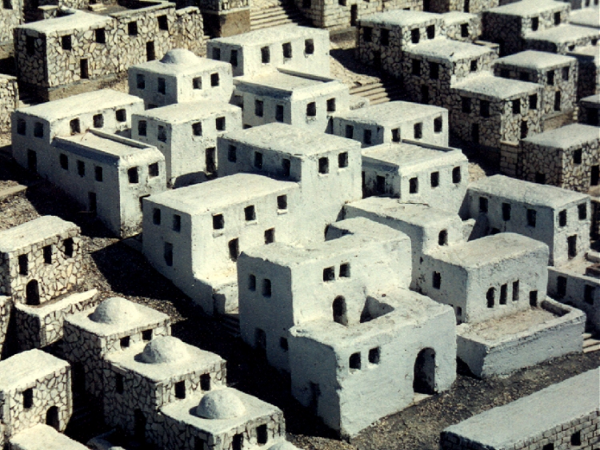

# Human-made Things in the Bible

## License Information

Human-made Things in the Bible © United Bible Societies, 2025. Adapted from: <cite>The Works of Their Hands: Man-made Things in the Bible</cite>, by Ray Pritz © 2009 United Bible Societies. This work is licensed under Creative Commons Attribution-ShareAlike 4.0 International (<a href="https://creativecommons.org/licenses/by-sa/4.0/">https://creativecommons.org/licenses/by-sa/4.0/</a>).

--------------------------------

## Plaster, stucco, whitewash (id: REALIA:1.8.3)

1\.8\.3 Plaster, stucco, whitewash
==================================

References:
-----------

Aramaic גִּיר (gir)

[DAN 5:5](https://ref.ly/Dan5:5)

Hebrew טפל (tafal (verb))

[JOB 13:4](https://ref.ly/Job13:4), [JOB 14:17](https://ref.ly/Job14:17), [PSA 119:69](https://ref.ly/Ps119:69)

Hebrew שִׂיד, שׂיד (sid)

[DEU 27:2](https://ref.ly/Deut27:2), [DEU 27:2](https://ref.ly/Deut27:2), [DEU 27:4](https://ref.ly/Deut27:4), [DEU 27:4](https://ref.ly/Deut27:4)

Hebrew טוח, טִיחַ (tuach (verb), tiach)

[LEV 14:42](https://ref.ly/Lev14:42), [LEV 14:43](https://ref.ly/Lev14:43), [LEV 14:48](https://ref.ly/Lev14:48), [1CH 29:4](https://ref.ly/1Chr29:4), [EZK 13:10](https://ref.ly/Ezek13:10), [EZK 13:11](https://ref.ly/Ezek13:11), [EZK 13:12](https://ref.ly/Ezek13:12), [EZK 13:12](https://ref.ly/Ezek13:12), [EZK 13:14](https://ref.ly/Ezek13:14), [EZK 13:15](https://ref.ly/Ezek13:15), [EZK 13:15](https://ref.ly/Ezek13:15), [EZK 22:28](https://ref.ly/Ezek22:28)

Hebrew תָּפֵל (tafel)

[EZK 13:10](https://ref.ly/Ezek13:10), [EZK 13:11](https://ref.ly/Ezek13:11), [EZK 13:14](https://ref.ly/Ezek13:14), [EZK 13:15](https://ref.ly/Ezek13:15), [EZK 22:28](https://ref.ly/Ezek22:28)

Greek κονιάω (koniaō (verb))

[MAT 23:27](https://ref.ly/Matt23:27), [ACT 23:3](https://ref.ly/Acts23:3)

Greek ψαμμωτός (psammōtos)

[SIR 22:17](https://ref.ly/Sir22:17)

Description and usage:
----------------------

*Plaster covering a stone wall (© Ray Pritz by United Bible Societies)*

Plaster was a wet, pasty material used to cover a wall. It filled in holes and cracks, and when it dried, it left the wall smooth. Different materials were used, among them mud or a composition of lime, water, and sand. The plaster served to fill and seal spaces between the building stones and thus protect the surface from water seepage. Because it made a smooth surface, the plaster also served as a base for decorating walls with paint.

Whitewash was lime mixed with water. It was painted on walls to make them white and cover ugly rough surfaces. Whitewash did not strengthen a structure but only beautified it. Even where decorations were not added, it was common to cover the plaster layer with whitewash.

---

Translation:
------------

*Painted plaster (British Museum, Public domain, via Wikimedia Commons)*

“Plaster” may be translated “dry earth” or “dried mud.” This would be an accurate description of a material widely used at that time and a quite natural translation in many languages of the world ([LEV 14:41](https://ref.ly/Lev14:41); [LEV 14:42](https://ref.ly/Lev14:42); [LEV 14:45](https://ref.ly/Lev14:45); [LEV 14:48](https://ref.ly/Lev14:48) uses the Hebrew word *‘afar*, which was just soil mixed with water to make mud). Where a distinction is made between kinds of plaster or sealant, it should be noted that some of the above references are to plaster made with lime ([DEU 27:2](https://ref.ly/Deut27:2); [DEU 27:4](https://ref.ly/Deut27:4); [DAN 5:5](https://ref.ly/Dan5:5)). In some languages it may be necessary to resort to a general term meaning “covering” or “stucco.”

The Hebrew word *tafal* ([JOB 13:4](https://ref.ly/Job13:4); [JOB 14:17](https://ref.ly/Job14:17); [PSA 119:69](https://ref.ly/Ps119:69)) is always used in a figurative sense, and normally it will not be necessary to find a literal translation; for example, in [JOB 13:4](https://ref.ly/Job13:4) the literal text “you plaster with lies” may be rendered “You hide the truth with your lies” (SPCL (Spanish Common Language Version (Dios Habla Hoy))) or “You cover up your ignorance with lies” (GNT (Good News Translation (1992))).

*Whitewashed buildings (© Ray Pritz by United Bible Societies)*

The purpose of plastering a wall was to make it more attractive than just rough stones. This underlying purpose is reflected in GNT (Good News Translation (1992)) ’s rendering for the last half of [SIR 22:17](https://ref.ly/Sir22:17): “a firm wall, finely decorated.”

The references to whitewash in Ezekiel and the New Testament are symbolic. This should be kept in mind when trying to render the meaning; for example, in [EZK 22:28](https://ref.ly/Ezek22:28) the literal text “And her prophets have spread whitewash for them” is expanded by GNT (Good News Translation (1992)) to “The prophets have hidden these sins like workers covering a wall with white­wash.” Where whitewash or some equivalent paint is unknown, translators may follow NCV (New Century Version), which has “And the prophets try to cover this up.”

In some of the references above it is not clear whether plaster or whitewash is intended. Some languages will require the translator to make a choice between the two. In most cases the context will help with the choice of terms. These following texts probably refer to plaster: [LEV 14:43](https://ref.ly/Lev14:43); [LEV 14:43](https://ref.ly/Lev14:43); [LEV 14:48](https://ref.ly/Lev14:48); [DEU 27:2](https://ref.ly/Deut27:2); [DEU 27:4](https://ref.ly/Deut27:4); [PSA 119:69](https://ref.ly/Ps119:69); [DAN 5:5](https://ref.ly/Dan5:5); [SIR 22:17](https://ref.ly/Sir22:17). The remaining references are probably to whitewash.

[MAT 23:27](https://ref.ly/Matt23:27): For many languages the closest equivalent of the phrase “whitewashed tombs” is simply “tombs that have been painted white.”

[ACT 23:3](https://ref.ly/Acts23:3): A literal translation of the phrase “whitewashed wall” is rarely meaningful. Sometimes you can use a descriptive phrase, such as “dirty wall that is made to look white” or “… to look clean.” In other instances you may wish to focus upon the function suggested by the idiom “whitewashed wall” and use a phrase such as “one who has been made to look good but really isn’t.”

* **Associated Passages:** Daniel 5:5; Job 13:4; Job 14:17; Psalms 119:69; Deuteronomy 27:2; Deuteronomy 27:4; Leviticus 14:42; Leviticus 14:43; Leviticus 14:48; 1 Chronicles 29:4; Ezekiel 13:10; Ezekiel 13:11; Ezekiel 13:12; Ezekiel 13:14; Ezekiel 13:15; Ezekiel 22:28; Matthew 23:27; Acts 23:3; Sirach 22:17; Leviticus 14:41; Leviticus 14:45

