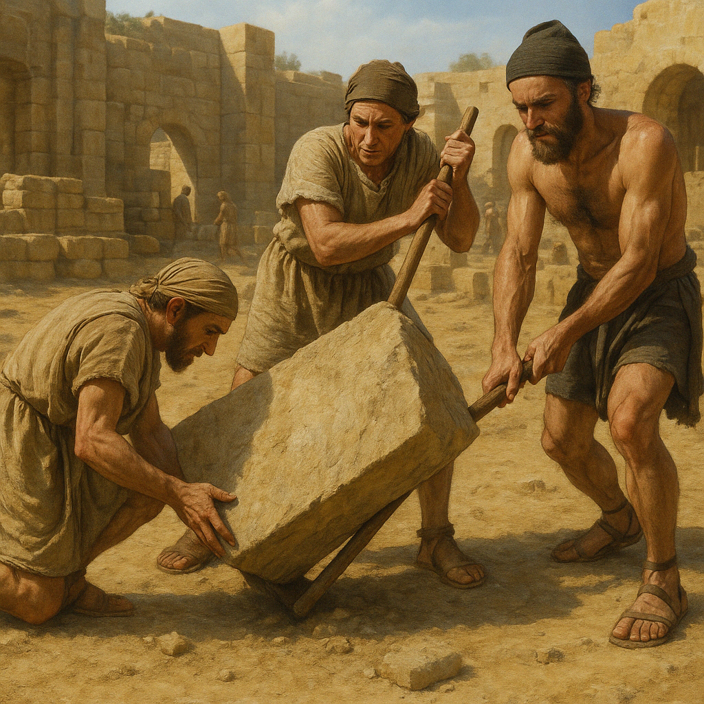

# Human-made Things in the Bible

## License Information

Human-made Things in the Bible © United Bible Societies, 2025. Adapted from: <cite>The Works of Their Hands: Man-made Things in the Bible</cite>, by Ray Pritz © 2009 United Bible Societies. This work is licensed under Creative Commons Attribution-ShareAlike 4.0 International (<a href="https://creativecommons.org/licenses/by-sa/4.0/">https://creativecommons.org/licenses/by-sa/4.0/</a>).

--------------------------------

## Squared stones for building (id: REALIA:1.8.4)

1\.8\.4 Squared stones for building
===================================

References:
-----------

Hebrew אֶבֶן, גָּזִית (gazith, ’even gazith)

[EXO 20:25](https://ref.ly/Exod20:25), [1KI 5:31](https://ref.ly/1Kgs5:31), [1KI 6:36](https://ref.ly/1Kgs6:36), [1KI 7:9](https://ref.ly/1Kgs7:9), [1KI 7:11](https://ref.ly/1Kgs7:11), [1KI 7:12](https://ref.ly/1Kgs7:12), [1CH 22:2](https://ref.ly/1Chr22:2), [ISA 9:9](https://ref.ly/Isa9:9), [LAM 3:9](https://ref.ly/Lam3:9), [EZK 40:42](https://ref.ly/Ezek40:42), [AMO 5:11](https://ref.ly/Amos5:11)

Greek λίθος, λαξεύω (lithos lelaxeumenos)

[JDT 1:2](https://ref.ly/Jdt1:2)

Greek λίθος, ξυστός (lithos xustos)

[1ES 6:8](https://ref.ly/1Esd6:8), [1ES 6:24](https://ref.ly/1Esd6:24)

Greek λίθος, τετράποδος (lithos tetrapodos)

[1MA 10:11](https://ref.ly/1Macc10:11)

Description and usage:
----------------------

*Herodian squared stones in the Western Wall, Jerusalem (© Gilabrand, CC BY 3\.0, via Wikimedia Commons)*

Squared stones were stones (often quarried from the bedrock) that were cut square so that they could be laid one on another to form a wall or building.

---

Translation:
------------

The size of building stones varied considerably, from stones that could be lifted by a man to some which were several meters long and weighed many tons. Translators should avoid a word that means simply bricks or small stones. We may say “very large stones that have been cut into square blocks.”

*Ceiling, wall, tefachoth (© Ray Pritz by United Bible Societies)*

[1KI 7:9](https://ref.ly/1Kgs7:9): This verse describes building stones that were smoothed on both back and front. They were used for each wall, from bottom to top. For the top of the wall, the Hebrew text uses the word *tfachoth*, which is usually rendered as “eaves” (GNT (Good News Translation (1992)), NIV (New International Version (1984))) or “coping” (RSV (Revised Standard Version (1952)), REB (Revised English Bible (1989))). In many languages such a technical term will be lacking or not widely understood (like “eaves” and “coping” in common English). It has recently been suggested, however, that the *tfachoth* were actually a decorative feature at the top of the wall, resembling two or three inverted steps between the ceiling and the wall.

Normally it is not necessary to translate such an unsure term with great architectural precision, and for the whole verse it will be preferable to follow a version like CEV (Contemporary English Version), which says “From the foundation all the way to the top, these buildings and the courtyard were made out of the best stones carefully cut to size, then smoothed on every side with saws,” or NCV (New Century Version), which has “All these buildings were made with blocks of fine stone. First they were carefully cut. Then they were trimmed with a saw in the front and back. These fine stones went from the foundations of the buildings to the top of the walls. Even the courtyard was made with blocks of stone.”

*Men moving a building stone (Image generated by ChatGPT using OpenAI technology)*

The stones in [EZK 40:42](https://ref.ly/Ezek40:42) are said to form a “table” (*shulchan* in Hebrew). See the discussion at [4\.3\.6 Tables for preparing sacrificial victims\<REALIA:4\.3\.6\>](#).

* **Associated Passages:** Exodus 20:25; 1 Kings 5:31; 1 Kings 6:36; 1 Kings 7:9; 1 Kings 7:11; 1 Kings 7:12; 1 Chronicles 22:2; Isaiah 9:9; Lamentations 3:9; Ezekiel 40:42; Amos 5:11; Judith 1:2; 1 Esdras (Greek) 6:8; 1 Esdras (Greek) 6:24; 1 Maccabees 10:11

