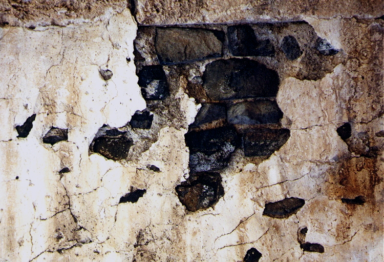
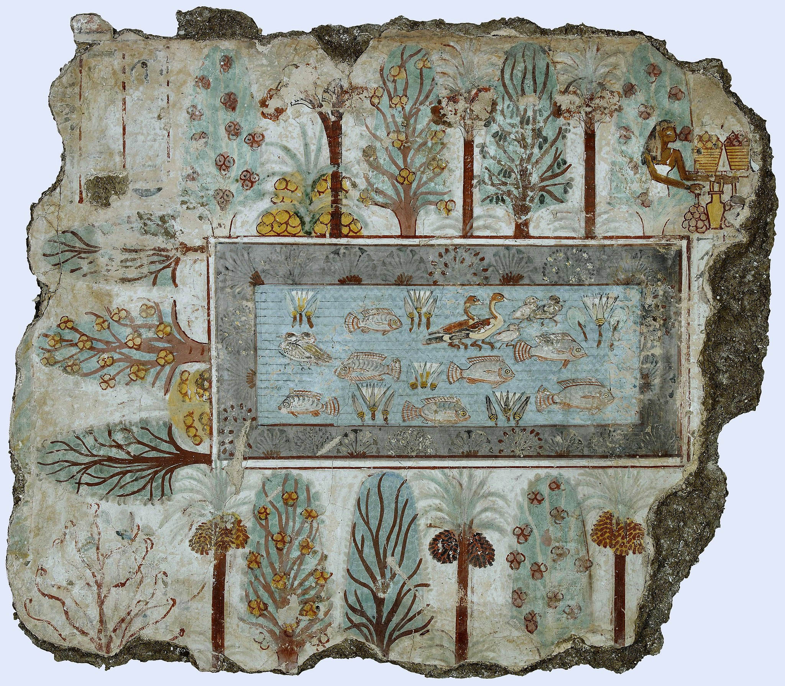
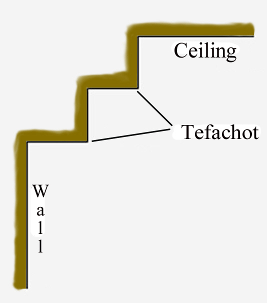
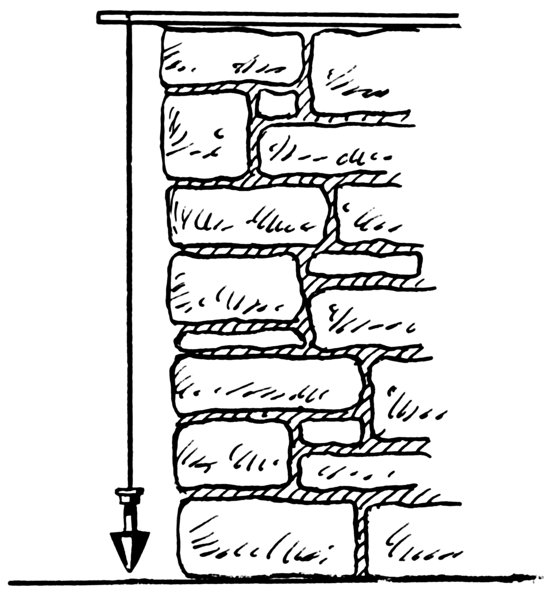
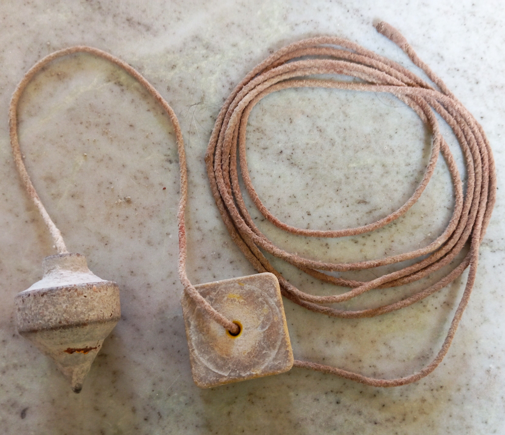

# Human-made Things in the Bible

## License Information

Human-made Things in the Bible © United Bible Societies, 2025. Adapted from: <cite>The Works of Their Hands: Man-made Things in the Bible</cite>, by Ray Pritz © 2009 United Bible Societies. This work is licensed under Creative Commons Attribution-ShareAlike 4.0 International (<a href="https://creativecommons.org/licenses/by-sa/4.0/">https://creativecommons.org/licenses/by-sa/4.0/</a>).

--------------------------------

## Builders (id: REALIA:1.8)

1\.8 Builders
=============

## Brick mold, brickkiln (id: REALIA:1.8.1)

1\.8\.1 Brick mold, brickkiln
=============================

References:
-----------

Hebrew מַלְבֵּן (malben)

[2SA 12:31](https://ref.ly/2Sam12:31), [NAM 3:14](https://ref.ly/Nah3:14)

Description:
------------

*A brick mold from a foundation deposit for Hatshepsut's temple (Egypt) (Metropolitan Museum of Art, CC0, via Wikimedia Commons)*

**Brick mold**: This was a small, rectangular wooden container (about 20–25 by 10 centimeters \[8–10 by 4 inches]) used to form each brick into the same shape and size as the other bricks (see [1\.8\.2 Brick\<REALIA:1\.8\.2\>](#)).

**Brickkiln**: This was a large outdoor oven for baking bricks to harden them (see the illustration at [1\.11\.1 Smelting furnace, kiln\<REALIA:1\.11\.1\>](#)).

---

Usage:
------

*Mud bricks (original mud bricks of the outer gate structure of Philistine Ashkelon) (© Ian Scott, CC BY\-SA 2\.0, via Wikimedia Commons)*

The mold was packed full with clay or other material from which bricks were made. Once the material was shaped, the brick was removed from the mold and left in the sun to dry. In some places the hardening process was facilitated by baking the bricks in a kiln or oven.

---

Translation:
------------

[2SA 12:31](https://ref.ly/2Sam12:31): The Hebrew word *malben* is only a proposed *qere* reading; it is unattested in any ancient manuscript or version. However, the text as it stands is unintelligible. HOTTP (Hebrew Old Testament Text Project (UBS)) suggests “brickkiln,” which is more or less what is found in most translations. GNT (Good News Translation (1992)) and CEV (Contemporary English Version) have “making bricks,” NCV (New Century Version) uses “build with bricks,” and NRSV (New Revised Standard Version (1989)) has “brickworks.”

[NAM 3:14](https://ref.ly/Nah3:14): The following is adapted from *A Handbook on The Books of Nahum, Habakkuk, and Zephaniah* (pages 55–56\): The last half of this verse speaks about various parts of the process of making bricks. The first two parts are “go into the clay, tread the mortar” (RSV (Revised Standard Version (1952))). They refer to the trampling of the clay underfoot to make it soft enough to be shaped. GNT (Good News Translation (1992)) drops the repetition and expresses this aspect of the brick making in a single clause: “Trample the clay to make bricks.” When the clay was soft enough, it was put into a brick mold. The bricks were then removed from the mold to dry in the sun. Nahum tells the people of Nineveh to “take hold of the brick mold” (RSV (Revised Standard Version (1952))), or as GNT (Good News Translation (1992)) puts it more clearly, “get the brick molds ready.” The last half of this verse can also be rendered “Trample the clay that you use to make bricks, and prepare the brick molds” or “Use your feet to soften the clay that will be used to make bricks ….”

See also the discussion at [3\.20\.1 Pavement, The Pavement\<REALIA:3\.20\.1\>](#).

* **Associated Passages:** 2 Samuel 12:31; Nahum 3:14

* **Associated ACAI Concepts:** Brick Mold (ID: `realia:BrickMold`)

## Brick (id: REALIA:1.8.2)

1\.8\.2 Brick
=============

References:
-----------

Hebrew לְבֵנָה (lvenah)

[GEN 11:3](https://ref.ly/Gen11:3), [GEN 11:3](https://ref.ly/Gen11:3), [EXO 1:14](https://ref.ly/Exod1:14), [EXO 5:8](https://ref.ly/Exod5:8), [EXO 5:16](https://ref.ly/Exod5:16), [EXO 5:18](https://ref.ly/Exod5:18), [EXO 5:19](https://ref.ly/Exod5:19), [ISA 9:9](https://ref.ly/Isa9:9), [ISA 65:3](https://ref.ly/Isa65:3), [EZK 4:1](https://ref.ly/Ezek4:1)

Greek πλίνθος (plinthos)

[JDT 5:11](https://ref.ly/Jdt5:11)

Description:
------------

The brick was a building block made of clay in a mold and either dried in the sun or hardened in an oven.

---

Usage:
------

Bricks were used as a building material, especially in places where stone or wood was scarce.

---

Translation:
------------

For [ISA 65:3](https://ref.ly/Isa65:3) see [4\.2\.4 Incense altar\<REALIA:4\.2\.4\>](#).

* **Associated Passages:** Genesis 11:3; Exodus 1:14; Exodus 5:8; Exodus 5:16; Exodus 5:18; Exodus 5:19; Isaiah 9:9; Isaiah 65:3; Ezekiel 4:1; Judith 5:11

* **Associated ACAI Concepts:** Brick (ID: `realia:Brick`)

## Plaster, stucco, whitewash (id: REALIA:1.8.3)

1\.8\.3 Plaster, stucco, whitewash
==================================

References:
-----------

Aramaic גִּיר (gir)

[DAN 5:5](https://ref.ly/Dan5:5)

Hebrew טפל (tafal (verb))

[JOB 13:4](https://ref.ly/Job13:4), [JOB 14:17](https://ref.ly/Job14:17), [PSA 119:69](https://ref.ly/Ps119:69)

Hebrew שִׂיד, שׂיד (sid)

[DEU 27:2](https://ref.ly/Deut27:2), [DEU 27:2](https://ref.ly/Deut27:2), [DEU 27:4](https://ref.ly/Deut27:4), [DEU 27:4](https://ref.ly/Deut27:4)

Hebrew טוח, טִיחַ (tuach (verb), tiach)

[LEV 14:42](https://ref.ly/Lev14:42), [LEV 14:43](https://ref.ly/Lev14:43), [LEV 14:48](https://ref.ly/Lev14:48), [1CH 29:4](https://ref.ly/1Chr29:4), [EZK 13:10](https://ref.ly/Ezek13:10), [EZK 13:11](https://ref.ly/Ezek13:11), [EZK 13:12](https://ref.ly/Ezek13:12), [EZK 13:12](https://ref.ly/Ezek13:12), [EZK 13:14](https://ref.ly/Ezek13:14), [EZK 13:15](https://ref.ly/Ezek13:15), [EZK 13:15](https://ref.ly/Ezek13:15), [EZK 22:28](https://ref.ly/Ezek22:28)

Hebrew תָּפֵל (tafel)

[EZK 13:10](https://ref.ly/Ezek13:10), [EZK 13:11](https://ref.ly/Ezek13:11), [EZK 13:14](https://ref.ly/Ezek13:14), [EZK 13:15](https://ref.ly/Ezek13:15), [EZK 22:28](https://ref.ly/Ezek22:28)

Greek κονιάω (koniaō (verb))

[MAT 23:27](https://ref.ly/Matt23:27), [ACT 23:3](https://ref.ly/Acts23:3)

Greek ψαμμωτός (psammōtos)

[SIR 22:17](https://ref.ly/Sir22:17)

Description and usage:
----------------------

*Plaster covering a stone wall (© Ray Pritz by United Bible Societies)*

Plaster was a wet, pasty material used to cover a wall. It filled in holes and cracks, and when it dried, it left the wall smooth. Different materials were used, among them mud or a composition of lime, water, and sand. The plaster served to fill and seal spaces between the building stones and thus protect the surface from water seepage. Because it made a smooth surface, the plaster also served as a base for decorating walls with paint.

Whitewash was lime mixed with water. It was painted on walls to make them white and cover ugly rough surfaces. Whitewash did not strengthen a structure but only beautified it. Even where decorations were not added, it was common to cover the plaster layer with whitewash.

---

Translation:
------------

*Painted plaster (British Museum, Public domain, via Wikimedia Commons)*

“Plaster” may be translated “dry earth” or “dried mud.” This would be an accurate description of a material widely used at that time and a quite natural translation in many languages of the world ([LEV 14:41](https://ref.ly/Lev14:41); [LEV 14:42](https://ref.ly/Lev14:42); [LEV 14:45](https://ref.ly/Lev14:45); [LEV 14:48](https://ref.ly/Lev14:48) uses the Hebrew word *‘afar*, which was just soil mixed with water to make mud). Where a distinction is made between kinds of plaster or sealant, it should be noted that some of the above references are to plaster made with lime ([DEU 27:2](https://ref.ly/Deut27:2); [DEU 27:4](https://ref.ly/Deut27:4); [DAN 5:5](https://ref.ly/Dan5:5)). In some languages it may be necessary to resort to a general term meaning “covering” or “stucco.”

The Hebrew word *tafal* ([JOB 13:4](https://ref.ly/Job13:4); [JOB 14:17](https://ref.ly/Job14:17); [PSA 119:69](https://ref.ly/Ps119:69)) is always used in a figurative sense, and normally it will not be necessary to find a literal translation; for example, in [JOB 13:4](https://ref.ly/Job13:4) the literal text “you plaster with lies” may be rendered “You hide the truth with your lies” (SPCL (Spanish Common Language Version (Dios Habla Hoy))) or “You cover up your ignorance with lies” (GNT (Good News Translation (1992))).

*Whitewashed buildings (© Ray Pritz by United Bible Societies)*

The purpose of plastering a wall was to make it more attractive than just rough stones. This underlying purpose is reflected in GNT (Good News Translation (1992)) ’s rendering for the last half of [SIR 22:17](https://ref.ly/Sir22:17): “a firm wall, finely decorated.”

The references to whitewash in Ezekiel and the New Testament are symbolic. This should be kept in mind when trying to render the meaning; for example, in [EZK 22:28](https://ref.ly/Ezek22:28) the literal text “And her prophets have spread whitewash for them” is expanded by GNT (Good News Translation (1992)) to “The prophets have hidden these sins like workers covering a wall with white­wash.” Where whitewash or some equivalent paint is unknown, translators may follow NCV (New Century Version), which has “And the prophets try to cover this up.”

In some of the references above it is not clear whether plaster or whitewash is intended. Some languages will require the translator to make a choice between the two. In most cases the context will help with the choice of terms. These following texts probably refer to plaster: [LEV 14:43](https://ref.ly/Lev14:43); [LEV 14:43](https://ref.ly/Lev14:43); [LEV 14:48](https://ref.ly/Lev14:48); [DEU 27:2](https://ref.ly/Deut27:2); [DEU 27:4](https://ref.ly/Deut27:4); [PSA 119:69](https://ref.ly/Ps119:69); [DAN 5:5](https://ref.ly/Dan5:5); [SIR 22:17](https://ref.ly/Sir22:17). The remaining references are probably to whitewash.

[MAT 23:27](https://ref.ly/Matt23:27): For many languages the closest equivalent of the phrase “whitewashed tombs” is simply “tombs that have been painted white.”

[ACT 23:3](https://ref.ly/Acts23:3): A literal translation of the phrase “whitewashed wall” is rarely meaningful. Sometimes you can use a descriptive phrase, such as “dirty wall that is made to look white” or “… to look clean.” In other instances you may wish to focus upon the function suggested by the idiom “whitewashed wall” and use a phrase such as “one who has been made to look good but really isn’t.”

* **Associated Passages:** Daniel 5:5; Job 13:4; Job 14:17; Psalms 119:69; Deuteronomy 27:2; Deuteronomy 27:4; Leviticus 14:42; Leviticus 14:43; Leviticus 14:48; 1 Chronicles 29:4; Ezekiel 13:10; Ezekiel 13:11; Ezekiel 13:12; Ezekiel 13:14; Ezekiel 13:15; Ezekiel 22:28; Matthew 23:27; Acts 23:3; Sirach 22:17; Leviticus 14:41; Leviticus 14:45

* **Associated ACAI Concepts:** Plaster (ID: `realia:Plaster`)

## Squared stones for building (id: REALIA:1.8.4)

1\.8\.4 Squared stones for building
===================================

References:
-----------

Hebrew אֶבֶן, גָּזִית (gazith, ’even gazith)

[EXO 20:25](https://ref.ly/Exod20:25), [1KI 5:31](https://ref.ly/1Kgs5:31), [1KI 6:36](https://ref.ly/1Kgs6:36), [1KI 7:9](https://ref.ly/1Kgs7:9), [1KI 7:11](https://ref.ly/1Kgs7:11), [1KI 7:12](https://ref.ly/1Kgs7:12), [1CH 22:2](https://ref.ly/1Chr22:2), [ISA 9:9](https://ref.ly/Isa9:9), [LAM 3:9](https://ref.ly/Lam3:9), [EZK 40:42](https://ref.ly/Ezek40:42), [AMO 5:11](https://ref.ly/Amos5:11)

Greek λίθος, λαξεύω (lithos lelaxeumenos)

[JDT 1:2](https://ref.ly/Jdt1:2)

Greek λίθος, ξυστός (lithos xustos)

[1ES 6:8](https://ref.ly/1Esd6:8), [1ES 6:24](https://ref.ly/1Esd6:24)

Greek λίθος, τετράποδος (lithos tetrapodos)

[1MA 10:11](https://ref.ly/1Macc10:11)

Description and usage:
----------------------

*Herodian squared stones in the Western Wall, Jerusalem (© Gilabrand, CC BY 3\.0, via Wikimedia Commons)*

Squared stones were stones (often quarried from the bedrock) that were cut square so that they could be laid one on another to form a wall or building.

---

Translation:
------------

The size of building stones varied considerably, from stones that could be lifted by a man to some which were several meters long and weighed many tons. Translators should avoid a word that means simply bricks or small stones. We may say “very large stones that have been cut into square blocks.”

*Ceiling, wall, tefachoth (© Ray Pritz by United Bible Societies)*

[1KI 7:9](https://ref.ly/1Kgs7:9): This verse describes building stones that were smoothed on both back and front. They were used for each wall, from bottom to top. For the top of the wall, the Hebrew text uses the word *tfachoth*, which is usually rendered as “eaves” (GNT (Good News Translation (1992)), NIV (New International Version (1984))) or “coping” (RSV (Revised Standard Version (1952)), REB (Revised English Bible (1989))). In many languages such a technical term will be lacking or not widely understood (like “eaves” and “coping” in common English). It has recently been suggested, however, that the *tfachoth* were actually a decorative feature at the top of the wall, resembling two or three inverted steps between the ceiling and the wall.

Normally it is not necessary to translate such an unsure term with great architectural precision, and for the whole verse it will be preferable to follow a version like CEV (Contemporary English Version), which says “From the foundation all the way to the top, these buildings and the courtyard were made out of the best stones carefully cut to size, then smoothed on every side with saws,” or NCV (New Century Version), which has “All these buildings were made with blocks of fine stone. First they were carefully cut. Then they were trimmed with a saw in the front and back. These fine stones went from the foundations of the buildings to the top of the walls. Even the courtyard was made with blocks of stone.”

*Men moving a building stone (Image generated by ChatGPT using OpenAI technology)*

The stones in [EZK 40:42](https://ref.ly/Ezek40:42) are said to form a “table” (*shulchan* in Hebrew). See the discussion at [4\.3\.6 Tables for preparing sacrificial victims\<REALIA:4\.3\.6\>](#).

* **Associated Passages:** Exodus 20:25; 1 Kings 5:31; 1 Kings 6:36; 1 Kings 7:9; 1 Kings 7:11; 1 Kings 7:12; 1 Chronicles 22:2; Isaiah 9:9; Lamentations 3:9; Ezekiel 40:42; Amos 5:11; Judith 1:2; 1 Esdras (Greek) 6:8; 1 Esdras (Greek) 6:24; 1 Maccabees 10:11

## Stone plane, saw (id: REALIA:1.8.4.1)

1\.8\.4\.1 Stone plane, saw
===========================

References:
-----------

Hebrew מְגֵרָה (mgerah)

[2SA 12:31](https://ref.ly/2Sam12:31), [1KI 7:9](https://ref.ly/1Kgs7:9), [1CH 20:3](https://ref.ly/1Chr20:3), [1CH 20:3](https://ref.ly/1Chr20:3)

Description:
------------

The stone plane/saw was an instrument used in the preparation of building stones.

---

Translation:
------------

[2SA 12:31](https://ref.ly/2Sam12:31): There is disagreement among scholars concerning the precise action that is being described here, and this is reflected in the different translations. It is possible to understand that David tortured or killed the inhabitants of Rabbah with various implements, including saws (KJV (King James Version (1611)), NASB (New American Standard Bible)). Most modern translations, however, understand the text to mean that David put the people to work with those implements (for example, NCV (New Century Version) “He also brought out the people of the city and forced them to work with saws, iron picks, and axes …”). This is the preferred interpretation. While the argument is more complicated for the parallel text at [1CH 20:3](https://ref.ly/1Chr20:3) (which is not identical), most translations give the same rendering there.

It now seems probable that translations have been inaccurate in rendering the Hebrew word *mgerah* as “saw\[s].” Archaeology knows of no use of saws either to quarry or to shape stones in the time period described. Many building stones have been found which were finely smoothed, but these stones show none of the marks that would have been left by a saw. It has been proposed that the *mgerah* was a heavy metal instrument with a wide rough surface, like that of a file. This instrument was pushed and pulled across the surface of the stone until it was quite smooth. This would have been heavy and exhausting work, appropriate for captives or slaves (see Barkay, pages 32–37\).

* **Associated Passages:** 2 Samuel 12:31; 1 Kings 7:9; 1 Chronicles 20:3

* **Associated ACAI Concepts:** Stone Plane (ID: `realia:StonePlane`)

## Plumb line (id: REALIA:1.8.5)

1\.8\.5 Plumb line
==================

References:
-----------

Hebrew אֲנָךְ (’anak)

[AMO 7:7](https://ref.ly/Amos7:7), [AMO 7:7](https://ref.ly/Amos7:7), [AMO 7:8](https://ref.ly/Amos7:8), [AMO 7:8](https://ref.ly/Amos7:8)

Hebrew אֶבֶן בְּדִ֛יל (’even bedil)

[ZEC 4:10](https://ref.ly/Zech4:10)

Hebrew מִשְׁקֶלֶת, מִשְׁקֹלֶת (mishqeleth, mishqoleth)

[2KI 21:13](https://ref.ly/2Kgs21:13), [ISA 28:17](https://ref.ly/Isa28:17)

Description and usage:
----------------------

*A plumb line is used to check verticality (© Pearson Scott Foresman © Wikimedia Commons)*

The plumb line was a weight suspended on the end of a string, used by builders to determine, for example, if all the stones in a wall were vertically straight.

---

Translation:
------------

*A craftsman checking verticality with a plumb line (© Salil Kumar Mukherjee © Wikimedia Commons)*

In many cultures the only tool similar to the plumb line is the water\-level, and the Pidgin English word “wataplan” has often become part of the vocabulary. This measures the horizontal plane rather than the vertical one, but might serve the purpose. Where there is no word for plumb line or where an existing word would not be understood by most readers, it may be necessary to use a descriptive phrase, as does CEV (Contemporary English Version) at [AMO 7:7](https://ref.ly/Amos7:7) by saying “a weight tied to the end of it. The string and weight had been used to measure the straightness of the wall.” In addition, some kind of illustration to show the shape and use of the tool might be helpful. In [AMO 7:8](https://ref.ly/Amos7:8)CEV (Contemporary English Version) translates “plumb line” as “measuring line.” “Measuring line” is also used by CEV (Contemporary English Version) at [ISA 28:17](https://ref.ly/Isa28:17) (see [1\.8\.6 Measuring rod, measuring line\<REALIA:1\.8\.6\>](#)).

In [2KI 21:13](https://ref.ly/2Kgs21:13) the Hebrew text is literally “And I will stretch out over Jerusalem the measuring line of Samaria and the plumb line of the house of Ahab.” Here both “the measuring line” and “the plumb line” are used symbolically, so translators may convey the meaning without actually referring to them. GNT (Good News Translation (1992)) may serve as a model: “I will punish Jerusalem as I did Samaria, as I did King Ahab of Israel and his descendants.” Compare CEV (Contemporary English Version): “Jerusalem is as sinful as Ahab and the people of Samaria were.”

[AMO 7:7](https://ref.ly/Amos7:7): The LORD is seen as standing on or by a wall, which in Hebrew is called “a wall of a plumb line.” The translation “plumb line” is not fully certain but no other suggestion is as good. GNT (Good News Translation (1992)) tries to make sense out of the phrase “a wall of a plumb line” by saying “a wall that had been built with the use of a plumb line” (similarly RSV (Revised Standard Version (1952)), *The Translator’s Old Testament* \[TOT]). On the other hand, it may be better to follow most modern English translations (AT (American Translation (Goodspeed, 1935)), Mft (Moffatt Translation (1926)), NAB (New American Bible (1970)), NEB (New English Bible (1970))) as well as many commentators who have something like “standing by a wall with a plumb line in his hand” for the last half of this verse. They consider “of a plumb line” to be the result of a copying mistake. A possible model for the whole verse is “The LORD caused me to see again in a vision. I saw him on the top of a wall stretching out a cord to see whether the wall was straight.”

* **Associated Passages:** Amos 7:7; Amos 7:8; Zechariah 4:10; 2 Kings 21:13; Isaiah 28:17

* **Associated ACAI Concepts:** Plumb Line (ID: `realia:PlumbLine`)

## Measuring rod, measuring line (id: REALIA:1.8.6)

1\.8\.6 Measuring rod, measuring line
=====================================

References:
-----------

### **Rod**:

Hebrew קָנֶה (qaneh)

[EZK 40:3](https://ref.ly/Ezek40:3), [EZK 40:5](https://ref.ly/Ezek40:5), [EZK 40:5](https://ref.ly/Ezek40:5), [EZK 40:5](https://ref.ly/Ezek40:5), [EZK 40:6](https://ref.ly/Ezek40:6), [EZK 40:6](https://ref.ly/Ezek40:6), [EZK 40:7](https://ref.ly/Ezek40:7), [EZK 40:7](https://ref.ly/Ezek40:7), [EZK 40:7](https://ref.ly/Ezek40:7), [EZK 40:8](https://ref.ly/Ezek40:8), [EZK 41:8](https://ref.ly/Ezek41:8), [EZK 42:16](https://ref.ly/Ezek42:16), [EZK 42:16](https://ref.ly/Ezek42:16), [EZK 42:16](https://ref.ly/Ezek42:16), [EZK 42:17](https://ref.ly/Ezek42:17), [EZK 42:17](https://ref.ly/Ezek42:17), [EZK 42:18](https://ref.ly/Ezek42:18), [EZK 42:18](https://ref.ly/Ezek42:18), [EZK 42:19](https://ref.ly/Ezek42:19), [EZK 42:19](https://ref.ly/Ezek42:19)

Greek κάλαμος (kalamos)

[REV 11:1](https://ref.ly/Rev11:1), [REV 21:15](https://ref.ly/Rev21:15), [REV 21:16](https://ref.ly/Rev21:16)

References:
-----------

### **Line**:

Hebrew חֶבֶל, מִדָּה (chevel, chevel midah)

[2SA 8:2](https://ref.ly/2Sam8:2), [2SA 8:2](https://ref.ly/2Sam8:2), [2SA 8:2](https://ref.ly/2Sam8:2), [PSA 78:55](https://ref.ly/Ps78:55), [AMO 7:17](https://ref.ly/Amos7:17), [MIC 2:5](https://ref.ly/Mic2:5), [ZEC 2:5](https://ref.ly/Zech2:5)

Hebrew חוּט (chut)

[1KI 7:15](https://ref.ly/1Kgs7:15), [JER 52:21](https://ref.ly/Jer52:21)

Hebrew פָּתִיל (pathil)

[EZK 40:3](https://ref.ly/Ezek40:3)

Hebrew קַו, קָוֶה, מִדָּה (qaw, qaw midah, qaweh)

[1KI 7:23](https://ref.ly/1Kgs7:23), [1KI 7:23](https://ref.ly/1Kgs7:23), [2KI 21:13](https://ref.ly/2Kgs21:13), [2CH 4:2](https://ref.ly/2Chr4:2), [JOB 38:5](https://ref.ly/Job38:5), [ISA 28:17](https://ref.ly/Isa28:17), [ISA 34:11](https://ref.ly/Isa34:11), [ISA 34:17](https://ref.ly/Isa34:17), [ISA 44:13](https://ref.ly/Isa44:13), [JER 31:39](https://ref.ly/Jer31:39), [JER 31:39](https://ref.ly/Jer31:39), [LAM 2:8](https://ref.ly/Lam2:8), [EZK 47:3](https://ref.ly/Ezek47:3), [ZEC 1:16](https://ref.ly/Zech1:16)

Description and usage:
----------------------

*Surveyors measure a plot of land using rope with knots tied at regular intervals (facsimile, painted by Charles K. Wilkinson; tomb of Menna, original ca. 1400–1352 BCE) (Metropolitan Museum of Art, Public domain)*

The measuring rod/line was an instrument used for measuring length. It could be a reed, stick, or rope.

---

Translation:
------------

The equivalent for “measuring rod” may be simply “measuring stick” or “stick with which to count the distance.”

[2KI 21:13](https://ref.ly/2Kgs21:13): The declaration of judgment in this verse was given before the capture and exile of Judah but after the defeat of the northern kingdom with its capital in Samaria. The “measuring line” is used as a device to indicate that the sins of the southern kingdom with its capital in Jerusalem are just as bad as those of the northern kingdom with its capital Samaria. Some common\-language translations choose to drop the image of the “measuring line” in favor of a direct statement of the essence of the judgment; for example, the first half of this verse in CEV (Contemporary English Version) reads “Jerusalem is as sinful as Ahab and the people of Samaria were” (see [1\.8\.5 Plumb line\<REALIA:1\.8\.5\>](#)).

[MIC 2:5](https://ref.ly/Mic2:5): The Hebrew word *chevel* in this verse refers to a line used to measure out property for ownership. The prophet is saying that when the exiles of Judah return, the families of the rich people will have no share or plot of land. The Hebrew refers specifically to the process by which the family shares were chosen. The “lot” (RSV (Revised Standard Version (1952))) was probably a set of stones with special markings on them (see [4\.9 Lots\<REALIA:4\.9\>](#)). The stone chosen would show what God’s will was in that particular case. The “line” is the measuring line used to mark out the family plots. The lots may have been used to show where the measuring line should be placed. Most translators prefer to express the general procedure of parceling out the land and its significance rather than trying to render the specific instruments involved in the procedure; for example, CEV (Contemporary English Version) has “And so you will never again own property among the LORD’s people,” and GNT (Good News Translation (1992)) says “So then, when the time comes for the land to be given back to the LORD’s people, there will be no share for any of you.”

[REV 11:1](https://ref.ly/Rev11:1): RSV (Revised Standard Version (1952)) renders the Greek phrase of three words near the beginning of this verse as “a measuring rod like a staff.” However, the meaning of the Greek is better expressed by NJB (New Jerusalem Bible (1985)) “a long cane like a measuring rod”; compare GNT (Good News Translation (1992)) “a stick that looked like a measuring\-rod,” REB (Revised English Bible (1989)) “a long cane to use as a measuring rod,” NIV (New International Version (1984)) “a reed like a measuring rod,” and the Chewa common language translation, which has “a reed for measuring with that looked like a walking stick.” The first Greek word in this phrase is *kalamos*. It designates a reed or a cane (see its use in [REV 21:15](https://ref.ly/Rev21:15); [REV 21:16](https://ref.ly/Rev21:16), where GNT (Good News Translation (1992)) has “measuring stick”). The third Greek word, *rhabdos*, refers to a staff or a rod here. Elsewhere in Revelation it refers to the “iron rod” (or, “scepter”) used by Jesus Christ ([REV 12:5](https://ref.ly/Rev12:5); [REV 19:15](https://ref.ly/Rev19:15)) and his followers ([REV 2:27](https://ref.ly/Rev2:27)). It is better to follow GNT (Good News Translation (1992)) or NJB (New Jerusalem Bible (1985)) in translating the passage here. See also the remarks at [1\.2\.4 Rod, club, shepherd’s staff\<REALIA:1\.2\.4\>](#).

* **Associated Passages:** Ezekiel 40:3; Ezekiel 40:5; Ezekiel 40:6; Ezekiel 40:7; Ezekiel 40:8; Ezekiel 41:8; Ezekiel 42:16; Ezekiel 42:17; Ezekiel 42:18; Ezekiel 42:19; Revelation 11:1; Revelation 21:15; Revelation 21:16; 2 Samuel 8:2; Psalms 78:55; Amos 7:17; Micah 2:5; Zechariah 2:5; 1 Kings 7:15; Jeremiah 52:21; 1 Kings 7:23; 2 Kings 21:13; 2 Chronicles 4:2; Job 38:5; Isaiah 28:17; Isaiah 34:11; Isaiah 34:17; Isaiah 44:13; Jeremiah 31:39; Lamentations 2:8; Ezekiel 47:3; Zechariah 1:16; Revelation 12:5; Revelation 19:15; Revelation 2:27

* **Associated ACAI Concepts:** Measuring Reed (ID: `realia:MeasuringReed`)
