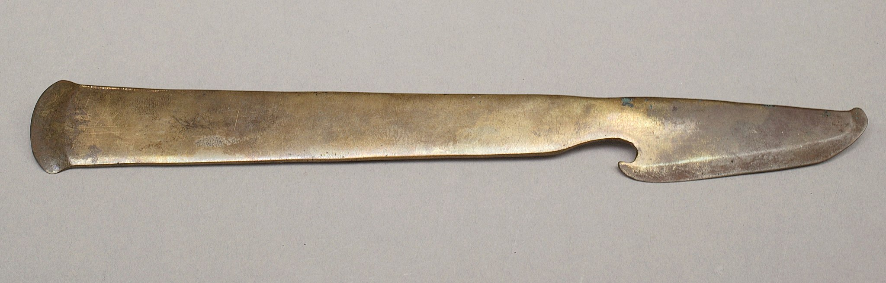

# Human-made Things in the Bible

## License Information

Human-made Things in the Bible © United Bible Societies, 2025. Adapted from: <cite>The Works of Their Hands: Man-made Things in the Bible</cite>, by Ray Pritz © 2009 United Bible Societies. This work is licensed under Creative Commons Attribution-ShareAlike 4.0 International (<a href="https://creativecommons.org/licenses/by-sa/4.0/">https://creativecommons.org/licenses/by-sa/4.0/</a>).

--------------------------------

## Razor (id: REALIA:1.9.1)

1\.9\.1 Razor
=============

References:
-----------

Hebrew מוֹרָה (morah)

[JDG 13:5](https://ref.ly/Judg13:5), [JDG 16:17](https://ref.ly/Judg16:17), [1SA 1:11](https://ref.ly/1Sam1:11)

Hebrew תַּעַר (ta‘ar)

[NUM 6:5](https://ref.ly/Num6:5), [NUM 8:7](https://ref.ly/Num8:7), [PSA 52:4](https://ref.ly/Ps52:4), [ISA 7:20](https://ref.ly/Isa7:20), [JER 36:23](https://ref.ly/Jer36:23), [EZK 5:1](https://ref.ly/Ezek5:1)

Description and usage:
----------------------

*An ancient razor (Egyptian, 1550–1458 BCE) (Metropolitan Museum of Art, Public domain, via Wikimedia Commons)*

The razor was a very sharp knife used to shave hair from the skin.

---

Translation:
------------

The literal clause “no razor shall come on his head” in [NUM 6:5](https://ref.ly/Num6:5) (compare [JDG 13:5](https://ref.ly/Judg13:5); [JDG 16:17](https://ref.ly/Judg16:17); [1SA 1:11](https://ref.ly/1Sam1:11)) may be rendered “he must not cut his hair” or “you must not cut your hair or shave” (GNT (Good News Translation (1992))).

The implement mentioned in [JER 36:23](https://ref.ly/Jer36:23) was a small knife or razor used by a scribe to sharpen his pens (see [1\.7\.3 Pen\<REALIA:1\.7\.3\>](#)). The English word “penknife” (RSV (Revised Standard Version (1952))) comes from just such an implement, although today it may convey to the hearer a folding pocketknife.

Like many physical objects, the razor is sometimes used figuratively in the Bible. In [PSA 52:4](https://ref.ly/Ps52:4) the tongue is compared to a sharpened razor. All the translations consulted retain the metaphor. Similarly, in [ISA 7:20](https://ref.ly/Isa7:20) the razor symbolizes an attack by the king of Assyria. Almost all translations manage to retain the image of the razor in this passage. GNT (Good News Translation (1992)) does so only indirectly with “When that time comes, the Lord will hire a barber from across the Euphrates—the emperor of Assyria!—and he will shave off your beards and the hair on your heads and your bodies.”

* **Associated Passages:** Judges 13:5; Judges 16:17; 1 Samuel 1:11; Numbers 6:5; Numbers 8:7; Psalms 52:4; Isaiah 7:20; Jeremiah 36:23; Ezekiel 5:1

