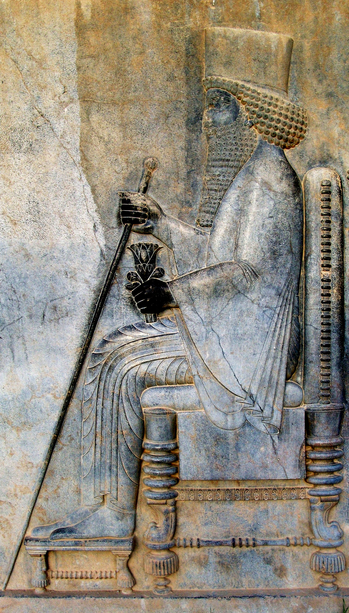

# Human-made Things in the Bible

## License Information

Human-made Things in the Bible © United Bible Societies, 2025. Adapted from: <cite>The Works of Their Hands: Man-made Things in the Bible</cite>, by Ray Pritz © 2009 United Bible Societies. This work is licensed under Creative Commons Attribution-ShareAlike 4.0 International (<a href="https://creativecommons.org/licenses/by-sa/4.0/">https://creativecommons.org/licenses/by-sa/4.0/</a>).

--------------------------------

## Throne (id: REALIA:1.10.1)

1\.10\.1 Throne
===============

References:
-----------

Hebrew כִּסֵּא (kise’, kiseh)

[GEN 41:40](https://ref.ly/Gen41:40), [EXO 11:5](https://ref.ly/Exod11:5), [EXO 12:29](https://ref.ly/Exod12:29), [DEU 17:18](https://ref.ly/Deut17:18), [JDG 3:20](https://ref.ly/Judg3:20), [1SA 2:8](https://ref.ly/1Sam2:8), [2SA 3:10](https://ref.ly/2Sam3:10), [2SA 7:13](https://ref.ly/2Sam7:13), [2SA 7:16](https://ref.ly/2Sam7:16), [2SA 14:9](https://ref.ly/2Sam14:9), [1KI 1:13](https://ref.ly/1Kgs1:13), [1KI 1:17](https://ref.ly/1Kgs1:17), [1KI 1:20](https://ref.ly/1Kgs1:20), [1KI 1:24](https://ref.ly/1Kgs1:24), [1KI 1:27](https://ref.ly/1Kgs1:27), [1KI 1:30](https://ref.ly/1Kgs1:30), [1KI 1:35](https://ref.ly/1Kgs1:35), [1KI 1:37](https://ref.ly/1Kgs1:37), [1KI 1:37](https://ref.ly/1Kgs1:37), [1KI 1:46](https://ref.ly/1Kgs1:46), [1KI 1:47](https://ref.ly/1Kgs1:47), [1KI 1:47](https://ref.ly/1Kgs1:47), [1KI 1:48](https://ref.ly/1Kgs1:48), [1KI 2:4](https://ref.ly/1Kgs2:4), [1KI 2:12](https://ref.ly/1Kgs2:12), [1KI 2:19](https://ref.ly/1Kgs2:19), [1KI 2:19](https://ref.ly/1Kgs2:19), [1KI 2:24](https://ref.ly/1Kgs2:24), [1KI 2:33](https://ref.ly/1Kgs2:33), [1KI 2:45](https://ref.ly/1Kgs2:45), [1KI 3:6](https://ref.ly/1Kgs3:6), [1KI 5:19](https://ref.ly/1Kgs5:19), [1KI 7:7](https://ref.ly/1Kgs7:7), [1KI 8:20](https://ref.ly/1Kgs8:20), [1KI 8:25](https://ref.ly/1Kgs8:25), [1KI 9:5](https://ref.ly/1Kgs9:5), [1KI 9:5](https://ref.ly/1Kgs9:5), [1KI 10:9](https://ref.ly/1Kgs10:9), [1KI 10:18](https://ref.ly/1Kgs10:18), [1KI 10:19](https://ref.ly/1Kgs10:19), [1KI 10:19](https://ref.ly/1Kgs10:19), [1KI 16:11](https://ref.ly/1Kgs16:11), [1KI 22:10](https://ref.ly/1Kgs22:10), [1KI 22:19](https://ref.ly/1Kgs22:19), [2KI 10:3](https://ref.ly/2Kgs10:3), [2KI 10:30](https://ref.ly/2Kgs10:30), [2KI 11:19](https://ref.ly/2Kgs11:19), [2KI 13:13](https://ref.ly/2Kgs13:13), [2KI 15:12](https://ref.ly/2Kgs15:12), [2KI 25:28](https://ref.ly/2Kgs25:28), [2KI 25:28](https://ref.ly/2Kgs25:28), [1CH 17:12](https://ref.ly/1Chr17:12), [1CH 17:14](https://ref.ly/1Chr17:14), [1CH 22:10](https://ref.ly/1Chr22:10), [1CH 28:5](https://ref.ly/1Chr28:5), [1CH 29:23](https://ref.ly/1Chr29:23), [2CH 6:10](https://ref.ly/2Chr6:10), [2CH 6:16](https://ref.ly/2Chr6:16), [2CH 7:18](https://ref.ly/2Chr7:18), [2CH 9:8](https://ref.ly/2Chr9:8), [2CH 9:17](https://ref.ly/2Chr9:17), [2CH 9:18](https://ref.ly/2Chr9:18), [2CH 9:18](https://ref.ly/2Chr9:18), [2CH 18:9](https://ref.ly/2Chr18:9), [2CH 18:18](https://ref.ly/2Chr18:18), [2CH 23:20](https://ref.ly/2Chr23:20), [EST 1:2](https://ref.ly/Esth1:2), [EST 5:1](https://ref.ly/Esth5:1), [JOB 26:9](https://ref.ly/Job26:9), [JOB 36:7](https://ref.ly/Job36:7), [PSA 9:5](https://ref.ly/Ps9:5), [PSA 9:8](https://ref.ly/Ps9:8), [PSA 11:4](https://ref.ly/Ps11:4), [PSA 45:7](https://ref.ly/Ps45:7), [PSA 47:9](https://ref.ly/Ps47:9), [PSA 89:5](https://ref.ly/Ps89:5), [PSA 89:15](https://ref.ly/Ps89:15), [PSA 89:30](https://ref.ly/Ps89:30), [PSA 89:37](https://ref.ly/Ps89:37), [PSA 89:45](https://ref.ly/Ps89:45), [PSA 93:2](https://ref.ly/Ps93:2), [PSA 94:20](https://ref.ly/Ps94:20), [PSA 97:2](https://ref.ly/Ps97:2), [PSA 103:19](https://ref.ly/Ps103:19), [PSA 122:5](https://ref.ly/Ps122:5), [PSA 122:5](https://ref.ly/Ps122:5), [PSA 132:11](https://ref.ly/Ps132:11), [PRO 16:12](https://ref.ly/Prov16:12), [PRO 20:8](https://ref.ly/Prov20:8), [PRO 20:28](https://ref.ly/Prov20:28), [PRO 25:5](https://ref.ly/Prov25:5), [PRO 29:14](https://ref.ly/Prov29:14), [ISA 6:1](https://ref.ly/Isa6:1), [ISA 9:6](https://ref.ly/Isa9:6), [ISA 14:9](https://ref.ly/Isa14:9), [ISA 14:13](https://ref.ly/Isa14:13), [ISA 16:5](https://ref.ly/Isa16:5), [ISA 22:23](https://ref.ly/Isa22:23), [ISA 47:1](https://ref.ly/Isa47:1), [ISA 66:1](https://ref.ly/Isa66:1), [JER 1:15](https://ref.ly/Jer1:15), [JER 3:17](https://ref.ly/Jer3:17), [JER 13:13](https://ref.ly/Jer13:13), [JER 14:21](https://ref.ly/Jer14:21), [JER 17:12](https://ref.ly/Jer17:12), [JER 17:25](https://ref.ly/Jer17:25), [JER 22:2](https://ref.ly/Jer22:2), [JER 22:4](https://ref.ly/Jer22:4), [JER 22:30](https://ref.ly/Jer22:30), [JER 29:16](https://ref.ly/Jer29:16), [JER 33:17](https://ref.ly/Jer33:17), [JER 33:21](https://ref.ly/Jer33:21), [JER 36:30](https://ref.ly/Jer36:30), [JER 43:10](https://ref.ly/Jer43:10), [JER 49:38](https://ref.ly/Jer49:38), [JER 52:32](https://ref.ly/Jer52:32), [JER 52:32](https://ref.ly/Jer52:32), [LAM 5:19](https://ref.ly/Lam5:19), [EZK 1:26](https://ref.ly/Ezek1:26), [EZK 1:26](https://ref.ly/Ezek1:26), [EZK 10:1](https://ref.ly/Ezek10:1), [EZK 26:16](https://ref.ly/Ezek26:16), [EZK 43:7](https://ref.ly/Ezek43:7), [JON 3:6](https://ref.ly/Jonah3:6), [HAG 2:22](https://ref.ly/Hag2:22), [ZEC 6:13](https://ref.ly/Zech6:13), [ZEC 6:13](https://ref.ly/Zech6:13)

Aramaic כָּרְסֵא (korse’)

[DAN 5:20](https://ref.ly/Dan5:20), [DAN 7:9](https://ref.ly/Dan7:9), [DAN 7:9](https://ref.ly/Dan7:9)

Greek δίφρος (difros)

[JDT 11:19](https://ref.ly/Jdt11:19)

Greek θρόνος (thronos)

[MAT 5:34](https://ref.ly/Matt5:34), [MAT 19:28](https://ref.ly/Matt19:28), [MAT 19:28](https://ref.ly/Matt19:28), [MAT 23:22](https://ref.ly/Matt23:22), [MAT 25:31](https://ref.ly/Matt25:31), [LUK 1:32](https://ref.ly/Luke1:32), [LUK 1:52](https://ref.ly/Luke1:52), [LUK 22:30](https://ref.ly/Luke22:30), [ACT 2:30](https://ref.ly/Acts2:30), [ACT 7:49](https://ref.ly/Acts7:49), [COL 1:16](https://ref.ly/Col1:16), [HEB 1:8](https://ref.ly/Heb1:8), [HEB 4:16](https://ref.ly/Heb4:16), [HEB 8:1](https://ref.ly/Heb8:1), [HEB 12:2](https://ref.ly/Heb12:2), [REV 1:4](https://ref.ly/Rev1:4), [REV 2:13](https://ref.ly/Rev2:13), [REV 3:21](https://ref.ly/Rev3:21), [REV 3:21](https://ref.ly/Rev3:21), [REV 4:2](https://ref.ly/Rev4:2), [REV 4:2](https://ref.ly/Rev4:2), [REV 4:3](https://ref.ly/Rev4:3), [REV 4:4](https://ref.ly/Rev4:4), [REV 4:4](https://ref.ly/Rev4:4), [REV 4:4](https://ref.ly/Rev4:4), [REV 4:5](https://ref.ly/Rev4:5), [REV 4:5](https://ref.ly/Rev4:5), [REV 4:6](https://ref.ly/Rev4:6), [REV 4:6](https://ref.ly/Rev4:6), [REV 4:6](https://ref.ly/Rev4:6), [REV 4:9](https://ref.ly/Rev4:9), [REV 4:10](https://ref.ly/Rev4:10), [REV 4:10](https://ref.ly/Rev4:10), [REV 5:1](https://ref.ly/Rev5:1), [REV 5:6](https://ref.ly/Rev5:6), [REV 5:7](https://ref.ly/Rev5:7), [REV 5:11](https://ref.ly/Rev5:11), [REV 5:13](https://ref.ly/Rev5:13), [REV 6:16](https://ref.ly/Rev6:16), [REV 7:9](https://ref.ly/Rev7:9), [REV 7:10](https://ref.ly/Rev7:10), [REV 7:11](https://ref.ly/Rev7:11), [REV 7:11](https://ref.ly/Rev7:11), [REV 7:15](https://ref.ly/Rev7:15), [REV 7:15](https://ref.ly/Rev7:15), [REV 7:17](https://ref.ly/Rev7:17), [REV 8:3](https://ref.ly/Rev8:3), [REV 11:16](https://ref.ly/Rev11:16), [REV 12:5](https://ref.ly/Rev12:5), [REV 13:2](https://ref.ly/Rev13:2), [REV 14:3](https://ref.ly/Rev14:3), [REV 16:10](https://ref.ly/Rev16:10), [REV 16:17](https://ref.ly/Rev16:17), [REV 19:4](https://ref.ly/Rev19:4), [REV 19:5](https://ref.ly/Rev19:5), [REV 20:4](https://ref.ly/Rev20:4), [REV 20:11](https://ref.ly/Rev20:11), [REV 20:12](https://ref.ly/Rev20:12), [REV 21:3](https://ref.ly/Rev21:3), [REV 21:5](https://ref.ly/Rev21:5), [REV 22:1](https://ref.ly/Rev22:1), [REV 22:3](https://ref.ly/Rev22:3), [JDT 1:12](https://ref.ly/Jdt1:12), [JDT 9:3](https://ref.ly/Jdt9:3), [ESG 5:1](https://ref.ly/EsthGr5:1), [ESG 5:1](https://ref.ly/EsthGr5:1), [ESG 8:12](https://ref.ly/EsthGr8:12), [WIS 5:23](https://ref.ly/Wis5:23), [WIS 6:21](https://ref.ly/Wis6:21), [WIS 7:8](https://ref.ly/Wis7:8), [WIS 9:4](https://ref.ly/Wis9:4), [WIS 9:10](https://ref.ly/Wis9:10), [WIS 9:12](https://ref.ly/Wis9:12), [WIS 18:15](https://ref.ly/Wis18:15), [SIR 1:8](https://ref.ly/Sir1:8), [SIR 10:14](https://ref.ly/Sir10:14), [SIR 24:4](https://ref.ly/Sir24:4), [SIR 40:3](https://ref.ly/Sir40:3), [SIR 47:11](https://ref.ly/Sir47:11), [BAR 5:6](https://ref.ly/Bar5:6), [1MA 2:57](https://ref.ly/1Macc2:57), [1MA 7:4](https://ref.ly/1Macc7:4), [1MA 10:52](https://ref.ly/1Macc10:52), [1MA 10:53](https://ref.ly/1Macc10:53), [1MA 10:55](https://ref.ly/1Macc10:55), [1MA 11:52](https://ref.ly/1Macc11:52), [4MA 17:18](https://ref.ly/4Macc17:18), [ODA 3:8](https://ref.ly/Odes3:8), [PSS 2:19](https://ref.ly/PssSol2:19), [PSS 17:6](https://ref.ly/PssSol17:6)

Latin thronus

[2ES 8:21](https://ref.ly/2Esd8:21)

Description:
------------

*Relief of Darius sitting on his throne in Persepolis (© درفش کاویانی, CC BY\-SA 3\.0, via Wikimedia Commons)*

The throne was a relatively large and elaborate seat upon which a ruler sat. It could be made of stone or wood or even other substances such as precious metals and ivory. It usually had a back and often armrests on the sides. The throne of Solomon is described in [1KI 10:19](https://ref.ly/1Kgs10:19); [1KI 10:20](https://ref.ly/1Kgs10:20) and [2CH 9:18](https://ref.ly/2Chr9:18); [2CH 9:19](https://ref.ly/2Chr9:19) as being elevated and approached by stairs. See [3\.1\.7 Stairs, steps\<REALIA:3\.1\.7\>](#).

---

Usage:
------

On official occasions the ruler sat on the throne. This could be for the reception of foreign dignitaries, the passing of judgment, or the making and declaration of major decisions regarding the nation.

---

Translation:
------------

“Throne” may be rendered “great chair,” “important seat,” or “king’s chair.” On the other hand, a description of the “throne” as a place of judging or of decision making may be the rendering, for example, “chair from which the ruler gives orders,” “seat of decision making for a ruler,” or “seat of judging.”

The Greek word *thronos* refers only to a throne, but the Hebrew words *kise’* and *kiseh* are the normal words for a seat (see [5\.9 Chair, seat\<REALIA:5\.9\>](#)). When the seat of a king is in view, then the proper translation of these Hebrew words is “throne.”

* **Associated Passages:** Genesis 41:40; Exodus 11:5; Exodus 12:29; Deuteronomy 17:18; Judges 3:20; 1 Samuel 2:8; 2 Samuel 3:10; 2 Samuel 7:13; 2 Samuel 7:16; 2 Samuel 14:9; 1 Kings 1:13; 1 Kings 1:17; 1 Kings 1:20; 1 Kings 1:24; 1 Kings 1:27; 1 Kings 1:30; 1 Kings 1:35; 1 Kings 1:37; 1 Kings 1:46; 1 Kings 1:47; 1 Kings 1:48; 1 Kings 2:4; 1 Kings 2:12; 1 Kings 2:19; 1 Kings 2:24; 1 Kings 2:33; 1 Kings 2:45; 1 Kings 3:6; 1 Kings 5:19; 1 Kings 7:7; 1 Kings 8:20; 1 Kings 8:25; 1 Kings 9:5; 1 Kings 10:9; 1 Kings 10:18; 1 Kings 10:19; 1 Kings 16:11; 1 Kings 22:10; 1 Kings 22:19; 2 Kings 10:3; 2 Kings 10:30; 2 Kings 11:19; 2 Kings 13:13; 2 Kings 15:12; 2 Kings 25:28; 1 Chronicles 17:12; 1 Chronicles 17:14; 1 Chronicles 22:10; 1 Chronicles 28:5; 1 Chronicles 29:23; 2 Chronicles 6:10; 2 Chronicles 6:16; 2 Chronicles 7:18; 2 Chronicles 9:8; 2 Chronicles 9:17; 2 Chronicles 9:18; 2 Chronicles 18:9; 2 Chronicles 18:18; 2 Chronicles 23:20; Esther 1:2; Esther 5:1; Job 26:9; Job 36:7; Psalms 9:5; Psalms 9:8; Psalms 11:4; Psalms 45:7; Psalms 47:9; Psalms 89:5; Psalms 89:15; Psalms 89:30; Psalms 89:37; Psalms 89:45; Psalms 93:2; Psalms 94:20; Psalms 97:2; Psalms 103:19; Psalms 122:5; Psalms 132:11; Proverbs 16:12; Proverbs 20:8; Proverbs 20:28; Proverbs 25:5; Proverbs 29:14; Isaiah 6:1; Isaiah 9:6; Isaiah 14:9; Isaiah 14:13; Isaiah 16:5; Isaiah 22:23; Isaiah 47:1; Isaiah 66:1; Jeremiah 1:15; Jeremiah 3:17; Jeremiah 13:13; Jeremiah 14:21; Jeremiah 17:12; Jeremiah 17:25; Jeremiah 22:2; Jeremiah 22:4; Jeremiah 22:30; Jeremiah 29:16; Jeremiah 33:17; Jeremiah 33:21; Jeremiah 36:30; Jeremiah 43:10; Jeremiah 49:38; Jeremiah 52:32; Lamentations 5:19; Ezekiel 1:26; Ezekiel 10:1; Ezekiel 26:16; Ezekiel 43:7; Jonah 3:6; Haggai 2:22; Zechariah 6:13; Daniel 5:20; Daniel 7:9; Judith 11:19; Matthew 5:34; Matthew 19:28; Matthew 23:22; Matthew 25:31; Luke 1:32; Luke 1:52; Luke 22:30; Acts 2:30; Acts 7:49; Colossians 1:16; Hebrews 1:8; Hebrews 4:16; Hebrews 8:1; Hebrews 12:2; Revelation 1:4; Revelation 2:13; Revelation 3:21; Revelation 4:2; Revelation 4:3; Revelation 4:4; Revelation 4:5; Revelation 4:6; Revelation 4:9; Revelation 4:10; Revelation 5:1; Revelation 5:6; Revelation 5:7; Revelation 5:11; Revelation 5:13; Revelation 6:16; Revelation 7:9; Revelation 7:10; Revelation 7:11; Revelation 7:15; Revelation 7:17; Revelation 8:3; Revelation 11:16; Revelation 12:5; Revelation 13:2; Revelation 14:3; Revelation 16:10; Revelation 16:17; Revelation 19:4; Revelation 19:5; Revelation 20:4; Revelation 20:11; Revelation 20:12; Revelation 21:3; Revelation 21:5; Revelation 22:1; Revelation 22:3; Judith 1:12; Judith 9:3; Esther Greek 5:1; Esther Greek 8:12; Wisdom of Solomon 5:23; Wisdom of Solomon 6:21; Wisdom of Solomon 7:8; Wisdom of Solomon 9:4; Wisdom of Solomon 9:10; Wisdom of Solomon 9:12; Wisdom of Solomon 18:15; Sirach 1:8; Sirach 10:14; Sirach 24:4; Sirach 40:3; Sirach 47:11; Baruch 5:6; 1 Maccabees 2:57; 1 Maccabees 7:4; 1 Maccabees 10:52; 1 Maccabees 10:53; 1 Maccabees 10:55; 1 Maccabees 11:52; 4 Maccabees 17:18; Odae/Odes 3:8; Psalms of Solomon 2:19; Psalms of Solomon 17:6; 2 Esdras (Latin) 8:21; 1 Kings 10:20; 2 Chronicles 9:19

* **Associated ACAI Concepts:** Throne (ID: `realia:Throne`); Hall of the Throne (ID: `place:HallOfTheThrone`)
