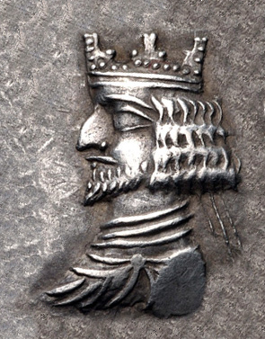

# Human-made Things in the Bible

## License Information

Human-made Things in the Bible © United Bible Societies, 2025. Adapted from: <cite>The Works of Their Hands: Man-made Things in the Bible</cite>, by Ray Pritz © 2009 United Bible Societies. This work is licensed under Creative Commons Attribution-ShareAlike 4.0 International (<a href="https://creativecommons.org/licenses/by-sa/4.0/">https://creativecommons.org/licenses/by-sa/4.0/</a>).

--------------------------------

## Crown (id: REALIA:1.10.2)

1\.10\.2 Crown
==============

References:
-----------

Hebrew כֶּתֶר (kether)

[EST 1:11](https://ref.ly/Esth1:11), [EST 2:17](https://ref.ly/Esth2:17), [EST 6:8](https://ref.ly/Esth6:8)

Hebrew נֵזֶר (nezer)

[2SA 1:10](https://ref.ly/2Sam1:10), [2KI 11:12](https://ref.ly/2Kgs11:12), [2CH 23:11](https://ref.ly/2Chr23:11), [PSA 89:40](https://ref.ly/Ps89:40), [PSA 132:18](https://ref.ly/Ps132:18), [PRO 27:24](https://ref.ly/Prov27:24), [ZEC 9:16](https://ref.ly/Zech9:16)

Hebrew עטר (‘atar (verb))

[PSA 8:6](https://ref.ly/Ps8:6), [SNG 3:11](https://ref.ly/Song3:11)

Hebrew עֲטָרָה (‘atarah)

[2SA 12:30](https://ref.ly/2Sam12:30), [1CH 20:2](https://ref.ly/1Chr20:2), [EST 8:15](https://ref.ly/Esth8:15), [PSA 21:4](https://ref.ly/Ps21:4), [SNG 3:11](https://ref.ly/Song3:11), [JER 13:18](https://ref.ly/Jer13:18), [EZK 16:12](https://ref.ly/Ezek16:12), [EZK 21:31](https://ref.ly/Ezek21:31), [ZEC 6:11](https://ref.ly/Zech6:11), [ZEC 6:14](https://ref.ly/Zech6:14)

Greek διάδημα (diadēma)

[REV 12:3](https://ref.ly/Rev12:3), [REV 13:1](https://ref.ly/Rev13:1), [REV 19:12](https://ref.ly/Rev19:12), [ESG 1:11](https://ref.ly/EsthGr1:11), [ESG 2:17](https://ref.ly/EsthGr2:17), [ESG 8:15](https://ref.ly/EsthGr8:15), [WIS 5:16](https://ref.ly/Wis5:16), [WIS 18:24](https://ref.ly/Wis18:24), [SIR 11:5](https://ref.ly/Sir11:5), [SIR 47:6](https://ref.ly/Sir47:6), [1MA 1:9](https://ref.ly/1Macc1:9), [1MA 6:15](https://ref.ly/1Macc6:15), [1MA 8:14](https://ref.ly/1Macc8:14), [1MA 11:13](https://ref.ly/1Macc11:13), [1MA 11:13](https://ref.ly/1Macc11:13), [1MA 11:54](https://ref.ly/1Macc11:54), [1MA 12:39](https://ref.ly/1Macc12:39), [1MA 13:32](https://ref.ly/1Macc13:32), [1ES 4:30](https://ref.ly/1Esd4:30)

Greek στέφανος, στεφανόω (stefanos, stefanoō (verb))

[MAT 27:29](https://ref.ly/Matt27:29), [MRK 15:17](https://ref.ly/Mark15:17), [JHN 19:2](https://ref.ly/John19:2), [JHN 19:5](https://ref.ly/John19:5), [HEB 2:7](https://ref.ly/Heb2:7), [HEB 2:9](https://ref.ly/Heb2:9), [REV 4:4](https://ref.ly/Rev4:4), [REV 4:10](https://ref.ly/Rev4:10), [REV 6:2](https://ref.ly/Rev6:2), [REV 9:7](https://ref.ly/Rev9:7), [REV 12:1](https://ref.ly/Rev12:1), [REV 14:14](https://ref.ly/Rev14:14), [SIR 40:4](https://ref.ly/Sir40:4), [SIR 45:12](https://ref.ly/Sir45:12), [1MA 10:20](https://ref.ly/1Macc10:20), [1MA 10:29](https://ref.ly/1Macc10:29), [1MA 11:35](https://ref.ly/1Macc11:35), [1MA 13:37](https://ref.ly/1Macc13:37), [1MA 13:39](https://ref.ly/1Macc13:39), [2MA 14:4](https://ref.ly/2Macc14:4)

Description and usage:
----------------------

*King wearing a crown (© CNG Wikimedia Commons)*

*Double crown uniting the scorpion\-shaped crown of Lower Egypt and the bottle\-shaped crown of Upper Egypt (© Einsamer Schütze, via Wikimedia Commons)*

The crown was a type of headgear worn by a king or queen as a sign of the royal office.

---

Translation:
------------

The “crown” may be described as “symbol of his/her power, worn on his/her head.”

*Crown of thorns (© Sgconlaw \- Wikimedia Commons)*

In some passages the crown serves only as a symbol of the office of king or queen. In those cultures where royalty (or the office of the supreme leader) is indicated by another symbol, this may be substituted for “crown.” Thus, for example, [EST 2:17](https://ref.ly/Esth2:17) might read “he gave her the royal seal and made her queen in place of Vashti.” Similarly, [PSA 21:4](https://ref.ly/Ps21:4) might read “you seat him on the chief’s stool” or “you make him chief.”

In some passages ([JOB 19:9](https://ref.ly/Job19:9); [JOB 31:36](https://ref.ly/Job31:36); [PRO 12:4](https://ref.ly/Prov12:4); [PRO 16:31](https://ref.ly/Prov16:31); [PRO 17:6](https://ref.ly/Prov17:6); [LAM 5:16](https://ref.ly/Lam5:16)) it is unclear from the context if the Hebrew word *‘atarah* refers to a crown or a wreath (see [6\.8 Wreath, crown\<REALIA:6\.8\>](#)).

RSV (Revised Standard Version (1952)) renders [1MA 11:13](https://ref.ly/1Macc11:13) as “Then Ptolemy entered Antioch and put on the crown of Asia. Thus he put two crowns upon his head, the crown of Egypt and that of Asia.” This literal rendering can create a rather silly picture in the mind of the reader. The crowns, of course, simply represent the authority held by Ptolemy in the two regions mentioned here. CEV (Contemporary English Version) has avoided the image of a king trying to balance two crowns on his head by saying “Ptolemy went to the city of Antioch, where he crowned himself king—both of Syria and of Egypt.” CEV (Contemporary English Version) ’s rendering, however, gives the mis­impression that he became king of Syria and Egypt simultaneously. A better model is “Ptolemy went to the city of Antioch, where he crowned himself king. This meant that he now ruled over both Egypt and Syria.”

It should be noted that the “crown of thorns” placed on Jesus was a wreath made of thorny branches ([MAT 27:29](https://ref.ly/Matt27:29); [MRK 15:17](https://ref.ly/Mark15:17); [JHN 19:2](https://ref.ly/John19:2); [JHN 19:5](https://ref.ly/John19:5)). The action may be described as “put a circle of thorns on his head” or “wove thorn branches together into a wreath \[or, circle] and put them on his head.”

For *stefanos* as a wreath, see [6\.8 Wreath, crown\<REALIA:6\.8\>](#).

* **Associated Passages:** Esther 1:11; Esther 2:17; Esther 6:8; 2 Samuel 1:10; 2 Kings 11:12; 2 Chronicles 23:11; Psalms 89:40; Psalms 132:18; Proverbs 27:24; Zechariah 9:16; Psalms 8:6; Song of Songs 3:11; 2 Samuel 12:30; 1 Chronicles 20:2; Esther 8:15; Psalms 21:4; Jeremiah 13:18; Ezekiel 16:12; Ezekiel 21:31; Zechariah 6:11; Zechariah 6:14; Revelation 12:3; Revelation 13:1; Revelation 19:12; Esther Greek 1:11; Esther Greek 2:17; Esther Greek 8:15; Wisdom of Solomon 5:16; Wisdom of Solomon 18:24; Sirach 11:5; Sirach 47:6; 1 Maccabees 1:9; 1 Maccabees 6:15; 1 Maccabees 8:14; 1 Maccabees 11:13; 1 Maccabees 11:54; 1 Maccabees 12:39; 1 Maccabees 13:32; 1 Esdras (Greek) 4:30; Matthew 27:29; Mark 15:17; John 19:2; John 19:5; Hebrews 2:7; Hebrews 2:9; Revelation 4:4; Revelation 4:10; Revelation 6:2; Revelation 9:7; Revelation 12:1; Revelation 14:14; Sirach 40:4; Sirach 45:12; 1 Maccabees 10:20; 1 Maccabees 10:29; 1 Maccabees 11:35; 1 Maccabees 13:37; 1 Maccabees 13:39; 2 Maccabees 14:4; Job 19:9; Job 31:36; Proverbs 12:4; Proverbs 16:31; Proverbs 17:6; Lamentations 5:16

* **Associated ACAI Concepts:** Crown (ID: `realia:Crown`); Crown (ID: `realia:Crown.2`)
