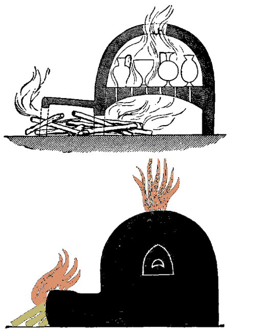

# Human-made Things in the Bible

## License Information

Human-made Things in the Bible © United Bible Societies, 2025. Adapted from: <cite>The Works of Their Hands: Man-made Things in the Bible</cite>, by Ray Pritz © 2009 United Bible Societies. This work is licensed under Creative Commons Attribution-ShareAlike 4.0 International (<a href="https://creativecommons.org/licenses/by-sa/4.0/">https://creativecommons.org/licenses/by-sa/4.0/</a>).

--------------------------------

## Smelting furnace, kiln (id: REALIA:1.11.1)

1\.11\.1 Smelting furnace, kiln
===============================

References:
-----------

Aramaic אַתּוּן (’atun)

[DAN 3:6](https://ref.ly/Dan3:6), [DAN 3:11](https://ref.ly/Dan3:11), [DAN 3:15](https://ref.ly/Dan3:15), [DAN 3:17](https://ref.ly/Dan3:17), [DAN 3:19](https://ref.ly/Dan3:19), [DAN 3:20](https://ref.ly/Dan3:20), [DAN 3:21](https://ref.ly/Dan3:21), [DAN 3:22](https://ref.ly/Dan3:22), [DAN 3:23](https://ref.ly/Dan3:23), [DAN 3:26](https://ref.ly/Dan3:26)

Hebrew כִּבְשָׁן (kivshan)

[GEN 19:28](https://ref.ly/Gen19:28), [EXO 9:8](https://ref.ly/Exod9:8), [EXO 9:10](https://ref.ly/Exod9:10), [EXO 19:18](https://ref.ly/Exod19:18)

Hebrew כּוּר (kur)

[DEU 4:20](https://ref.ly/Deut4:20), [1KI 8:51](https://ref.ly/1Kgs8:51), [PRO 17:3](https://ref.ly/Prov17:3), [PRO 27:21](https://ref.ly/Prov27:21), [ISA 48:10](https://ref.ly/Isa48:10), [JER 11:4](https://ref.ly/Jer11:4), [EZK 22:18](https://ref.ly/Ezek22:18), [EZK 22:20](https://ref.ly/Ezek22:20), [EZK 22:22](https://ref.ly/Ezek22:22)

Hebrew מַצְרֵף (matsref)

[PRO 17:3](https://ref.ly/Prov17:3), [PRO 27:21](https://ref.ly/Prov27:21)

Hebrew עֲלִיל (‘alil)

[PSA 12:7](https://ref.ly/Ps12:7)

Greek κάμινος (kaminos)

[MAT 13:42](https://ref.ly/Matt13:42), [MAT 13:50](https://ref.ly/Matt13:50), [REV 1:15](https://ref.ly/Rev1:15), [REV 9:2](https://ref.ly/Rev9:2), [SIR 2:5](https://ref.ly/Sir2:5), [SIR 22:24](https://ref.ly/Sir22:24), [SIR 27:5](https://ref.ly/Sir27:5), [SIR 31:26](https://ref.ly/Sir31:26), [SIR 38:28](https://ref.ly/Sir38:28), [SIR 38:30](https://ref.ly/Sir38:30), [SIR 43:4](https://ref.ly/Sir43:4), [3MA 6:6](https://ref.ly/3Macc6:6), [4MA 13:9](https://ref.ly/4Macc13:9), [4MA 16:3](https://ref.ly/4Macc16:3), [4MA 16:21](https://ref.ly/4Macc16:21), [DAG 3:6](https://ref.ly/INVALID), [DAG 3:11](https://ref.ly/INVALID), [DAG 3:15](https://ref.ly/INVALID), [DAG 3:17](https://ref.ly/INVALID), [DAG 3:19](https://ref.ly/INVALID), [DAG 3:20](https://ref.ly/INVALID), [DAG 3:21](https://ref.ly/INVALID), [DAG 3:22](https://ref.ly/INVALID), [DAG 3:23](https://ref.ly/INVALID), [DAG 3:46](https://ref.ly/INVALID), [DAG 3:47](https://ref.ly/INVALID), [DAG 3:48](https://ref.ly/INVALID), [DAG 3:49](https://ref.ly/INVALID), [DAG 3:49](https://ref.ly/INVALID), [DAG 3:50](https://ref.ly/INVALID), [DAG 3:51](https://ref.ly/INVALID), [DAG 3:88](https://ref.ly/INVALID), [DAG 3:93](https://ref.ly/INVALID)

Greek χωνευτήριον (chōneutērion)

[WIS 3:6](https://ref.ly/Wis3:6)

Latin fornax

[2ES 4:48](https://ref.ly/2Esd4:48)

Latin clibanus

[2ES 7:36](https://ref.ly/2Esd7:36)

Description:
------------

*Cross section of a pottery kiln (Encyclopaedia Biblica, 1903, Public domain, via Wikimedia Commons)*

The kiln was a furnace used for the smelting of ore or the firing of ceramic ware. Such furnaces were made of hardened clay or of brick. They could vary considerably in size and shape. See also [5\.11 Oven\<REALIA:5\.11\>](#).

---

Usage:
------

*Reconstructed kiln in Revadim, Israel (© Heritage Conservation Outside the City, Pikiwiki Israel, CC BY 2\.5, via Wikimedia Commons)*

Almost all metals exist in nature in combination with other minerals. To remove the other minerals requires chemical treatment combined with heating the ore to very high temperatures in kilns. Such heating chambers served also for firing bricks or pottery and for other purposes.

---

Translation:
------------

When translating the word “furnace,” the emphasis should be upon the extreme heat, rather than upon the particular type of construction. However, if a particular word for “furnace” is chosen, it should be remembered that this furnace or oven was not made of metal but of brick or hardened clay.

The Hebrew word *kur* is always used in metaphorical or symbolic language describing human sufferings. It will often be possible to portray the meaning of the metaphor without reference to the physical object; for example, CEV (Contemporary English Version) renders [DEU 4:20](https://ref.ly/Deut4:20) as “But you are the LORD’s people, because he led you through fiery trials and rescued you from Egypt.”

[PSA 12:7](https://ref.ly/Ps12:7): The Hebrew word *‘alil* occurs only here in the Old Testament, and its meaning is uncertain. It seems best to translate the obscure clause at the end of this verse in a general sense; for example, GNT (Good News Translation (1992)) has “they are as genuine as silver refined seven times in the furnace,” and NIV (New International Version (1984)) says “like silver refined in a furnace of clay, purified seven times.” “Seven times” means “many times,” that is, as many times as needed to get rid of all the impurities.

[PRO 17:3](https://ref.ly/Prov17:3); [PRO 27:21](https://ref.ly/Prov27:21): Two instruments for heating and refining metals are mentioned in these verses: the *matsref* and the *kur*. If separate words exist in a language for these two instruments (for example, “crucible” and “furnace”), these may be used. Many translations combine the two words; for example, in [PRO 17:3](https://ref.ly/Prov17:3) a GNT (Good News Translation (1992)) says “Gold and silver are tested by fire,” and NCV (New Century Version) has “A hot furnace tests silver and gold.”

[DAN 3:0](https://ref.ly/Dan3:0): The furnace described here probably had an opening at the top and another at ground level. It was clearly large enough for men to stand and even walk around in. The word for “furnace” here should also be used in [DAG 3:23–DAG 3:28](https://ref.ly/INVALID) and [DAG 3:66](https://ref.ly/INVALID).

In [MAT 13:42](https://ref.ly/Matt13:42); [MAT 13:50](https://ref.ly/Matt13:50) the Greek word *kaminos* is used figuratively of hell. Alternative renderings for the literal phrase “the furnace of fire” are “the fires of hell” and “hell, which is like a great fire.” Another possibility is simply “the great fire.” Similarly, the Latin word *clibanus* is used metaphorically in [2ES 7:36](https://ref.ly/2Esd7:36) for the heat of hell.

The difference between this entry and [5\.11 Oven\<REALIA:5\.11\>](#) is primarily one of size rather than of basic design. Ovens, of course, could be put to many uses. Where a language does not have a variety of words, such as “oven,” “furnace” and “kiln” in English, a single word will normally suffice. In that case, it will sometimes be necessary to indicate the relative size of the oven according to the context. An oven in which bread was baked may be rendered “small oven,” while the one into which several people were thrown will be a “very large oven.”

The fuel burned in ancient ovens was wood, the leftover flesh of pressed olives, or dried animal dung. Translators should avoid a word for “oven” that indicates a device that runs on electricity or uses a refined fuel like oil or kerosene.

* **Associated Passages:** Daniel 3:6; Daniel 3:11; Daniel 3:15; Daniel 3:17; Daniel 3:19; Daniel 3:20; Daniel 3:21; Daniel 3:22; Daniel 3:23; Daniel 3:26; Genesis 19:28; Exodus 9:8; Exodus 9:10; Exodus 19:18; Deuteronomy 4:20; 1 Kings 8:51; Proverbs 17:3; Proverbs 27:21; Isaiah 48:10; Jeremiah 11:4; Ezekiel 22:18; Ezekiel 22:20; Ezekiel 22:22; Psalms 12:7; Matthew 13:42; Matthew 13:50; Revelation 1:15; Revelation 9:2; Sirach 2:5; Sirach 22:24; Sirach 27:5; Sirach 31:26; Sirach 38:28; Sirach 38:30; Sirach 43:4; 3 Maccabees 6:6; 4 Maccabees 13:9; 4 Maccabees 16:3; 4 Maccabees 16:21; Daniel Greek 3:6; Daniel Greek 3:11; Daniel Greek 3:15; Daniel Greek 3:17; Daniel Greek 3:19; Daniel Greek 3:20; Daniel Greek 3:21; Daniel Greek 3:22; Daniel Greek 3:23; Daniel Greek 3:46; Daniel Greek 3:47; Daniel Greek 3:48; Daniel Greek 3:49; Daniel Greek 3:50; Daniel Greek 3:51; Daniel Greek 3:88; Daniel Greek 3:93; Wisdom of Solomon 3:6; 2 Esdras (Latin) 4:48; 2 Esdras (Latin) 7:36; Daniel 3:0; Daniel Greek 3:28; Daniel Greek 3:66

