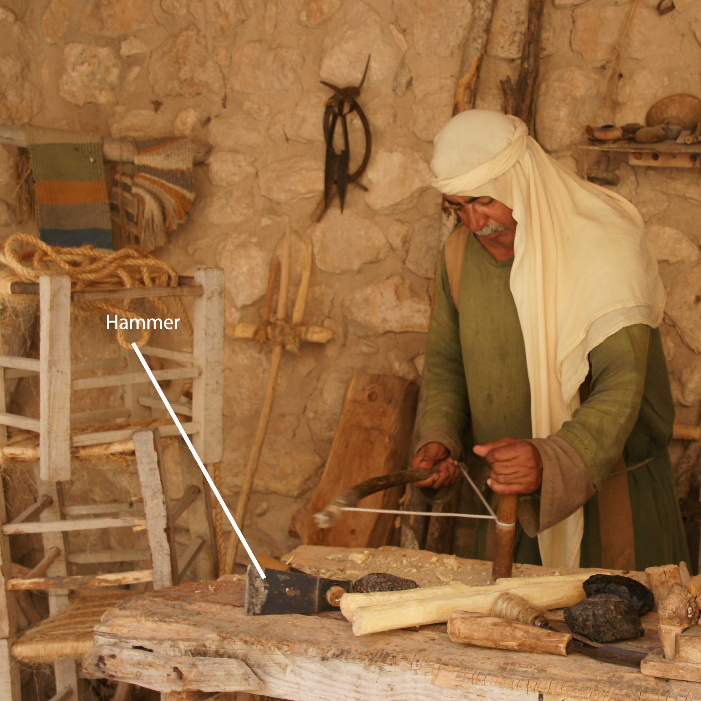

# Human-made Things in the Bible

## License Information

Human-made Things in the Bible © United Bible Societies, 2025. Adapted from: <cite>The Works of Their Hands: Man-made Things in the Bible</cite>, by Ray Pritz © 2009 United Bible Societies. This work is licensed under Creative Commons Attribution-ShareAlike 4.0 International (<a href="https://creativecommons.org/licenses/by-sa/4.0/">https://creativecommons.org/licenses/by-sa/4.0/</a>).

--------------------------------

## Carpenter (id: REALIA:1.12)

1\.12 Carpenter
===============

Axe: See [1\.1\.9\.2 Fork\<REALIA:1\.1\.9\.2\>](#).
---------------------------------------------------

## Hammer (id: REALIA:1.12.1)

1\.12\.1 Hammer
===============

References:
-----------

Hebrew הַלְמוּת (halmuth)

[JDG 5:26](https://ref.ly/Judg5:26)

Hebrew מַקֶּבֶת (maqavah, maqeveth)

[JDG 4:21](https://ref.ly/Judg4:21), [1KI 6:7](https://ref.ly/1Kgs6:7), [ISA 44:12](https://ref.ly/Isa44:12), [JER 10:4](https://ref.ly/Jer10:4)

Hebrew מִקְשָׁה (miqshah)

[EXO 25:18](https://ref.ly/Exod25:18), [EXO 25:31](https://ref.ly/Exod25:31), [EXO 25:36](https://ref.ly/Exod25:36), [EXO 37:7](https://ref.ly/Exod37:7), [EXO 37:17](https://ref.ly/Exod37:17), [EXO 37:22](https://ref.ly/Exod37:22), [NUM 8:4](https://ref.ly/Num8:4), [NUM 8:4](https://ref.ly/Num8:4), [NUM 10:2](https://ref.ly/Num10:2)

Hebrew פַּטִּישׁ (patish)

[ISA 41:7](https://ref.ly/Isa41:7), [JER 23:29](https://ref.ly/Jer23:29), [JER 50:23](https://ref.ly/Jer50:23)

Hebrew רִקֻּעַ (riqua‘)

[NUM 17:3](https://ref.ly/Num17:3)

Greek ἐλατός (elatos)

[SIR 50:16](https://ref.ly/Sir50:16)

Greek ὁλοσφύρητος (olosfurētos)

[SIR 50:9](https://ref.ly/Sir50:9)

Greek σφῦρα (sfura)

[SIR 38:28](https://ref.ly/Sir38:28)

Description:
------------

*Wooden hammer (© Giovanni Dall'Orto, Attribution, via Wikimedia Commons)*

The hammer was an instrument about 30 centimeters (1 foot) long. It had a handle, usually made of wood, to which was attached a stone, wooden, or (less frequently) metal head. The handle was fitted into a hole in the hammer’s head.

---

Usage:
------

*Drawing of a worker using a hammer (Elbert Boot © United Bible Societies)*

The hammer served many purposes, including the breaking or dressing of building stones, pounding nails or pegs into wood, or pounding pegs into the ground. It also was used by blacksmiths to shape hot metal.

---

Translation:
------------

The meaning of the Hebrew word *miqshah* is uncertain. It seems to refer to the result of the work of an artisan on metal objects, that is, “hammered work” or “beaten work.”

* **Associated Passages:** Judges 5:26; Judges 4:21; 1 Kings 6:7; Isaiah 44:12; Jeremiah 10:4; Exodus 25:18; Exodus 25:31; Exodus 25:36; Exodus 37:7; Exodus 37:17; Exodus 37:22; Numbers 8:4; Numbers 10:2; Isaiah 41:7; Jeremiah 23:29; Jeremiah 50:23; Numbers 17:3; Sirach 50:16; Sirach 50:9; Sirach 38:28

* **Associated ACAI Concepts:** Hammer (ID: `realia:Hammer`)

## Nail, spike (id: REALIA:1.12.2)

1\.12\.2 Nail, spike
====================

References:
-----------

Hebrew מַסְמֵר (masmer)

[1CH 22:3](https://ref.ly/1Chr22:3), [2CH 3:9](https://ref.ly/2Chr3:9), [ISA 41:7](https://ref.ly/Isa41:7), [JER 10:4](https://ref.ly/Jer10:4)

Hebrew מַשְׂמֵרָה (masmerah)

[ECC 12:11](https://ref.ly/Eccl12:11)

Greek ἧλος (hēlos)

[JHN 20:25](https://ref.ly/John20:25), [JHN 20:25](https://ref.ly/John20:25)

Description:
------------

*Spike in an anklebone (Gary Todd, Israel Museum, CC0, via Wikimedia Commons)*

The nail was a thin piece of metal (usually iron) sharpened on one end. It served much the same purpose as a modern nail, attaching pieces of wood to each other or to the floor.

The spike for crucifixion was a fairly thick, pointed piece of iron. It was roughly 20 centimeters (8 inches) long and about the thickness of a man’s finger. Archaeological excavations in 1968 uncovered the remains of a crucified man. A metal spike was still lodged in an anklebone, passing through it from the side.

---

Translation:
------------

In a number of languages a distinction is made between relatively small nails and larger spikes. The latter would be appropriate when speaking of crucifixion and probably for the spikes used in gate construction in [1CH 22:3](https://ref.ly/1Chr22:3). The word chosen should indicate a spike strong enough that two or three of them would have held the weight of a man.

*Roman\-era rought iron nails (© Takkk, CC BY\-SA 3\.0, via Wikimedia Commons)*

The nails mentioned in [2CH 3:9](https://ref.ly/2Chr3:9) were made of gold and varied widely in size.

* **Associated Passages:** 1 Chronicles 22:3; 2 Chronicles 3:9; Isaiah 41:7; Jeremiah 10:4; Ecclesiastes 12:11; John 20:25

* **Associated ACAI Concepts:** Nail (ID: `realia:Nail`)

## Chisel, plane (id: REALIA:1.12.3)

1\.12\.3 Chisel, plane
======================

Reference:
----------

Hebrew מַקְצוּעָה (maqtsu‘a)

[ISA 44:13](https://ref.ly/Isa44:13)

Description and usage:
----------------------

*Man crafting a piece of wood with a chisel (Image generated by ChatGPT using OpenAI technology)*

The chisel or plane was a metal tool with a sharp edge used to shape wood.

---

Translation:
------------

[ISA 44:13](https://ref.ly/Isa44:13): This verse mentions three tools used by a carpenter in making an idol from a piece of wood. All three tools are mentioned only here in the Bible, and their meanings are derived primarily from the context and from their etymologies. Two of the tools, the *sered* (see [1\.12\.6 Stylus, marker\<REALIA:1\.12\.6\>](#)) and the *mchugah* (see [1\.12\.7 Compass, circle instrument\<REALIA:1\.12\.7\>](#)), have to do with marking the wood before carving it, while the *maqtsu‘a* was used to cut and shape the wood into the desired form.

GNT (Good News Translation (1992)) combines *maqtsu‘a* and *mchugah* in the generic rendering “tools.” This may serve for cultures where the chisel or plane is not known. It is also possible to render *maqtsu‘a* as “knife.”

* **Associated Passages:** Isaiah 44:13

* **Associated ACAI Concepts:** Chisel (ID: `realia:Chisel`); House (ID: `realia:House`)

## Awl (id: REALIA:1.12.4)

1\.12\.4 Awl
============

References:
-----------

Hebrew מַרְצֵעַ (martsea‘)

[EXO 21:6](https://ref.ly/Exod21:6), [DEU 15:17](https://ref.ly/Deut15:17)

Description and usage:
----------------------

*An iron titching awl from the Roman period (Vidy Roman Museum, Lausanne, Switzerland) (© Rama, CC BY\-SA 2\.0 FR, CeCILL or CC BY\-SA 2\.0 FR, via Wikimedia Commons)*

The awl was a hand tool with a narrow point used for boring holes in wood, leather, or other substances. The point could be made of metal, bone, or stone. The awl sometimes had a handle made of wood or bone.

---

Translation:
------------

In the only references to this implement in Scripture, it is used to pierce the ear of a slave to symbolize that he has chosen to remain with his master for life. It is possible that, in the hole made by the piercing, the master placed a ring or band indicating ownership. The exact instrument is not as important as its form. Where there is no word for “awl,” translators may use a word for some similar pointed implement, such as “nail” or “knife.”

* **Associated Passages:** Exodus 21:6; Deuteronomy 15:17

* **Associated ACAI Concepts:** Awl (ID: `realia:Awl`)

## Saw (id: REALIA:1.12.5)

1\.12\.5 Saw
============

Reference:
----------

Greek πρίζω (prizō (verb))

[HEB 11:37](https://ref.ly/Heb11:37)

Description and usage:
----------------------

*Depiction of a carpenter on a mural in the burial chamber of the sculptors Nebamun and Ipuki (Eloquence, Public domain, via Wikimedia Commons)*

The saw was a flat tool with a serrated edge, used for cutting objects in two. It could be made of hard stone such as flint or of metal and was sometimes fitted with a handle.

---

Translation:
------------

[HEB 11:37](https://ref.ly/Heb11:37): It may not be necessary to be so precise about the instrument here. NCV (New Century Version) “cut in half” adequately conveys the idea.

* **Associated Passages:** Hebrews 11:37

* **Associated ACAI Concepts:** Saw (ID: `realia:Saw`)

## Stylus, marker (id: REALIA:1.12.6)

1\.12\.6 Stylus, marker
=======================

Reference:
----------

Hebrew שֶׂרֶד (sered)

[ISA 44:13](https://ref.ly/Isa44:13)

Description and usage:
----------------------

*(Image generated by ChatGPT using OpenAI technology)*

The stylus was a tool used to make marks on wood to help the carpenter plan out the shape he would make.

---

Translation:
------------

[ISA 44:13](https://ref.ly/Isa44:13): Two different implements are possible for the Hebrew word *sered*, although both would have the same function. One possibility is a pointed tool used to scratch marks in the wood (NRSV (New Revised Standard Version (1989)) “stylus”); the other possibility is a soft red stone, similar to chalk, with which the carpenter could make marks on the wood (GNT (Good News Translation (1992)) “chalk”; NASB (New American Standard Bible) “red chalk”; NIV (New International Version (1984)) “marker”). A good model that expresses the meaning of the second clause in this verse without explicitly mentioning this tool is CEV (Contemporary English Version) “then draws an outline.” See also the comments at [1\.12\.3 Chisel, plane\<REALIA:1\.12\.3\>](#).

* **Associated Passages:** Isaiah 44:13

* **Associated ACAI Concepts:** Stylus (ID: `realia:Stylus.2`); Compass (ID: `realia:Compass`); Measuring Reed (ID: `realia:MeasuringReed`)

## Compass, circle instrument (id: REALIA:1.12.7)

1\.12\.7 Compass, circle instrument
===================================

Reference:
----------

Hebrew מְחוּגָה (mchugah)

[ISA 44:13](https://ref.ly/Isa44:13)

Description and usage:
----------------------

*Roman compass (1st to 3rd c. CE) (© Bullenwächter / Andreas Franzkowiak, Halstenbek, CC BY\-SA 3\.0, via Wikimedia Commons; cropped)*

The compass was a tool for drawing or marking circles. It is also possible that the instrument was used for making measurements.

---

Translation:
------------

See the comments at [1\.12\.3 Chisel, plane\<REALIA:1\.12\.3\>](#)

* **Associated Passages:** Isaiah 44:13

* **Associated ACAI Concepts:** Compass (ID: `realia:Compass`); Measuring Reed (ID: `realia:MeasuringReed`)
