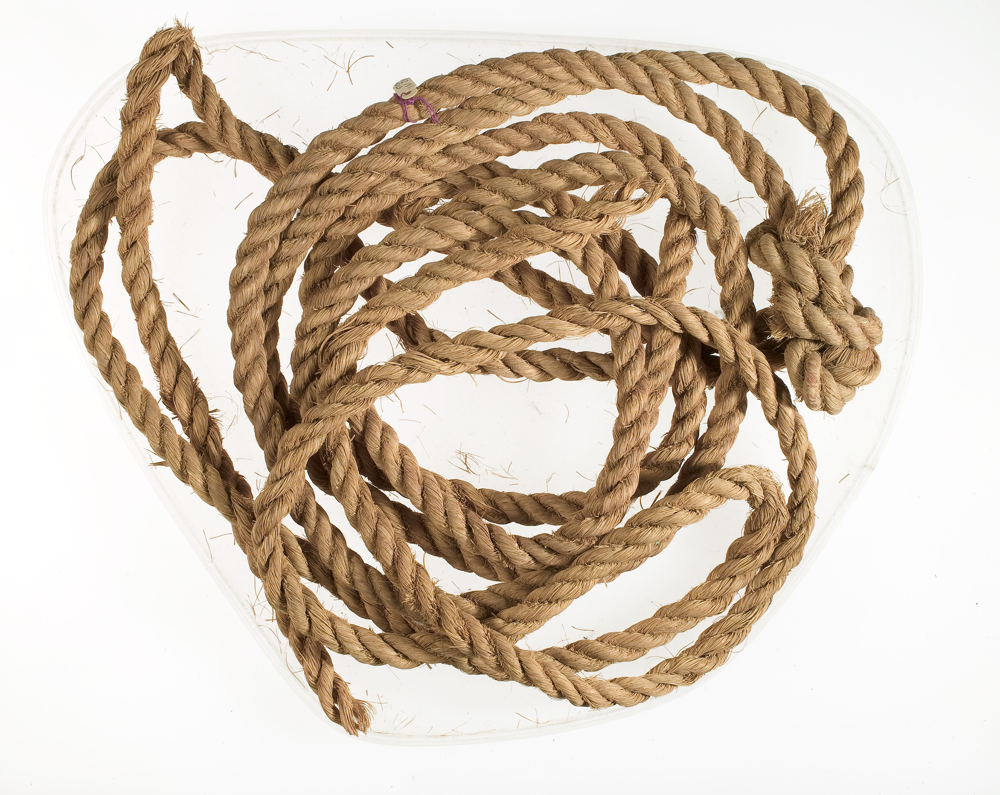

# Human-made Things in the Bible

## License Information

Human-made Things in the Bible © United Bible Societies, 2025. Adapted from: <cite>The Works of Their Hands: Man-made Things in the Bible</cite>, by Ray Pritz © 2009 United Bible Societies. This work is licensed under Creative Commons Attribution-ShareAlike 4.0 International (<a href="https://creativecommons.org/licenses/by-sa/4.0/">https://creativecommons.org/licenses/by-sa/4.0/</a>).

--------------------------------

## Rope, cord (id: REALIA:1.14)

1\.14 Rope, cord
================

References:
-----------

Hebrew אַגְמוֹן (’agmon)

JOB 40:26

Hebrew חֶבֶל (chevel)

JOS 2:15, 2SA 8:2, 2SA 8:2, 2SA 8:2, 2SA 17:13, 2SA 22:6, 1KI 20:31, 1KI 20:32, EST 1:6, JOB 36:8, JOB 40:25, PSA 18:5, PSA 18:6, PSA 116:3, PSA 119:61, PRO 5:22, ECC 12:6, ISA 5:18, ISA 33:20, ISA 33:23, JER 38:6, JER 38:11, JER 38:12, JER 38:13, EZK 27:24, HOS 11:4

Hebrew מֵיתָר (meythar)

EXO 35:18, EXO 39:40, NUM 3:26, NUM 3:37, NUM 4:26, NUM 4:32, ISA 54:2, JER 10:20

Hebrew מֹשְׁכוֹת (moshkoth)

JOB 38:31

Hebrew נִקְפָּה (niqfah)

ISA 3:24

Hebrew עֲבֹת (‘avoth)

EXO 28:14, EXO 28:14, EXO 28:22, EXO 28:24, EXO 28:25, EXO 39:15, EXO 39:17, EXO 39:18, JDG 15:13, JDG 15:14, JDG 16:11, JDG 16:12, JOB 39:10, PSA 2:3, PSA 118:27, PSA 129:4, ISA 5:18, EZK 3:25, EZK 4:8, HOS 11:4

Greek ζευκτηρία (zeuktēria)

ACT 27:40

Greek κλῶσμα (klōsma)

SIR 6:30

Greek νευρά (neura)

2MA 7:1

Greek σχοινίον (schoinion)

JHN 2:15, ACT 27:32, LJE 1:43

Description:
------------

*Rope, probably made of palm fiber (ca. 1550–1295 BCE, New Kingdom, Egypt, Thebes, Dra Abu el\-Naga) (Rogers Fund, 1912, Metropolitan Museum of Art, CC0\)*

Rope was a fairly thick cord formed by twisting or braiding several strands together. It could be made of a variety of materials, including palm fibers, linen, or reeds.

---

Usage:
------

Rope had multiple uses. It could be used to bind things together, to connect draft animals to the implements they pulled, to tie people up, and even to measure the length of things.

---

Translation:
------------

In Exodus the Hebrew word *‘avoth* refers to short, cordlike connectors between the ephod and the shoulder straps. The text says they were made of pure gold. They have been understood as chains with links or as strips of gold braided into a kind of cord. Translations have rendered it various ways, but none of these renderings leave a really clear picture (and in that sense they reflect the Hebrew text); for example, in EXO 28:14CEV (Contemporary English Version) and NIV (New International Version (1984)) have “braided chains of pure gold,” GNT (Good News Translation (1992)) says “chains of pure gold twisted like cords,” REB (Revised English Bible (1989)) uses “chains of pure gold worked into the form of cords,” and NJPSV (New Jewish Publication Society Version) translates “chains of pure gold; braid these like corded work.” An alternative translation model offered by *A Handbook on Exodus* is “gold cords that they have braided \[or, twisted] like rope” (page 656\).

In JOB 36:8 the phrase “cords of affliction” (RSV (Revised Standard Version (1952)), NIV (New International Version (1984)); compare similar expressions in 2SA 22:6; PSA 18:5; PSA 18:5; PSA 116:3; PSA 119:61; PSA 129:4; HOS 11:4) will sound as strange in many languages as it does in English. The translator should look for a rendering that is functionally equivalent; for example, GNT (Good News Translation (1992)) renders JOB 36:8 b as “suffering for what they have done.” NCV (New Century Version) maintains the metaphor of ropes while still using idiomatic English: “or if trouble, like ropes, ties them up.”

The Hebrew text of PSA 118:27 is uncertain. Most translations (RSV (Revised Standard Version (1952)), GNT (Good News Translation (1992)), NIV (New International Version (1984)), CEV (Contemporary English Version)), as well as *A Handbook on Psalms*, understand the word *‘avoth* to refer to leafy branches, perhaps in reference to a custom at the Feast of Tabernacles. Some translations (REB (Revised English Bible (1989)), NJPSV (New Jewish Publication Society Version), NASB (New American Standard Bible), New King James Version \[NKJV (New King James Version (1982))]) and rabbinic commentators understand the word to refer to thick ropes used to tie the sacrificial victim to the altar.

The ropes mentioned in ACT 27:32 would obviously have been rather thick, while in JHN 2:15 the whip that Jesus made in driving the animals and merchants out of the Temple would probably have consisted of strong cords.

In ACT 27:40 the Greek word *zeuktēria* refers to ropes used to link two rudders of a boat (see the illustration at [8\.1\.8 Steering oar, rudder\<REALIA:8\.1\.8\>](#)). In most languages translators would simply use a term for “rope.”

* **Associated Passages:** Job 40:26; Joshua 2:15; 2 Samuel 8:2; 2 Samuel 17:13; 2 Samuel 22:6; 1 Kings 20:31; 1 Kings 20:32; Esther 1:6; Job 36:8; Job 40:25; Psalms 18:5; Psalms 18:6; Psalms 116:3; Psalms 119:61; Proverbs 5:22; Ecclesiastes 12:6; Isaiah 5:18; Isaiah 33:20; Isaiah 33:23; Jeremiah 38:6; Jeremiah 38:11; Jeremiah 38:12; Jeremiah 38:13; Ezekiel 27:24; Hosea 11:4; Exodus 35:18; Exodus 39:40; Numbers 3:26; Numbers 3:37; Numbers 4:26; Numbers 4:32; Isaiah 54:2; Jeremiah 10:20; Job 38:31; Isaiah 3:24; Exodus 28:14; Exodus 28:22; Exodus 28:24; Exodus 28:25; Exodus 39:15; Exodus 39:17; Exodus 39:18; Judges 15:13; Judges 15:14; Judges 16:11; Judges 16:12; Job 39:10; Psalms 2:3; Psalms 118:27; Psalms 129:4; Ezekiel 3:25; Ezekiel 4:8; Acts 27:40; Sirach 6:30; 2 Maccabees 7:1; John 2:15; Acts 27:32; Letter of Jeremiah 1:43

* **Associated ACAI Concepts:** Rope (ID: `realia:Rope`)
