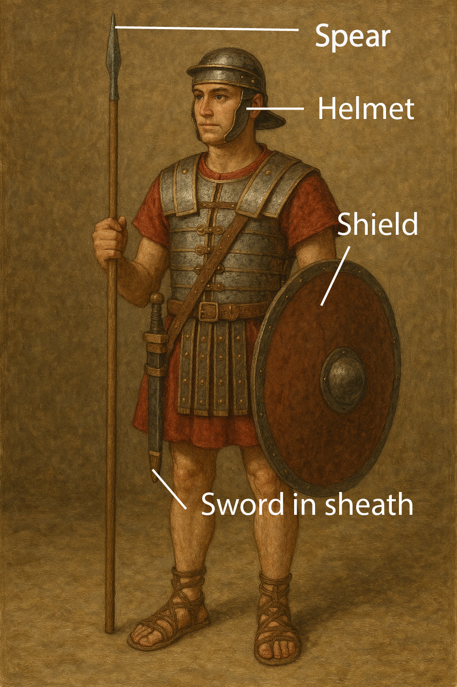

# Human-made Things in the Bible

## License Information

Human-made Things in the Bible © United Bible Societies, 2025. Adapted from: <cite>The Works of Their Hands: Man-made Things in the Bible</cite>, by Ray Pritz © 2009 United Bible Societies. This work is licensed under Creative Commons Attribution-ShareAlike 4.0 International (<a href="https://creativecommons.org/licenses/by-sa/4.0/">https://creativecommons.org/licenses/by-sa/4.0/</a>).

--------------------------------

## Sheath, scabbard (id: REALIA:2.3.1)

2\.3\.1 Sheath, scabbard
========================

References:
-----------

Hebrew נָדָן (nadan)

[1CH 21:27](https://ref.ly/1Chr21:27)

Hebrew תַּעַר (ta‘ar)

[1SA 17:51](https://ref.ly/1Sam17:51), [2SA 20:8](https://ref.ly/2Sam20:8), [JER 47:6](https://ref.ly/Jer47:6), [EZK 21:8](https://ref.ly/Ezek21:8), [EZK 21:9](https://ref.ly/Ezek21:9), [EZK 21:10](https://ref.ly/Ezek21:10), [EZK 21:35](https://ref.ly/Ezek21:35)

Greek θήκη (thēkē)

[JHN 18:11](https://ref.ly/John18:11)

Description:
------------

*Body armor and weapons of a soldier (Image generated by ChatGPT using OpenAI technology)*

The sheath was a case or bag about the size and shape of a sword, used to cover and to carry the sword. It could be made of a variety of materials, usually leather, but also cloth, metal, or even wood. It was normally attached to a circular strap or belt that could be hung over the shoulder or tied around the waist. In later Old Testament times, when iron swords were too heavy for a belt alone, the sheath was attached to a combination of a belt and a shoulder strap.

---

Usage:
------

The sheath covered the blade of a sword in order to protect the blade and to protect the person carrying the sword and those around him from being cut accidentally.

---

Translation:
------------

In some languages “sheath” may be rendered “leather bag for a sword,” “covering for a sword,” or “something in which a sword is carried.”

* **Associated Passages:** 1 Chronicles 21:27; 1 Samuel 17:51; 2 Samuel 20:8; Jeremiah 47:6; Ezekiel 21:8; Ezekiel 21:9; Ezekiel 21:10; Ezekiel 21:35; John 18:11

