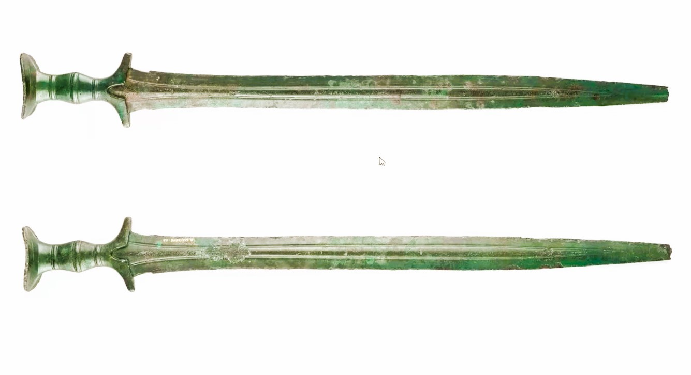

# Human-made Things in the Bible

## License Information

Human-made Things in the Bible © United Bible Societies, 2025. Adapted from: <cite>The Works of Their Hands: Man-made Things in the Bible</cite>, by Ray Pritz © 2009 United Bible Societies. This work is licensed under Creative Commons Attribution-ShareAlike 4.0 International (<a href="https://creativecommons.org/licenses/by-sa/4.0/">https://creativecommons.org/licenses/by-sa/4.0/</a>).

--------------------------------

## Dagger (id: REALIA:2.4)

2\.4 Dagger
===========

Reference:
----------

Greek ἐγχειρίδιον (egcheiridion)

[LJE 1:13](https://ref.ly/EpJer1:13)

Description and usage:
----------------------

*Sword (dagger) (© Unknown \- Wikimedia Commons)*

The dagger was a short stabbing weapon with a pointed blade. It was held easily in one hand and could be concealed without difficulty.

---

Translation:
------------

The dagger was smaller than the short sword and in most cultures will be comparable to a pointed knife.

* **Associated Passages:** Letter of Jeremiah 1:13

