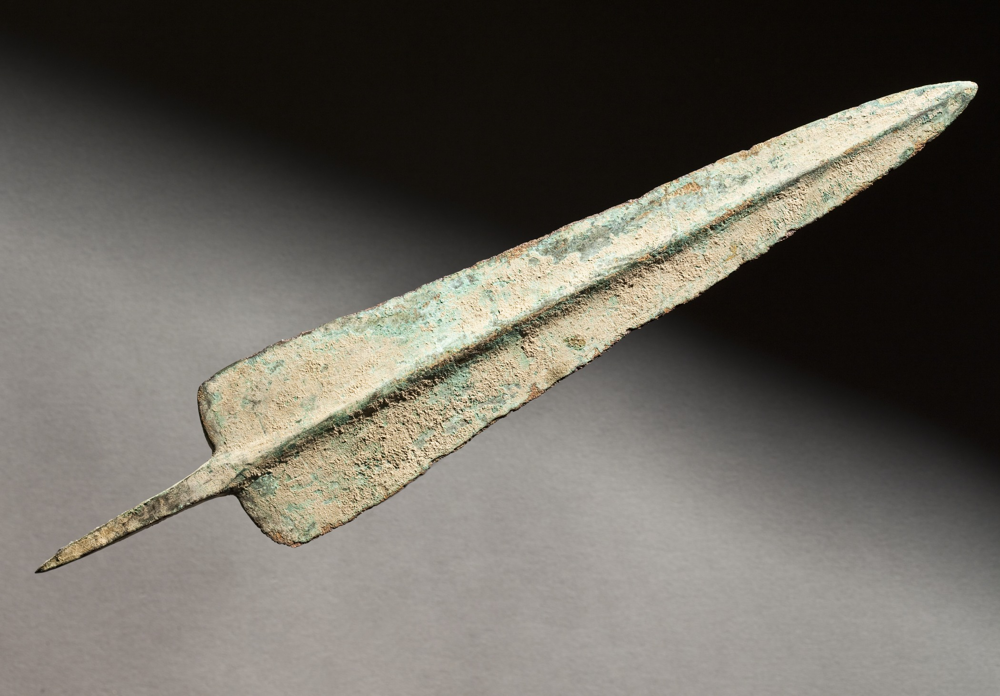

# Human-made Things in the Bible

## License Information

Human-made Things in the Bible © United Bible Societies, 2025. Adapted from: <cite>The Works of Their Hands: Man-made Things in the Bible</cite>, by Ray Pritz © 2009 United Bible Societies. This work is licensed under Creative Commons Attribution-ShareAlike 4.0 International (<a href="https://creativecommons.org/licenses/by-sa/4.0/">https://creativecommons.org/licenses/by-sa/4.0/</a>).

--------------------------------

## Spearhead (id: REALIA:2.5.1)

2\.5\.1 Spearhead
=================

References:
-----------

Hebrew לֶהָבָה (lehavah)

[1SA 17:7](https://ref.ly/1Sam17:7)

Hebrew קַיִן (qayin)

[2SA 21:16](https://ref.ly/2Sam21:16)

Description and usage:
----------------------

*Bronze spearhead from Iran, Luristan, ca 1000–550 BCE (Los Angeles County Museum of Art www.lacma.org, Public domain, via Wikimedia Commons)*

The spearhead was a piece of metal, usually iron or bronze, attached to the end of the spear (see [2\.5 Spear, lance\<REALIA:2\.5\>](#)). It was either placed over the end of the spear shaft like a sleeve or wedged into a split at the end of the spear shaft and secured by tying it with a cord. The spearhead was sharpened to a point.

---

Translation:
------------

In both of the references the spearhead is mentioned because of its exceptional size (about 7 kilograms, 15–16 pounds). The spearhead of an average soldier weighed much less. It is possible, but less likely, that the Hebrew word *qayin* in [2SA 21:16](https://ref.ly/2Sam21:16) refers to the entire spear, including its iron head.

* **Associated Passages:** 1 Samuel 17:7; 2 Samuel 21:16

