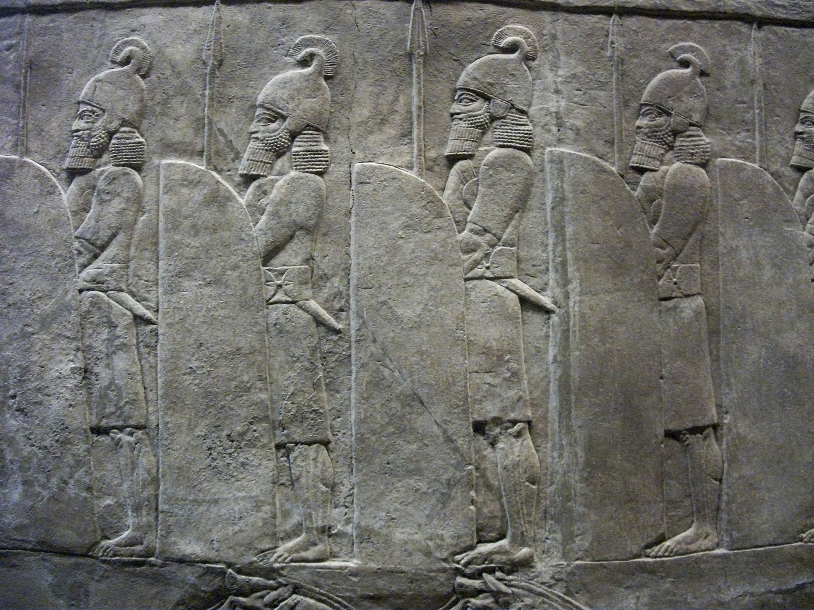

# Human-made Things in the Bible

## License Information

Human-made Things in the Bible © United Bible Societies, 2025. Adapted from: <cite>The Works of Their Hands: Man-made Things in the Bible</cite>, by Ray Pritz © 2009 United Bible Societies. This work is licensed under Creative Commons Attribution-ShareAlike 4.0 International (<a href="https://creativecommons.org/licenses/by-sa/4.0/">https://creativecommons.org/licenses/by-sa/4.0/</a>).

--------------------------------

## Large shield (id: REALIA:2.10.1)

2\.10\.1 Large shield
=====================

References:
-----------

Hebrew צִנָּה (tsinah)

[1SA 17:7](https://ref.ly/1Sam17:7), [1SA 17:41](https://ref.ly/1Sam17:41), [1KI 10:16](https://ref.ly/1Kgs10:16), [1KI 10:16](https://ref.ly/1Kgs10:16), [1CH 12:9](https://ref.ly/1Chr12:9), [1CH 12:25](https://ref.ly/1Chr12:25), [1CH 12:35](https://ref.ly/1Chr12:35), [2CH 9:15](https://ref.ly/2Chr9:15), [2CH 9:15](https://ref.ly/2Chr9:15), [2CH 11:12](https://ref.ly/2Chr11:12), [2CH 14:7](https://ref.ly/2Chr14:7), [2CH 25:5](https://ref.ly/2Chr25:5), [PSA 5:13](https://ref.ly/Ps5:13), [PSA 35:2](https://ref.ly/Ps35:2), [PSA 91:4](https://ref.ly/Ps91:4), [JER 46:3](https://ref.ly/Jer46:3), [EZK 23:24](https://ref.ly/Ezek23:24), [EZK 26:8](https://ref.ly/Ezek26:8), [EZK 38:4](https://ref.ly/Ezek38:4), [EZK 39:9](https://ref.ly/Ezek39:9)

Greek ἀσπιδίσκη (aspidiskē)

[1MA 4:57](https://ref.ly/1Macc4:57)

Greek ἀσπίς (aspis)

[JDT 9:7](https://ref.ly/Jdt9:7), [WIS 5:19](https://ref.ly/Wis5:19), [SIR 29:13](https://ref.ly/Sir29:13), [SIR 37:5](https://ref.ly/Sir37:5), [1MA 6:39](https://ref.ly/1Macc6:39), [1MA 14:24](https://ref.ly/1Macc14:24), [1MA 15:18](https://ref.ly/1Macc15:18), [1MA 15:20](https://ref.ly/1Macc15:20), [2MA 5:3](https://ref.ly/2Macc5:3), [2MA 15:11](https://ref.ly/2Macc15:11)

Greek κάλυμμα (kalumma)

[1MA 4:6](https://ref.ly/1Macc4:6), [1MA 6:2](https://ref.ly/1Macc6:2)

Greek θυρεός (thureos)

[EPH 6:16](https://ref.ly/Eph6:16)

Description:
------------

*Large shields held by soldiers at the lion hunt of Ashurbanipal (Room 10a, British Museum) (© Johnbod, CC BY\-SA 4\.0, via Wikimedia Commons)*

The large shield was a long, oblong shield. It was about the height of a man since it was intended to protect the entire body. It could be made of wood, metal, leather stretched over wood, or even plaited strips of wood or reeds.

---

Usage:
------

This shield was held with one hand by means of straps attached to its back. A warrior who held his sword in his right hand would hold his shield with his left hand, and vice versa. The shield was held between the warrior and his opponent and was used to ward off blows from swords, spears or clubs, as well as to stop any missiles such as arrows, stones, or javelins. In the story of David fighting the giant Goliath ([1SA 17:0](https://ref.ly/1Sam17:0)), a servant stood in front of Goliath holding the giant’s shield.

---

Translation:
------------

In some languages “shield” is rendered “protection a person carries when he fights” or “protection carried to prevent blows from the enemy.” In passages where “shield” is used figuratively, it is possible to preserve the element of protection while avoiding translating the actual piece of armor; for example, “his faithfulness is a shield and buckler” ([PSA 91:4](https://ref.ly/Ps91:4) in RSV (Revised Standard Version (1952))) may be rendered “God keeps his promises and will protect and defend you.”

The Hebrew word *tsinah* is sometimes used metaphorically of God as protector (see [PSA 5:13](https://ref.ly/Ps5:13) and [PSA 91:4](https://ref.ly/Ps91:4) and the discussion at [2\.10\.2 Small shield, buckler\<REALIA:2\.10\.2\>](#)).

In [EZK 26:8](https://ref.ly/Ezek26:8) the Hebrew word *tsinah* indicates a special large shield, known technically as a mantelet (see [2\.19\.8 Mantelet\<REALIA:2\.19\.8\>](#)), which was held above or in front of soldiers engaged in siege activities. While the Hebrew word is singular, such cover was normally made of many such shields. So for the last part of this verse, GNT (Good News Translation (1992)) has “make a solid wall of shields against you” and CEV (Contemporary English Version) says “set up rows of shields around you.”

In the Septuagint the Greek word *kalumma* refers to the veil or a cloth covering furniture in the Tabernacle. In [1MA 4:6](https://ref.ly/1Macc4:6) almost all translations render it as some piece of protective “armor” (RSV (Revised Standard Version (1952)), CEV (Contemporary English Version)). In [1MA 6:2](https://ref.ly/1Macc6:2) some render it “shields” (RSV (Revised Standard Version (1952)), CEV (Contemporary English Version)), while NAB (New American Bible (1970)) and Goldstein prefer “helmets.”

* **Associated Passages:** 1 Samuel 17:7; 1 Samuel 17:41; 1 Kings 10:16; 1 Chronicles 12:9; 1 Chronicles 12:25; 1 Chronicles 12:35; 2 Chronicles 9:15; 2 Chronicles 11:12; 2 Chronicles 14:7; 2 Chronicles 25:5; Psalms 5:13; Psalms 35:2; Psalms 91:4; Jeremiah 46:3; Ezekiel 23:24; Ezekiel 26:8; Ezekiel 38:4; Ezekiel 39:9; 1 Maccabees 4:57; Judith 9:7; Wisdom of Solomon 5:19; Sirach 29:13; Sirach 37:5; 1 Maccabees 6:39; 1 Maccabees 14:24; 1 Maccabees 15:18; 1 Maccabees 15:20; 2 Maccabees 5:3; 2 Maccabees 15:11; 1 Maccabees 4:6; 1 Maccabees 6:2; Ephesians 6:16; 1 Samuel 17:0

