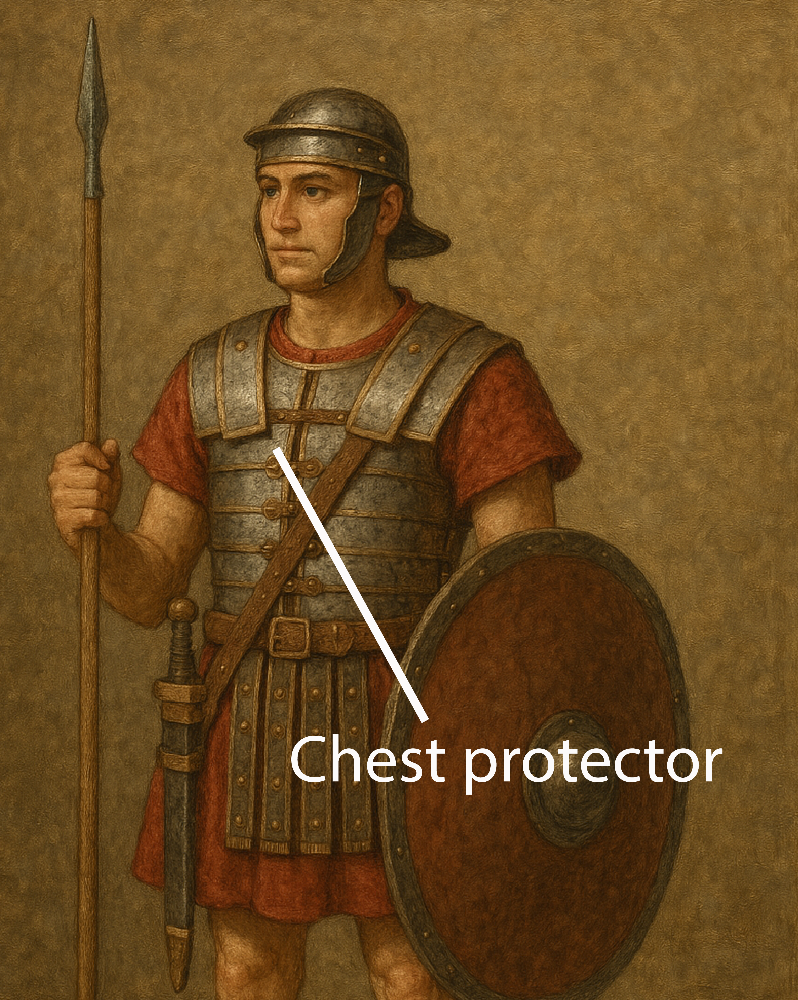

# Human-made Things in the Bible

## License Information

Human-made Things in the Bible © United Bible Societies, 2025. Adapted from: <cite>The Works of Their Hands: Man-made Things in the Bible</cite>, by Ray Pritz © 2009 United Bible Societies. This work is licensed under Creative Commons Attribution-ShareAlike 4.0 International (<a href="https://creativecommons.org/licenses/by-sa/4.0/">https://creativecommons.org/licenses/by-sa/4.0/</a>).

--------------------------------

## Breastplate, chest protector (id: REALIA:2.12)

2\.12 Breastplate, chest protector
==================================

References:
-----------

Hebrew שִׁרְיוֹן (shiryan)

[1KI 22:34](https://ref.ly/1Kgs22:34), [2CH 18:33](https://ref.ly/2Chr18:33), [ISA 59:17](https://ref.ly/Isa59:17)

Greek θώραξ (thorax)

[EPH 6:14](https://ref.ly/Eph6:14), [1TH 5:8](https://ref.ly/1Thess5:8), [REV 9:9](https://ref.ly/Rev9:9), [REV 9:9](https://ref.ly/Rev9:9), [REV 9:17](https://ref.ly/Rev9:17), [WIS 5:18](https://ref.ly/Wis5:18), [SIR 43:20](https://ref.ly/Sir43:20), [1MA 3:3](https://ref.ly/1Macc3:3), [1MA 6:2](https://ref.ly/1Macc6:2), [1MA 6:43](https://ref.ly/1Macc6:43)

Description and usage:
----------------------

*Chest protector (Image generated by ChatGPT using OpenAI technology)*

The breastplate was a piece of armor covering the chest (and sometimes the back) to protect it against blows and arrows. It was normally made of metal or thick leather reinforced with metal. It covered the chest from the neck to the waist and was held on by straps around the back.

---

Translation:
------------

The use of the word “breastplate” in [EPH 6:14](https://ref.ly/Eph6:14) and [1TH 5:8](https://ref.ly/1Thess5:8) is figurative to indicate the protective values of certain Christian virtues (compare [WIS 5:18](https://ref.ly/Wis5:18)). So it is possible to translate the figurative meaning as follows: “We must protect ourselves, like with armor, with faith and love” ([1TH 5:8](https://ref.ly/1Thess5:8) b in SPCL (Spanish Common Language Version (Dios Habla Hoy))) and “the protection of right living on your chest” ([EPH 6:14](https://ref.ly/Eph6:14) c in NCV (New Century Version)).

In [REV 9:9](https://ref.ly/Rev9:9) the breastplates are worn by the horses. Warhorses sometimes wore breast shields to protect them from the enemy’s spears and swords. For the first half of this verse, RSV (Revised Standard Version (1952)) has “they had scales like iron breastplates.” NJB (New Jerusalem Bible (1985)) is better with “They had body\-armour like iron breastplates.” SPCL (Spanish Common Language Version (Dios Habla Hoy)) translates “Their bodies were covered with a kind of iron armor.” Another possible rendering is “Their bodies were covered with what looked like pieces of metal used to protect the chests of people.”

* **Associated Passages:** 1 Kings 22:34; 2 Chronicles 18:33; Isaiah 59:17; Ephesians 6:14; 1 Thessalonians 5:8; Revelation 9:9; Revelation 9:17; Wisdom of Solomon 5:18; Sirach 43:20; 1 Maccabees 3:3; 1 Maccabees 6:2; 1 Maccabees 6:43

