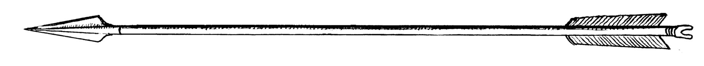

# Human-made Things in the Bible

## License Information

Human-made Things in the Bible © United Bible Societies, 2025. Adapted from: <cite>The Works of Their Hands: Man-made Things in the Bible</cite>, by Ray Pritz © 2009 United Bible Societies. This work is licensed under Creative Commons Attribution-ShareAlike 4.0 International (<a href="https://creativecommons.org/licenses/by-sa/4.0/">https://creativecommons.org/licenses/by-sa/4.0/</a>).

--------------------------------

## Arrow (id: REALIA:2.14.2)

2\.14\.2 Arrow
==============

References:
-----------

Hebrew בֵּן, אַשְׁפָּה (ben ’ashpah)

[LAM 3:13](https://ref.ly/Lam3:13)

Hebrew בֵּן, קֶשֶׁת (ben qesheth)

[JOB 41:20](https://ref.ly/Job41:20)

Hebrew חֵץ, חֵץִי (chets, chetsi)

[GEN 49:23](https://ref.ly/Gen49:23), [NUM 24:8](https://ref.ly/Num24:8), [DEU 32:23](https://ref.ly/Deut32:23), [DEU 32:42](https://ref.ly/Deut32:42), [1SA 17:7](https://ref.ly/1Sam17:7), [1SA 20:20](https://ref.ly/1Sam20:20), [1SA 20:21](https://ref.ly/1Sam20:21), [1SA 20:21](https://ref.ly/1Sam20:21), [1SA 20:22](https://ref.ly/1Sam20:22), [1SA 20:36](https://ref.ly/1Sam20:36), [1SA 20:36](https://ref.ly/1Sam20:36), [1SA 20:37](https://ref.ly/1Sam20:37), [1SA 20:37](https://ref.ly/1Sam20:37), [1SA 20:38](https://ref.ly/1Sam20:38), [2SA 22:15](https://ref.ly/2Sam22:15), [2KI 9:24](https://ref.ly/2Kgs9:24), [2KI 13:15](https://ref.ly/2Kgs13:15), [2KI 13:15](https://ref.ly/2Kgs13:15), [2KI 13:17](https://ref.ly/2Kgs13:17), [2KI 13:17](https://ref.ly/2Kgs13:17), [2KI 13:18](https://ref.ly/2Kgs13:18), [2KI 19:32](https://ref.ly/2Kgs19:32), [1CH 12:2](https://ref.ly/1Chr12:2), [2CH 26:15](https://ref.ly/2Chr26:15), [JOB 6:4](https://ref.ly/Job6:4), [JOB 34:6](https://ref.ly/Job34:6), [PSA 7:14](https://ref.ly/Ps7:14), [PSA 11:2](https://ref.ly/Ps11:2), [PSA 18:15](https://ref.ly/Ps18:15), [PSA 38:3](https://ref.ly/Ps38:3), [PSA 45:6](https://ref.ly/Ps45:6), [PSA 57:5](https://ref.ly/Ps57:5), [PSA 58:8](https://ref.ly/Ps58:8), [PSA 58:8](https://ref.ly/Ps58:8), [PSA 64:4](https://ref.ly/Ps64:4), [PSA 64:8](https://ref.ly/Ps64:8), [PSA 77:18](https://ref.ly/Ps77:18), [PSA 91:5](https://ref.ly/Ps91:5), [PSA 120:4](https://ref.ly/Ps120:4), [PSA 127:4](https://ref.ly/Ps127:4), [PSA 144:6](https://ref.ly/Ps144:6), [PRO 7:23](https://ref.ly/Prov7:23), [PRO 25:18](https://ref.ly/Prov25:18), [PRO 26:18](https://ref.ly/Prov26:18), [ISA 5:28](https://ref.ly/Isa5:28), [ISA 7:24](https://ref.ly/Isa7:24), [ISA 37:33](https://ref.ly/Isa37:33), [ISA 49:2](https://ref.ly/Isa49:2), [JER 9:7](https://ref.ly/Jer9:7), [JER 50:9](https://ref.ly/Jer50:9), [JER 50:14](https://ref.ly/Jer50:14), [JER 51:11](https://ref.ly/Jer51:11), [LAM 3:12](https://ref.ly/Lam3:12), [EZK 5:16](https://ref.ly/Ezek5:16), [EZK 21:26](https://ref.ly/Ezek21:26), [EZK 39:3](https://ref.ly/Ezek39:3), [EZK 39:9](https://ref.ly/Ezek39:9), [HAB 3:11](https://ref.ly/Hab3:11), [ZEC 9:14](https://ref.ly/Zech9:14)

Hebrew מַטֶּה (mateh)

[HAB 3:9](https://ref.ly/Hab3:9), [HAB 3:14](https://ref.ly/Hab3:14)

Hebrew רֶשֶׁף (reshef)

[PSA 76:4](https://ref.ly/Ps76:4)

Greek βέλος (belos)

[EPH 6:16](https://ref.ly/Eph6:16), [WIS 5:12](https://ref.ly/Wis5:12), [SIR 19:12](https://ref.ly/Sir19:12), [SIR 26:12](https://ref.ly/Sir26:12), [1MA 6:51](https://ref.ly/1Macc6:51), [2MA 5:3](https://ref.ly/2Macc5:3), [2MA 12:27](https://ref.ly/2Macc12:27), [ODA 2:23](https://ref.ly/Odes2:23), [ODA 2:42](https://ref.ly/Odes2:42)

Greek σχίζα (schiza)

[1MA 10:80](https://ref.ly/1Macc10:80)

Greek τόξευμα (toxeuma)

[2MA 10:30](https://ref.ly/2Macc10:30)

Latin sagitta

[2ES 16:7](https://ref.ly/2Esd16:7), [2ES 16:13](https://ref.ly/2Esd16:13), [2ES 16:16](https://ref.ly/2Esd16:16)

Description:
------------

*Arrow (© Deutsche Bibelgesellschaft, Stuttgart by United Bible Societies)*

The arrow was a thin, straight rod made of reed or wood, about 50–70 centimeters (20–28 inches) in length. To one end of the arrow was attached a sharpened point, either of stone or metal. In the other end a notch was carved to fit on the string of the bow. The notched end was sometimes fitted with two or more feathers that helped stabilize the arrow in flight.

---

Usage:
------

See [2\.14\.1 Bow\<REALIA:2\.14\.1\>](#).

---

Translation:
------------

The Hebrew word *reshef* normally refers to something fiery (for example, spark or lightning bolt; see [JOB 5:7](https://ref.ly/Job5:7); [PSA 78:48](https://ref.ly/Ps78:48); [SNG 8:6](https://ref.ly/Song8:6)). In [PSA 76:4](https://ref.ly/Ps76:4) it is parallel with the word for “bow” and probably indicates some kind of burning arrow.

[LAM 3:13](https://ref.ly/Lam3:13): See the comments at [2\.14\.3 Quiver\<REALIA:2\.14\.3\>](#).

The Hebrew word *mateh* usually refers to a rod, club, or shepherd’s staff (see [1\.2\.4 Rod, club, shepherd’s staff\<REALIA:1\.2\.4\>](#)), but in [HAB 3:9](https://ref.ly/Hab3:9) many translations render it “arrows” (RSV (Revised Standard Version (1952)), GNT (Good News Translation (1992)); supported by HOTTP (Hebrew Old Testament Text Project (UBS)) and *A Handbook on The Books of Nahum, Habakkuk, and Zephaniah*). This verse is very unclear in Hebrew.

* **Associated Passages:** Lamentations 3:13; Job 41:20; Genesis 49:23; Numbers 24:8; Deuteronomy 32:23; Deuteronomy 32:42; 1 Samuel 17:7; 1 Samuel 20:20; 1 Samuel 20:21; 1 Samuel 20:22; 1 Samuel 20:36; 1 Samuel 20:37; 1 Samuel 20:38; 2 Samuel 22:15; 2 Kings 9:24; 2 Kings 13:15; 2 Kings 13:17; 2 Kings 13:18; 2 Kings 19:32; 1 Chronicles 12:2; 2 Chronicles 26:15; Job 6:4; Job 34:6; Psalms 7:14; Psalms 11:2; Psalms 18:15; Psalms 38:3; Psalms 45:6; Psalms 57:5; Psalms 58:8; Psalms 64:4; Psalms 64:8; Psalms 77:18; Psalms 91:5; Psalms 120:4; Psalms 127:4; Psalms 144:6; Proverbs 7:23; Proverbs 25:18; Proverbs 26:18; Isaiah 5:28; Isaiah 7:24; Isaiah 37:33; Isaiah 49:2; Jeremiah 9:7; Jeremiah 50:9; Jeremiah 50:14; Jeremiah 51:11; Lamentations 3:12; Ezekiel 5:16; Ezekiel 21:26; Ezekiel 39:3; Ezekiel 39:9; Habakkuk 3:11; Zechariah 9:14; Habakkuk 3:9; Habakkuk 3:14; Psalms 76:4; Ephesians 6:16; Wisdom of Solomon 5:12; Sirach 19:12; Sirach 26:12; 1 Maccabees 6:51; 2 Maccabees 5:3; 2 Maccabees 12:27; Odae/Odes 2:23; Odae/Odes 2:42; 1 Maccabees 10:80; 2 Maccabees 10:30; 2 Esdras (Latin) 16:7; 2 Esdras (Latin) 16:13; 2 Esdras (Latin) 16:16; Job 5:7; Psalms 78:48; Song of Songs 8:6

* **Associated ACAI Concepts:** Arrow (ID: `realia:Arrow`); Arrow (ID: `keyterm:Arrow`)
