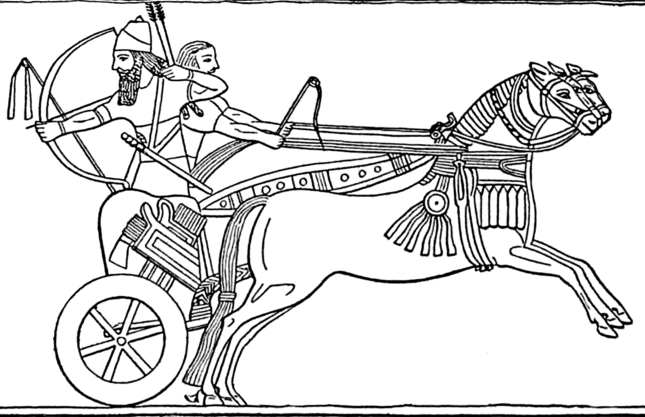
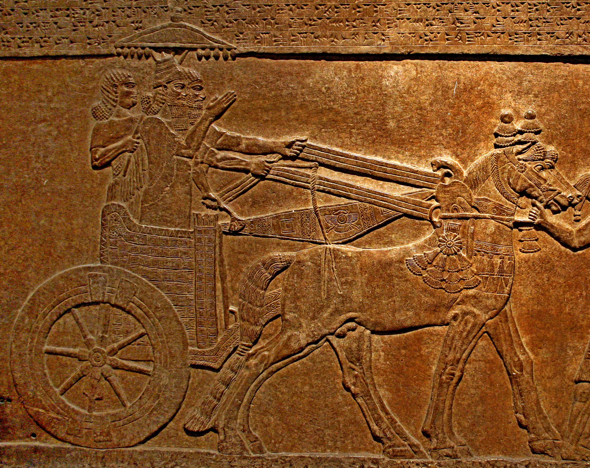
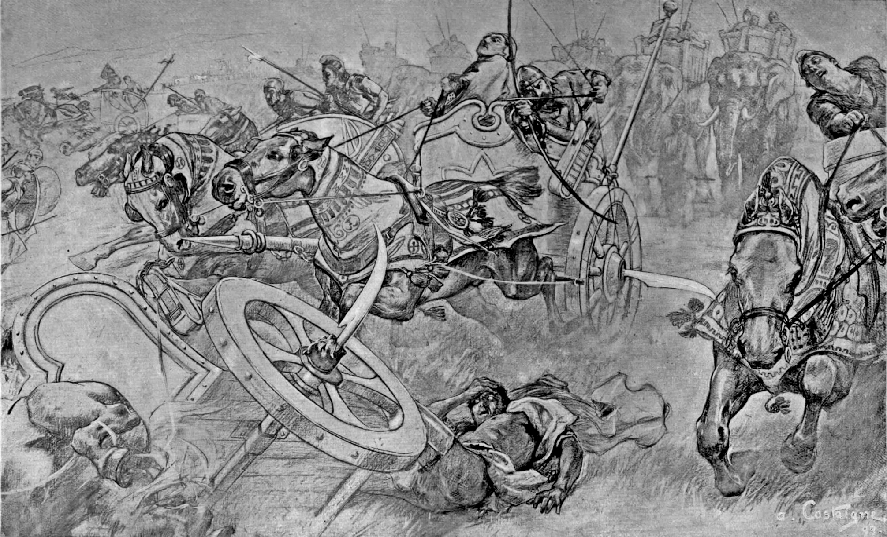

# Human-made Things in the Bible

## License Information

Human-made Things in the Bible © United Bible Societies, 2025. Adapted from: <cite>The Works of Their Hands: Man-made Things in the Bible</cite>, by Ray Pritz © 2009 United Bible Societies. This work is licensed under Creative Commons Attribution-ShareAlike 4.0 International (<a href="https://creativecommons.org/licenses/by-sa/4.0/">https://creativecommons.org/licenses/by-sa/4.0/</a>).

--------------------------------

## Chariot (id: REALIA:2.15)

2\.15 Chariot
=============

References:
-----------

Hebrew מֶרְכָּב, מֶרְכָּבָה (merkav, merkavah)

GEN 41:43, GEN 46:29, EXO 14:25, EXO 15:4, JOS 11:6, JOS 11:9, JDG 4:15, JDG 5:28, 1SA 8:11, 1SA 8:11, 2SA 15:1, 1KI 5:6, 1KI 7:33, 1KI 10:29, 1KI 12:18, 1KI 20:33, 1KI 22:35, 2KI 5:21, 2KI 5:26, 2KI 9:27, 2KI 10:15, 2KI 23:11, 1CH 28:18, 2CH 1:17, 2CH 9:25, 2CH 10:18, 2CH 14:8, 2CH 18:34, 2CH 35:24, SNG 6:12, ISA 2:7, ISA 22:18, ISA 66:15, JER 4:13, JOL 2:5, MIC 1:13, MIC 5:9, NAM 3:2, HAB 3:8, HAG 2:22, ZEC 6:1, ZEC 6:2, ZEC 6:2, ZEC 6:3, ZEC 6:3

Hebrew רַכָּב, רכב (rakav (verb or noun))

1KI 22:34, 2CH 18:33, JER 51:21, JER 51:21

Hebrew רֶכֶב (rekev)

GEN 50:9, EXO 14:6, EXO 14:7, EXO 14:7, EXO 14:9, EXO 14:17, EXO 14:18, EXO 14:23, EXO 14:26, EXO 14:28, EXO 15:19, DEU 11:4, DEU 20:1, DEU 24:6, JOS 11:4, JOS 17:16, JOS 17:18, JOS 24:6, JDG 1:19, JDG 4:3, JDG 4:7, JDG 4:13, JDG 4:13, JDG 4:15, JDG 4:16, JDG 5:28, JDG 9:53, 1SA 8:12, 1SA 13:5, 2SA 1:6, 2SA 8:4, 2SA 8:4, 2SA 10:18, 2SA 11:21, 1KI 1:5, 1KI 9:19, 1KI 9:22, 1KI 10:26, 1KI 10:26, 1KI 10:26, 1KI 16:9, 1KI 20:1, 1KI 20:21, 1KI 20:25, 1KI 20:25, 1KI 22:31, 1KI 22:32, 1KI 22:33, 1KI 22:35, 1KI 22:38, 2KI 2:11, 2KI 2:12, 2KI 5:9, 2KI 6:14, 2KI 6:15, 2KI 6:17, 2KI 7:6, 2KI 7:14, 2KI 8:21, 2KI 8:21, 2KI 9:21, 2KI 9:21, 2KI 9:24, 2KI 10:2, 2KI 10:16, 2KI 13:7, 2KI 13:14, 2KI 18:24, 2KI 19:23, 2KI 19:23, 1CH 18:4, 1CH 18:4, 1CH 18:4, 1CH 19:6, 1CH 19:7, 1CH 19:18, 2CH 1:14, 2CH 1:14, 2CH 1:14, 2CH 8:6, 2CH 8:9, 2CH 9:25, 2CH 12:3, 2CH 16:8, 2CH 18:30, 2CH 18:31, 2CH 18:32, 2CH 21:9, 2CH 21:9, 2CH 35:24, PSA 20:8, PSA 68:18, PSA 76:7, SNG 1:9, ISA 21:7, ISA 21:7, ISA 21:7, ISA 21:9, ISA 22:6, ISA 22:7, ISA 31:1, ISA 36:9, ISA 37:24, ISA 43:17, ISA 66:20, JER 17:25, JER 22:4, JER 46:9, JER 47:3, JER 50:37, JER 51:21, EZK 23:24, EZK 26:7, EZK 26:10, EZK 39:20, DAN 11:40, NAM 2:4, NAM 2:5, NAM 2:14, ZEC 9:10

Hebrew רְכוּב (rkuv)

PSA 104:3

Greek ἅρμα (harma)

ACT 8:29, ACT 8:29, ACT 8:38, REV 9:9, JDT 1:13, JDT 2:19, JDT 2:22, JDT 7:20, SIR 48:9, SIR 49:8, 1MA 1:17, 1MA 8:6, 2MA 9:7, 2MA 13:2, 3MA 2:7, 3MA 6:4, 1ES 1:26, 1ES 1:29, 1ES 3:6, ODA 1:4, ODA 1:19, DAG 11:40

Greek ἁρματηλάτης (harmatēlatēs)

2MA 9:4

Latin currus

2ES 15:29

Description:
------------

*An Assyrian archer shoots from a war chariot (William C. Morey (Outlines of Greek History, pg. 40\), Public domain, via Wikimedia Commons)*

The chariot was an open vehicle with two or four wheels, used in war or for traveling. War chariots were at first heavy, made of wood, with solid wooden wheels. In later biblical times, they were constructed with a light wooden frame with a standing platform and two wheels set toward the back of the frame. The wheels were a rim with four or six spokes and were set wide apart (about twice the width of the chariot frame) to give extra mobility. The wooden frame was sometimes covered with leather. A pole extended from the center of the front of the frame, and to its end were yoked animals to pull it. It was about 2\.5 meters (8 feet) long.

---

Usage:
------

*The Assyrian king Tiglath\-Pileser III rides in his chariot (ca. 730–727 BCE; palace relief, British Museum) (David Castor (dcastor), Public domain, via Wikimedia Commons)*

The chariot was harnessed to and drawn by two or four horses. It was manned by a driver and usually another soldier. From its platform the soldier could shoot arrows, throw projectiles, or engage in sword combat. It provided speed of movement on the battlefield but was limited to relatively flat and unobstructed terrain. In combat highest priority was given to mobility and speed of movement, so chariots were made of the lightest materials possible, although several references speak of iron chariots. Note that all these references are to early times (JOS 17:16, JOS 17:18; JDG 1:19; JDG 4:3, JDG 4:13). While most translations have simply “iron chariots,” it is possible that these were wooden chariots overlaid with iron (REB (Revised English Bible (1989)) “iron\-clad chariots”). However, it is more likely that the wood was reinforced at certain places with iron and that the wheels had iron rims, making them much less liable to break on rough ground.

Chariots were also used as a form of transportation, primarily by wealthier people.

---

Translation:
------------

In languages that have no technical term for “chariot,” it is possible to speak of a war chariot as “war carriage,” “horse\-drawn war cart,” “war cart pulled by horses,” or “horse\-drawn cart for fighting.” A traveling chariot, such as the one mentioned in ACT 8:29, may be rendered “traveling carriage” or “horse\-drawn vehicle.”

In SNG 3:10 the Hebrew word *merkav* indicates the fancy “bench” or “seat” on which the honored chariot rider sat. For the same word at LEV 15:9, see [8\.4 Saddle, saddle cloth\<REALIA:8\.4\>](#).

* **Associated Passages:** Genesis 41:43; Genesis 46:29; Exodus 14:25; Exodus 15:4; Joshua 11:6; Joshua 11:9; Judges 4:15; Judges 5:28; 1 Samuel 8:11; 2 Samuel 15:1; 1 Kings 5:6; 1 Kings 7:33; 1 Kings 10:29; 1 Kings 12:18; 1 Kings 20:33; 1 Kings 22:35; 2 Kings 5:21; 2 Kings 5:26; 2 Kings 9:27; 2 Kings 10:15; 2 Kings 23:11; 1 Chronicles 28:18; 2 Chronicles 1:17; 2 Chronicles 9:25; 2 Chronicles 10:18; 2 Chronicles 14:8; 2 Chronicles 18:34; 2 Chronicles 35:24; Song of Songs 6:12; Isaiah 2:7; Isaiah 22:18; Isaiah 66:15; Jeremiah 4:13; Joel 2:5; Micah 1:13; Micah 5:9; Nahum 3:2; Habakkuk 3:8; Haggai 2:22; Zechariah 6:1; Zechariah 6:2; Zechariah 6:3; 1 Kings 22:34; 2 Chronicles 18:33; Jeremiah 51:21; Genesis 50:9; Exodus 14:6; Exodus 14:7; Exodus 14:9; Exodus 14:17; Exodus 14:18; Exodus 14:23; Exodus 14:26; Exodus 14:28; Exodus 15:19; Deuteronomy 11:4; Deuteronomy 20:1; Deuteronomy 24:6; Joshua 11:4; Joshua 17:16; Joshua 17:18; Joshua 24:6; Judges 1:19; Judges 4:3; Judges 4:7; Judges 4:13; Judges 4:16; Judges 9:53; 1 Samuel 8:12; 1 Samuel 13:5; 2 Samuel 1:6; 2 Samuel 8:4; 2 Samuel 10:18; 2 Samuel 11:21; 1 Kings 1:5; 1 Kings 9:19; 1 Kings 9:22; 1 Kings 10:26; 1 Kings 16:9; 1 Kings 20:1; 1 Kings 20:21; 1 Kings 20:25; 1 Kings 22:31; 1 Kings 22:32; 1 Kings 22:33; 1 Kings 22:38; 2 Kings 2:11; 2 Kings 2:12; 2 Kings 5:9; 2 Kings 6:14; 2 Kings 6:15; 2 Kings 6:17; 2 Kings 7:6; 2 Kings 7:14; 2 Kings 8:21; 2 Kings 9:21; 2 Kings 9:24; 2 Kings 10:2; 2 Kings 10:16; 2 Kings 13:7; 2 Kings 13:14; 2 Kings 18:24; 2 Kings 19:23; 1 Chronicles 18:4; 1 Chronicles 19:6; 1 Chronicles 19:7; 1 Chronicles 19:18; 2 Chronicles 1:14; 2 Chronicles 8:6; 2 Chronicles 8:9; 2 Chronicles 12:3; 2 Chronicles 16:8; 2 Chronicles 18:30; 2 Chronicles 18:31; 2 Chronicles 18:32; 2 Chronicles 21:9; Psalms 20:8; Psalms 68:18; Psalms 76:7; Song of Songs 1:9; Isaiah 21:7; Isaiah 21:9; Isaiah 22:6; Isaiah 22:7; Isaiah 31:1; Isaiah 36:9; Isaiah 37:24; Isaiah 43:17; Isaiah 66:20; Jeremiah 17:25; Jeremiah 22:4; Jeremiah 46:9; Jeremiah 47:3; Jeremiah 50:37; Ezekiel 23:24; Ezekiel 26:7; Ezekiel 26:10; Ezekiel 39:20; Daniel 11:40; Nahum 2:4; Nahum 2:5; Nahum 2:14; Zechariah 9:10; Psalms 104:3; Acts 8:29; Acts 8:38; Revelation 9:9; Judith 1:13; Judith 2:19; Judith 2:22; Judith 7:20; Sirach 48:9; Sirach 49:8; 1 Maccabees 1:17; 1 Maccabees 8:6; 2 Maccabees 9:7; 2 Maccabees 13:2; 3 Maccabees 2:7; 3 Maccabees 6:4; 1 Esdras (Greek) 1:26; 1 Esdras (Greek) 1:29; 1 Esdras (Greek) 3:6; Odae/Odes 1:4; Odae/Odes 1:19; Daniel Greek 11:40; 2 Maccabees 9:4; 2 Esdras (Latin) 15:29; Song of Songs 3:10; Leviticus 15:9

* **Associated ACAI Concepts:** Chariot (ID: `realia:Chariot`)

## Scythe (chariot weapon) (id: REALIA:2.15.1)

2\.15\.1 Scythe (chariot weapon)
================================

Reference:
----------

Greek δρεπανηφόρος (drepanēforos)

2MA 13:2

Description and usage:
----------------------

*Scythe chariots with blades mounted on the axle of the wheels (André Castaigne (Public domain), Public domain, via Wikimedia Commons)*

The scythe was a sharp, curved blade that was attached to either side of a war chariot. It prevented enemy soldiers from running alongside the chariot to attack. It also could act as an offensive weapon; as the chariot drove swiftly through the enemy, the blade would cut at their legs.

---

Translation:
------------

In very few languages will the idea of a weapon attached to a chariot wheel be clear. So a literal translation such as “chariots armed with scythes” (NRSV (New Revised Standard Version (1989))) at the end of 2MA 13:2 will probably not communicate sufficient information to the reader. GNT (Good News Translation (1992)) expands this to “chariots with sharp blades attached to their wheels.”

* **Associated Passages:** 2 Maccabees 13:2

