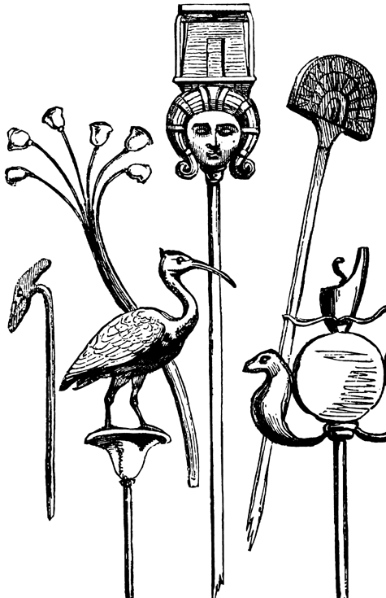

# Human-made Things in the Bible

## License Information

Human-made Things in the Bible © United Bible Societies, 2025. Adapted from: <cite>The Works of Their Hands: Man-made Things in the Bible</cite>, by Ray Pritz © 2009 United Bible Societies. This work is licensed under Creative Commons Attribution-ShareAlike 4.0 International (<a href="https://creativecommons.org/licenses/by-sa/4.0/">https://creativecommons.org/licenses/by-sa/4.0/</a>).

--------------------------------

## Standard, ensign, banner (id: REALIA:2.17)

2\.17 Standard, ensign, banner
==============================

References:
-----------

Hebrew אוֹת (’oth)

[NUM 2:2](https://ref.ly/Num2:2), [PSA 74:4](https://ref.ly/Ps74:4), [PSA 74:4](https://ref.ly/Ps74:4)

Hebrew דגל (dagal (verb))

[PSA 20:6](https://ref.ly/Ps20:6), [SNG 6:4](https://ref.ly/Song6:4), [SNG 6:10](https://ref.ly/Song6:10)

Hebrew דֶּגֶל (degel)

[NUM 1:52](https://ref.ly/Num1:52), [NUM 2:2](https://ref.ly/Num2:2), [NUM 2:3](https://ref.ly/Num2:3), [NUM 2:10](https://ref.ly/Num2:10), [NUM 2:17](https://ref.ly/Num2:17), [NUM 2:18](https://ref.ly/Num2:18), [NUM 2:25](https://ref.ly/Num2:25), [NUM 2:31](https://ref.ly/Num2:31), [NUM 2:34](https://ref.ly/Num2:34), [NUM 10:14](https://ref.ly/Num10:14), [NUM 10:18](https://ref.ly/Num10:18), [NUM 10:22](https://ref.ly/Num10:22), [NUM 10:25](https://ref.ly/Num10:25), [SNG 2:4](https://ref.ly/Song2:4)

Hebrew נֵס (nes)

[EXO 17:15](https://ref.ly/Exod17:15), [NUM 21:8](https://ref.ly/Num21:8), [NUM 21:9](https://ref.ly/Num21:9), [PSA 60:6](https://ref.ly/Ps60:6), [ISA 5:26](https://ref.ly/Isa5:26), [ISA 11:10](https://ref.ly/Isa11:10), [ISA 11:12](https://ref.ly/Isa11:12), [ISA 13:2](https://ref.ly/Isa13:2), [ISA 18:3](https://ref.ly/Isa18:3), [ISA 30:17](https://ref.ly/Isa30:17), [ISA 31:9](https://ref.ly/Isa31:9), [ISA 49:22](https://ref.ly/Isa49:22), [ISA 62:10](https://ref.ly/Isa62:10), [JER 4:6](https://ref.ly/Jer4:6), [JER 4:21](https://ref.ly/Jer4:21), [JER 50:2](https://ref.ly/Jer50:2), [JER 51:12](https://ref.ly/Jer51:12), [JER 51:27](https://ref.ly/Jer51:27), [EZK 27:7](https://ref.ly/Ezek27:7)

Hebrew נסס (nasas (verb))

[ZEC 9:16](https://ref.ly/Zech9:16)

Hebrew תֹּרֶן (toren)

[ISA 30:17](https://ref.ly/Isa30:17)

Description and usage:
----------------------

*Various examples of standards (Cyclopedia of Biblical, Theological and Ecclesiastical Literature, Harper 1888, Public domain)*

The standard was a distinctive device used to identify a particular group. It could be a flag or a board attached to a stick. In many cases it was a metal device or image (such as an eagle or the head of a lion) that was fitted over the end of a pole in much the same way that a spearhead was attached to a spear.

---

Translation:
------------

*Reconstruction of the Titus Arch frieze (Rome), showing a menorah and standards from the temple being carried off by the Roman victors (71 C.E.) (© Original file by Steerpike (File:Arch of Titus Menorah.png), CC BY 3\.0, via Wikimedia Commons)*

The Hebrew words listed above occur in both military and religious contexts. In a time of war the standard was carried with the army into combat and served as a rallying point for the soldiers. If a victory was won or a strategic position was captured, the standard might be set up in that place as a sign of victory. So in a language where flags or military standards are unfamiliar, it is possible to say the following in [PSA 74:4](https://ref.ly/Ps74:4): “they have placed their signs of victory here” or “they have put up the signs that show they have defeated us.”

There is a textual problem in [EXO 17:16](https://ref.ly/Exod17:16). While the Hebrew text reads *kes*, meaning “seat” or “throne,” some translations accept an emended text that reads *nes*, which appears also in the previous verse; for example, for the first half of this verse GNT (Good News Translation (1992)) has “He said, ‘Hold high the banner of the LORD!’ ” Other translations prefer to translate the word *kes* without emendation; for example, NIV (New International Version (1984)) has “He said, ‘For hands were lifted up to the throne of the LORD.’ ”

[ZEC 9:16](https://ref.ly/Zech9:16): The precise meaning of the Hebrew verb form *mithnossoth* is doubtful. If it is related to the word *nes*, then the literal meaning is “lifted up as an ensign.” However, very few translations (KJV (King James Version (1611)), NAB (New American Bible (1970)), Vulgate) express this meaning. Most translators and commentators take the word to be related to a different Hebrew root meaning “to shine” or “to sparkle.”

* **Associated Passages:** Numbers 2:2; Psalms 74:4; Psalms 20:6; Song of Songs 6:4; Song of Songs 6:10; Numbers 1:52; Numbers 2:3; Numbers 2:10; Numbers 2:17; Numbers 2:18; Numbers 2:25; Numbers 2:31; Numbers 2:34; Numbers 10:14; Numbers 10:18; Numbers 10:22; Numbers 10:25; Song of Songs 2:4; Exodus 17:15; Numbers 21:8; Numbers 21:9; Psalms 60:6; Isaiah 5:26; Isaiah 11:10; Isaiah 11:12; Isaiah 13:2; Isaiah 18:3; Isaiah 30:17; Isaiah 31:9; Isaiah 49:22; Isaiah 62:10; Jeremiah 4:6; Jeremiah 4:21; Jeremiah 50:2; Jeremiah 51:12; Jeremiah 51:27; Ezekiel 27:7; Zechariah 9:16; Exodus 17:16

