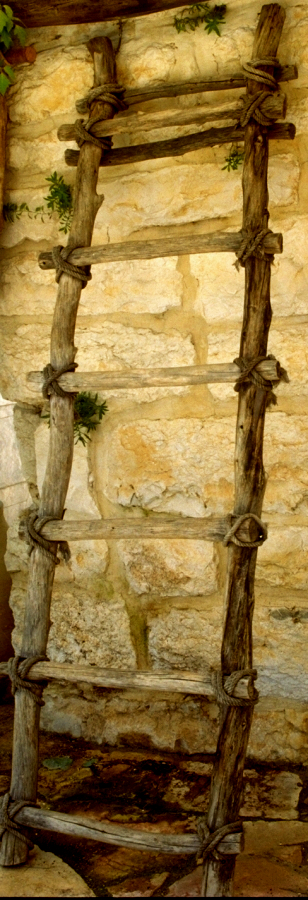

# Human-made Things in the Bible

## License Information

Human-made Things in the Bible © United Bible Societies, 2025. Adapted from: <cite>The Works of Their Hands: Man-made Things in the Bible</cite>, by Ray Pritz © 2009 United Bible Societies. This work is licensed under Creative Commons Attribution-ShareAlike 4.0 International (<a href="https://creativecommons.org/licenses/by-sa/4.0/">https://creativecommons.org/licenses/by-sa/4.0/</a>).

--------------------------------

## Ladder (id: REALIA:2.19.4)

2\.19\.4 Ladder
===============

Reference:
----------

Greek κλῖμαξ (klimax)

[1MA 5:30](https://ref.ly/1Macc5:30)

Description and usage:
----------------------

*Replica of an ancient wooden ladder, with ropes securing the steps (© Ray Pritz by United Bible Societies)*

The ladder was a device by which an attacking army could scale the walls or defenses of a city. It was constructed of wood and consisted of two long poles laid parallel and then joined together by a series of crosspieces that were tied to the poles with ropes. It was carried by the soldiers (or by prisoners captured from the enemy) and placed against the wall of the city so that they could climb it and gain entrance to the city.

---

Translation:
------------

It may be necessary to say in translation that the “ladders” in [1MA 5:30](https://ref.ly/1Macc5:30) were relatively “long” or “high.” While the text itself gives an indication of the purpose of the ladders (RSV (Revised Standard Version (1952)) “… carrying ladders and engines of war to capture the stronghold, and attacking the Jews within”), some translators may feel the need to expand it a bit more regarding the use of the ladders: “ladders to climb the walls.” See also the discussion at [3\.13\.3 City fortifications\<REALIA:3\.13\.3\>](#).

* **Associated Passages:** 1 Maccabees 5:30

