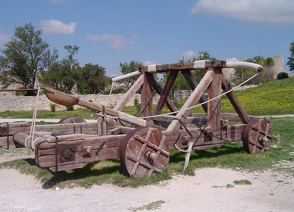
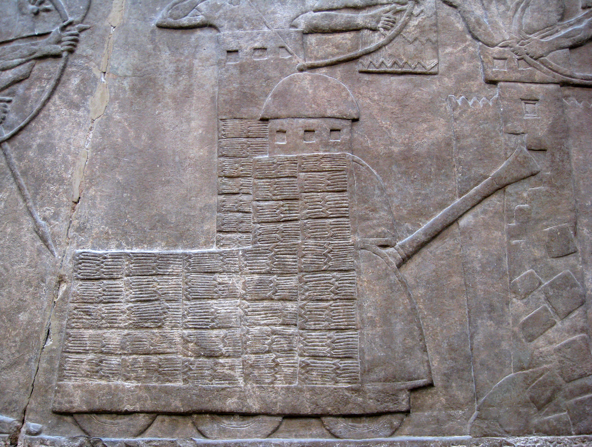

# Human-made Things in the Bible

## License Information

Human-made Things in the Bible © United Bible Societies, 2025. Adapted from: <cite>The Works of Their Hands: Man-made Things in the Bible</cite>, by Ray Pritz © 2009 United Bible Societies. This work is licensed under Creative Commons Attribution-ShareAlike 4.0 International (<a href="https://creativecommons.org/licenses/by-sa/4.0/">https://creativecommons.org/licenses/by-sa/4.0/</a>).

--------------------------------

## Siege instruments (id: REALIA:2.19)

2\.19 Siege instruments
=======================

*A relief showing the weapons used in attacking and defending a city (ChrisO, Public domain, via Wikimedia Commons)*

Many ancient cities were surrounded by a high wall for protection. In wartime an attacking army had to find a way to get past the wall and into the city. Five methods were available to the attacker to conquer a fortified city, all of which are reflected in the Bible: 1\) penetration over the top of the fortifications; 2\) penetration through the fortifications; 3\) penetration below the fortifications; 4\) penetration by ruse or trickery ([JOS 8:0](https://ref.ly/Josh8:0)); and 5\) siege. Penetration from above was usually done by scaling the walls using ladders ([JOL 2:7](https://ref.ly/Joel2:7); [JOL 2:8](https://ref.ly/Joel2:8); [JOL 2:9](https://ref.ly/Joel2:9)). Going through the wall could be done by chopping it with hammers, axes, and other tools, by breaking it down using a catapult, or by breaking or burning the gates ([JER 51:58](https://ref.ly/Jer51:58)). Frequently, however, this was accomplished with a battering ram ([EZK 21:22](https://ref.ly/Ezek21:22)). The attack on the wall was often aided by the building of a siege tower, which put the attackers on a level with the defenders on the wall, making it easier to attack them with arrows and javelins. Penetration from below usually meant the long process of digging a tunnel under the wall. Sometimes, however, it was possible to use an existing tunnel, such as a shaft connecting the city to its water supply ([2SA 5:8](https://ref.ly/2Sam5:8)).

Defenders of a city were equally ingenious in finding methods to neutralize the efforts of the attacking army. Ladders were pushed over, second walls were built behind the first wall that was about to fall, and large stones or even burning objects could be thrown down on attackers who got close to the wall. In order to protect soldiers working or attacking near the wall, the attacking army would build a large kind of shield that covered the soldiers from above. This device is mentioned by the prophet Nahum: “The attackers rush to the wall and set up the shield for the battering ram” (GNT (Good News Translation (1992)); [NAM 2:6](https://ref.ly/Nah2:6) b).

When an army did not have the equipment to use one of these methods, or when the terrain was too difficult for an attack, the attacking army could just close off all exits from the city and sit tight. This was called a siege. Its objective was to wait until the people inside the city ran out of food or water and were then ready to surrender ([2KI 25:0](https://ref.ly/2Kgs25:0)).

* **Associated Passages:** Joshua 8:0; Joel 2:7; Joel 2:8; Joel 2:9; Jeremiah 51:58; Ezekiel 21:22; 2 Samuel 5:8; Nahum 2:6; 2 Kings 25:0

## Siege wall (id: REALIA:2.19.1)

2\.19\.1 Siege wall
===================

References:
-----------

Hebrew דָּיֵק (dayeq)

[2KI 25:1](https://ref.ly/2Kgs25:1), [JER 52:4](https://ref.ly/Jer52:4), [EZK 4:2](https://ref.ly/Ezek4:2), [EZK 17:17](https://ref.ly/Ezek17:17), [EZK 21:27](https://ref.ly/Ezek21:27), [EZK 26:8](https://ref.ly/Ezek26:8)

Hebrew מָצוֹד (matsod)

[ECC 9:14](https://ref.ly/Eccl9:14)

Hebrew מָצוֹר (matsor)

[DEU 20:20](https://ref.ly/Deut20:20), [EZK 4:2](https://ref.ly/Ezek4:2), [MIC 4:14](https://ref.ly/Mic4:14)

Hebrew סלל (salal (verb))

[JOB 19:12](https://ref.ly/Job19:12)

Greek χάραξ (charax)

[LUK 19:43](https://ref.ly/Luke19:43), [4MA 3:12](https://ref.ly/4Macc3:12)

Description:
------------

The siege wall was a fence of poles or stakes used to fortify entrenchments. Sometimes such a wall was reinforced with, or even made of, earth and stones.

---

Usage:
------

When an army was trying to capture a walled and fortified city, it surrounded the city with an extra wall, which would prevent any of the inhabitants of the city from escaping or launching an attack against the besiegers. Such a wall would also prevent the people in the city from sending for help or from bringing in food and water. After some time the city would be forced to surrender (see [DEU 20:20](https://ref.ly/Deut20:20)).

---

Translation:
------------

The Hebrew words in some of the passages listed above may be rendered “thick walls” or “strong fences.”

* **Associated Passages:** 2 Kings 25:1; Jeremiah 52:4; Ezekiel 4:2; Ezekiel 17:17; Ezekiel 21:27; Ezekiel 26:8; Ecclesiastes 9:14; Deuteronomy 20:20; Micah 4:14; Job 19:12; Luke 19:43; 4 Maccabees 3:12

* **Associated ACAI Concepts:** Siege-Works (ID: `realia:Siege-works`)

## Siege ramp, siege mound (id: REALIA:2.19.2)

2\.19\.2 Siege ramp, siege mound
================================

References:
-----------

Hebrew סֹלְלָה (sollah)

[2SA 20:15](https://ref.ly/2Sam20:15), [2KI 19:32](https://ref.ly/2Kgs19:32), [ISA 37:33](https://ref.ly/Isa37:33), [JER 6:6](https://ref.ly/Jer6:6), [JER 32:24](https://ref.ly/Jer32:24), [JER 33:4](https://ref.ly/Jer33:4), [EZK 4:2](https://ref.ly/Ezek4:2), [EZK 17:17](https://ref.ly/Ezek17:17), [EZK 21:27](https://ref.ly/Ezek21:27), [EZK 26:8](https://ref.ly/Ezek26:8), [DAN 11:15](https://ref.ly/Dan11:15)

Description and usage:
----------------------

*Siege ramp at Masada, built by the Romans to attack the Jewish rebels who had taken refuge there (© Andrew Shiva / Wikipedia, via Wikimedia Commons)*

The siege ramp was a road leading up to the walls of a city that was under attack. Fortified cities were often built on high ground and were difficult to approach. Battering rams (see [2\.19\.7 Battering ram\<REALIA:2\.19\.7\>](#)) were very heavy and hard to move. The attackers would build a ramp or road over which they could bring their battering ram and other siege instruments.

---

Translation:
------------

It is not always clear from the context if the Hebrew word *sollah* refers to a siege wall or to a ramp for an assault. Most translations choose something like “siege mound,” which will not be understood by most readers. In [EZK 4:2](https://ref.ly/Ezek4:2)GNT (Good News Translation (1992)) has “earthworks,” which is more modern English but does not indicate the function of the structure. NIV (New International Version (1984)) comes closer with “a ramp up to it.”

* **Associated Passages:** 2 Samuel 20:15; 2 Kings 19:32; Isaiah 37:33; Jeremiah 6:6; Jeremiah 32:24; Jeremiah 33:4; Ezekiel 4:2; Ezekiel 17:17; Ezekiel 21:27; Ezekiel 26:8; Daniel 11:15

* **Associated ACAI Concepts:** Siege Ramp (ID: `realia:SiegeRamp`)

## Firing platform, siege tower (id: REALIA:2.19.3)

2\.19\.3 Firing platform, siege tower
=====================================

References:
-----------

Hebrew בַּחוּן (bachun)

[ISA 23:13](https://ref.ly/Isa23:13)

Hebrew מֻצָּב (mutsav)

[ISA 29:3](https://ref.ly/Isa29:3)

Hebrew מְצוּרָה (mtsurah)

[ISA 29:3](https://ref.ly/Isa29:3)

Greek βελόστασις (belostasis)

[1MA 6:20](https://ref.ly/1Macc6:20), [1MA 6:51](https://ref.ly/1Macc6:51)

Description:
------------

*Siege tower and battering ram destroying the walls of a fortified city, Assyrian relief (Capillon, Public domain, via Wikimedia Commons)*

The siege tower was a high, wooden structure that enabled a besieging army to fire arrows, stones and other missiles into the besieged city. It was sometimes constructed with wheels so that it could be pushed closer to the walls. Near its top was a platform on which the attacking soldiers could fire their missiles at the defenders on the walls as a cover for their own troops while they undermined the wall or attacked it with a battering ram.

---

Translation:
------------

The Hebrew word *matsor* and its derivative *mtsurah* refer to both the act of besieging a city and the implements that were built for the siege (see [2\.19\.1 Siege wall\<REALIA:2\.19\.1\>](#)). Elsewhere the word can indicate a kind of tower (see [3\.13\.3\.3 Watchtower, tower\<REALIA:3\.13\.3\.3\>](#)). [ISA 29:3](https://ref.ly/Isa29:3) says literally “I will raise towers against you.” The “towers” in this context are siege towers. This line may be rendered “I will build battle towers from which to attack you.” Some translators may prefer a more general rendering, such as “I will … attack from all sides” (CEV (Contemporary English Version)) or “I will surround you … with devices to attack you” (NCV (New Century Version)).

The Hebrew word *bachun* in [ISA 23:13](https://ref.ly/Isa23:13) is an emendation for *bchin*. Almost all translations take it to be some kind of tower. Most have “siege towers” (RSV (Revised Standard Version (1952)), GNT (Good News Translation (1992)), GECL (German Common Language Version (Gute Nachricht Bibel))). NJPSV (New Jewish Publication Society Version) says “watchtowers,” while others do not make a choice and just have “towers” (NAB (New American Bible (1970)), ITCL (Italian Common Language Version), Vulgate).

In [1MA 6:20](https://ref.ly/1Macc6:20) the Greek word *belostasis* has been rendered “siege towers” (RSV (Revised Standard Version (1952)), NRSV (New Revised Standard Version (1989))), “siege platforms” (GNT (Good News Translation (1992))), “embankments” (ITCL (Italian Common Language Version)), “batteries” (NJB (New Jerusalem Bible (1985))), “ballista” (TOB (Traduction Oecuménique de la Bible (French, 1975))), and “catapults” (NAB (New American Bible (1970))). Liddell and Scott define the word *belostasis* as “battery of warlike engines,” since it is a rather generic term. Translators may want to reflect this by saying “devices to aid in bombarding the city.”

* **Associated Passages:** Isaiah 23:13; Isaiah 29:3; 1 Maccabees 6:20; 1 Maccabees 6:51

* **Associated ACAI Concepts:** Siege Tower (ID: `realia:SiegeTower`)

## Ladder (id: REALIA:2.19.4)

2\.19\.4 Ladder
===============

Reference:
----------

Greek κλῖμαξ (klimax)

[1MA 5:30](https://ref.ly/1Macc5:30)

Description and usage:
----------------------

*Replica of an ancient wooden ladder, with ropes securing the steps (© Ray Pritz by United Bible Societies)*

The ladder was a device by which an attacking army could scale the walls or defenses of a city. It was constructed of wood and consisted of two long poles laid parallel and then joined together by a series of crosspieces that were tied to the poles with ropes. It was carried by the soldiers (or by prisoners captured from the enemy) and placed against the wall of the city so that they could climb it and gain entrance to the city.

---

Translation:
------------

It may be necessary to say in translation that the “ladders” in [1MA 5:30](https://ref.ly/1Macc5:30) were relatively “long” or “high.” While the text itself gives an indication of the purpose of the ladders (RSV (Revised Standard Version (1952)) “… carrying ladders and engines of war to capture the stronghold, and attacking the Jews within”), some translators may feel the need to expand it a bit more regarding the use of the ladders: “ladders to climb the walls.” See also the discussion at [3\.13\.3 City fortifications\<REALIA:3\.13\.3\>](#).

* **Associated Passages:** 1 Maccabees 5:30

## Fire thrower (id: REALIA:2.19.5)

2\.19\.5 Fire thrower
=====================

Reference:
----------

Greek πυροβόλον (purobolon)

[1MA 6:51](https://ref.ly/1Macc6:51)

Description and usage:
----------------------

The fire thrower was a kind of catapult device for propelling burning objects (perhaps burning arrows) at a besieged city. It may have been simply an adapted catapult (see [2\.19\.6 Catapult, ballista\<REALIA:2\.19\.6\>](#)) or perhaps a kind of large crossbow.

---

Translation:
------------

In [1MA 6:51](https://ref.ly/1Macc6:51)GNT (Good News Translation (1992)) expands the literal expression “fire throwers” to “catapults for throwing fire.”

* **Associated Passages:** 1 Maccabees 6:51

## Catapult, ballista (id: REALIA:2.19.6)

2\.19\.6 Catapult, ballista
===========================

References:
-----------

Hebrew חִשָּׁבוֹן (chishvon)

[2CH 26:15](https://ref.ly/2Chr26:15)

Greek λιθοβόλον (lithobolon)

[1MA 6:51](https://ref.ly/1Macc6:51)

Greek πετροβόλος (petrobolos)

[WIS 5:22](https://ref.ly/Wis5:22)

Greek σκορπίδιον (skorpidion)

[1MA 6:51](https://ref.ly/1Macc6:51)

Description and usage:
----------------------

*Ballista stones for use in a catapult (Herodion fortress in the Judean desert) (© Moshe Milner, Israel Government Press Office)*

The catapult was a device constructed of wood and ropes or leather cords and used in the siege of a city. It consisted of a base to which was attached a long wooden arm. At one end of the arm was an open bowl\-like container that held the object to be projected, usually a heavy stone. The arm was forced down by mechanical means, bending the wood into a tense bow. When released, the arm snapped back into place, hurling the stone in the direction of the besieged city. The size of the stones varied widely according to the size of the catapult.

---

Translation:
------------

*Modern copy of a catapult (© ChrisO, CC BY\-SA 3\.0, via Wikimedia Commons)*

[2CH 26:15](https://ref.ly/2Chr26:15) seems to describe a kind of catapult “to shoot arrows and hurl large stones” (NIV (New International Version (1984))), and most translations follow this pattern. However, this seems to be an anachronism. De Vaux and Yadin suggest that the Hebrew word *chishvon* in this context refers to projections or frames (which were possibly made of stone, but were more likely wooden frames covered with shields that were erected when attack was imminent) that protected the defenders on the walls of the city as they shot arrows or slung rocks at the attackers below. This is reflected in NJB (New Jerusalem Bible (1985)) ’s rendering of [2CH 26:15](https://ref.ly/2Chr26:15) a, which reads “He also erected expertly contrived devices for the towers and angles of Jerusalem from which to shoot arrows and drop large stones.” NJB (New Jerusalem Bible (1985)) also adds the following footnote: “Defensive screens projecting from the stonework, not platforms for catapults which were still unknown at that epoch.”

While the Greek text of [1MA 6:51](https://ref.ly/1Macc6:51) uses three words for instruments to propel objects (see [2\.19\.5 Fire thrower\<REALIA:2\.19\.5\>](#)), some translators may want to combine the three words in a more general phrase, for example, “weapons \[or, machines] that threw fire and spears and rocks.” GNT (Good News Translation (1992)) provides a good model: “catapults for throwing fire and stones, and other weapons to throw spears and rocks.”

* **Associated Passages:** 2 Chronicles 26:15; 1 Maccabees 6:51; Wisdom of Solomon 5:22

## Battering ram (id: REALIA:2.19.7)

2\.19\.7 Battering ram
======================

References:
-----------

Hebrew חֶרֶב (cherev)

[EZK 26:9](https://ref.ly/Ezek26:9)

Hebrew כַּר (kar)

[EZK 4:2](https://ref.ly/Ezek4:2), [EZK 21:27](https://ref.ly/Ezek21:27), [EZK 21:27](https://ref.ly/Ezek21:27)

Hebrew קְבֹל (qvol)

[EZK 26:9](https://ref.ly/Ezek26:9)

Greek ἑλεόπολις (heleopolis)

[1MA 13:43](https://ref.ly/1Macc13:43), [1MA 13:44](https://ref.ly/1Macc13:44)

Greek κριός (krios)

[2MA 12:15](https://ref.ly/2Macc12:15)

Description and usage:
----------------------

*A large wheeled Assyrian battering ram attacks the walls of a besieged city, while archers on both sides exchange arrows (Nimrud, about 865–860 BC; British Museum) (Chris0, British Museum, Public domain, via Wikimedia Commons)*

The battering ram was a log or other long, heavy piece of wood covered on one end with metal. It was rammed by soldiers against the wall or gate of a city under siege. It sometimes had a point since the purpose of the ramming was to wedge a hole in the wall. Others were blunt on the end. Repeated banging on the wall weakened it and caused it to fall or opened a hole in it. After the ram had penetrated the wall, it would be levered back and forth until that section of the wall fell. It could be held and swung by soldiers, or sometimes it was suspended by ropes from a moveable wooden tower.

---

Translation:
------------

Where there is no word for “battering ram,” translators may use a descriptive phrase. In [EZK 26:9](https://ref.ly/Ezek26:9)NCV (New Century Version) has “He will bring logs to pound through your city walls,” and CEV (Contemporary English Version) says “He will command some of his troops to use large wooden poles to beat down your walls.” However, ITCL (Italian Common Language Version) “They will pound your walls with their heavy weapons” may be misleading to the modern reader.

[EZK 26:9](https://ref.ly/Ezek26:9) has the Hebrew word *cherev*. While this word normally means “sword,” the context here makes this interpretation unlikely. In [EXO 20:25](https://ref.ly/Exod20:25) the same word means something like “chisel” (GNT (Good News Translation (1992))). Here in [EZK 26:9](https://ref.ly/Ezek26:9) it seems to refer to a heavy iron tool that could be used to break apart a stone wall. De Vaux suggests a kind of battering ram with a pointed head or a sapper’s pick. Translations have various renderings, such as “axes” (RSV (Revised Standard Version (1952)), REB (Revised English Bible (1989))), “iron rods” (CEV (Contemporary English Version)), “iron bars” (GNT (Good News Translation (1992)), NCV (New Century Version)), and simply “weapons” (NIV (New International Version (1984))).

* **Associated Passages:** Ezekiel 26:9; Ezekiel 4:2; Ezekiel 21:27; 1 Maccabees 13:43; 1 Maccabees 13:44; 2 Maccabees 12:15; Exodus 20:25

* **Associated ACAI Concepts:** Battering-Ram (ID: `realia:Battering-ram`)

## Mantelet (id: REALIA:2.19.8)

2\.19\.8 Mantelet
=================

Reference:
----------

Hebrew סֹכֵךְ (sokek)

[NAM 2:6](https://ref.ly/Nah2:6)

Description and usage:
----------------------

*Soldiers form a mantelet with their shields for group protection (© Ziko, CC BY\-SA 3\.0, via Wikimedia Commons)*

The soldiers who operated a battering ram were exposed to attack from above by the defenders of the city. In order to protect them, there was a large protective shield (called a mantelet) over their heads. Sometimes the mantelet was part of the mechanism that carried the battering ram; sometimes it was formed by other soldiers who overlapped individual shields (see [2\.10\.1 Large shield\<REALIA:2\.10\.1\>](#)) above their heads.

---

Translation:
------------

Many languages will have no word for this ancient warfare technique. In languages that do have a word, like English, it may be so obscure that the average reader will not be familiar with it. It will usually be best to use a descriptive phrase; for example, in [NAM 2:6](https://ref.ly/Nah2:6) b) CEV (Contemporary English Version) has “they hasten to build a shelter to protect themselves against rocks thrown down from the city wall” (CEV (Contemporary English Version)), and ITCL (Italian Common Language Version) says “the enemies have launched an attack on the wall, all of them huddled tightly under their shields.” GECL (German Common Language Version (Gute Nachricht Bibel)) “the enemy has already erected the protective shelters for his storm troops” could leave the impression that the “protective shelters” are a kind of barracks or secure camp. Where possible, it is advisable to add an explanatory footnote.

* **Associated Passages:** Nahum 2:6

