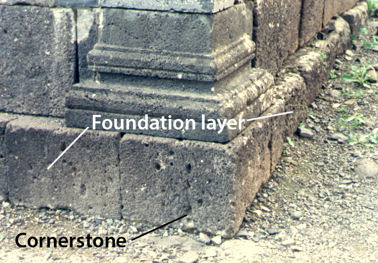

# Human-made Things in the Bible

## License Information

Human-made Things in the Bible © United Bible Societies, 2025. Adapted from: <cite>The Works of Their Hands: Man-made Things in the Bible</cite>, by Ray Pritz © 2009 United Bible Societies. This work is licensed under Creative Commons Attribution-ShareAlike 4.0 International (<a href="https://creativecommons.org/licenses/by-sa/4.0/">https://creativecommons.org/licenses/by-sa/4.0/</a>).

--------------------------------

## Foundation (id: REALIA:3.1.1)

3\.1\.1 Foundation
==================

References:
-----------

Aramaic אֹשׁ (’osh)

[EZR 4:12](https://ref.ly/Ezra4:12), [EZR 5:16](https://ref.ly/Ezra5:16), [EZR 6:3](https://ref.ly/Ezra6:3)

Hebrew אָשְׁיָה (’oshyah)

[JER 50:15](https://ref.ly/Jer50:15)

Hebrew יסד, יְסוֹד, יְסוּדָה, מוֹסָד, מוֹסָדָה, מוּסָדָה, מַסָּד (yasad (verb), ysod, ysudah, mosad, musad, mosadah, musadah, masad)

[DEU 32:22](https://ref.ly/Deut32:22), [JOS 6:26](https://ref.ly/Josh6:26), [2SA 22:8](https://ref.ly/2Sam22:8), [2SA 22:16](https://ref.ly/2Sam22:16), [1KI 5:31](https://ref.ly/1Kgs5:31), [1KI 6:37](https://ref.ly/1Kgs6:37), [1KI 7:9](https://ref.ly/1Kgs7:9), [1KI 7:10](https://ref.ly/1Kgs7:10), [1KI 16:34](https://ref.ly/1Kgs16:34)

Hebrew מָכוֹן (makon)

[PSA 104:5](https://ref.ly/Ps104:5)

Hebrew סַף (saf)

[AMO 9:1](https://ref.ly/Amos9:1)

Greek θεμέλιον, θεμέλιος, θεμελιόω (themelion, themelios, themelioō (verb))

[MAT 7:25](https://ref.ly/Matt7:25), [LUK 6:48](https://ref.ly/Luke6:48), [LUK 6:49](https://ref.ly/Luke6:49), [LUK 14:29](https://ref.ly/Luke14:29)

Greek ὑποβάλλω (hupoballō (verb))

[1ES 2:14](https://ref.ly/1Esd2:14)

Latin fundamentum

[2ES 16:12](https://ref.ly/2Esd16:12), [2ES 6:15](https://ref.ly/2Esd6:15), [2ES 10:27](https://ref.ly/2Esd10:27), [2ES 10:53](https://ref.ly/2Esd10:53), [2ES 15:23](https://ref.ly/2Esd15:23), [2ES 16:12](https://ref.ly/2Esd16:12)

Description:
------------

*Cornerstone in a foundation (© Ray Pritz by United Bible Societies)*

The foundation was the solid layer on which the wall of a building or the entire building was constructed. Foundations were made of large stones laid side by side.

---

Translation:
------------

In some languages it is possible to describe a typical “foundation” in ancient times as “large stones underneath the walls.” In other languages, however, this may seem to be quite a meaningless type of expression, since foundations are only made secure by driving stakes deep into the ground. Therefore it may be best to describe the function of a foundation by saying “what keeps the walls firm,” “how the walls are made not to move,” or “what goes beneath the walls.”

In many parts of the world it is not customary to build buildings with foundations or from stones or bricks. As a result, the figurative use of “foundation” in the New Testament may pose some difficulties. For these situations “foundation” may be rendered “solid \[or, strong] base put down to build a house on,” “base people put down before they build a house made of stone,” or “root of the house.”

[JER 50:15](https://ref.ly/Jer50:15): RSV (Revised Standard Version (1952)) and NRSV (New Revised Standard Version (1989)) render the Hebrew word *’ashwiyoth* in this verse as “bulwarks”; NCV (New Century Version), NIV (New International Version (1984)), and CEV (Contemporary English Version) have “towers.” GNT (Good News Translation (1992)) leaves it untranslated and notes that the meaning of the Hebrew word is uncertain. Commentators disagree concerning the meaning of this word. Some suggest “foundations,” and draw a parallel to the related Aramaic word in [EZR 4:12](https://ref.ly/Ezra4:12) and [EZR 5:16](https://ref.ly/Ezra5:16). Others point out that it would be incorrect to speak of foundations as “falling.” For these commentators it would be better to view *’ashwiyoth* as a general term referring to the “defenses” of the city.

[AMO 9:1](https://ref.ly/Amos9:1): The meaning of the Hebrew word *sipim* in this verse is uncertain. In Hebrew it is clear that something shakes under the blow, but translations differ considerably concerning what is shaken: “thresholds” (RSV (Revised Standard Version (1952)), AT (American Translation (Goodspeed, 1935))), “lintels” (TOT), “doorjambs” (NAB (New American Bible (1970))), “ceiling” (Mft (Moffatt Translation (1926))), “whole porch” (NEB (New English Bible (1970))), and “foundation” (GNT (Good News Translation (1992))). The word probably refers to either the foundation or the roof structure. However, this verse gives a picture of the whole building shaking from the roof to the foundation until it collapses. This is what must be made clear, with the particular choice of wording depending on the translation of what follows.

* **Associated Passages:** Ezra 4:12; Ezra 5:16; Ezra 6:3; Jeremiah 50:15; Deuteronomy 32:22; Joshua 6:26; 2 Samuel 22:8; 2 Samuel 22:16; 1 Kings 5:31; 1 Kings 6:37; 1 Kings 7:9; 1 Kings 7:10; 1 Kings 16:34; Psalms 104:5; Amos 9:1; Matthew 7:25; Luke 6:48; Luke 6:49; Luke 14:29; 1 Esdras (Greek) 2:14; 2 Esdras (Latin) 16:12; 2 Esdras (Latin) 6:15; 2 Esdras (Latin) 10:27; 2 Esdras (Latin) 10:53; 2 Esdras (Latin) 15:23

