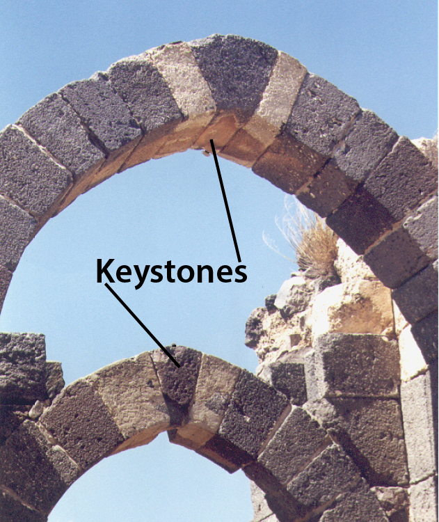
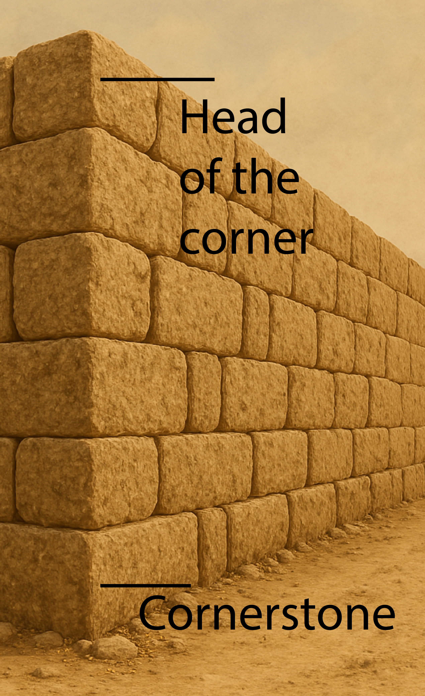

# Human-made Things in the Bible

## License Information

Human-made Things in the Bible © United Bible Societies, 2025. Adapted from: <cite>The Works of Their Hands: Man-made Things in the Bible</cite>, by Ray Pritz © 2009 United Bible Societies. This work is licensed under Creative Commons Attribution-ShareAlike 4.0 International (<a href="https://creativecommons.org/licenses/by-sa/4.0/">https://creativecommons.org/licenses/by-sa/4.0/</a>).

--------------------------------

## Cornerstone, keystone, capstone (id: REALIA:3.1.1.1)

3\.1\.1\.1 Cornerstone, keystone, capstone
==========================================

References:
-----------

Hebrew אֶבֶן, פִנָּה (’even pinah)

[JOB 38:6](https://ref.ly/Job38:6)

Hebrew אֶבֶן, רֹאשָׁה (’even ro’shah)

[ZEC 4:7](https://ref.ly/Zech4:7)

Hebrew פִנָּה (pinah)

[ISA 28:16](https://ref.ly/Isa28:16), [ZEC 10:4](https://ref.ly/Zech10:4)

Hebrew רֹאשׁ פִּנָּה (ro’sh pinah)

[PSA 118:22](https://ref.ly/Ps118:22)

Greek ἀκρογωνιαῖος (akrogōniaios)

[EPH 2:20](https://ref.ly/Eph2:20), [1PE 2:6](https://ref.ly/1Pet2:6)

Greek κεφαλή, γωνία (kefalē gōnias)

[MAT 21:42](https://ref.ly/Matt21:42), [MRK 12:10](https://ref.ly/Mark12:10), [LUK 20:17](https://ref.ly/Luke20:17), [ACT 4:11](https://ref.ly/Acts4:11), [1PE 2:7](https://ref.ly/1Pet2:7)

Description and usage:
----------------------

*Keystones in stone arches (© Ray Pritz by United Bible Societies)*

In buildings made of stone, the cornerstone was the first stone laid in the foundation (see the illustration at [3\.1\.1 Foundation\<REALIA:3\.1\.1\>](#)). Its orientation gave direction to the entire structure, and its position in the foundation meant it gave support to the building.

The keystone or capstone, on the other hand, was the final stone in a structure, for example, in an arch. At a time when much building was done without mortar or other material to cement stones to each other, the keystone was the strategic stone that locked the whole structure together.

---

Translation:
------------

It is impossible in most cases to determine precisely which stone is meant by the Hebrew and Greek expressions listed above. The stone in question could be the large stone used in ancient buildings that extended to the corner of the building. Others take each of these expressions to mean “keystone,” the stone at the top of an arch. (It is, in fact, probable that these expressions refer to the type of stone that was used in the Temple in Jerusalem, and therefore it is far more likely that they refer to a cornerstone rather than a capstone of a peaked roof or arch.)

*Drawing of the stones at the corner of a building: the cornerstone and the head of the corner (Image generated by ChatGPT using OpenAI technology)*

Whatever the precise meaning of the Greek expression *kefalē gōnias* in the New Testament quotations from [PSA 118:22](https://ref.ly/Ps118:22), the general meaning is not in doubt; Christ is called the most important stone in the building, the one that provides cohesion and support for the whole structure. So it will be better in most languages to render the meaning of this expression as “most important stone” or “the stone that gives strength to the building.” These renderings serve to describe the function and significance of *kefalē gōnias* without trying to indicate precisely its location or form.

When translators use expansions such as these, it becomes much easier to translate with metaphors or similes, where the comparisons are made clear. One way to do this in [EPH 2:20](https://ref.ly/Eph2:20) is “You, too, are part of a building. The base they build that building on was put there by the apostles and the prophets, and the stone that gives it strength is Christ Jesus himself.” Another model is “You, too, are like part of a building for which the apostles and the prophets laid down the base that gives it strength; and Christ Jesus is the important stone that gives strength to the building.”

[JOB 38:6](https://ref.ly/Job38:6): Where cornerstones are unknown, it may be possible to render the second line of this verse as “or who finished the work of setting it in place?” or “who completed the place where it would rest?”

[ZEC 10:4](https://ref.ly/Zech10:4): It has been suggested that the Hebrew word *pinah* (literally “corner”) here indicates the corner tower or fortifications of a walled city (compare [2CH 26:15](https://ref.ly/2Chr26:15); [NEH 3:24](https://ref.ly/Neh3:24)). However, no translation consulted has followed this. Some (for example, DUCL (Dutch Common Language Version)) see this word as a reference to military leaders and have translated accordingly. From earliest times this verse has been understood to refer to a messianic figure. Some translations have tried to reflect that by capitalizing “Cornerstone.” Such visual hints may be too subtle for most readers and are, of course, lost when the text is read aloud. A literal rendering of the two Hebrew words at the beginning of this verse (RSV (Revised Standard Version (1952)) “Out of them shall come the cornerstone”) will be unintelligible in some languages. It is better to show that the prophecy is speaking about a leader. Good examples for the whole verse are GNT (Good News Translation (1992)) “From among them will come rulers, leaders, and commanders to govern my people” and CEV (Contemporary English Version) “From this flock will come leaders who will be strong like cornerstones and tent pegs and weapons of war.”

* **Associated Passages:** Job 38:6; Zechariah 4:7; Isaiah 28:16; Zechariah 10:4; Psalms 118:22; Ephesians 2:20; 1 Peter 2:6; Matthew 21:42; Mark 12:10; Luke 20:17; Acts 4:11; 1 Peter 2:7; 2 Chronicles 26:15; Nehemiah 3:24

