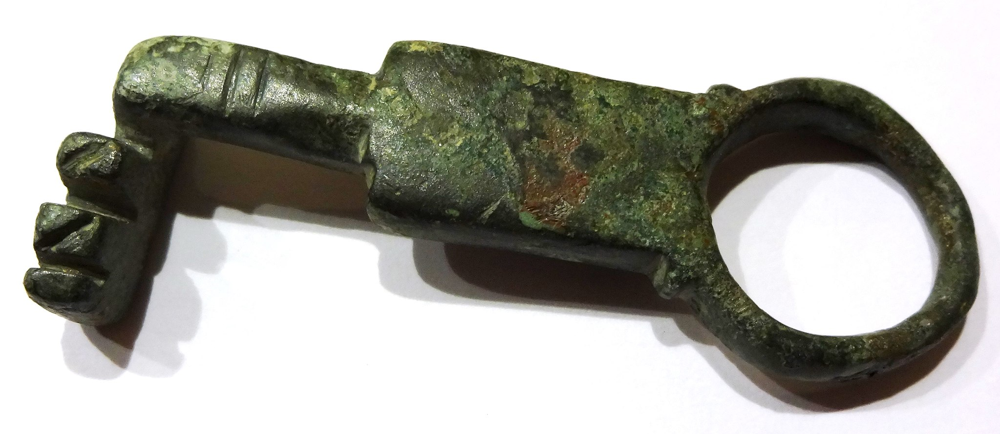

# Human-made Things in the Bible

## License Information

Human-made Things in the Bible © United Bible Societies, 2025. Adapted from: <cite>The Works of Their Hands: Man-made Things in the Bible</cite>, by Ray Pritz © 2009 United Bible Societies. This work is licensed under Creative Commons Attribution-ShareAlike 4.0 International (<a href="https://creativecommons.org/licenses/by-sa/4.0/">https://creativecommons.org/licenses/by-sa/4.0/</a>).

--------------------------------

## Key (id: REALIA:3.1.2.2)

3\.1\.2\.2 Key
==============

References:
-----------

Hebrew מַפְתֵּחַ (mafteach)

[JDG 3:25](https://ref.ly/Judg3:25), [1CH 9:27](https://ref.ly/1Chr9:27), [ISA 22:22](https://ref.ly/Isa22:22)

Greek κλείς (kleis)

[MAT 16:19](https://ref.ly/Matt16:19), [LUK 11:52](https://ref.ly/Luke11:52), [REV 1:18](https://ref.ly/Rev1:18), [REV 3:7](https://ref.ly/Rev3:7), [REV 9:1](https://ref.ly/Rev9:1), [REV 20:1](https://ref.ly/Rev20:1)

Description and usage:
----------------------

*Roman era key (© Hermann Junghans, CC BY\-SA 3\.0, via Wikimedia Commons)*

The key was an instrument used for locking and unlocking doors and gates. Ancient keys were generally much larger than anything commonly known today.

---

Translation:
------------

*Ancient Roman keys (Archaeological park Ruffenhofen: Limeseum) (© Wolfgang Sauber, CC BY\-SA 3\.0, via Wikimedia Commons)*

Keys are not always well known, so some translators may have to use a descriptive phrase, such as “object that controls whether a door can be opened.” Sometimes it is possible to render “key” by describing its function, for example, “unlocker” or “means to open.”

Except for [JDG 3:25](https://ref.ly/Judg3:25), all the references to “key” listed above are symbolic. Nevertheless, all translations consulted use the word “key” even in the symbolic contexts. Note the expansion of ITCL (Italian Common Language Version) at [ISA 22:22](https://ref.ly/Isa22:22): where the text says literally “I will place on his shoulder the key of the house of David (RSV (Revised Standard Version (1952))), ITCL (Italian Common Language Version) has “To him will be given full authority over the palace of David. The keys will be entrusted to him.” Similarly, NLT (New Living Translation) says “I will give him the key to the house of David—the highest position in the royal court.”

It may not be possible to speak of the key to a place, such as “the abyss” (GNT (Good News Translation (1992))) in [REV 9:1](https://ref.ly/Rev9:1) or “the kingdom of heaven” (RSV (Revised Standard Version (1952))) in [MAT 16:19](https://ref.ly/Matt16:19). In such cases translators may have to say “the key to the entrance to …” or “the key used in opening or closing the gate to ….”

* **Associated Passages:** Judges 3:25; 1 Chronicles 9:27; Isaiah 22:22; Matthew 16:19; Luke 11:52; Revelation 1:18; Revelation 3:7; Revelation 9:1; Revelation 20:1

