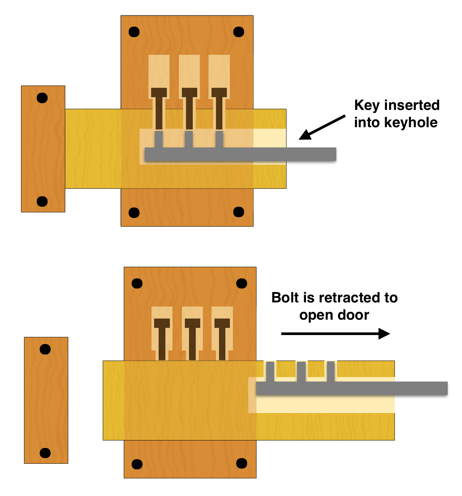
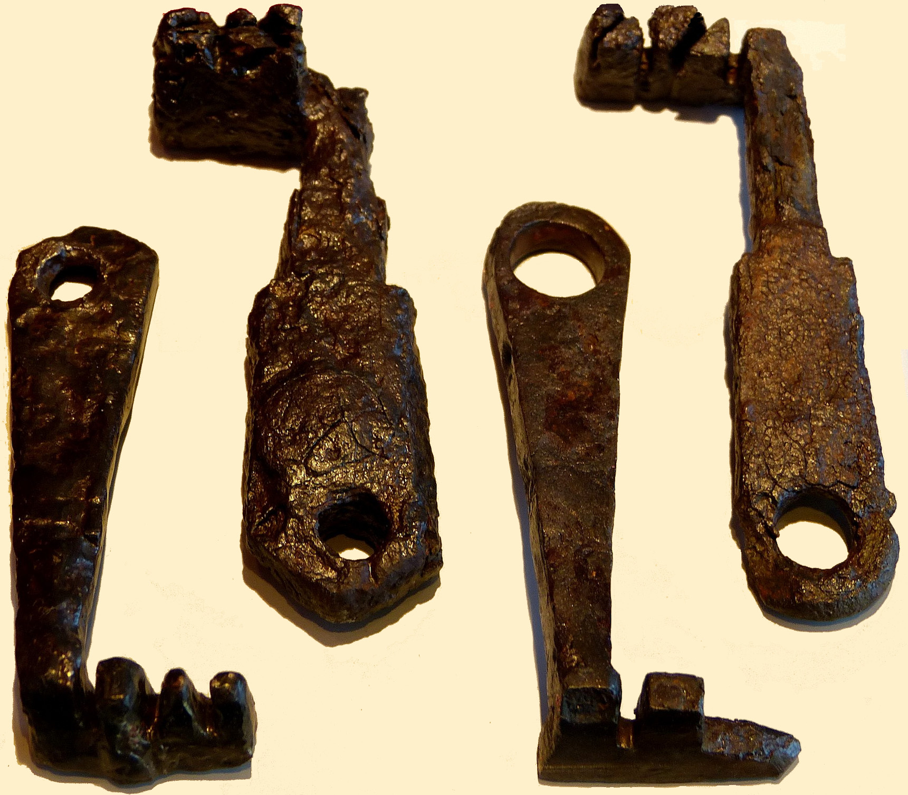
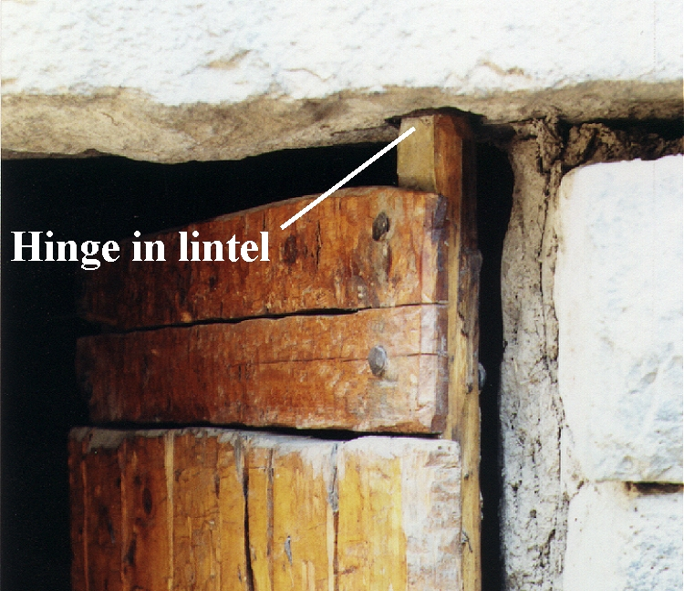

# Human-made Things in the Bible

## License Information

Human-made Things in the Bible © United Bible Societies, 2025. Adapted from: <cite>The Works of Their Hands: Man-made Things in the Bible</cite>, by Ray Pritz © 2009 United Bible Societies. This work is licensed under Creative Commons Attribution-ShareAlike 4.0 International (<a href="https://creativecommons.org/licenses/by-sa/4.0/">https://creativecommons.org/licenses/by-sa/4.0/</a>).

--------------------------------

## Door, doorway (id: REALIA:3.1.2)

3\.1\.2 Door, doorway
=====================

References:
-----------

Hebrew דַּל, דֶּלֶת (dal, dalah, deleth)

[GEN 19:6](https://ref.ly/Gen19:6), [GEN 19:9](https://ref.ly/Gen19:9), [GEN 19:10](https://ref.ly/Gen19:10), [EXO 21:6](https://ref.ly/Exod21:6)

Hebrew סַף (saf)

[2KI 12:10](https://ref.ly/2Kgs12:10), [2KI 22:4](https://ref.ly/2Kgs22:4), [2KI 23:4](https://ref.ly/2Kgs23:4), [2KI 25:18](https://ref.ly/2Kgs25:18), [1CH 9:19](https://ref.ly/1Chr9:19), [1CH 9:22](https://ref.ly/1Chr9:22), [2CH 23:4](https://ref.ly/2Chr23:4), [2CH 34:9](https://ref.ly/2Chr34:9), [EST 2:21](https://ref.ly/Esth2:21), [EST 6:2](https://ref.ly/Esth6:2), [ISA 6:4](https://ref.ly/Isa6:4), [JER 35:4](https://ref.ly/Jer35:4), [JER 52:24](https://ref.ly/Jer52:24), [EZK 41:16](https://ref.ly/Ezek41:16), [EZK 41:16](https://ref.ly/Ezek41:16)

Hebrew ספף (safaf (verb))

[PSA 84:11](https://ref.ly/Ps84:11)

Hebrew פֶּתַח (pethach)

[GEN 4:7](https://ref.ly/Gen4:7), [GEN 6:16](https://ref.ly/Gen6:16), [GEN 18:1](https://ref.ly/Gen18:1), [GEN 18:2](https://ref.ly/Gen18:2), [GEN 18:10](https://ref.ly/Gen18:10), [GEN 19:6](https://ref.ly/Gen19:6), [GEN 19:11](https://ref.ly/Gen19:11), [GEN 19:11](https://ref.ly/Gen19:11), [GEN 43:19](https://ref.ly/Gen43:19), [EXO 12:22](https://ref.ly/Exod12:22), [EXO 12:23](https://ref.ly/Exod12:23), [EXO 26:36](https://ref.ly/Exod26:36), [EXO 29:4](https://ref.ly/Exod29:4), [EXO 29:11](https://ref.ly/Exod29:11), [EXO 29:32](https://ref.ly/Exod29:32), [EXO 29:42](https://ref.ly/Exod29:42), [EXO 33:8](https://ref.ly/Exod33:8), [EXO 33:9](https://ref.ly/Exod33:9), [EXO 33:10](https://ref.ly/Exod33:10), [EXO 33:10](https://ref.ly/Exod33:10), [EXO 35:15](https://ref.ly/Exod35:15), [EXO 35:15](https://ref.ly/Exod35:15), [EXO 36:37](https://ref.ly/Exod36:37), [EXO 38:8](https://ref.ly/Exod38:8), [EXO 38:30](https://ref.ly/Exod38:30), [EXO 39:38](https://ref.ly/Exod39:38), [EXO 40:5](https://ref.ly/Exod40:5), [EXO 40:6](https://ref.ly/Exod40:6), [EXO 40:12](https://ref.ly/Exod40:12), [EXO 40:28](https://ref.ly/Exod40:28), [EXO 40:29](https://ref.ly/Exod40:29), [LEV 1:3](https://ref.ly/Lev1:3), [LEV 1:5](https://ref.ly/Lev1:5), [LEV 3:2](https://ref.ly/Lev3:2), [LEV 4:4](https://ref.ly/Lev4:4), [LEV 4:7](https://ref.ly/Lev4:7), [LEV 4:18](https://ref.ly/Lev4:18), [LEV 8:3](https://ref.ly/Lev8:3), [LEV 8:4](https://ref.ly/Lev8:4), [LEV 8:31](https://ref.ly/Lev8:31), [LEV 8:33](https://ref.ly/Lev8:33), [LEV 8:35](https://ref.ly/Lev8:35), [LEV 10:7](https://ref.ly/Lev10:7), [LEV 12:6](https://ref.ly/Lev12:6), [LEV 14:11](https://ref.ly/Lev14:11), [LEV 14:23](https://ref.ly/Lev14:23), [LEV 14:38](https://ref.ly/Lev14:38), [LEV 15:14](https://ref.ly/Lev15:14), [LEV 15:29](https://ref.ly/Lev15:29), [LEV 16:7](https://ref.ly/Lev16:7), [LEV 17:4](https://ref.ly/Lev17:4), [LEV 17:5](https://ref.ly/Lev17:5), [LEV 17:6](https://ref.ly/Lev17:6), [LEV 17:9](https://ref.ly/Lev17:9), [LEV 19:21](https://ref.ly/Lev19:21), [NUM 3:25](https://ref.ly/Num3:25), [NUM 3:26](https://ref.ly/Num3:26), [NUM 4:25](https://ref.ly/Num4:25), [NUM 6:10](https://ref.ly/Num6:10), [NUM 6:13](https://ref.ly/Num6:13), [NUM 6:18](https://ref.ly/Num6:18), [NUM 10:3](https://ref.ly/Num10:3), [NUM 11:10](https://ref.ly/Num11:10), [NUM 12:5](https://ref.ly/Num12:5), [NUM 16:18](https://ref.ly/Num16:18), [NUM 16:19](https://ref.ly/Num16:19), [NUM 16:27](https://ref.ly/Num16:27), [NUM 17:15](https://ref.ly/Num17:15), [NUM 20:6](https://ref.ly/Num20:6), [NUM 25:6](https://ref.ly/Num25:6), [NUM 27:2](https://ref.ly/Num27:2), [DEU 22:21](https://ref.ly/Deut22:21), [DEU 31:15](https://ref.ly/Deut31:15), [JOS 19:51](https://ref.ly/Josh19:51), [JDG 4:20](https://ref.ly/Judg4:20), [JDG 9:52](https://ref.ly/Judg9:52), [JDG 19:26](https://ref.ly/Judg19:26), [JDG 19:27](https://ref.ly/Judg19:27), [1SA 2:22](https://ref.ly/1Sam2:22), [2SA 11:9](https://ref.ly/2Sam11:9), [1KI 6:8](https://ref.ly/1Kgs6:8), [1KI 6:31](https://ref.ly/1Kgs6:31), [1KI 6:33](https://ref.ly/1Kgs6:33), [1KI 7:5](https://ref.ly/1Kgs7:5), [1KI 14:6](https://ref.ly/1Kgs14:6), [1KI 14:27](https://ref.ly/1Kgs14:27), [1KI 19:13](https://ref.ly/1Kgs19:13), [2KI 4:15](https://ref.ly/2Kgs4:15), [2KI 5:9](https://ref.ly/2Kgs5:9), [1CH 9:21](https://ref.ly/1Chr9:21), [2CH 4:22](https://ref.ly/2Chr4:22), [2CH 12:10](https://ref.ly/2Chr12:10), [NEH 3:20](https://ref.ly/Neh3:20), [NEH 3:21](https://ref.ly/Neh3:21), [EST 5:1](https://ref.ly/Esth5:1), [JOB 31:9](https://ref.ly/Job31:9), [JOB 31:34](https://ref.ly/Job31:34), [PSA 24:7](https://ref.ly/Ps24:7), [PSA 24:9](https://ref.ly/Ps24:9), [PRO 5:8](https://ref.ly/Prov5:8), [PRO 8:3](https://ref.ly/Prov8:3), [PRO 8:34](https://ref.ly/Prov8:34), [PRO 9:14](https://ref.ly/Prov9:14), [PRO 17:19](https://ref.ly/Prov17:19), [SNG 7:14](https://ref.ly/Song7:14), [JER 43:9](https://ref.ly/Jer43:9), [EZK 8:7](https://ref.ly/Ezek8:7), [EZK 8:8](https://ref.ly/Ezek8:8), [EZK 8:16](https://ref.ly/Ezek8:16), [EZK 33:30](https://ref.ly/Ezek33:30), [EZK 40:38](https://ref.ly/Ezek40:38), [EZK 41:2](https://ref.ly/Ezek41:2), [EZK 41:2](https://ref.ly/Ezek41:2), [EZK 41:3](https://ref.ly/Ezek41:3), [EZK 41:3](https://ref.ly/Ezek41:3), [EZK 41:3](https://ref.ly/Ezek41:3), [EZK 41:11](https://ref.ly/Ezek41:11), [EZK 41:11](https://ref.ly/Ezek41:11), [EZK 41:11](https://ref.ly/Ezek41:11), [EZK 41:17](https://ref.ly/Ezek41:17), [EZK 41:20](https://ref.ly/Ezek41:20), [EZK 42:2](https://ref.ly/Ezek42:2), [EZK 42:4](https://ref.ly/Ezek42:4), [EZK 42:11](https://ref.ly/Ezek42:11), [EZK 42:12](https://ref.ly/Ezek42:12), [EZK 42:12](https://ref.ly/Ezek42:12), [EZK 47:1](https://ref.ly/Ezek47:1), [HOS 2:17](https://ref.ly/Hos2:17)

Aramaic תְּרַע (tra‘)

[DAN 3:26](https://ref.ly/Dan3:26)

Greek θύρα (thura)

[MAT 6:6](https://ref.ly/Matt6:6), [MAT 24:33](https://ref.ly/Matt24:33), [MAT 25:10](https://ref.ly/Matt25:10), [MRK 1:33](https://ref.ly/Mark1:33), [MRK 2:2](https://ref.ly/Mark2:2), [MRK 11:4](https://ref.ly/Mark11:4), [MRK 13:29](https://ref.ly/Mark13:29), [LUK 11:7](https://ref.ly/Luke11:7), [LUK 13:24](https://ref.ly/Luke13:24), [LUK 13:25](https://ref.ly/Luke13:25), [LUK 13:25](https://ref.ly/Luke13:25), [JHN 10:1](https://ref.ly/John10:1), [JHN 10:2](https://ref.ly/John10:2), [JHN 10:7](https://ref.ly/John10:7), [JHN 10:9](https://ref.ly/John10:9), [JHN 18:16](https://ref.ly/John18:16), [JHN 20:19](https://ref.ly/John20:19), [JHN 20:26](https://ref.ly/John20:26), [ACT 5:9](https://ref.ly/Acts5:9), [ACT 5:19](https://ref.ly/Acts5:19), [ACT 5:23](https://ref.ly/Acts5:23), [ACT 12:6](https://ref.ly/Acts12:6), [ACT 12:13](https://ref.ly/Acts12:13), [ACT 14:27](https://ref.ly/Acts14:27), [ACT 16:26](https://ref.ly/Acts16:26), [ACT 16:27](https://ref.ly/Acts16:27), [ACT 21:30](https://ref.ly/Acts21:30), [1CO 16:9](https://ref.ly/1Cor16:9), [2CO 2:12](https://ref.ly/2Cor2:12), [COL 4:3](https://ref.ly/Col4:3), [JAS 5:9](https://ref.ly/Jas5:9), [REV 3:8](https://ref.ly/Rev3:8), [REV 3:20](https://ref.ly/Rev3:20), [REV 3:20](https://ref.ly/Rev3:20), [REV 4:1](https://ref.ly/Rev4:1)

Greek θύρωμα (thurōma)

[SIR 14:23](https://ref.ly/Sir14:23), [LJE 1:17](https://ref.ly/EpJer1:17), [2MA 14:43](https://ref.ly/2Macc14:43)

Greek θυρωρός (thurōros)

[MRK 13:34](https://ref.ly/Mark13:34), [JHN 18:16](https://ref.ly/John18:16), [JHN 18:17](https://ref.ly/John18:17)

Greek θυρόω (thuroō (verb))

[1MA 4:57](https://ref.ly/1Macc4:57)

Description and usage:
----------------------

*Wooden outside door to a house (© Ray Pritz by United Bible Societies)*

The door was the entranceway into a building or structure or the panel that covered that entranceway. Doors were normally made of wood. To one edge along the length of the door was attached a wooden pole which extended slightly past the top and bottom edge of the door. The protruding ends of this pole were sharpened or rounded and set into sockets or holes cut into the stone lintel and threshold, thus allowing the door to swing open and shut. Sometimes the door panel was hung on hinges made usually of leather, sometimes of metal.

---

Translation:
------------

In some passages “door” means simply “opening” or “doorway” without reference to the physical object (see [JOB 3:10](https://ref.ly/Job3:10); [JOB 41:6](https://ref.ly/Job41:6); [PSA 78:23](https://ref.ly/Ps78:23)). This is especially true of the Hebrew word *pethach*.

Occasionally “door” is used as a figure for shutting out; for example, CEV (Contemporary English Version) says “boundaries” in [JOB 38:8](https://ref.ly/Job38:8), where God speaks of limiting the extent of the sea. Similarly, in [PSA 141:3](https://ref.ly/Ps141:3) the psalmist literally asks the LORD to “keep watch over the door of my lips” (RSV (Revised Standard Version (1952))). In some languages it may be better to render this line without the image, for example, NCV (New Century Version) says “help me be careful about what I say.” CEV (Contemporary English Version) provides a helpful model for the whole verse, saying “Help me to guard my words whenever I say something.”

*Door of a storeroom (Image generated by ChatGPT using OpenAI technology)*

There seems to be a textual problem in [1KI 6:34](https://ref.ly/1Kgs6:34), where the Hebrew text speaks of the two doors to the sanctuary being made of two “curtains.” A minor emendation changes “curtains” to “sections,” which is the reading preferred by most translations. However, the meaning of the text still remains unclear even after the emendation. The rendering of GNT (Good News Translation (1992)) shows the way a number of translations solve the difficulty: “There were two folding doors made of pine.” Somewhat more literal is NIV (New International Version (1984)), which says “He also made two pine doors, each having two leaves that turned in sockets.”

The Aramaic word *tra‘* in [DAN 3:26](https://ref.ly/Dan3:26) means “gate” or “door.” Some translations have “door” (RSV (Revised Standard Version (1952)), GNT (Good News Translation (1992)), NASB (New American Standard Bible)), while others have “opening” (NIV (New International Version (1984)), NCV (New Century Version)). The opening may have been in the top of the furnace, but it was more likely in the side as a kind of “doorway.”

In [JHN 10:7](https://ref.ly/John10:7); [JHN 10:9](https://ref.ly/John10:9) the Greek word *thura* is used figuratively to refer to Jesus as the means of access to salvation. The emphasis in these verses is on the “door” as a passageway and not as an object closing off an entrance. The literal translation “I am the door of the sheep” (RSV (Revised Standard Version (1952))) may often lead to misinterpretation, since the term used for “door” is likely to refer to the door panel rather than to the doorway or entranceway, thus suggesting that Jesus Christ functions primarily to prevent passage rather than to make entrance possible. The translator should use an expression such as “I am the gateway/doorway/entranceway where the sheep enter.”

* **Associated Passages:** Genesis 19:6; Genesis 19:9; Genesis 19:10; Exodus 21:6; 2 Kings 12:10; 2 Kings 22:4; 2 Kings 23:4; 2 Kings 25:18; 1 Chronicles 9:19; 1 Chronicles 9:22; 2 Chronicles 23:4; 2 Chronicles 34:9; Esther 2:21; Esther 6:2; Isaiah 6:4; Jeremiah 35:4; Jeremiah 52:24; Ezekiel 41:16; Psalms 84:11; Genesis 4:7; Genesis 6:16; Genesis 18:1; Genesis 18:2; Genesis 18:10; Genesis 19:11; Genesis 43:19; Exodus 12:22; Exodus 12:23; Exodus 26:36; Exodus 29:4; Exodus 29:11; Exodus 29:32; Exodus 29:42; Exodus 33:8; Exodus 33:9; Exodus 33:10; Exodus 35:15; Exodus 36:37; Exodus 38:8; Exodus 38:30; Exodus 39:38; Exodus 40:5; Exodus 40:6; Exodus 40:12; Exodus 40:28; Exodus 40:29; Leviticus 1:3; Leviticus 1:5; Leviticus 3:2; Leviticus 4:4; Leviticus 4:7; Leviticus 4:18; Leviticus 8:3; Leviticus 8:4; Leviticus 8:31; Leviticus 8:33; Leviticus 8:35; Leviticus 10:7; Leviticus 12:6; Leviticus 14:11; Leviticus 14:23; Leviticus 14:38; Leviticus 15:14; Leviticus 15:29; Leviticus 16:7; Leviticus 17:4; Leviticus 17:5; Leviticus 17:6; Leviticus 17:9; Leviticus 19:21; Numbers 3:25; Numbers 3:26; Numbers 4:25; Numbers 6:10; Numbers 6:13; Numbers 6:18; Numbers 10:3; Numbers 11:10; Numbers 12:5; Numbers 16:18; Numbers 16:19; Numbers 16:27; Numbers 17:15; Numbers 20:6; Numbers 25:6; Numbers 27:2; Deuteronomy 22:21; Deuteronomy 31:15; Joshua 19:51; Judges 4:20; Judges 9:52; Judges 19:26; Judges 19:27; 1 Samuel 2:22; 2 Samuel 11:9; 1 Kings 6:8; 1 Kings 6:31; 1 Kings 6:33; 1 Kings 7:5; 1 Kings 14:6; 1 Kings 14:27; 1 Kings 19:13; 2 Kings 4:15; 2 Kings 5:9; 1 Chronicles 9:21; 2 Chronicles 4:22; 2 Chronicles 12:10; Nehemiah 3:20; Nehemiah 3:21; Esther 5:1; Job 31:9; Job 31:34; Psalms 24:7; Psalms 24:9; Proverbs 5:8; Proverbs 8:3; Proverbs 8:34; Proverbs 9:14; Proverbs 17:19; Song of Songs 7:14; Jeremiah 43:9; Ezekiel 8:7; Ezekiel 8:8; Ezekiel 8:16; Ezekiel 33:30; Ezekiel 40:38; Ezekiel 41:2; Ezekiel 41:3; Ezekiel 41:11; Ezekiel 41:17; Ezekiel 41:20; Ezekiel 42:2; Ezekiel 42:4; Ezekiel 42:11; Ezekiel 42:12; Ezekiel 47:1; Hosea 2:17; Daniel 3:26; Matthew 6:6; Matthew 24:33; Matthew 25:10; Mark 1:33; Mark 2:2; Mark 11:4; Mark 13:29; Luke 11:7; Luke 13:24; Luke 13:25; John 10:1; John 10:2; John 10:7; John 10:9; John 18:16; John 20:19; John 20:26; Acts 5:9; Acts 5:19; Acts 5:23; Acts 12:6; Acts 12:13; Acts 14:27; Acts 16:26; Acts 16:27; Acts 21:30; 1 Corinthians 16:9; 2 Corinthians 2:12; Colossians 4:3; James 5:9; Revelation 3:8; Revelation 3:20; Revelation 4:1; Sirach 14:23; Letter of Jeremiah 1:17; 2 Maccabees 14:43; Mark 13:34; John 18:17; 1 Maccabees 4:57; Job 3:10; Job 41:6; Psalms 78:23; Job 38:8; Psalms 141:3; 1 Kings 6:34

## Lock (id: REALIA:3.1.2.1)

3\.1\.2\.1 Lock
===============

References:
-----------

Hebrew כַּף, מַנְעוּל (kaf man‘ul)

[SNG 5:5](https://ref.ly/Song5:5)

Hebrew נעל (na‘al)

[JDG 3:23](https://ref.ly/Judg3:23), [JDG 3:24](https://ref.ly/Judg3:24), [2SA 13:17](https://ref.ly/2Sam13:17), [2SA 13:18](https://ref.ly/2Sam13:18)

Hebrew סגר (sagar)

[JDG 9:51](https://ref.ly/Judg9:51)

Greek κλεῖθρον (kleithron)

[LJE 1:17](https://ref.ly/EpJer1:17)

Greek κλείω (kleiō)

[MAT 25:10](https://ref.ly/Matt25:10), [LUK 11:7](https://ref.ly/Luke11:7), [JHN 20:19](https://ref.ly/John20:19), [JHN 20:26](https://ref.ly/John20:26), [ACT 5:23](https://ref.ly/Acts5:23), [ACT 21:30](https://ref.ly/Acts21:30), [SIR 42:6](https://ref.ly/Sir42:6), [BEL 1:14](https://ref.ly/Bel1:14)

Description and usage:
----------------------

*Diagram of an ancient Egyptian lock mechanism for a door (© Willh26, CC BY\-SA 4\.0, via Wikimedia Commons)*

The lock was a device that fastened a door in such a way that it could only be opened by a special key (see [3\.1\.2\.2 Key\<REALIA:3\.1\.2\.2\>](#)).

---

Translation:
------------

The Hebrew expression *kaf man‘ul* in [SNG 5:5](https://ref.ly/Song5:5) probably refers to a wooden protrusion or a cord used to pull back the door bar to allow the door to open. GNT (Good News Translation (1992)) has “handle of the door,” while others say “handles of the bolt” (RSV (Revised Standard Version (1952)), NASB (New American Standard Bible)) or “handles of the lock” (KJV (King James Version (1611))). CEV (Contemporary English Version) has simply “door.”

The unusual Greek word used in [LJE 1:18](https://ref.ly/EpJer1:18) can mean either a lock (so RSV (Revised Standard Version (1952))) or a bar drawn across a door to secure it (so GNT (Good News Translation (1992))).

* **Associated Passages:** Song of Songs 5:5; Judges 3:23; Judges 3:24; 2 Samuel 13:17; 2 Samuel 13:18; Judges 9:51; Letter of Jeremiah 1:17; Matthew 25:10; Luke 11:7; John 20:19; John 20:26; Acts 5:23; Acts 21:30; Sirach 42:6; Bel and the Dragon 1:14; Letter of Jeremiah 1:18

## Key (id: REALIA:3.1.2.2)

3\.1\.2\.2 Key
==============

References:
-----------

Hebrew מַפְתֵּחַ (mafteach)

[JDG 3:25](https://ref.ly/Judg3:25), [1CH 9:27](https://ref.ly/1Chr9:27), [ISA 22:22](https://ref.ly/Isa22:22)

Greek κλείς (kleis)

[MAT 16:19](https://ref.ly/Matt16:19), [LUK 11:52](https://ref.ly/Luke11:52), [REV 1:18](https://ref.ly/Rev1:18), [REV 3:7](https://ref.ly/Rev3:7), [REV 9:1](https://ref.ly/Rev9:1), [REV 20:1](https://ref.ly/Rev20:1)

Description and usage:
----------------------

*Roman era key (© Hermann Junghans, CC BY\-SA 3\.0, via Wikimedia Commons)*

The key was an instrument used for locking and unlocking doors and gates. Ancient keys were generally much larger than anything commonly known today.

---

Translation:
------------

*Ancient Roman keys (Archaeological park Ruffenhofen: Limeseum) (© Wolfgang Sauber, CC BY\-SA 3\.0, via Wikimedia Commons)*

Keys are not always well known, so some translators may have to use a descriptive phrase, such as “object that controls whether a door can be opened.” Sometimes it is possible to render “key” by describing its function, for example, “unlocker” or “means to open.”

Except for [JDG 3:25](https://ref.ly/Judg3:25), all the references to “key” listed above are symbolic. Nevertheless, all translations consulted use the word “key” even in the symbolic contexts. Note the expansion of ITCL (Italian Common Language Version) at [ISA 22:22](https://ref.ly/Isa22:22): where the text says literally “I will place on his shoulder the key of the house of David (RSV (Revised Standard Version (1952))), ITCL (Italian Common Language Version) has “To him will be given full authority over the palace of David. The keys will be entrusted to him.” Similarly, NLT (New Living Translation) says “I will give him the key to the house of David—the highest position in the royal court.”

It may not be possible to speak of the key to a place, such as “the abyss” (GNT (Good News Translation (1992))) in [REV 9:1](https://ref.ly/Rev9:1) or “the kingdom of heaven” (RSV (Revised Standard Version (1952))) in [MAT 16:19](https://ref.ly/Matt16:19). In such cases translators may have to say “the key to the entrance to …” or “the key used in opening or closing the gate to ….”

* **Associated Passages:** Judges 3:25; 1 Chronicles 9:27; Isaiah 22:22; Matthew 16:19; Luke 11:52; Revelation 1:18; Revelation 3:7; Revelation 9:1; Revelation 20:1

## Hinge (id: REALIA:3.1.2.3)

3\.1\.2\.3 Hinge
================

References:
-----------

Hebrew גָּלִיל (galil)

[1KI 6:34](https://ref.ly/1Kgs6:34), [1KI 6:34](https://ref.ly/1Kgs6:34)

Hebrew פֹּת (poth)

[1KI 7:50](https://ref.ly/1Kgs7:50)

Hebrew צִיר (tsir)

[PRO 26:14](https://ref.ly/Prov26:14)

Description and usage:
----------------------

*A metal hinge on a door or gate (© Ray Pritz by United Bible Societies)*

The hinge was a device for attaching two things in a way that they were free to swing relative to each other. On a door the hinge was the point at which the door was attached at the top (the lintel) and at the base (the threshold) or to the doorpost (if there was one), allowing the door to swing open or closed. Hinges for doors of simple dwellings were often just extensions of the wooden door that stood in indentations or sockets in the stone lintel and threshold of the doorway. Hinges for larger doors were made of metal. A metal hinge consisted of three parts: two leaves, one attached to the door and one to the wall or doorpost, and a metal pin that held them together.

Translation:
------------

*A wooden socket hinge on a door (© Ray Pritz by United Bible Societies)*

The exact meaning of the Hebrew word *galil* in [1KI 6:34](https://ref.ly/1Kgs6:34) is uncertain. REB (Revised English Bible (1989)) takes the word (which is related to a Hebrew verb meaning “to rotate”) to be a “swivel\-pin,” that is, a kind of “hinge.” Many translations render this difficult verse in a way that makes it unnecessary to identify the specific object intended by *galil*; for example, GNT (Good News Translation (1992)) renders the whole verse as “There were two folding doors made of pine.”

* **Associated Passages:** 1 Kings 6:34; 1 Kings 7:50; Proverbs 26:14

## Doorpost (id: REALIA:3.1.2.4)

3\.1\.2\.4 Doorpost
===================

References:
-----------

Hebrew אַמָּה (’amah)

[ISA 6:4](https://ref.ly/Isa6:4)

Hebrew אֹמְנָה (’omnah)

[2KI 18:16](https://ref.ly/2Kgs18:16)

Hebrew מְזוּזָה (mzuzah)

[EXO 12:7](https://ref.ly/Exod12:7), [EXO 12:22](https://ref.ly/Exod12:22), [EXO 12:23](https://ref.ly/Exod12:23), [EXO 21:6](https://ref.ly/Exod21:6), [DEU 6:9](https://ref.ly/Deut6:9), [DEU 11:20](https://ref.ly/Deut11:20), [JDG 16:3](https://ref.ly/Judg16:3), [1SA 1:9](https://ref.ly/1Sam1:9), [1KI 6:31](https://ref.ly/1Kgs6:31), [1KI 6:33](https://ref.ly/1Kgs6:33), [1KI 7:5](https://ref.ly/1Kgs7:5), [PRO 8:34](https://ref.ly/Prov8:34), [ISA 57:8](https://ref.ly/Isa57:8), [EZK 41:21](https://ref.ly/Ezek41:21), [EZK 43:8](https://ref.ly/Ezek43:8), [EZK 43:8](https://ref.ly/Ezek43:8), [EZK 45:19](https://ref.ly/Ezek45:19), [EZK 45:19](https://ref.ly/Ezek45:19), [EZK 46:2](https://ref.ly/Ezek46:2)

Hebrew סַף (saf)

[2CH 3:7](https://ref.ly/2Chr3:7)

Description and usage:
----------------------

*Doorpost and lintel of a door (Image generated by ChatGPT using OpenAI technology)*

Entrances such as doorways and gateways were rectangular. The two sides of the doorway were sometimes lined with wood, to which the hinges of the door could be attached. The doorposts were these side poles of the doorway. They also served to support the structure above the doorway.

---

Translation:
------------

Where technical terms for the doorframe parts do not exist, a descriptive phrase may be used; for example, in [EXO 12:22](https://ref.ly/Exod12:22), where RSV (Revised Standard Version (1952)) refers to “the lintel and the two doorposts,” NCV (New Century Version) has “the sides and tops of the doorframes.”

[2KI 18:16](https://ref.ly/2Kgs18:16): The Hebrew word *’omnah* only occurs here in Scripture, and its meaning is uncertain. The meaning of the verb root from which it is derived is “to carry, support,” and it could refer either to supporting columns for a large room or to posts that support a door opening. Most translations understand it in this second way and say “doorposts.”

* **Associated Passages:** Isaiah 6:4; 2 Kings 18:16; Exodus 12:7; Exodus 12:22; Exodus 12:23; Exodus 21:6; Deuteronomy 6:9; Deuteronomy 11:20; Judges 16:3; 1 Samuel 1:9; 1 Kings 6:31; 1 Kings 6:33; 1 Kings 7:5; Proverbs 8:34; Isaiah 57:8; Ezekiel 41:21; Ezekiel 43:8; Ezekiel 45:19; Ezekiel 46:2; 2 Chronicles 3:7

## Lintel (id: REALIA:3.1.2.5)

3\.1\.2\.5 Lintel
=================

References:
-----------

Hebrew מַשְׁקוֹף (mashqof)

[EXO 12:7](https://ref.ly/Exod12:7), [EXO 12:22](https://ref.ly/Exod12:22), [EXO 12:23](https://ref.ly/Exod12:23)

Description:
------------

The lintel was the top beam of the doorframe (see [3\.1\.2 Door, doorway\<REALIA:3\.1\.2\>](#)). See the illustration at [3\.1\.2\.4 Doorpost\<REALIA:3\.1\.2\.4\>](#).

---

Translation:
------------

See the discussion under [3\.1\.2\.4 Doorpost\<REALIA:3\.1\.2\.4\>](#).

* **Associated Passages:** Exodus 12:7; Exodus 12:22; Exodus 12:23

## Threshold, doorsill (id: REALIA:3.1.2.6)

3\.1\.2\.6 Threshold, doorsill
==============================

References:
-----------

Hebrew סַף (saf)

[JDG 19:27](https://ref.ly/Judg19:27), [1KI 14:17](https://ref.ly/1Kgs14:17), [EZK 40:6](https://ref.ly/Ezek40:6), [EZK 40:6](https://ref.ly/Ezek40:6), [EZK 40:7](https://ref.ly/Ezek40:7), [EZK 41:16](https://ref.ly/Ezek41:16), [EZK 41:16](https://ref.ly/Ezek41:16), [EZK 43:8](https://ref.ly/Ezek43:8), [EZK 43:8](https://ref.ly/Ezek43:8), [ZEP 2:14](https://ref.ly/Zeph2:14)

Hebrew מִפְתָּן (miftan)

[1SA 5:4](https://ref.ly/1Sam5:4), [1SA 5:5](https://ref.ly/1Sam5:5), [EZK 9:3](https://ref.ly/Ezek9:3), [EZK 10:4](https://ref.ly/Ezek10:4), [EZK 10:18](https://ref.ly/Ezek10:18), [EZK 46:2](https://ref.ly/Ezek46:2), [EZK 47:1](https://ref.ly/Ezek47:1), [ZEP 1:9](https://ref.ly/Zeph1:9)

Greek χελωνίς (chelōnis)

[JDT 14:15](https://ref.ly/Jdt14:15)

Description:
------------

*Threshold of an old doorway in Santorini (© Dietmar Rabich, CC BY\-SA 4\.0, via Wikimedia Commons)*

The threshold was the bottom part of a doorframe (see [3\.1\.2 Door, doorway\<REALIA:3\.1\.2\>](#)); it was the piece that sat horizontally on the ground. It was usually made of stone.

---

Translation:
------------

Where a technical term for “threshold” does not exist or would not be generally understood, it may be necessary to use a descriptive phrase; for example, in [EZK 9:3](https://ref.ly/Ezek9:3)NCV (New Century Version) has “place … where the door opened.”

[ZEP 1:9](https://ref.ly/Zeph1:9): The literal phrase “all who jump over \[or, on] the threshold” in this verse is obscure and has been rendered in various ways. It may refer to a Philistine religious practice, the origins of which are described in [1SA 5:4](https://ref.ly/1Sam5:4); [1SA 5:5](https://ref.ly/1Sam5:5). CEV (Contemporary English Version) reflects this by saying “worshipers of pagan gods” and adding a footnote. NCV (New Century Version) is more specific with “those who worship Dagon” but does not add a footnote. Also possible is the expanded translation in FRCL (French Common Language Version (Bible en français courant)), which reads “all those who, like the pagans, jump over the doorsill of the temple.” FRCL (French Common Language Version (Bible en français courant)) also includes a footnote with the following alternate rendering: “all those who go up on the \[sacred] platform.” See also the discussion in *A Handbook on The Books of Nahum, Habakkuk, and Zephaniah*, pages 152–153\.

*Threshold (Image generated by ChatGPT using OpenAI technology)*

The Greek word *chelōnis* in [JDT 14:15](https://ref.ly/Jdt14:15) is somewhat obscure. NJB (New Jerusalem Bible (1985)) has “threshold,” which is also the definition given by Liddell\-Scott. In [JDT 13:9](https://ref.ly/Jdt13:9) we learn that Judith rolled Holofernes’ body off the bed, which means it lay on the floor. So in 14\.15 many translations render *chelōnis* as “floor” (ITCL (Italian Common Language Version), NAB (New American Bible (1970))), and this seems preferable.

* **Associated Passages:** Judges 19:27; 1 Kings 14:17; Ezekiel 40:6; Ezekiel 40:7; Ezekiel 41:16; Ezekiel 43:8; Zephaniah 2:14; 1 Samuel 5:4; 1 Samuel 5:5; Ezekiel 9:3; Ezekiel 10:4; Ezekiel 10:18; Ezekiel 46:2; Ezekiel 47:1; Zephaniah 1:9; Judith 14:15; Judith 13:9

