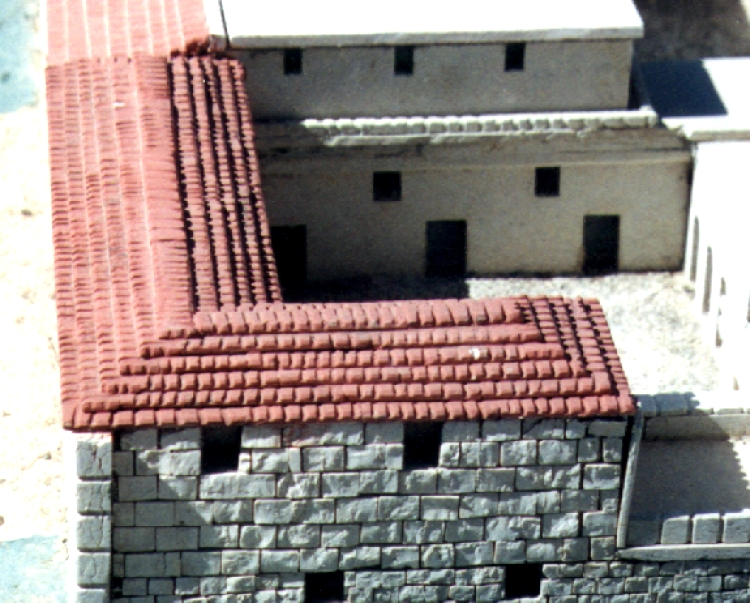

# Human-made Things in the Bible

## License Information

Human-made Things in the Bible © United Bible Societies, 2025. Adapted from: <cite>The Works of Their Hands: Man-made Things in the Bible</cite>, by Ray Pritz © 2009 United Bible Societies. This work is licensed under Creative Commons Attribution-ShareAlike 4.0 International (<a href="https://creativecommons.org/licenses/by-sa/4.0/">https://creativecommons.org/licenses/by-sa/4.0/</a>).

--------------------------------

## Roof tile (id: REALIA:3.1.5.2)

3\.1\.5\.2 Roof tile
====================

Reference:
----------

Greek κέραμος (keramos)

[LUK 5:19](https://ref.ly/Luke5:19)

Description and usage:
----------------------

*Clay roof tiles (© Arivumathi, CC BY\-SA 4\.0, via Wikimedia Commons)*

The roof tile was a thin slab or bent piece of baked clay used to cover a pitched roof. It is also possible that [LUK 5:19](https://ref.ly/Luke5:19) is speaking of thin, flat stones.

---

Translation:
------------

*Clay tiles on roof (© Ray Pritz by United Bible Societies)*

While the normal Israelite house did not have roof tiles, [LUK 5:19](https://ref.ly/Luke5:19) mentions them specifically. Roof tiles were part of Greek roof construction, although by the time of the New Testament they were also known in the land of Israel. Many suggestions have been made to understand this seeming anomaly, but the translator should translate the text as it is.

“Roof tiles” has been rendered “flat stones” or, more generically, “covering” or “roofing.” Where a roofing material other than tiles is known, it may be necessary to adjust the literal clause “through the tiles they let him down on his bed,” for example, “they parted the roof \[of split bamboo] and lowered him on his bed” or, without reference to the material, “where the housetop was opened by them, they lowered him on his bed.” NCV (New Century Version) eliminates any mention of making a hole: “they … lowered the man on his mat through the ceiling.”

* **Associated Passages:** Luke 5:19

