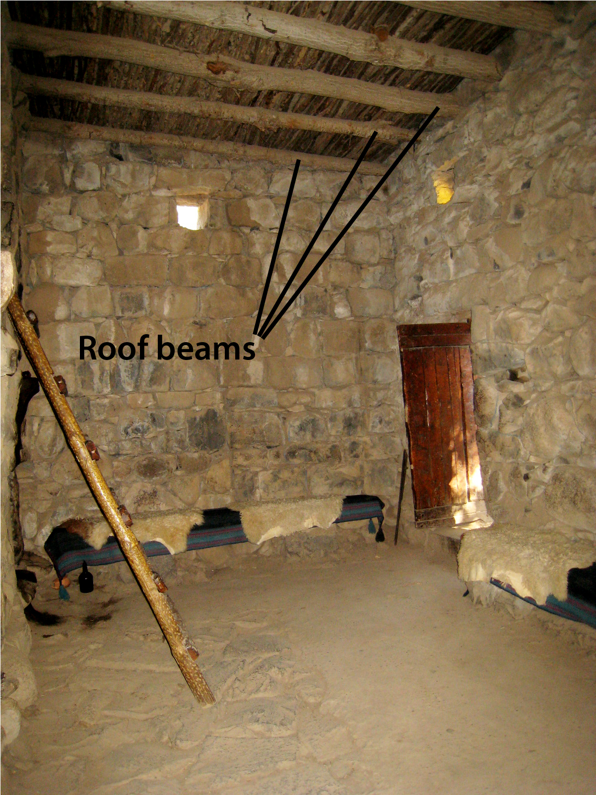

# Human-made Things in the Bible

## License Information

Human-made Things in the Bible © United Bible Societies, 2025. Adapted from: <cite>The Works of Their Hands: Man-made Things in the Bible</cite>, by Ray Pritz © 2009 United Bible Societies. This work is licensed under Creative Commons Attribution-ShareAlike 4.0 International (<a href="https://creativecommons.org/licenses/by-sa/4.0/">https://creativecommons.org/licenses/by-sa/4.0/</a>).

--------------------------------

## Crossbeam, rafter (id: REALIA:3.1.5.3)

3\.1\.5\.3 Crossbeam, rafter
============================

References:
-----------

Aramaic אָע (’a‘)

[EZR 6:11](https://ref.ly/Ezra6:11)

Hebrew גֵּב (gev)

[1KI 6:9](https://ref.ly/1Kgs6:9)

Hebrew כָּפִיס (kafis)

[HAB 2:11](https://ref.ly/Hab2:11)

Hebrew קרה, קוֹרָה (qarah (verb), qorah)

[2CH 3:7](https://ref.ly/2Chr3:7), [SNG 1:17](https://ref.ly/Song1:17), [2CH 34:11](https://ref.ly/2Chr34:11)

Hebrew רָהִיט (rachit)

[SNG 1:17](https://ref.ly/Song1:17)

Hebrew שְׂדֵרָה (sderah)

[1KI 6:9](https://ref.ly/1Kgs6:9)

Greek δοκός (dokos)

[SIR 29:22](https://ref.ly/Sir29:22), [LJE 1:19](https://ref.ly/EpJer1:19), [LJE 1:54](https://ref.ly/EpJer1:54)

Greek ἱμάντωσις (himantōsis)

[SIR 22:16](https://ref.ly/Sir22:16)

Greek ξύλον (xulon)

[1ES 6:31](https://ref.ly/1Esd6:31)

Description and usage:
----------------------

*Roof beams in a house (© Hagit Baldar, CC BY, via Wikimedia Commons)*

The roof of an Israelite house was made of three or even four layers. First thick wooden poles were laid between two walls at the top and along the length of the house. These were inserted in the top of the wall and were part of the wall structure. If they were removed, the wall would be heavily damaged. These “crossbeams” or “rafters” were separated from each other at a distance about the length of a man’s forearm. On top of these crossbeams and perpendicular to them was laid a layer of smaller poles, roughly 3–4 centimeters (1–2 inches) in diameter. These poles were laid side by side to create a platform. They are probably mentioned in [1KI 6:9](https://ref.ly/1Kgs6:9) as *sderoth* (plural of *sderah*). On top of the smaller poles there was a layer of dirt and sometimes on top of the dirt a layer of tiles.

---

Translation:
------------

While the meaning of the Hebrew word *gev* is uncertain in [1KI 6:9](https://ref.ly/1Kgs6:9), all the translations consulted render it “beams.” See also the discussion on this word at [3\.1\.6 Room\<REALIA:3\.1\.6\>](#).

In [SNG 1:17](https://ref.ly/Song1:17) the Hebrew word *rachit* is used figuratively, and there is also a textual problem. See the discussion of this verse in *A Handbook on Song of Songs*, page 49\.

[HAB 2:11](https://ref.ly/Hab2:11): The Hebrew word *kafis* appears only here in Scripture, but most translations agree that it refers to a rafter or crossbeam in a house. NRSV (New Revised Standard Version (1989)) differs by rendering the last line of this verse as “and the plaster will respond from the woodwork.” Babylonian houses were usually built with brick rather than stone, and the prophet is describing Babylonian homes in terms of the building materials he was familiar with in the land of Israel. In a similar way some translators may have to speak of building materials in common use in their own areas (such as clay and wood, or wood and thatch), rather than try to describe “crossbeams” or “rafters”; for example, they may say “and the wood \[or, thatch/clay] in the roof cries back \[or, echoes the cry].” In some languages it may not be possible to speak of building materials crying out like people. In such cases it may be possible to use a simile and render the whole verse as “It will be as if even the stones and woodwork of your houses bore witness against your evil deeds.”

The crossbeam provided essential support for the building. In [EZR 6:11](https://ref.ly/Ezra6:11) and [1ES 6:31](https://ref.ly/1Esd6:31) the act of removing a beam from a person’s house will certainly cause it to fall. So an alternative rendering for the middle of these verses is “his house will be destroyed, and one of its wooden beams will be driven through his body.”

* **Associated Passages:** Ezra 6:11; 1 Kings 6:9; Habakkuk 2:11; 2 Chronicles 3:7; Song of Songs 1:17; 2 Chronicles 34:11; Sirach 29:22; Letter of Jeremiah 1:19; Letter of Jeremiah 1:54; Sirach 22:16; 1 Esdras (Greek) 6:31

