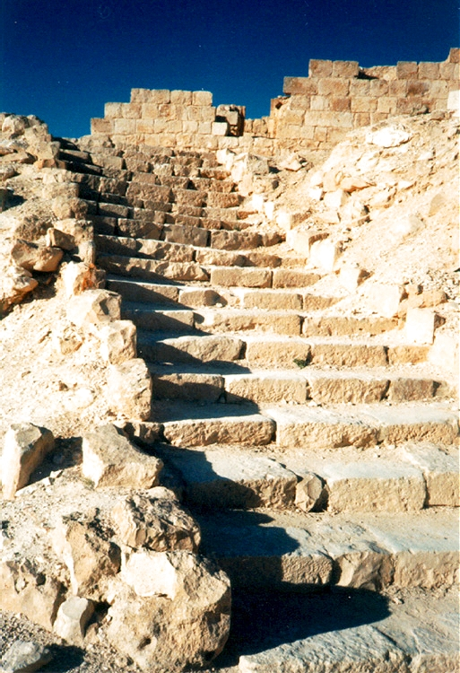

# Human-made Things in the Bible

## License Information

Human-made Things in the Bible © United Bible Societies, 2025. Adapted from: <cite>The Works of Their Hands: Man-made Things in the Bible</cite>, by Ray Pritz © 2009 United Bible Societies. This work is licensed under Creative Commons Attribution-ShareAlike 4.0 International (<a href="https://creativecommons.org/licenses/by-sa/4.0/">https://creativecommons.org/licenses/by-sa/4.0/</a>).

--------------------------------

## House, permanent dwelling (id: REALIA:3.1)

3\.1 House, permanent dwelling
==============================

References:
-----------

Hebrew בַּיִת (bayith)

[GEN 7:1](https://ref.ly/Gen7:1), [GEN 12:1](https://ref.ly/Gen12:1), [GEN 14:14](https://ref.ly/Gen14:14), [GEN 15:2](https://ref.ly/Gen15:2), [GEN 15:3](https://ref.ly/Gen15:3), [GEN 17:13](https://ref.ly/Gen17:13), [GEN 17:13](https://ref.ly/Gen17:13), [GEN 17:23](https://ref.ly/Gen17:23), [GEN 17:23](https://ref.ly/Gen17:23), [GEN 17:27](https://ref.ly/Gen17:27), [GEN 17:27](https://ref.ly/Gen17:27), [GEN 18:19](https://ref.ly/Gen18:19), [GEN 19:4](https://ref.ly/Gen19:4), [GEN 19:10](https://ref.ly/Gen19:10), [GEN 19:11](https://ref.ly/Gen19:11)

Greek οἰκία, οἶκος (oikia, oikos)

[MAT 2:11](https://ref.ly/Matt2:11), [MAT 5:15](https://ref.ly/Matt5:15), [MAT 7:24](https://ref.ly/Matt7:24), [MAT 7:25](https://ref.ly/Matt7:25), [MAT 7:26](https://ref.ly/Matt7:26), [MAT 7:27](https://ref.ly/Matt7:27), [MAT 8:6](https://ref.ly/Matt8:6), [MAT 8:14](https://ref.ly/Matt8:14), [MAT 9:6](https://ref.ly/Matt9:6), [MAT 9:7](https://ref.ly/Matt9:7)

Latin domus

[2ES 1:7](https://ref.ly/2Esd1:7), [2ES 1:35](https://ref.ly/2Esd1:35), [2ES 9:24](https://ref.ly/2Esd9:24), [2ES 10:51](https://ref.ly/2Esd10:51), [2ES 12:46](https://ref.ly/2Esd12:46), [2ES 12:49](https://ref.ly/2Esd12:49), [2ES 14:13](https://ref.ly/2Esd14:13)

Description and usage:
----------------------

*A drawing showing the parts of a house of NT times (Image generated by ChatGPT using OpenAI technology)*

The average family house in biblical times was small, perhaps no more than 40–50 square meters (400–500 square feet). Its shape and the materials from which it was built varied according to location and time period; for example, houses in Egypt before the Exodus did not look like houses in Mesopotamia in the time of the later prophets, and these in turn differed from houses in Galilee in New Testament times. Where a generic term exists for a single\-family dwelling, it can usually be used throughout the Bible. Where a language must specify, for example, the material of which the house is made or the shape of the house, the following discussion may be of help.

Houses in Egypt and Canaan in the time of the patriarchs were made of mud bricks. These houses were rectangular and had one story and usually one room. The floor was normally made of packed, dried mud. Mud brick construction was also used in Mesopotamia even into later biblical times. The mud brick walls were sometimes built on a foundation layer of stones.

For the construction of houses in the period of the kings, local stone replaced mud, and stone may have been the main building material in the hilly regions even from earliest times. The stones were rough and undressed (that is, not cut or manually shaped) and were piled on each other and held together by mud. There was generally no finish given to the outside of the walls, although it was sometimes the custom to plaster the interior walls in the dwelling area.

---

Translation:
------------

In a number of languages it is important to distinguish clearly between various types of dwellings depending upon their size and presumed importance. Accordingly, in rendering the generic Hebrew, Greek and Latin words listed above, it is necessary to use a number of different terms roughly equivalent to the English words “cottage,” “house,” “official residence,” “palace,” “temple,” and so on. See also [3\.4 Palace\<REALIA:3\.4\>](#) and [3\.14\.1 Jewish Temple\<REALIA:3\.14\.1\>](#).

In some languages translators must distinguish carefully between a house and a home. A term meaning “house” would be used in referring to any dwelling as a construction, while a term meaning “home” would be used in referring to the more or less permanent dwelling of a particular person. In [MRK 2:1](https://ref.ly/Mark2:1), for example, it is significant to indicate that Jesus was dwelling in the house through the roof of which the paralyzed man was let down, that is, he was “at home” (RSV (Revised Standard Version (1952)), GNT (Good News Translation (1992))).

A number of the items that follow (for example, foundation, lintel, stairs) are structural features that are common to other buildings in addition to permanent private dwellings. They are gathered under this heading for convenience.

* **Associated Passages:** Genesis 7:1; Genesis 12:1; Genesis 14:14; Genesis 15:2; Genesis 15:3; Genesis 17:13; Genesis 17:23; Genesis 17:27; Genesis 18:19; Genesis 19:4; Genesis 19:10; Genesis 19:11; Matthew 2:11; Matthew 5:15; Matthew 7:24; Matthew 7:25; Matthew 7:26; Matthew 7:27; Matthew 8:6; Matthew 8:14; Matthew 9:6; Matthew 9:7; 2 Esdras (Latin) 1:7; 2 Esdras (Latin) 1:35; 2 Esdras (Latin) 9:24; 2 Esdras (Latin) 10:51; 2 Esdras (Latin) 12:46; 2 Esdras (Latin) 12:49; 2 Esdras (Latin) 14:13; Mark 2:1

* **Associated ACAI Concepts:** House (ID: `realia:House`)

## Foundation (id: REALIA:3.1.1)

3\.1\.1 Foundation
==================

References:
-----------

Aramaic אֹשׁ (’osh)

[EZR 4:12](https://ref.ly/Ezra4:12), [EZR 5:16](https://ref.ly/Ezra5:16), [EZR 6:3](https://ref.ly/Ezra6:3)

Hebrew אָשְׁיָה (’oshyah)

[JER 50:15](https://ref.ly/Jer50:15)

Hebrew יסד, יְסוֹד, יְסוּדָה, מוֹסָד, מוֹסָדָה, מוּסָדָה, מַסָּד (yasad (verb), ysod, ysudah, mosad, musad, mosadah, musadah, masad)

[DEU 32:22](https://ref.ly/Deut32:22), [JOS 6:26](https://ref.ly/Josh6:26), [2SA 22:8](https://ref.ly/2Sam22:8), [2SA 22:16](https://ref.ly/2Sam22:16), [1KI 5:31](https://ref.ly/1Kgs5:31), [1KI 6:37](https://ref.ly/1Kgs6:37), [1KI 7:9](https://ref.ly/1Kgs7:9), [1KI 7:10](https://ref.ly/1Kgs7:10), [1KI 16:34](https://ref.ly/1Kgs16:34)

Hebrew מָכוֹן (makon)

[PSA 104:5](https://ref.ly/Ps104:5)

Hebrew סַף (saf)

[AMO 9:1](https://ref.ly/Amos9:1)

Greek θεμέλιον, θεμέλιος, θεμελιόω (themelion, themelios, themelioō (verb))

[MAT 7:25](https://ref.ly/Matt7:25), [LUK 6:48](https://ref.ly/Luke6:48), [LUK 6:49](https://ref.ly/Luke6:49), [LUK 14:29](https://ref.ly/Luke14:29)

Greek ὑποβάλλω (hupoballō (verb))

[1ES 2:14](https://ref.ly/1Esd2:14)

Latin fundamentum

[2ES 16:12](https://ref.ly/2Esd16:12), [2ES 6:15](https://ref.ly/2Esd6:15), [2ES 10:27](https://ref.ly/2Esd10:27), [2ES 10:53](https://ref.ly/2Esd10:53), [2ES 15:23](https://ref.ly/2Esd15:23), [2ES 16:12](https://ref.ly/2Esd16:12)

Description:
------------

*Cornerstone in a foundation (© Ray Pritz by United Bible Societies)*

The foundation was the solid layer on which the wall of a building or the entire building was constructed. Foundations were made of large stones laid side by side.

---

Translation:
------------

In some languages it is possible to describe a typical “foundation” in ancient times as “large stones underneath the walls.” In other languages, however, this may seem to be quite a meaningless type of expression, since foundations are only made secure by driving stakes deep into the ground. Therefore it may be best to describe the function of a foundation by saying “what keeps the walls firm,” “how the walls are made not to move,” or “what goes beneath the walls.”

In many parts of the world it is not customary to build buildings with foundations or from stones or bricks. As a result, the figurative use of “foundation” in the New Testament may pose some difficulties. For these situations “foundation” may be rendered “solid \[or, strong] base put down to build a house on,” “base people put down before they build a house made of stone,” or “root of the house.”

[JER 50:15](https://ref.ly/Jer50:15): RSV (Revised Standard Version (1952)) and NRSV (New Revised Standard Version (1989)) render the Hebrew word *’ashwiyoth* in this verse as “bulwarks”; NCV (New Century Version), NIV (New International Version (1984)), and CEV (Contemporary English Version) have “towers.” GNT (Good News Translation (1992)) leaves it untranslated and notes that the meaning of the Hebrew word is uncertain. Commentators disagree concerning the meaning of this word. Some suggest “foundations,” and draw a parallel to the related Aramaic word in [EZR 4:12](https://ref.ly/Ezra4:12) and [EZR 5:16](https://ref.ly/Ezra5:16). Others point out that it would be incorrect to speak of foundations as “falling.” For these commentators it would be better to view *’ashwiyoth* as a general term referring to the “defenses” of the city.

[AMO 9:1](https://ref.ly/Amos9:1): The meaning of the Hebrew word *sipim* in this verse is uncertain. In Hebrew it is clear that something shakes under the blow, but translations differ considerably concerning what is shaken: “thresholds” (RSV (Revised Standard Version (1952)), AT (American Translation (Goodspeed, 1935))), “lintels” (TOT), “doorjambs” (NAB (New American Bible (1970))), “ceiling” (Mft (Moffatt Translation (1926))), “whole porch” (NEB (New English Bible (1970))), and “foundation” (GNT (Good News Translation (1992))). The word probably refers to either the foundation or the roof structure. However, this verse gives a picture of the whole building shaking from the roof to the foundation until it collapses. This is what must be made clear, with the particular choice of wording depending on the translation of what follows.

* **Associated Passages:** Ezra 4:12; Ezra 5:16; Ezra 6:3; Jeremiah 50:15; Deuteronomy 32:22; Joshua 6:26; 2 Samuel 22:8; 2 Samuel 22:16; 1 Kings 5:31; 1 Kings 6:37; 1 Kings 7:9; 1 Kings 7:10; 1 Kings 16:34; Psalms 104:5; Amos 9:1; Matthew 7:25; Luke 6:48; Luke 6:49; Luke 14:29; 1 Esdras (Greek) 2:14; 2 Esdras (Latin) 16:12; 2 Esdras (Latin) 6:15; 2 Esdras (Latin) 10:27; 2 Esdras (Latin) 10:53; 2 Esdras (Latin) 15:23

* **Associated ACAI Concepts:** Foundation (ID: `realia:Foundation`)

## Cornerstone, keystone, capstone (id: REALIA:3.1.1.1)

3\.1\.1\.1 Cornerstone, keystone, capstone
==========================================

References:
-----------

Hebrew אֶבֶן, פִנָּה (’even pinah)

[JOB 38:6](https://ref.ly/Job38:6)

Hebrew אֶבֶן, רֹאשָׁה (’even ro’shah)

[ZEC 4:7](https://ref.ly/Zech4:7)

Hebrew פִנָּה (pinah)

[ISA 28:16](https://ref.ly/Isa28:16), [ZEC 10:4](https://ref.ly/Zech10:4)

Hebrew רֹאשׁ פִּנָּה (ro’sh pinah)

[PSA 118:22](https://ref.ly/Ps118:22)

Greek ἀκρογωνιαῖος (akrogōniaios)

[EPH 2:20](https://ref.ly/Eph2:20), [1PE 2:6](https://ref.ly/1Pet2:6)

Greek κεφαλή, γωνία (kefalē gōnias)

[MAT 21:42](https://ref.ly/Matt21:42), [MRK 12:10](https://ref.ly/Mark12:10), [LUK 20:17](https://ref.ly/Luke20:17), [ACT 4:11](https://ref.ly/Acts4:11), [1PE 2:7](https://ref.ly/1Pet2:7)

Description and usage:
----------------------

*Keystones in stone arches (© Ray Pritz by United Bible Societies)*

In buildings made of stone, the cornerstone was the first stone laid in the foundation (see the illustration at [3\.1\.1 Foundation\<REALIA:3\.1\.1\>](#)). Its orientation gave direction to the entire structure, and its position in the foundation meant it gave support to the building.

The keystone or capstone, on the other hand, was the final stone in a structure, for example, in an arch. At a time when much building was done without mortar or other material to cement stones to each other, the keystone was the strategic stone that locked the whole structure together.

---

Translation:
------------

It is impossible in most cases to determine precisely which stone is meant by the Hebrew and Greek expressions listed above. The stone in question could be the large stone used in ancient buildings that extended to the corner of the building. Others take each of these expressions to mean “keystone,” the stone at the top of an arch. (It is, in fact, probable that these expressions refer to the type of stone that was used in the Temple in Jerusalem, and therefore it is far more likely that they refer to a cornerstone rather than a capstone of a peaked roof or arch.)

*Drawing of the stones at the corner of a building: the cornerstone and the head of the corner (Image generated by ChatGPT using OpenAI technology)*

Whatever the precise meaning of the Greek expression *kefalē gōnias* in the New Testament quotations from [PSA 118:22](https://ref.ly/Ps118:22), the general meaning is not in doubt; Christ is called the most important stone in the building, the one that provides cohesion and support for the whole structure. So it will be better in most languages to render the meaning of this expression as “most important stone” or “the stone that gives strength to the building.” These renderings serve to describe the function and significance of *kefalē gōnias* without trying to indicate precisely its location or form.

When translators use expansions such as these, it becomes much easier to translate with metaphors or similes, where the comparisons are made clear. One way to do this in [EPH 2:20](https://ref.ly/Eph2:20) is “You, too, are part of a building. The base they build that building on was put there by the apostles and the prophets, and the stone that gives it strength is Christ Jesus himself.” Another model is “You, too, are like part of a building for which the apostles and the prophets laid down the base that gives it strength; and Christ Jesus is the important stone that gives strength to the building.”

[JOB 38:6](https://ref.ly/Job38:6): Where cornerstones are unknown, it may be possible to render the second line of this verse as “or who finished the work of setting it in place?” or “who completed the place where it would rest?”

[ZEC 10:4](https://ref.ly/Zech10:4): It has been suggested that the Hebrew word *pinah* (literally “corner”) here indicates the corner tower or fortifications of a walled city (compare [2CH 26:15](https://ref.ly/2Chr26:15); [NEH 3:24](https://ref.ly/Neh3:24)). However, no translation consulted has followed this. Some (for example, DUCL (Dutch Common Language Version)) see this word as a reference to military leaders and have translated accordingly. From earliest times this verse has been understood to refer to a messianic figure. Some translations have tried to reflect that by capitalizing “Cornerstone.” Such visual hints may be too subtle for most readers and are, of course, lost when the text is read aloud. A literal rendering of the two Hebrew words at the beginning of this verse (RSV (Revised Standard Version (1952)) “Out of them shall come the cornerstone”) will be unintelligible in some languages. It is better to show that the prophecy is speaking about a leader. Good examples for the whole verse are GNT (Good News Translation (1992)) “From among them will come rulers, leaders, and commanders to govern my people” and CEV (Contemporary English Version) “From this flock will come leaders who will be strong like cornerstones and tent pegs and weapons of war.”

* **Associated Passages:** Job 38:6; Zechariah 4:7; Isaiah 28:16; Zechariah 10:4; Psalms 118:22; Ephesians 2:20; 1 Peter 2:6; Matthew 21:42; Mark 12:10; Luke 20:17; Acts 4:11; 1 Peter 2:7; 2 Chronicles 26:15; Nehemiah 3:24

* **Associated ACAI Concepts:** Cornerstone (ID: `realia:Cornerstone`)

## Door, doorway (id: REALIA:3.1.2)

3\.1\.2 Door, doorway
=====================

References:
-----------

Hebrew דַּל, דֶּלֶת (dal, dalah, deleth)

[GEN 19:6](https://ref.ly/Gen19:6), [GEN 19:9](https://ref.ly/Gen19:9), [GEN 19:10](https://ref.ly/Gen19:10), [EXO 21:6](https://ref.ly/Exod21:6)

Hebrew סַף (saf)

[2KI 12:10](https://ref.ly/2Kgs12:10), [2KI 22:4](https://ref.ly/2Kgs22:4), [2KI 23:4](https://ref.ly/2Kgs23:4), [2KI 25:18](https://ref.ly/2Kgs25:18), [1CH 9:19](https://ref.ly/1Chr9:19), [1CH 9:22](https://ref.ly/1Chr9:22), [2CH 23:4](https://ref.ly/2Chr23:4), [2CH 34:9](https://ref.ly/2Chr34:9), [EST 2:21](https://ref.ly/Esth2:21), [EST 6:2](https://ref.ly/Esth6:2), [ISA 6:4](https://ref.ly/Isa6:4), [JER 35:4](https://ref.ly/Jer35:4), [JER 52:24](https://ref.ly/Jer52:24), [EZK 41:16](https://ref.ly/Ezek41:16), [EZK 41:16](https://ref.ly/Ezek41:16)

Hebrew ספף (safaf (verb))

[PSA 84:11](https://ref.ly/Ps84:11)

Hebrew פֶּתַח (pethach)

[GEN 4:7](https://ref.ly/Gen4:7), [GEN 6:16](https://ref.ly/Gen6:16), [GEN 18:1](https://ref.ly/Gen18:1), [GEN 18:2](https://ref.ly/Gen18:2), [GEN 18:10](https://ref.ly/Gen18:10), [GEN 19:6](https://ref.ly/Gen19:6), [GEN 19:11](https://ref.ly/Gen19:11), [GEN 19:11](https://ref.ly/Gen19:11), [GEN 43:19](https://ref.ly/Gen43:19), [EXO 12:22](https://ref.ly/Exod12:22), [EXO 12:23](https://ref.ly/Exod12:23), [EXO 26:36](https://ref.ly/Exod26:36), [EXO 29:4](https://ref.ly/Exod29:4), [EXO 29:11](https://ref.ly/Exod29:11), [EXO 29:32](https://ref.ly/Exod29:32), [EXO 29:42](https://ref.ly/Exod29:42), [EXO 33:8](https://ref.ly/Exod33:8), [EXO 33:9](https://ref.ly/Exod33:9), [EXO 33:10](https://ref.ly/Exod33:10), [EXO 33:10](https://ref.ly/Exod33:10), [EXO 35:15](https://ref.ly/Exod35:15), [EXO 35:15](https://ref.ly/Exod35:15), [EXO 36:37](https://ref.ly/Exod36:37), [EXO 38:8](https://ref.ly/Exod38:8), [EXO 38:30](https://ref.ly/Exod38:30), [EXO 39:38](https://ref.ly/Exod39:38), [EXO 40:5](https://ref.ly/Exod40:5), [EXO 40:6](https://ref.ly/Exod40:6), [EXO 40:12](https://ref.ly/Exod40:12), [EXO 40:28](https://ref.ly/Exod40:28), [EXO 40:29](https://ref.ly/Exod40:29), [LEV 1:3](https://ref.ly/Lev1:3), [LEV 1:5](https://ref.ly/Lev1:5), [LEV 3:2](https://ref.ly/Lev3:2), [LEV 4:4](https://ref.ly/Lev4:4), [LEV 4:7](https://ref.ly/Lev4:7), [LEV 4:18](https://ref.ly/Lev4:18), [LEV 8:3](https://ref.ly/Lev8:3), [LEV 8:4](https://ref.ly/Lev8:4), [LEV 8:31](https://ref.ly/Lev8:31), [LEV 8:33](https://ref.ly/Lev8:33), [LEV 8:35](https://ref.ly/Lev8:35), [LEV 10:7](https://ref.ly/Lev10:7), [LEV 12:6](https://ref.ly/Lev12:6), [LEV 14:11](https://ref.ly/Lev14:11), [LEV 14:23](https://ref.ly/Lev14:23), [LEV 14:38](https://ref.ly/Lev14:38), [LEV 15:14](https://ref.ly/Lev15:14), [LEV 15:29](https://ref.ly/Lev15:29), [LEV 16:7](https://ref.ly/Lev16:7), [LEV 17:4](https://ref.ly/Lev17:4), [LEV 17:5](https://ref.ly/Lev17:5), [LEV 17:6](https://ref.ly/Lev17:6), [LEV 17:9](https://ref.ly/Lev17:9), [LEV 19:21](https://ref.ly/Lev19:21), [NUM 3:25](https://ref.ly/Num3:25), [NUM 3:26](https://ref.ly/Num3:26), [NUM 4:25](https://ref.ly/Num4:25), [NUM 6:10](https://ref.ly/Num6:10), [NUM 6:13](https://ref.ly/Num6:13), [NUM 6:18](https://ref.ly/Num6:18), [NUM 10:3](https://ref.ly/Num10:3), [NUM 11:10](https://ref.ly/Num11:10), [NUM 12:5](https://ref.ly/Num12:5), [NUM 16:18](https://ref.ly/Num16:18), [NUM 16:19](https://ref.ly/Num16:19), [NUM 16:27](https://ref.ly/Num16:27), [NUM 17:15](https://ref.ly/Num17:15), [NUM 20:6](https://ref.ly/Num20:6), [NUM 25:6](https://ref.ly/Num25:6), [NUM 27:2](https://ref.ly/Num27:2), [DEU 22:21](https://ref.ly/Deut22:21), [DEU 31:15](https://ref.ly/Deut31:15), [JOS 19:51](https://ref.ly/Josh19:51), [JDG 4:20](https://ref.ly/Judg4:20), [JDG 9:52](https://ref.ly/Judg9:52), [JDG 19:26](https://ref.ly/Judg19:26), [JDG 19:27](https://ref.ly/Judg19:27), [1SA 2:22](https://ref.ly/1Sam2:22), [2SA 11:9](https://ref.ly/2Sam11:9), [1KI 6:8](https://ref.ly/1Kgs6:8), [1KI 6:31](https://ref.ly/1Kgs6:31), [1KI 6:33](https://ref.ly/1Kgs6:33), [1KI 7:5](https://ref.ly/1Kgs7:5), [1KI 14:6](https://ref.ly/1Kgs14:6), [1KI 14:27](https://ref.ly/1Kgs14:27), [1KI 19:13](https://ref.ly/1Kgs19:13), [2KI 4:15](https://ref.ly/2Kgs4:15), [2KI 5:9](https://ref.ly/2Kgs5:9), [1CH 9:21](https://ref.ly/1Chr9:21), [2CH 4:22](https://ref.ly/2Chr4:22), [2CH 12:10](https://ref.ly/2Chr12:10), [NEH 3:20](https://ref.ly/Neh3:20), [NEH 3:21](https://ref.ly/Neh3:21), [EST 5:1](https://ref.ly/Esth5:1), [JOB 31:9](https://ref.ly/Job31:9), [JOB 31:34](https://ref.ly/Job31:34), [PSA 24:7](https://ref.ly/Ps24:7), [PSA 24:9](https://ref.ly/Ps24:9), [PRO 5:8](https://ref.ly/Prov5:8), [PRO 8:3](https://ref.ly/Prov8:3), [PRO 8:34](https://ref.ly/Prov8:34), [PRO 9:14](https://ref.ly/Prov9:14), [PRO 17:19](https://ref.ly/Prov17:19), [SNG 7:14](https://ref.ly/Song7:14), [JER 43:9](https://ref.ly/Jer43:9), [EZK 8:7](https://ref.ly/Ezek8:7), [EZK 8:8](https://ref.ly/Ezek8:8), [EZK 8:16](https://ref.ly/Ezek8:16), [EZK 33:30](https://ref.ly/Ezek33:30), [EZK 40:38](https://ref.ly/Ezek40:38), [EZK 41:2](https://ref.ly/Ezek41:2), [EZK 41:2](https://ref.ly/Ezek41:2), [EZK 41:3](https://ref.ly/Ezek41:3), [EZK 41:3](https://ref.ly/Ezek41:3), [EZK 41:3](https://ref.ly/Ezek41:3), [EZK 41:11](https://ref.ly/Ezek41:11), [EZK 41:11](https://ref.ly/Ezek41:11), [EZK 41:11](https://ref.ly/Ezek41:11), [EZK 41:17](https://ref.ly/Ezek41:17), [EZK 41:20](https://ref.ly/Ezek41:20), [EZK 42:2](https://ref.ly/Ezek42:2), [EZK 42:4](https://ref.ly/Ezek42:4), [EZK 42:11](https://ref.ly/Ezek42:11), [EZK 42:12](https://ref.ly/Ezek42:12), [EZK 42:12](https://ref.ly/Ezek42:12), [EZK 47:1](https://ref.ly/Ezek47:1), [HOS 2:17](https://ref.ly/Hos2:17)

Aramaic תְּרַע (tra‘)

[DAN 3:26](https://ref.ly/Dan3:26)

Greek θύρα (thura)

[MAT 6:6](https://ref.ly/Matt6:6), [MAT 24:33](https://ref.ly/Matt24:33), [MAT 25:10](https://ref.ly/Matt25:10), [MRK 1:33](https://ref.ly/Mark1:33), [MRK 2:2](https://ref.ly/Mark2:2), [MRK 11:4](https://ref.ly/Mark11:4), [MRK 13:29](https://ref.ly/Mark13:29), [LUK 11:7](https://ref.ly/Luke11:7), [LUK 13:24](https://ref.ly/Luke13:24), [LUK 13:25](https://ref.ly/Luke13:25), [LUK 13:25](https://ref.ly/Luke13:25), [JHN 10:1](https://ref.ly/John10:1), [JHN 10:2](https://ref.ly/John10:2), [JHN 10:7](https://ref.ly/John10:7), [JHN 10:9](https://ref.ly/John10:9), [JHN 18:16](https://ref.ly/John18:16), [JHN 20:19](https://ref.ly/John20:19), [JHN 20:26](https://ref.ly/John20:26), [ACT 5:9](https://ref.ly/Acts5:9), [ACT 5:19](https://ref.ly/Acts5:19), [ACT 5:23](https://ref.ly/Acts5:23), [ACT 12:6](https://ref.ly/Acts12:6), [ACT 12:13](https://ref.ly/Acts12:13), [ACT 14:27](https://ref.ly/Acts14:27), [ACT 16:26](https://ref.ly/Acts16:26), [ACT 16:27](https://ref.ly/Acts16:27), [ACT 21:30](https://ref.ly/Acts21:30), [1CO 16:9](https://ref.ly/1Cor16:9), [2CO 2:12](https://ref.ly/2Cor2:12), [COL 4:3](https://ref.ly/Col4:3), [JAS 5:9](https://ref.ly/Jas5:9), [REV 3:8](https://ref.ly/Rev3:8), [REV 3:20](https://ref.ly/Rev3:20), [REV 3:20](https://ref.ly/Rev3:20), [REV 4:1](https://ref.ly/Rev4:1)

Greek θύρωμα (thurōma)

[SIR 14:23](https://ref.ly/Sir14:23), [LJE 1:17](https://ref.ly/EpJer1:17), [2MA 14:43](https://ref.ly/2Macc14:43)

Greek θυρωρός (thurōros)

[MRK 13:34](https://ref.ly/Mark13:34), [JHN 18:16](https://ref.ly/John18:16), [JHN 18:17](https://ref.ly/John18:17)

Greek θυρόω (thuroō (verb))

[1MA 4:57](https://ref.ly/1Macc4:57)

Description and usage:
----------------------

*Wooden outside door to a house (© Ray Pritz by United Bible Societies)*

The door was the entranceway into a building or structure or the panel that covered that entranceway. Doors were normally made of wood. To one edge along the length of the door was attached a wooden pole which extended slightly past the top and bottom edge of the door. The protruding ends of this pole were sharpened or rounded and set into sockets or holes cut into the stone lintel and threshold, thus allowing the door to swing open and shut. Sometimes the door panel was hung on hinges made usually of leather, sometimes of metal.

---

Translation:
------------

In some passages “door” means simply “opening” or “doorway” without reference to the physical object (see [JOB 3:10](https://ref.ly/Job3:10); [JOB 41:6](https://ref.ly/Job41:6); [PSA 78:23](https://ref.ly/Ps78:23)). This is especially true of the Hebrew word *pethach*.

Occasionally “door” is used as a figure for shutting out; for example, CEV (Contemporary English Version) says “boundaries” in [JOB 38:8](https://ref.ly/Job38:8), where God speaks of limiting the extent of the sea. Similarly, in [PSA 141:3](https://ref.ly/Ps141:3) the psalmist literally asks the LORD to “keep watch over the door of my lips” (RSV (Revised Standard Version (1952))). In some languages it may be better to render this line without the image, for example, NCV (New Century Version) says “help me be careful about what I say.” CEV (Contemporary English Version) provides a helpful model for the whole verse, saying “Help me to guard my words whenever I say something.”

*Door of a storeroom (Image generated by ChatGPT using OpenAI technology)*

There seems to be a textual problem in [1KI 6:34](https://ref.ly/1Kgs6:34), where the Hebrew text speaks of the two doors to the sanctuary being made of two “curtains.” A minor emendation changes “curtains” to “sections,” which is the reading preferred by most translations. However, the meaning of the text still remains unclear even after the emendation. The rendering of GNT (Good News Translation (1992)) shows the way a number of translations solve the difficulty: “There were two folding doors made of pine.” Somewhat more literal is NIV (New International Version (1984)), which says “He also made two pine doors, each having two leaves that turned in sockets.”

The Aramaic word *tra‘* in [DAN 3:26](https://ref.ly/Dan3:26) means “gate” or “door.” Some translations have “door” (RSV (Revised Standard Version (1952)), GNT (Good News Translation (1992)), NASB (New American Standard Bible)), while others have “opening” (NIV (New International Version (1984)), NCV (New Century Version)). The opening may have been in the top of the furnace, but it was more likely in the side as a kind of “doorway.”

In [JHN 10:7](https://ref.ly/John10:7); [JHN 10:9](https://ref.ly/John10:9) the Greek word *thura* is used figuratively to refer to Jesus as the means of access to salvation. The emphasis in these verses is on the “door” as a passageway and not as an object closing off an entrance. The literal translation “I am the door of the sheep” (RSV (Revised Standard Version (1952))) may often lead to misinterpretation, since the term used for “door” is likely to refer to the door panel rather than to the doorway or entranceway, thus suggesting that Jesus Christ functions primarily to prevent passage rather than to make entrance possible. The translator should use an expression such as “I am the gateway/doorway/entranceway where the sheep enter.”

* **Associated Passages:** Genesis 19:6; Genesis 19:9; Genesis 19:10; Exodus 21:6; 2 Kings 12:10; 2 Kings 22:4; 2 Kings 23:4; 2 Kings 25:18; 1 Chronicles 9:19; 1 Chronicles 9:22; 2 Chronicles 23:4; 2 Chronicles 34:9; Esther 2:21; Esther 6:2; Isaiah 6:4; Jeremiah 35:4; Jeremiah 52:24; Ezekiel 41:16; Psalms 84:11; Genesis 4:7; Genesis 6:16; Genesis 18:1; Genesis 18:2; Genesis 18:10; Genesis 19:11; Genesis 43:19; Exodus 12:22; Exodus 12:23; Exodus 26:36; Exodus 29:4; Exodus 29:11; Exodus 29:32; Exodus 29:42; Exodus 33:8; Exodus 33:9; Exodus 33:10; Exodus 35:15; Exodus 36:37; Exodus 38:8; Exodus 38:30; Exodus 39:38; Exodus 40:5; Exodus 40:6; Exodus 40:12; Exodus 40:28; Exodus 40:29; Leviticus 1:3; Leviticus 1:5; Leviticus 3:2; Leviticus 4:4; Leviticus 4:7; Leviticus 4:18; Leviticus 8:3; Leviticus 8:4; Leviticus 8:31; Leviticus 8:33; Leviticus 8:35; Leviticus 10:7; Leviticus 12:6; Leviticus 14:11; Leviticus 14:23; Leviticus 14:38; Leviticus 15:14; Leviticus 15:29; Leviticus 16:7; Leviticus 17:4; Leviticus 17:5; Leviticus 17:6; Leviticus 17:9; Leviticus 19:21; Numbers 3:25; Numbers 3:26; Numbers 4:25; Numbers 6:10; Numbers 6:13; Numbers 6:18; Numbers 10:3; Numbers 11:10; Numbers 12:5; Numbers 16:18; Numbers 16:19; Numbers 16:27; Numbers 17:15; Numbers 20:6; Numbers 25:6; Numbers 27:2; Deuteronomy 22:21; Deuteronomy 31:15; Joshua 19:51; Judges 4:20; Judges 9:52; Judges 19:26; Judges 19:27; 1 Samuel 2:22; 2 Samuel 11:9; 1 Kings 6:8; 1 Kings 6:31; 1 Kings 6:33; 1 Kings 7:5; 1 Kings 14:6; 1 Kings 14:27; 1 Kings 19:13; 2 Kings 4:15; 2 Kings 5:9; 1 Chronicles 9:21; 2 Chronicles 4:22; 2 Chronicles 12:10; Nehemiah 3:20; Nehemiah 3:21; Esther 5:1; Job 31:9; Job 31:34; Psalms 24:7; Psalms 24:9; Proverbs 5:8; Proverbs 8:3; Proverbs 8:34; Proverbs 9:14; Proverbs 17:19; Song of Songs 7:14; Jeremiah 43:9; Ezekiel 8:7; Ezekiel 8:8; Ezekiel 8:16; Ezekiel 33:30; Ezekiel 40:38; Ezekiel 41:2; Ezekiel 41:3; Ezekiel 41:11; Ezekiel 41:17; Ezekiel 41:20; Ezekiel 42:2; Ezekiel 42:4; Ezekiel 42:11; Ezekiel 42:12; Ezekiel 47:1; Hosea 2:17; Daniel 3:26; Matthew 6:6; Matthew 24:33; Matthew 25:10; Mark 1:33; Mark 2:2; Mark 11:4; Mark 13:29; Luke 11:7; Luke 13:24; Luke 13:25; John 10:1; John 10:2; John 10:7; John 10:9; John 18:16; John 20:19; John 20:26; Acts 5:9; Acts 5:19; Acts 5:23; Acts 12:6; Acts 12:13; Acts 14:27; Acts 16:26; Acts 16:27; Acts 21:30; 1 Corinthians 16:9; 2 Corinthians 2:12; Colossians 4:3; James 5:9; Revelation 3:8; Revelation 3:20; Revelation 4:1; Sirach 14:23; Letter of Jeremiah 1:17; 2 Maccabees 14:43; Mark 13:34; John 18:17; 1 Maccabees 4:57; Job 3:10; Job 41:6; Psalms 78:23; Job 38:8; Psalms 141:3; 1 Kings 6:34

## Lock (id: REALIA:3.1.2.1)

3\.1\.2\.1 Lock
===============

References:
-----------

Hebrew כַּף, מַנְעוּל (kaf man‘ul)

[SNG 5:5](https://ref.ly/Song5:5)

Hebrew נעל (na‘al)

[JDG 3:23](https://ref.ly/Judg3:23), [JDG 3:24](https://ref.ly/Judg3:24), [2SA 13:17](https://ref.ly/2Sam13:17), [2SA 13:18](https://ref.ly/2Sam13:18)

Hebrew סגר (sagar)

[JDG 9:51](https://ref.ly/Judg9:51)

Greek κλεῖθρον (kleithron)

[LJE 1:17](https://ref.ly/EpJer1:17)

Greek κλείω (kleiō)

[MAT 25:10](https://ref.ly/Matt25:10), [LUK 11:7](https://ref.ly/Luke11:7), [JHN 20:19](https://ref.ly/John20:19), [JHN 20:26](https://ref.ly/John20:26), [ACT 5:23](https://ref.ly/Acts5:23), [ACT 21:30](https://ref.ly/Acts21:30), [SIR 42:6](https://ref.ly/Sir42:6), [BEL 1:14](https://ref.ly/Bel1:14)

Description and usage:
----------------------

*Diagram of an ancient Egyptian lock mechanism for a door (© Willh26, CC BY\-SA 4\.0, via Wikimedia Commons)*

The lock was a device that fastened a door in such a way that it could only be opened by a special key (see [3\.1\.2\.2 Key\<REALIA:3\.1\.2\.2\>](#)).

---

Translation:
------------

The Hebrew expression *kaf man‘ul* in [SNG 5:5](https://ref.ly/Song5:5) probably refers to a wooden protrusion or a cord used to pull back the door bar to allow the door to open. GNT (Good News Translation (1992)) has “handle of the door,” while others say “handles of the bolt” (RSV (Revised Standard Version (1952)), NASB (New American Standard Bible)) or “handles of the lock” (KJV (King James Version (1611))). CEV (Contemporary English Version) has simply “door.”

The unusual Greek word used in [LJE 1:18](https://ref.ly/EpJer1:18) can mean either a lock (so RSV (Revised Standard Version (1952))) or a bar drawn across a door to secure it (so GNT (Good News Translation (1992))).

* **Associated Passages:** Song of Songs 5:5; Judges 3:23; Judges 3:24; 2 Samuel 13:17; 2 Samuel 13:18; Judges 9:51; Letter of Jeremiah 1:17; Matthew 25:10; Luke 11:7; John 20:19; John 20:26; Acts 5:23; Acts 21:30; Sirach 42:6; Bel and the Dragon 1:14; Letter of Jeremiah 1:18

## Key (id: REALIA:3.1.2.2)

3\.1\.2\.2 Key
==============

References:
-----------

Hebrew מַפְתֵּחַ (mafteach)

[JDG 3:25](https://ref.ly/Judg3:25), [1CH 9:27](https://ref.ly/1Chr9:27), [ISA 22:22](https://ref.ly/Isa22:22)

Greek κλείς (kleis)

[MAT 16:19](https://ref.ly/Matt16:19), [LUK 11:52](https://ref.ly/Luke11:52), [REV 1:18](https://ref.ly/Rev1:18), [REV 3:7](https://ref.ly/Rev3:7), [REV 9:1](https://ref.ly/Rev9:1), [REV 20:1](https://ref.ly/Rev20:1)

Description and usage:
----------------------

*Roman era key (© Hermann Junghans, CC BY\-SA 3\.0, via Wikimedia Commons)*

The key was an instrument used for locking and unlocking doors and gates. Ancient keys were generally much larger than anything commonly known today.

---

Translation:
------------

*Ancient Roman keys (Archaeological park Ruffenhofen: Limeseum) (© Wolfgang Sauber, CC BY\-SA 3\.0, via Wikimedia Commons)*

Keys are not always well known, so some translators may have to use a descriptive phrase, such as “object that controls whether a door can be opened.” Sometimes it is possible to render “key” by describing its function, for example, “unlocker” or “means to open.”

Except for [JDG 3:25](https://ref.ly/Judg3:25), all the references to “key” listed above are symbolic. Nevertheless, all translations consulted use the word “key” even in the symbolic contexts. Note the expansion of ITCL (Italian Common Language Version) at [ISA 22:22](https://ref.ly/Isa22:22): where the text says literally “I will place on his shoulder the key of the house of David (RSV (Revised Standard Version (1952))), ITCL (Italian Common Language Version) has “To him will be given full authority over the palace of David. The keys will be entrusted to him.” Similarly, NLT (New Living Translation) says “I will give him the key to the house of David—the highest position in the royal court.”

It may not be possible to speak of the key to a place, such as “the abyss” (GNT (Good News Translation (1992))) in [REV 9:1](https://ref.ly/Rev9:1) or “the kingdom of heaven” (RSV (Revised Standard Version (1952))) in [MAT 16:19](https://ref.ly/Matt16:19). In such cases translators may have to say “the key to the entrance to …” or “the key used in opening or closing the gate to ….”

* **Associated Passages:** Judges 3:25; 1 Chronicles 9:27; Isaiah 22:22; Matthew 16:19; Luke 11:52; Revelation 1:18; Revelation 3:7; Revelation 9:1; Revelation 20:1

* **Associated ACAI Concepts:** Key (ID: `realia:Key`)

## Hinge (id: REALIA:3.1.2.3)

3\.1\.2\.3 Hinge
================

References:
-----------

Hebrew גָּלִיל (galil)

[1KI 6:34](https://ref.ly/1Kgs6:34), [1KI 6:34](https://ref.ly/1Kgs6:34)

Hebrew פֹּת (poth)

[1KI 7:50](https://ref.ly/1Kgs7:50)

Hebrew צִיר (tsir)

[PRO 26:14](https://ref.ly/Prov26:14)

Description and usage:
----------------------

*A metal hinge on a door or gate (© Ray Pritz by United Bible Societies)*

The hinge was a device for attaching two things in a way that they were free to swing relative to each other. On a door the hinge was the point at which the door was attached at the top (the lintel) and at the base (the threshold) or to the doorpost (if there was one), allowing the door to swing open or closed. Hinges for doors of simple dwellings were often just extensions of the wooden door that stood in indentations or sockets in the stone lintel and threshold of the doorway. Hinges for larger doors were made of metal. A metal hinge consisted of three parts: two leaves, one attached to the door and one to the wall or doorpost, and a metal pin that held them together.

Translation:
------------

*A wooden socket hinge on a door (© Ray Pritz by United Bible Societies)*

The exact meaning of the Hebrew word *galil* in [1KI 6:34](https://ref.ly/1Kgs6:34) is uncertain. REB (Revised English Bible (1989)) takes the word (which is related to a Hebrew verb meaning “to rotate”) to be a “swivel\-pin,” that is, a kind of “hinge.” Many translations render this difficult verse in a way that makes it unnecessary to identify the specific object intended by *galil*; for example, GNT (Good News Translation (1992)) renders the whole verse as “There were two folding doors made of pine.”

* **Associated Passages:** 1 Kings 6:34; 1 Kings 7:50; Proverbs 26:14

* **Associated ACAI Concepts:** Hinge (ID: `realia:Hinge`)

## Doorpost (id: REALIA:3.1.2.4)

3\.1\.2\.4 Doorpost
===================

References:
-----------

Hebrew אַמָּה (’amah)

[ISA 6:4](https://ref.ly/Isa6:4)

Hebrew אֹמְנָה (’omnah)

[2KI 18:16](https://ref.ly/2Kgs18:16)

Hebrew מְזוּזָה (mzuzah)

[EXO 12:7](https://ref.ly/Exod12:7), [EXO 12:22](https://ref.ly/Exod12:22), [EXO 12:23](https://ref.ly/Exod12:23), [EXO 21:6](https://ref.ly/Exod21:6), [DEU 6:9](https://ref.ly/Deut6:9), [DEU 11:20](https://ref.ly/Deut11:20), [JDG 16:3](https://ref.ly/Judg16:3), [1SA 1:9](https://ref.ly/1Sam1:9), [1KI 6:31](https://ref.ly/1Kgs6:31), [1KI 6:33](https://ref.ly/1Kgs6:33), [1KI 7:5](https://ref.ly/1Kgs7:5), [PRO 8:34](https://ref.ly/Prov8:34), [ISA 57:8](https://ref.ly/Isa57:8), [EZK 41:21](https://ref.ly/Ezek41:21), [EZK 43:8](https://ref.ly/Ezek43:8), [EZK 43:8](https://ref.ly/Ezek43:8), [EZK 45:19](https://ref.ly/Ezek45:19), [EZK 45:19](https://ref.ly/Ezek45:19), [EZK 46:2](https://ref.ly/Ezek46:2)

Hebrew סַף (saf)

[2CH 3:7](https://ref.ly/2Chr3:7)

Description and usage:
----------------------

*Doorpost and lintel of a door (Image generated by ChatGPT using OpenAI technology)*

Entrances such as doorways and gateways were rectangular. The two sides of the doorway were sometimes lined with wood, to which the hinges of the door could be attached. The doorposts were these side poles of the doorway. They also served to support the structure above the doorway.

---

Translation:
------------

Where technical terms for the doorframe parts do not exist, a descriptive phrase may be used; for example, in [EXO 12:22](https://ref.ly/Exod12:22), where RSV (Revised Standard Version (1952)) refers to “the lintel and the two doorposts,” NCV (New Century Version) has “the sides and tops of the doorframes.”

[2KI 18:16](https://ref.ly/2Kgs18:16): The Hebrew word *’omnah* only occurs here in Scripture, and its meaning is uncertain. The meaning of the verb root from which it is derived is “to carry, support,” and it could refer either to supporting columns for a large room or to posts that support a door opening. Most translations understand it in this second way and say “doorposts.”

* **Associated Passages:** Isaiah 6:4; 2 Kings 18:16; Exodus 12:7; Exodus 12:22; Exodus 12:23; Exodus 21:6; Deuteronomy 6:9; Deuteronomy 11:20; Judges 16:3; 1 Samuel 1:9; 1 Kings 6:31; 1 Kings 6:33; 1 Kings 7:5; Proverbs 8:34; Isaiah 57:8; Ezekiel 41:21; Ezekiel 43:8; Ezekiel 45:19; Ezekiel 46:2; 2 Chronicles 3:7

* **Associated ACAI Concepts:** Doorpost (ID: `realia:Doorpost`)

## Lintel (id: REALIA:3.1.2.5)

3\.1\.2\.5 Lintel
=================

References:
-----------

Hebrew מַשְׁקוֹף (mashqof)

[EXO 12:7](https://ref.ly/Exod12:7), [EXO 12:22](https://ref.ly/Exod12:22), [EXO 12:23](https://ref.ly/Exod12:23)

Description:
------------

The lintel was the top beam of the doorframe (see [3\.1\.2 Door, doorway\<REALIA:3\.1\.2\>](#)). See the illustration at [3\.1\.2\.4 Doorpost\<REALIA:3\.1\.2\.4\>](#).

---

Translation:
------------

See the discussion under [3\.1\.2\.4 Doorpost\<REALIA:3\.1\.2\.4\>](#).

* **Associated Passages:** Exodus 12:7; Exodus 12:22; Exodus 12:23

## Threshold, doorsill (id: REALIA:3.1.2.6)

3\.1\.2\.6 Threshold, doorsill
==============================

References:
-----------

Hebrew סַף (saf)

[JDG 19:27](https://ref.ly/Judg19:27), [1KI 14:17](https://ref.ly/1Kgs14:17), [EZK 40:6](https://ref.ly/Ezek40:6), [EZK 40:6](https://ref.ly/Ezek40:6), [EZK 40:7](https://ref.ly/Ezek40:7), [EZK 41:16](https://ref.ly/Ezek41:16), [EZK 41:16](https://ref.ly/Ezek41:16), [EZK 43:8](https://ref.ly/Ezek43:8), [EZK 43:8](https://ref.ly/Ezek43:8), [ZEP 2:14](https://ref.ly/Zeph2:14)

Hebrew מִפְתָּן (miftan)

[1SA 5:4](https://ref.ly/1Sam5:4), [1SA 5:5](https://ref.ly/1Sam5:5), [EZK 9:3](https://ref.ly/Ezek9:3), [EZK 10:4](https://ref.ly/Ezek10:4), [EZK 10:18](https://ref.ly/Ezek10:18), [EZK 46:2](https://ref.ly/Ezek46:2), [EZK 47:1](https://ref.ly/Ezek47:1), [ZEP 1:9](https://ref.ly/Zeph1:9)

Greek χελωνίς (chelōnis)

[JDT 14:15](https://ref.ly/Jdt14:15)

Description:
------------

*Threshold of an old doorway in Santorini (© Dietmar Rabich, CC BY\-SA 4\.0, via Wikimedia Commons)*

The threshold was the bottom part of a doorframe (see [3\.1\.2 Door, doorway\<REALIA:3\.1\.2\>](#)); it was the piece that sat horizontally on the ground. It was usually made of stone.

---

Translation:
------------

Where a technical term for “threshold” does not exist or would not be generally understood, it may be necessary to use a descriptive phrase; for example, in [EZK 9:3](https://ref.ly/Ezek9:3)NCV (New Century Version) has “place … where the door opened.”

[ZEP 1:9](https://ref.ly/Zeph1:9): The literal phrase “all who jump over \[or, on] the threshold” in this verse is obscure and has been rendered in various ways. It may refer to a Philistine religious practice, the origins of which are described in [1SA 5:4](https://ref.ly/1Sam5:4); [1SA 5:5](https://ref.ly/1Sam5:5). CEV (Contemporary English Version) reflects this by saying “worshipers of pagan gods” and adding a footnote. NCV (New Century Version) is more specific with “those who worship Dagon” but does not add a footnote. Also possible is the expanded translation in FRCL (French Common Language Version (Bible en français courant)), which reads “all those who, like the pagans, jump over the doorsill of the temple.” FRCL (French Common Language Version (Bible en français courant)) also includes a footnote with the following alternate rendering: “all those who go up on the \[sacred] platform.” See also the discussion in *A Handbook on The Books of Nahum, Habakkuk, and Zephaniah*, pages 152–153\.

*Threshold (Image generated by ChatGPT using OpenAI technology)*

The Greek word *chelōnis* in [JDT 14:15](https://ref.ly/Jdt14:15) is somewhat obscure. NJB (New Jerusalem Bible (1985)) has “threshold,” which is also the definition given by Liddell\-Scott. In [JDT 13:9](https://ref.ly/Jdt13:9) we learn that Judith rolled Holofernes’ body off the bed, which means it lay on the floor. So in 14\.15 many translations render *chelōnis* as “floor” (ITCL (Italian Common Language Version), NAB (New American Bible (1970))), and this seems preferable.

* **Associated Passages:** Judges 19:27; 1 Kings 14:17; Ezekiel 40:6; Ezekiel 40:7; Ezekiel 41:16; Ezekiel 43:8; Zephaniah 2:14; 1 Samuel 5:4; 1 Samuel 5:5; Ezekiel 9:3; Ezekiel 10:4; Ezekiel 10:18; Ezekiel 46:2; Ezekiel 47:1; Zephaniah 1:9; Judith 14:15; Judith 13:9

## Gate or gateway to house or building complex (id: REALIA:3.1.3)

3\.1\.3 Gate or gateway to house or building complex
====================================================

References:
-----------

Hebrew אַיִל (’ayil)

[1KI 6:31](https://ref.ly/1Kgs6:31), [EZK 40:9](https://ref.ly/Ezek40:9), [EZK 40:9](https://ref.ly/Ezek40:9), [EZK 40:10](https://ref.ly/Ezek40:10), [EZK 40:14](https://ref.ly/Ezek40:14), [EZK 40:14](https://ref.ly/Ezek40:14), [EZK 40:16](https://ref.ly/Ezek40:16), [EZK 40:16](https://ref.ly/Ezek40:16), [EZK 40:21](https://ref.ly/Ezek40:21), [EZK 40:21](https://ref.ly/Ezek40:21), [EZK 40:24](https://ref.ly/Ezek40:24), [EZK 40:24](https://ref.ly/Ezek40:24), [EZK 40:26](https://ref.ly/Ezek40:26), [EZK 40:26](https://ref.ly/Ezek40:26), [EZK 40:29](https://ref.ly/Ezek40:29), [EZK 40:29](https://ref.ly/Ezek40:29), [EZK 40:31](https://ref.ly/Ezek40:31), [EZK 40:31](https://ref.ly/Ezek40:31), [EZK 40:33](https://ref.ly/Ezek40:33), [EZK 40:34](https://ref.ly/Ezek40:34), [EZK 40:34](https://ref.ly/Ezek40:34), [EZK 40:36](https://ref.ly/Ezek40:36), [EZK 40:36](https://ref.ly/Ezek40:36), [EZK 40:37](https://ref.ly/Ezek40:37), [EZK 40:37](https://ref.ly/Ezek40:37), [EZK 40:37](https://ref.ly/Ezek40:37), [EZK 40:37](https://ref.ly/Ezek40:37), [EZK 40:38](https://ref.ly/Ezek40:38), [EZK 40:48](https://ref.ly/Ezek40:48), [EZK 40:49](https://ref.ly/Ezek40:49), [EZK 41:1](https://ref.ly/Ezek41:1), [EZK 41:3](https://ref.ly/Ezek41:3)

Hebrew פֶּתַח (pethach)

[2SA 11:9](https://ref.ly/2Sam11:9), [1KI 14:27](https://ref.ly/1Kgs14:27), [2CH 12:10](https://ref.ly/2Chr12:10), [JER 43:9](https://ref.ly/Jer43:9), [EZK 8:7](https://ref.ly/Ezek8:7)

Hebrew פֶּתֶח, שַׁעַר (pethach sha‘ar)

[JDG 18:16](https://ref.ly/Judg18:16), [JDG 18:17](https://ref.ly/Judg18:17), [JER 36:10](https://ref.ly/Jer36:10), [EZK 8:3](https://ref.ly/Ezek8:3), [EZK 8:14](https://ref.ly/Ezek8:14), [EZK 10:19](https://ref.ly/Ezek10:19), [EZK 11:1](https://ref.ly/Ezek11:1), [EZK 40:11](https://ref.ly/Ezek40:11), [EZK 40:40](https://ref.ly/Ezek40:40), [EZK 46:3](https://ref.ly/Ezek46:3)

Hebrew שַׁעַר (sha‘ar)

[EST 2:19](https://ref.ly/Esth2:19), [EST 2:21](https://ref.ly/Esth2:21), [EST 3:2](https://ref.ly/Esth3:2), [EST 3:3](https://ref.ly/Esth3:3), [EST 4:2](https://ref.ly/Esth4:2), [EST 4:2](https://ref.ly/Esth4:2), [EST 4:6](https://ref.ly/Esth4:6), [EST 5:9](https://ref.ly/Esth5:9), [EST 5:13](https://ref.ly/Esth5:13), [EST 6:10](https://ref.ly/Esth6:10), [EST 6:12](https://ref.ly/Esth6:12), [EZK 40:3](https://ref.ly/Ezek40:3), [EZK 40:6](https://ref.ly/Ezek40:6), [EZK 40:6](https://ref.ly/Ezek40:6), [EZK 40:8](https://ref.ly/Ezek40:8), [EZK 40:11](https://ref.ly/Ezek40:11), [EZK 40:11](https://ref.ly/Ezek40:11), [EZK 40:14](https://ref.ly/Ezek40:14)

Hebrew שַׁעַר, אִיתוֹן (sha‘ar ’iton)

[EZK 40:15](https://ref.ly/Ezek40:15)

Greek προαύλιον (proaulion)

[MRK 14:68](https://ref.ly/Mark14:68)

Greek πυλών (pulōn)

[MAT 26:71](https://ref.ly/Matt26:71), [LUK 16:20](https://ref.ly/Luke16:20), [ACT 10:17](https://ref.ly/Acts10:17), [ACT 12:13](https://ref.ly/Acts12:13), [ACT 12:14](https://ref.ly/Acts12:14), [ACT 12:14](https://ref.ly/Acts12:14)

Description:
------------

The gateway was the area associated with the entrance into the courtyard of a house or other building.

---

Translation:
------------

[EZK 40:0](https://ref.ly/Ezek40:0) –[EZK 41:0](https://ref.ly/Ezek41:0): These chapters contain a detailed and complicated description of a large entrance complex leading into the Temple of Ezekiel’s vision. This complex was made up of nine or ten different rooms or areas, some of them described with more than one term. The narrative description of the entrance complex and of the entire Temple is very difficult to understand without reference to diagrams of some sort. Translators should consider using diagrams of Ezekiel’s Temple similar to those provided in this Handbook (see [3\.14\.1 Jewish Temple\<REALIA:3\.14\.1\>](#)).

The meaning of the Hebrew word *’ayil* in [EZK 40:0](https://ref.ly/Ezek40:0) –[EZK 41:0](https://ref.ly/Ezek41:0) is disputed. Some translations understand it to be a pillar that stands flush with the wall or with the sides of an entranceway; for example, RSV (Revised Standard Version (1952)) renders it “jambs” (see [3\.1\.2\.4 Doorpost\<REALIA:3\.1\.2\.4\>](#)). In this case it would form only part of the entrance but could be understood to stand for the whole entrance.

RSV (Revised Standard Version (1952)) has rendered the Greek word *pulōn* as “porch” in [MAT 26:71](https://ref.ly/Matt26:71). For speakers of American English, this is misleading. GNT (Good News Translation (1992)) “entrance of the courtyard” is better. Other possibilities are “entryway” and “passageway.”

[ACT 12:13](https://ref.ly/Acts12:13): Here Peter knocks on “the door of the *pulōn* ” and waits outside until it is opened. This was either the door leading from the street into the inner court or else a smaller door built into the main door of the gate, which could be used for entrance without opening the larger main one. NASB (New American Standard Bible) “the door of the gate” is accurate but less than clear. Most translations render it “the outer door” or “the outside door.” Some languages may have a single word for this special door; for example, GECL (German Common Language Version (Gute Nachricht Bibel)) uses a single German word meaning “courtyard\-gate”). SPCL (Spanish Common Language Version (Dios Habla Hoy)) “street entrance” may also serve as a model.

* **Associated Passages:** 1 Kings 6:31; Ezekiel 40:9; Ezekiel 40:10; Ezekiel 40:14; Ezekiel 40:16; Ezekiel 40:21; Ezekiel 40:24; Ezekiel 40:26; Ezekiel 40:29; Ezekiel 40:31; Ezekiel 40:33; Ezekiel 40:34; Ezekiel 40:36; Ezekiel 40:37; Ezekiel 40:38; Ezekiel 40:48; Ezekiel 40:49; Ezekiel 41:1; Ezekiel 41:3; 2 Samuel 11:9; 1 Kings 14:27; 2 Chronicles 12:10; Jeremiah 43:9; Ezekiel 8:7; Judges 18:16; Judges 18:17; Jeremiah 36:10; Ezekiel 8:3; Ezekiel 8:14; Ezekiel 10:19; Ezekiel 11:1; Ezekiel 40:11; Ezekiel 40:40; Ezekiel 46:3; Esther 2:19; Esther 2:21; Esther 3:2; Esther 3:3; Esther 4:2; Esther 4:6; Esther 5:9; Esther 5:13; Esther 6:10; Esther 6:12; Ezekiel 40:3; Ezekiel 40:6; Ezekiel 40:8; Ezekiel 40:15; Mark 14:68; Matthew 26:71; Luke 16:20; Acts 10:17; Acts 12:13; Acts 12:14; Ezekiel 40:0; Ezekiel 41:0

## Window (id: REALIA:3.1.4)

3\.1\.4 Window
==============

References:
-----------

Hebrew אֲרֻבָּה (’arubah)

[GEN 7:11](https://ref.ly/Gen7:11), [GEN 8:2](https://ref.ly/Gen8:2), [2KI 7:2](https://ref.ly/2Kgs7:2), [2KI 7:19](https://ref.ly/2Kgs7:19), [ECC 12:3](https://ref.ly/Eccl12:3), [ISA 24:18](https://ref.ly/Isa24:18), [ISA 60:8](https://ref.ly/Isa60:8), [HOS 13:3](https://ref.ly/Hos13:3), [MAL 3:10](https://ref.ly/Mal3:10)

Hebrew חַלּוֹן (chalon)

[GEN 8:6](https://ref.ly/Gen8:6), [GEN 26:8](https://ref.ly/Gen26:8), [JOS 2:15](https://ref.ly/Josh2:15), [JOS 2:18](https://ref.ly/Josh2:18), [JOS 2:21](https://ref.ly/Josh2:21)

Aramaic כַּוָּה (kawah)

[DAN 6:11](https://ref.ly/Dan6:11)

Hebrew צֹהַר (tsohar)

[GEN 6:16](https://ref.ly/Gen6:16)

Hebrew שֶׁקֶף, שְׁקֻפִים (sheqef, shqufim)

[1KI 6:4](https://ref.ly/1Kgs6:4), [1KI 7:4](https://ref.ly/1Kgs7:4), [1KI 7:5](https://ref.ly/1Kgs7:5)

Greek θυρίς (thuris)

[ACT 20:9](https://ref.ly/Acts20:9), [2CO 11:33](https://ref.ly/2Cor11:33), [TOB 3:11](https://ref.ly/Tob3:11), [SIR 14:23](https://ref.ly/Sir14:23), [2MA 3:19](https://ref.ly/2Macc3:19), [DAG 6:11](https://ref.ly/INVALID)

Description and usage:
----------------------

*(Image generated by ChatGPT using OpenAI technology)*

The window was an opening in a wall for the entrance of light and air and for the purpose of seeing in or out.

---

Translation:
------------

In some languages a distinction is made between windows that may be closed with glass or shutters and those that are simply openings. It is probably the latter type that is involved in [HOS 13:3](https://ref.ly/Hos13:3); [ACT 20:9](https://ref.ly/Acts20:9); and [2CO 11:33](https://ref.ly/2Cor11:33), while it is clear that [GEN 6:16](https://ref.ly/Gen6:16); [GEN 8:6](https://ref.ly/Gen8:6); and [DAN 6:10](https://ref.ly/Dan6:10) speak of the former type. Generally, translators should avoid a word for “window” which indicates something made of glass, which was not used in windows in the ancient world.

The Hebrew word *’arubah* occurs in the phrases “windows of heaven” ([GEN 7:11](https://ref.ly/Gen7:11); [GEN 8:2](https://ref.ly/Gen8:2); [ISA 24:18](https://ref.ly/Isa24:18); [MAL 3:10](https://ref.ly/Mal3:10)) and “windows in heaven” ([2KI 7:2](https://ref.ly/2Kgs7:2); [2KI 7:19](https://ref.ly/2Kgs7:19)). It is not necessary to translate these phrases literally, as seen in GNT (Good News Translation (1992)), which renders the first phrase as “floodgates of the sky” in [GEN 7:11](https://ref.ly/Gen7:11) and [GEN 8:2](https://ref.ly/Gen8:2) and “Torrents of rain … from the sky” in [ISA 24:18](https://ref.ly/Isa24:18). For the literal expression “if the LORD himself should make windows in heaven” in [2KI 7:2](https://ref.ly/2Kgs7:2), GNT (Good News Translation (1992)) has “even if the LORD himself were to send grain” ([2KI 7:2](https://ref.ly/2Kgs7:2)).

Opinions differ concerning the meaning of *’arubah* in [ECC 12:3](https://ref.ly/Eccl12:3). Some versions (for example, SPCL (Spanish Common Language Version (Dios Habla Hoy)), TOB (Traduction Oecuménique de la Bible (French, 1975)), NIV (New International Version (1984))) translate literally “those \[women] who look through windows,” while others take it to be a reference to the eyes (CEV (Contemporary English Version) “your eyesight”; GNT (Good News Translation (1992)), NCV (New Century Version), GECL (German Common Language Version (Gute Nachricht Bibel)) “your eyes”).

The Hebrew phrase *chalone shqufim ’atumim* in [1KI 6:4](https://ref.ly/1Kgs6:4) is understood in various ways. Some translations find technical words for a particular architectural feature; for example, for the whole verse REB (Revised English Bible (1989)) has “and he fitted the house with embrasures,” and NIV (New International Version (1984)) says “He made narrow clerestory windows in the temple.” Both of these examples demonstrate what should not be done in a common\-language translation, using words that may be technically correct but are obscure to the reader. They would have achieved approximately the same effect by transliterating the Hebrew. Some understand these windows to be covered with a kind of “lattice,” “grill,” or “grate” (compare SPCL (Spanish Common Language Version (Dios Habla Hoy))). Others interpret the phrase as describing the structure of the window in the wall; for example, GNT (Good News Translation (1992)) says “The walls of the Temple had openings in them, narrower on the outside than on the inside,” and CEV (Contemporary English Version) has “The windows were narrow on the outside but wide on the inside.” Some think that a kind of “frame” for the window is being described: “And he made for the house windows with recessed frames” (RSV (Revised Standard Version (1952))). NJB (New Jerusalem Bible (1985)) combines two of these elements into “He made windows for the Temple with frames and latticework.” When choosing a translation here, it should be kept in mind that the probable purpose of these openings was to allow light into an otherwise rather dim Temple interior. Many translations add a footnote saying that the Hebrew is unclear.

* **Associated Passages:** Genesis 7:11; Genesis 8:2; 2 Kings 7:2; 2 Kings 7:19; Ecclesiastes 12:3; Isaiah 24:18; Isaiah 60:8; Hosea 13:3; Malachi 3:10; Genesis 8:6; Genesis 26:8; Joshua 2:15; Joshua 2:18; Joshua 2:21; Daniel 6:11; Genesis 6:16; 1 Kings 6:4; 1 Kings 7:4; 1 Kings 7:5; Acts 20:9; 2 Corinthians 11:33; Tobit 3:11; Sirach 14:23; 2 Maccabees 3:19; Daniel Greek 6:11; Daniel 6:10

* **Associated ACAI Concepts:** Window (ID: `realia:Window`)

## Roof, housetop (id: REALIA:3.1.5)

3\.1\.5 Roof, housetop
======================

References:
-----------

Hebrew גָּג (gag)

[DEU 22:8](https://ref.ly/Deut22:8), [JOS 2:6](https://ref.ly/Josh2:6), [JOS 2:6](https://ref.ly/Josh2:6), [JOS 2:8](https://ref.ly/Josh2:8), [JDG 9:51](https://ref.ly/Judg9:51), [JDG 16:27](https://ref.ly/Judg16:27), [1SA 9:25](https://ref.ly/1Sam9:25), [1SA 9:26](https://ref.ly/1Sam9:26), [2SA 11:2](https://ref.ly/2Sam11:2), [2SA 11:2](https://ref.ly/2Sam11:2), [2SA 16:22](https://ref.ly/2Sam16:22), [2SA 18:24](https://ref.ly/2Sam18:24), [2KI 19:26](https://ref.ly/2Kgs19:26), [2KI 23:12](https://ref.ly/2Kgs23:12), [NEH 8:16](https://ref.ly/Neh8:16), [PSA 102:8](https://ref.ly/Ps102:8), [PSA 129:6](https://ref.ly/Ps129:6), [PRO 21:9](https://ref.ly/Prov21:9), [PRO 25:24](https://ref.ly/Prov25:24), [ISA 15:3](https://ref.ly/Isa15:3), [ISA 22:1](https://ref.ly/Isa22:1), [ISA 37:27](https://ref.ly/Isa37:27), [JER 19:13](https://ref.ly/Jer19:13), [JER 32:29](https://ref.ly/Jer32:29), [JER 48:38](https://ref.ly/Jer48:38), [EZK 40:13](https://ref.ly/Ezek40:13), [EZK 40:13](https://ref.ly/Ezek40:13), [ZEP 1:5](https://ref.ly/Zeph1:5)

Hebrew מְקָרֶה (mqareh)

[ECC 10:18](https://ref.ly/Eccl10:18)

Hebrew קוֹרָה (qorah)

[GEN 19:8](https://ref.ly/Gen19:8)

Greek δῶμα (dōma)

[MAT 10:27](https://ref.ly/Matt10:27), [MAT 24:17](https://ref.ly/Matt24:17), [MRK 13:15](https://ref.ly/Mark13:15), [LUK 5:19](https://ref.ly/Luke5:19), [LUK 12:3](https://ref.ly/Luke12:3), [LUK 17:31](https://ref.ly/Luke17:31), [ACT 10:9](https://ref.ly/Acts10:9), [JDT 8:5](https://ref.ly/Jdt8:5)

Greek ὄροφος (orofos)

[WIS 17:2](https://ref.ly/Wis17:2)

Greek στέγη (stegē)

[MAT 8:8](https://ref.ly/Matt8:8), [MRK 2:4](https://ref.ly/Mark2:4), [LUK 7:6](https://ref.ly/Luke7:6), [4MA 17:3](https://ref.ly/4Macc17:3), [1ES 6:4](https://ref.ly/1Esd6:4)

Description:
------------

Houses in biblical times had flat roofs. These were often surrounded by a low wall or parapet (see [3\.1\.5\.1 Parapet, retaining wall\<REALIA:3\.1\.5\.1\>](#)) that prevented people or objects from falling off. They were made of a base of heavy wooden beams. These were overlaid with branches or grass, which was then covered with dirt, sometimes mixed with lime or stone. The dirt was pounded flat or rolled down with a heavy stone roller. The roof was normally reached by outside stairs along a wall of the house. See the illustrations at [3\.1 House, permanent dwelling\<REALIA:3\.1\>](#) and [3\.1\.5\.3 Crossbeam, rafter\<REALIA:3\.1\.5\.3\>](#).

---

Usage:
------

The roof of the house served several purposes. Certain produce was dried there in the sun. In the evening people sometimes sat on the roof in order to enjoy the cool breeze at the end of a hot day. The roof could also serve as a storage area. It was much more commonly the focus of activity than is true in many cultures today.

---

Translation:
------------

In view of the various types of activities described as taking place on the housetop, it may be important in some languages to indicate, either in the text or in a marginal note, the fact that such housetops were flat and that there was usually easy access to the roof. This will be especially true for [JOS 2:6](https://ref.ly/Josh2:6); [JOS 2:8](https://ref.ly/Josh2:8); [JDG 16:27](https://ref.ly/Judg16:27); [2SA 11:2](https://ref.ly/2Sam11:2); [2SA 16:22](https://ref.ly/2Sam16:22); [JER 19:13](https://ref.ly/Jer19:13); [JER 32:29](https://ref.ly/Jer32:29); [MAT 24:17](https://ref.ly/Matt24:17); [MRK 13:15](https://ref.ly/Mark13:15); [LUK 17:31](https://ref.ly/Luke17:31); [ACT 10:9](https://ref.ly/Acts10:9).

Where the normal term for “roof” suggests a pitched roof, the expression will have to be adjusted with a descriptive phrase, such as “top of the house” or “flat house top.”

[GEN 19:8](https://ref.ly/Gen19:8): At the end of this verse the literal expression “they have come under the shadow of my roof beam” will probably not be understood. As Lot’s guests, the men are under his protection. Even the rendering “they have come under the shelter \[or, protection] of my roof” (so RSV (Revised Standard Version (1952))) may not be clear or convey the full significance in some languages. The short Hebrew phrase here is expanded by GNT (Good News Translation (1992)) to “they are guests in my house, and I must protect them.”

Several Old Testament verses speak of grass growing on the housetop. To make this understandable, it may be necessary to explain in a footnote how roofs were constructed. Three Old Testament passages compare human beings to “grass on the housetops” ([2KI 19:26](https://ref.ly/2Kgs19:26); [PSA 129:6](https://ref.ly/Ps129:6); [ISA 37:27](https://ref.ly/Isa37:27)). The basis of comparison is the fleeting, transitory character of the life of the people involved. In many cultures, however, grass is used as a roofing material, and it is precisely the grass that has lived long and grown strong that is selected for such thatch. In those languages where a literal rendering would present difficulties to certain readers, the translator should try to find a more natural figure of speech without the word “housetop” in it; for example, “grass in the gutters” or “grass growing in the walls.”

[MAT 10:27](https://ref.ly/Matt10:27); [LUK 12:3](https://ref.ly/Luke12:3): The phrase “proclaim from the housetops” (NJB (New Jerusalem Bible (1985)) in [MAT 10:27](https://ref.ly/Matt10:27)) is an idiom meaning “proclaim publicly.” Compare the following model in *A Handbook on The Gospel of Matthew*: “you must announce to all the world” (page 306\).

For more discussion on how to translate the words “roof” and “housetop,” see John Ellington’s article “Up on the Housetop.”

* **Associated Passages:** Deuteronomy 22:8; Joshua 2:6; Joshua 2:8; Judges 9:51; Judges 16:27; 1 Samuel 9:25; 1 Samuel 9:26; 2 Samuel 11:2; 2 Samuel 16:22; 2 Samuel 18:24; 2 Kings 19:26; 2 Kings 23:12; Nehemiah 8:16; Psalms 102:8; Psalms 129:6; Proverbs 21:9; Proverbs 25:24; Isaiah 15:3; Isaiah 22:1; Isaiah 37:27; Jeremiah 19:13; Jeremiah 32:29; Jeremiah 48:38; Ezekiel 40:13; Zephaniah 1:5; Ecclesiastes 10:18; Genesis 19:8; Matthew 10:27; Matthew 24:17; Mark 13:15; Luke 5:19; Luke 12:3; Luke 17:31; Acts 10:9; Judith 8:5; Wisdom of Solomon 17:2; Matthew 8:8; Mark 2:4; Luke 7:6; 4 Maccabees 17:3; 1 Esdras (Greek) 6:4

* **Associated ACAI Concepts:** Housetop (ID: `realia:Housetop`)

## Parapet, retaining wall (id: REALIA:3.1.5.1)

3\.1\.5\.1 Parapet, retaining wall
==================================

Reference:
----------

Hebrew מַעֲקֶה (ma‘aqeh)

[DEU 22:8](https://ref.ly/Deut22:8)

Description and usage:
----------------------

The parapet was a low stone wall built around the flat roof of a house to prevent people or things from falling off. See the illustration at [3\.1 House, permanent dwelling\<REALIA:3\.1\>](#).

---

Translation:
------------

Most translations use a single word to render the Hebrew word *ma‘aqeh*, for example, “parapet” (RSV (Revised Standard Version (1952))) and “railing” (GNT (Good News Translation (1992))). NCV (New Century Version) and CEV (Contemporary English Version) have “low wall,” while SPCL (Spanish Common Language Version (Dios Habla Hoy)) “protective wall” is also good. The context of [DEU 22:8](https://ref.ly/Deut22:8) makes the purpose of the parapet clear as seen in the GNT (Good News Translation (1992)) rendering of this verse: “When you build a new house, be sure to put a railing around the edge of the roof. Then you will not be responsible if someone falls off and is killed.” Where possible and necessary, it is advisable to add a note explaining the nature and uses of the roof of an Israelite house (see [3\.1\.5 Roof, housetop\<REALIA:3\.1\.5\>](#)).

* **Associated Passages:** Deuteronomy 22:8

## Roof tile (id: REALIA:3.1.5.2)

3\.1\.5\.2 Roof tile
====================

Reference:
----------

Greek κέραμος (keramos)

[LUK 5:19](https://ref.ly/Luke5:19)

Description and usage:
----------------------

*Clay roof tiles (© Arivumathi, CC BY\-SA 4\.0, via Wikimedia Commons)*

The roof tile was a thin slab or bent piece of baked clay used to cover a pitched roof. It is also possible that [LUK 5:19](https://ref.ly/Luke5:19) is speaking of thin, flat stones.

---

Translation:
------------

*Clay tiles on roof (© Ray Pritz by United Bible Societies)*

While the normal Israelite house did not have roof tiles, [LUK 5:19](https://ref.ly/Luke5:19) mentions them specifically. Roof tiles were part of Greek roof construction, although by the time of the New Testament they were also known in the land of Israel. Many suggestions have been made to understand this seeming anomaly, but the translator should translate the text as it is.

“Roof tiles” has been rendered “flat stones” or, more generically, “covering” or “roofing.” Where a roofing material other than tiles is known, it may be necessary to adjust the literal clause “through the tiles they let him down on his bed,” for example, “they parted the roof \[of split bamboo] and lowered him on his bed” or, without reference to the material, “where the housetop was opened by them, they lowered him on his bed.” NCV (New Century Version) eliminates any mention of making a hole: “they … lowered the man on his mat through the ceiling.”

* **Associated Passages:** Luke 5:19

* **Associated ACAI Concepts:** Tile (ID: `realia:Tile`); Housetop (ID: `realia:Housetop`)

## Crossbeam, rafter (id: REALIA:3.1.5.3)

3\.1\.5\.3 Crossbeam, rafter
============================

References:
-----------

Aramaic אָע (’a‘)

[EZR 6:11](https://ref.ly/Ezra6:11)

Hebrew גֵּב (gev)

[1KI 6:9](https://ref.ly/1Kgs6:9)

Hebrew כָּפִיס (kafis)

[HAB 2:11](https://ref.ly/Hab2:11)

Hebrew קרה, קוֹרָה (qarah (verb), qorah)

[2CH 3:7](https://ref.ly/2Chr3:7), [SNG 1:17](https://ref.ly/Song1:17), [2CH 34:11](https://ref.ly/2Chr34:11)

Hebrew רָהִיט (rachit)

[SNG 1:17](https://ref.ly/Song1:17)

Hebrew שְׂדֵרָה (sderah)

[1KI 6:9](https://ref.ly/1Kgs6:9)

Greek δοκός (dokos)

[SIR 29:22](https://ref.ly/Sir29:22), [LJE 1:19](https://ref.ly/EpJer1:19), [LJE 1:54](https://ref.ly/EpJer1:54)

Greek ἱμάντωσις (himantōsis)

[SIR 22:16](https://ref.ly/Sir22:16)

Greek ξύλον (xulon)

[1ES 6:31](https://ref.ly/1Esd6:31)

Description and usage:
----------------------

*Roof beams in a house (© Hagit Baldar, CC BY, via Wikimedia Commons)*

The roof of an Israelite house was made of three or even four layers. First thick wooden poles were laid between two walls at the top and along the length of the house. These were inserted in the top of the wall and were part of the wall structure. If they were removed, the wall would be heavily damaged. These “crossbeams” or “rafters” were separated from each other at a distance about the length of a man’s forearm. On top of these crossbeams and perpendicular to them was laid a layer of smaller poles, roughly 3–4 centimeters (1–2 inches) in diameter. These poles were laid side by side to create a platform. They are probably mentioned in [1KI 6:9](https://ref.ly/1Kgs6:9) as *sderoth* (plural of *sderah*). On top of the smaller poles there was a layer of dirt and sometimes on top of the dirt a layer of tiles.

---

Translation:
------------

While the meaning of the Hebrew word *gev* is uncertain in [1KI 6:9](https://ref.ly/1Kgs6:9), all the translations consulted render it “beams.” See also the discussion on this word at [3\.1\.6 Room\<REALIA:3\.1\.6\>](#).

In [SNG 1:17](https://ref.ly/Song1:17) the Hebrew word *rachit* is used figuratively, and there is also a textual problem. See the discussion of this verse in *A Handbook on Song of Songs*, page 49\.

[HAB 2:11](https://ref.ly/Hab2:11): The Hebrew word *kafis* appears only here in Scripture, but most translations agree that it refers to a rafter or crossbeam in a house. NRSV (New Revised Standard Version (1989)) differs by rendering the last line of this verse as “and the plaster will respond from the woodwork.” Babylonian houses were usually built with brick rather than stone, and the prophet is describing Babylonian homes in terms of the building materials he was familiar with in the land of Israel. In a similar way some translators may have to speak of building materials in common use in their own areas (such as clay and wood, or wood and thatch), rather than try to describe “crossbeams” or “rafters”; for example, they may say “and the wood \[or, thatch/clay] in the roof cries back \[or, echoes the cry].” In some languages it may not be possible to speak of building materials crying out like people. In such cases it may be possible to use a simile and render the whole verse as “It will be as if even the stones and woodwork of your houses bore witness against your evil deeds.”

The crossbeam provided essential support for the building. In [EZR 6:11](https://ref.ly/Ezra6:11) and [1ES 6:31](https://ref.ly/1Esd6:31) the act of removing a beam from a person’s house will certainly cause it to fall. So an alternative rendering for the middle of these verses is “his house will be destroyed, and one of its wooden beams will be driven through his body.”

* **Associated Passages:** Ezra 6:11; 1 Kings 6:9; Habakkuk 2:11; 2 Chronicles 3:7; Song of Songs 1:17; 2 Chronicles 34:11; Sirach 29:22; Letter of Jeremiah 1:19; Letter of Jeremiah 1:54; Sirach 22:16; 1 Esdras (Greek) 6:31

## Room (id: REALIA:3.1.6)

3\.1\.6 Room
============

References:
-----------

Hebrew בַּיִת (bayith)

[1CH 28:11](https://ref.ly/1Chr28:11), [1CH 28:11](https://ref.ly/1Chr28:11), [EZK 41:17](https://ref.ly/Ezek41:17)

Hebrew גַּב (gev)

[EZK 16:24](https://ref.ly/Ezek16:24), [EZK 16:31](https://ref.ly/Ezek16:31), [EZK 16:39](https://ref.ly/Ezek16:39)

Hebrew חֶדֶר (cheder)

[GEN 43:30](https://ref.ly/Gen43:30), [DEU 32:25](https://ref.ly/Deut32:25), [JDG 15:1](https://ref.ly/Judg15:1), [JDG 16:9](https://ref.ly/Judg16:9), [JDG 16:12](https://ref.ly/Judg16:12), [2SA 13:10](https://ref.ly/2Sam13:10), [2SA 13:10](https://ref.ly/2Sam13:10), [1KI 1:15](https://ref.ly/1Kgs1:15), [PSA 105:30](https://ref.ly/Ps105:30), [PRO 7:27](https://ref.ly/Prov7:27), [PRO 24:4](https://ref.ly/Prov24:4), [SNG 1:4](https://ref.ly/Song1:4), [SNG 3:4](https://ref.ly/Song3:4), [ISA 26:20](https://ref.ly/Isa26:20), [EZK 8:12](https://ref.ly/Ezek8:12), [JOL 2:16](https://ref.ly/Joel2:16)

Hebrew יָצוּעַ, יָצִיעַ (yatsu‘a, yatsi‘a)

[1KI 6:6](https://ref.ly/1Kgs6:6), [1KI 6:6](https://ref.ly/1Kgs6:6), [1KI 6:10](https://ref.ly/1Kgs6:10), [1KI 6:10](https://ref.ly/1Kgs6:10)

Hebrew לִשְׁכָּה (lishkah)

[1SA 9:22](https://ref.ly/1Sam9:22), [2KI 23:11](https://ref.ly/2Kgs23:11), [1CH 9:26](https://ref.ly/1Chr9:26), [1CH 9:33](https://ref.ly/1Chr9:33), [1CH 23:28](https://ref.ly/1Chr23:28), [1CH 28:12](https://ref.ly/1Chr28:12), [2CH 31:11](https://ref.ly/2Chr31:11), [EZR 8:29](https://ref.ly/Ezra8:29), [EZR 10:6](https://ref.ly/Ezra10:6), [NEH 10:38](https://ref.ly/Neh10:38), [NEH 10:39](https://ref.ly/Neh10:39), [NEH 10:40](https://ref.ly/Neh10:40), [NEH 13:4](https://ref.ly/Neh13:4), [NEH 13:5](https://ref.ly/Neh13:5), [NEH 13:8](https://ref.ly/Neh13:8), [NEH 13:9](https://ref.ly/Neh13:9), [JER 35:2](https://ref.ly/Jer35:2), [JER 35:4](https://ref.ly/Jer35:4), [JER 35:4](https://ref.ly/Jer35:4), [JER 35:4](https://ref.ly/Jer35:4), [JER 36:10](https://ref.ly/Jer36:10), [JER 36:12](https://ref.ly/Jer36:12), [JER 36:20](https://ref.ly/Jer36:20), [JER 36:21](https://ref.ly/Jer36:21), [EZK 40:17](https://ref.ly/Ezek40:17), [EZK 40:17](https://ref.ly/Ezek40:17), [EZK 40:38](https://ref.ly/Ezek40:38), [EZK 40:44](https://ref.ly/Ezek40:44), [EZK 40:45](https://ref.ly/Ezek40:45), [EZK 40:46](https://ref.ly/Ezek40:46), [EZK 41:10](https://ref.ly/Ezek41:10), [EZK 42:1](https://ref.ly/Ezek42:1), [EZK 42:4](https://ref.ly/Ezek42:4), [EZK 42:5](https://ref.ly/Ezek42:5), [EZK 42:7](https://ref.ly/Ezek42:7), [EZK 42:7](https://ref.ly/Ezek42:7), [EZK 42:8](https://ref.ly/Ezek42:8), [EZK 42:9](https://ref.ly/Ezek42:9), [EZK 42:9](https://ref.ly/Ezek42:9), [EZK 42:10](https://ref.ly/Ezek42:10), [EZK 42:11](https://ref.ly/Ezek42:11), [EZK 42:12](https://ref.ly/Ezek42:12), [EZK 42:13](https://ref.ly/Ezek42:13), [EZK 42:13](https://ref.ly/Ezek42:13), [EZK 42:13](https://ref.ly/Ezek42:13), [EZK 44:19](https://ref.ly/Ezek44:19), [EZK 45:5](https://ref.ly/Ezek45:5), [EZK 46:19](https://ref.ly/Ezek46:19)

Hebrew נִשְׁכָּה (nishkah)

[NEH 3:30](https://ref.ly/Neh3:30), [NEH 12:44](https://ref.ly/Neh12:44), [NEH 13:7](https://ref.ly/Neh13:7)

Hebrew צֵלָע (tsela‘)

[1KI 6:5](https://ref.ly/1Kgs6:5), [1KI 6:8](https://ref.ly/1Kgs6:8), [1KI 7:3](https://ref.ly/1Kgs7:3), [EZK 41:9](https://ref.ly/Ezek41:9), [EZK 41:9](https://ref.ly/Ezek41:9), [EZK 41:11](https://ref.ly/Ezek41:11), [EZK 41:26](https://ref.ly/Ezek41:26)

Greek θάλαμος (thalamos)

[3MA 1:18](https://ref.ly/3Macc1:18)

Greek παστοφόριον (pastoforion)

[1MA 4:38](https://ref.ly/1Macc4:38), [1MA 4:57](https://ref.ly/1Macc4:57), [1ES 8:58](https://ref.ly/1Esd8:58), [1ES 9:1](https://ref.ly/1Esd9:1)

Description:
------------

The room was a subdivision in a house or other structure.

---

Translation:
------------

The meaning of the Hebrew word *gev* in [EZK 16:24](https://ref.ly/Ezek16:24) is uncertain. While RSV (Revised Standard Version (1952)) renders it “vaulted chamber,” most translations prefer a word or phrase that indicates a place of forbidden worship, for example, “shrine\[s]” (NKJV (New King James Version (1982)), REB (Revised English Bible (1989)), NASB (New American Standard Bible)), “place to worship gods” (NCV (New Century Version)), or “mound” (NIV (New International Version (1984))).

The Hebrew word *tsela‘* appears first in [GEN 2:22](https://ref.ly/Gen2:22) as a rib of Adam. Certain rooms in Solomon’s Temple and in the ideal Temple described by Ezekiel ran along the sides of the Temple, and perhaps from some resemblance to the human rib cage they are also designated as *tsela‘*. See the discussion of [1KI 6:5](https://ref.ly/1Kgs6:5) in *A Handbook on 1–2 Kings*.

* **Associated Passages:** 1 Chronicles 28:11; Ezekiel 41:17; Ezekiel 16:24; Ezekiel 16:31; Ezekiel 16:39; Genesis 43:30; Deuteronomy 32:25; Judges 15:1; Judges 16:9; Judges 16:12; 2 Samuel 13:10; 1 Kings 1:15; Psalms 105:30; Proverbs 7:27; Proverbs 24:4; Song of Songs 1:4; Song of Songs 3:4; Isaiah 26:20; Ezekiel 8:12; Joel 2:16; 1 Kings 6:6; 1 Kings 6:10; 1 Samuel 9:22; 2 Kings 23:11; 1 Chronicles 9:26; 1 Chronicles 9:33; 1 Chronicles 23:28; 1 Chronicles 28:12; 2 Chronicles 31:11; Ezra 8:29; Ezra 10:6; Nehemiah 10:38; Nehemiah 10:39; Nehemiah 10:40; Nehemiah 13:4; Nehemiah 13:5; Nehemiah 13:8; Nehemiah 13:9; Jeremiah 35:2; Jeremiah 35:4; Jeremiah 36:10; Jeremiah 36:12; Jeremiah 36:20; Jeremiah 36:21; Ezekiel 40:17; Ezekiel 40:38; Ezekiel 40:44; Ezekiel 40:45; Ezekiel 40:46; Ezekiel 41:10; Ezekiel 42:1; Ezekiel 42:4; Ezekiel 42:5; Ezekiel 42:7; Ezekiel 42:8; Ezekiel 42:9; Ezekiel 42:10; Ezekiel 42:11; Ezekiel 42:12; Ezekiel 42:13; Ezekiel 44:19; Ezekiel 45:5; Ezekiel 46:19; Nehemiah 3:30; Nehemiah 12:44; Nehemiah 13:7; 1 Kings 6:5; 1 Kings 6:8; 1 Kings 7:3; Ezekiel 41:9; Ezekiel 41:11; Ezekiel 41:26; 3 Maccabees 1:18; 1 Maccabees 4:38; 1 Maccabees 4:57; 1 Esdras (Greek) 8:58; 1 Esdras (Greek) 9:1; Genesis 2:22

* **Associated ACAI Concepts:** Room (ID: `realia:Room`)

## Ceiling (id: REALIA:3.1.6.1)

3\.1\.6\.1 Ceiling
==================

References:
-----------

Hebrew סִפֻּן (sipun)

[1KI 6:15](https://ref.ly/1Kgs6:15)

Greek φάτνωμα (fatnōma)

[2MA 1:16](https://ref.ly/2Macc1:16)

Description and usage:
----------------------

The ceiling was the upper surface of a room on the inside, separating the room from a room above or from the outside, in which case the ceiling is the inner surface of the roof. See the illustration at [3\.1\.5\.3 Crossbeam, rafter\<REALIA:3\.1\.5\.3\>](#).

---

Translation:
------------

In [2MA 1:16](https://ref.ly/2Macc1:16) some translators may find it strange to speak of a hidden door in a ceiling, so it may be necessary to expand the translation or even add a footnote explaining that the priests were, in fact, in a space above the ceiling. They gained access to it through the hidden door.

* **Associated Passages:** 1 Kings 6:15; 2 Maccabees 1:16

## Floor (id: REALIA:3.1.6.2)

3\.1\.6\.2 Floor
================

References:
-----------

Hebrew קַרְקַע (qarqa‘)

[NUM 5:17](https://ref.ly/Num5:17), [1KI 6:16](https://ref.ly/1Kgs6:16), [1KI 6:30](https://ref.ly/1Kgs6:30), [1KI 7:7](https://ref.ly/1Kgs7:7), [1KI 7:7](https://ref.ly/1Kgs7:7)

---

Translation:
------------

The Hebrew word *qarqa‘* in [NUM 5:17](https://ref.ly/Num5:17) describes the unpaved dirt floor of the Tabernacle. We are not told if Solomon’s Temple had paved floors, but since [1KI 6:30](https://ref.ly/1Kgs6:30) says that he overlaid them with gold, we may assume that they had some kind of paving, either wood or stone.

* **Associated Passages:** Numbers 5:17; 1 Kings 6:16; 1 Kings 6:30; 1 Kings 7:7

* **Associated ACAI Concepts:** Floor (ID: `realia:Floor`)

## Wall (id: REALIA:3.1.6.3)

3\.1\.6\.3 Wall
===============

References:
-----------

Hebrew כֹּתֶל (kothel)

[SNG 2:9](https://ref.ly/Song2:9)

Aramaic כְּתַל (kethal)

[EZR 5:8](https://ref.ly/Ezra5:8), [DAN 5:5](https://ref.ly/Dan5:5)

Hebrew קִיר (qir)

[LEV 14:37](https://ref.ly/Lev14:37), [LEV 14:37](https://ref.ly/Lev14:37), [LEV 14:39](https://ref.ly/Lev14:39), [1SA 18:11](https://ref.ly/1Sam18:11), [1SA 19:10](https://ref.ly/1Sam19:10), [1SA 19:10](https://ref.ly/1Sam19:10), [1SA 20:25](https://ref.ly/1Sam20:25), [1SA 25:22](https://ref.ly/1Sam25:22), [1SA 25:34](https://ref.ly/1Sam25:34), [2SA 5:11](https://ref.ly/2Sam5:11), [1KI 5:13](https://ref.ly/1Kgs5:13), [1KI 6:6](https://ref.ly/1Kgs6:6), [1KI 6:15](https://ref.ly/1Kgs6:15), [1KI 6:15](https://ref.ly/1Kgs6:15), [1KI 6:27](https://ref.ly/1Kgs6:27), [1KI 6:27](https://ref.ly/1Kgs6:27), [1KI 6:29](https://ref.ly/1Kgs6:29), [1KI 14:10](https://ref.ly/1Kgs14:10), [1KI 16:11](https://ref.ly/1Kgs16:11), [1KI 21:21](https://ref.ly/1Kgs21:21), [2KI 4:10](https://ref.ly/2Kgs4:10), [2KI 9:8](https://ref.ly/2Kgs9:8), [2KI 9:33](https://ref.ly/2Kgs9:33), [2KI 20:2](https://ref.ly/2Kgs20:2), [1CH 14:1](https://ref.ly/1Chr14:1)

Description:
------------

*Fitted stones in a wall (MM, Public domain, via Wikimedia Commons)*

A wall is the verticle surface that forms one side of a building or room. It supports the ceiling of a room or the roof of a building. We distinguish here between this kind of wall in a building and a city wall (see [3\.13\.3\.1 City wall, rampart, battlement\<REALIA:3\.13\.3\.1\>](#)) or a boundary wall (see [3\.6 Boundary wall, fence\<REALIA:3\.6\>](#)).

---

Translation:
------------

The Hebrew word *qir* can refer to both the outer wall and the inner wall of a structure. Where a language has distinct words for these different walls, the translator will need to pay close attention to the context. For example, [1KI 5:13](https://ref.ly/1Kgs5:13) mentions “the hyssop that grows out of the wall” (RSV (Revised Standard Version (1952))). This “wall” is more likely an external wall rather than one inside a house.

In [1SA 25:22](https://ref.ly/1Sam25:22); [1SA 25:34](https://ref.ly/1Sam25:34); [1KI 14:10](https://ref.ly/1Kgs14:10); [1KI 16:11](https://ref.ly/1Kgs16:11); [1KI 21:21](https://ref.ly/1Kgs21:21); and[2KI 9:8](https://ref.ly/2Kgs9:8) there is a Hebrew phrase that is literally “one who urinates against a wall.” This phrase refers to men, so most translations say “man/men” or “male\[s].”

In [2SA 5:11](https://ref.ly/2Sam5:11) and [1CH 14:1](https://ref.ly/1Chr14:1)RSV (Revised Standard Version (1952)) says that King Hiram of Tyre sent Solomon “masons,” which is literally “wall\-stone workers/cutters” in Hebrew. These were men who shaped stones so they fit together neatly in a wall. GNT (Good News Translation (1992)) says “stone masons,” and CEV (Contemporary English Version) has “stone workers.”

* **Associated Passages:** Song of Songs 2:9; Ezra 5:8; Daniel 5:5; Leviticus 14:37; Leviticus 14:39; 1 Samuel 18:11; 1 Samuel 19:10; 1 Samuel 20:25; 1 Samuel 25:22; 1 Samuel 25:34; 2 Samuel 5:11; 1 Kings 5:13; 1 Kings 6:6; 1 Kings 6:15; 1 Kings 6:27; 1 Kings 6:29; 1 Kings 14:10; 1 Kings 16:11; 1 Kings 21:21; 2 Kings 4:10; 2 Kings 9:8; 2 Kings 9:33; 2 Kings 20:2; 1 Chronicles 14:1

## Upper room, roof chamber (id: REALIA:3.1.6.4)

3\.1\.6\.4 Upper room, roof chamber
===================================

References:
-----------

Hebrew עֲלִיָּה (‘aliyah)

[JDG 3:20](https://ref.ly/Judg3:20), [JDG 3:23](https://ref.ly/Judg3:23), [JDG 3:24](https://ref.ly/Judg3:24), [JDG 3:25](https://ref.ly/Judg3:25), [2SA 19:1](https://ref.ly/2Sam19:1), [1KI 17:19](https://ref.ly/1Kgs17:19), [1KI 17:23](https://ref.ly/1Kgs17:23), [2KI 1:2](https://ref.ly/2Kgs1:2), [2KI 4:10](https://ref.ly/2Kgs4:10), [2KI 4:11](https://ref.ly/2Kgs4:11), [2KI 23:12](https://ref.ly/2Kgs23:12), [1CH 28:11](https://ref.ly/1Chr28:11), [2CH 3:9](https://ref.ly/2Chr3:9), [NEH 3:31](https://ref.ly/Neh3:31), [NEH 3:32](https://ref.ly/Neh3:32), [PSA 104:3](https://ref.ly/Ps104:3), [PSA 104:13](https://ref.ly/Ps104:13), [JER 22:13](https://ref.ly/Jer22:13), [JER 22:14](https://ref.ly/Jer22:14)

Aramaic עִלִּי (‘ili)

[DAN 6:11](https://ref.ly/Dan6:11)

Hebrew מַעֲלָה (ma‘alah)

[AMO 9:6](https://ref.ly/Amos9:6)

Greek ἀνάγαιον (anagaion)

[MRK 14:15](https://ref.ly/Mark14:15), [LUK 22:12](https://ref.ly/Luke22:12)

Greek ὑπερῷον (huperōion)

[ACT 1:13](https://ref.ly/Acts1:13), [ACT 9:37](https://ref.ly/Acts9:37), [ACT 9:39](https://ref.ly/Acts9:39), [ACT 20:8](https://ref.ly/Acts20:8), [TOB 3:10](https://ref.ly/Tob3:10), [TOB 3:17](https://ref.ly/Tob3:17)

Description:
------------

*House with an upper room (Image generated by ChatGPT using OpenAI technology)*

The upper room was a room on the level above the ground floor (second story in American usage and first story in most other languages). This room generally would not cover an entire story but only part of the roof.

---

Translation:
------------

The Hebrew phrase *‘aliyath mqerah* in [JDG 3:20](https://ref.ly/Judg3:20) (also called *cheder mqerah* in [JDG 3:24](https://ref.ly/Judg3:24)) refers to a special upper room built for coolness. Its higher level exposed it to the breeze, and it was probably built facing north, where it would be less exposed to the sun.

[1KI 6:6](https://ref.ly/1Kgs6:6); [1KI 6:8](https://ref.ly/1Kgs6:8) mentions second and third stories (American usage) built around the outside of the Temple. [1KI 6:8](https://ref.ly/1Kgs6:8) refers to the “entrance for the middle story” (NRSV (New Revised Standard Version (1989))). HOTTP (Hebrew Old Testament Text Project (UBS)) makes the following comment on this: “These stories seem to have been open arcades or galleries. Therefore it was necessary to speak, not about the entrance of the open ground\-floor, but about the entrances of the first (or middle) and of the second (or highest) floor.” This comment is based on the reading of the Hebrew text, which states clearly that the entrance was to the middle story and that steps led to the middle story and from the middle story to the upper story. However, the Septuagint as well as an ancient Jewish Aramaic translation (Targum) understood the two appearances of the Hebrew adjective *tikonah* (“middle”) at the end of verse 8 to refer to the middle floor, while the first appearance refers in fact to the lowest floor. Thus, for example, NJB (New Jerusalem Bible (1985)) has “The entrance to the lowest storey was at the right\-hand corner of the Temple; access to the middle storey was by a spiral staircase, and so from the middle storey to the third.”

[PSA 104:3](https://ref.ly/Ps104:3); [PSA 104:13](https://ref.ly/Ps104:13): The Hebrew word *‘aliyoth* in these verses refers to God’s dwelling place. Many translations avoid a literal rendering. CEV (Contemporary English Version) has “home” in both verses, while GNT (Good News Translation (1992)) says “home” in verse 3 and “the sky” in verse 13\. NJB (New Jerusalem Bible (1985)) has “palace” and “halls” respectively.

* **Associated Passages:** Judges 3:20; Judges 3:23; Judges 3:24; Judges 3:25; 2 Samuel 19:1; 1 Kings 17:19; 1 Kings 17:23; 2 Kings 1:2; 2 Kings 4:10; 2 Kings 4:11; 2 Kings 23:12; 1 Chronicles 28:11; 2 Chronicles 3:9; Nehemiah 3:31; Nehemiah 3:32; Psalms 104:3; Psalms 104:13; Jeremiah 22:13; Jeremiah 22:14; Daniel 6:11; Amos 9:6; Mark 14:15; Luke 22:12; Acts 1:13; Acts 9:37; Acts 9:39; Acts 20:8; Tobit 3:10; Tobit 3:17; 1 Kings 6:6; 1 Kings 6:8

## Third floor (id: REALIA:3.1.6.5)

3\.1\.6\.5 Third floor
======================

Reference:
----------

Greek τρίστεγον (tristegon)

[ACT 20:9](https://ref.ly/Acts20:9)

Description:
------------

The third floor was the third story of a building, that is, the second floor above ground level, which is “second story” in British usage and “third story” in American usage.

---

Translation:
------------

Translators should be careful when expressing what happened to Eutychus in [ACT 20:9](https://ref.ly/Acts20:9). While some languages will designate the room from which he fell as the “second floor,” they may have to say that he fell “three floors.” When designating the location of the floor, it would be called the second, but the distance he fell includes also the ground floor, so he fell three floors.

* **Associated Passages:** Acts 20:9

* **Associated ACAI Concepts:** Second Story (ID: `realia:SecondStory`)

## Inner room (id: REALIA:3.1.6.6)

3\.1\.6\.6 Inner room
=====================

References:
-----------

Hebrew חֶדֶר (cheder bcheder)

[1KI 20:30](https://ref.ly/1Kgs20:30), [1KI 22:25](https://ref.ly/1Kgs22:25), [2KI 9:2](https://ref.ly/2Kgs9:2), [2CH 18:24](https://ref.ly/2Chr18:24)

Hebrew חֶדֶר, פְּנִימִי (cheder pnimi)

[1CH 28:11](https://ref.ly/1Chr28:11)

Greek μυχός (muchos)

[WIS 17:4](https://ref.ly/Wis17:4)

Greek ταμεῖον (tameion)

[MAT 6:6](https://ref.ly/Matt6:6), [MAT 24:26](https://ref.ly/Matt24:26), [LUK 12:3](https://ref.ly/Luke12:3)

Description:
------------

The inner room was a room in the interior of a house, normally without windows opening to the outside.

---

Translation:
------------

In [LUK 12:3](https://ref.ly/Luke12:3) the emphasis is upon the strictly private location of the inner room. In such a context translators may say “a strictly private room” or “a small room in the center of the house.”

* **Associated Passages:** 1 Kings 20:30; 1 Kings 22:25; 2 Kings 9:2; 2 Chronicles 18:24; 1 Chronicles 28:11; Wisdom of Solomon 17:4; Matthew 6:6; Matthew 24:26; Luke 12:3

* **Associated ACAI Concepts:** Inner Room (ID: `realia:InnerRoom`)

## Bedroom (id: REALIA:3.1.6.7)

3\.1\.6\.7 Bedroom
==================

References:
-----------

Hebrew חֶדֶר, מִטָּה (cheder mitah)

[2KI 11:2](https://ref.ly/2Kgs11:2), [2CH 22:11](https://ref.ly/2Chr22:11)

Hebrew חֶדֶר, מִשְׁכָּב (cheder mishkav)

[EXO 7:28](https://ref.ly/Exod7:28), [2SA 4:7](https://ref.ly/2Sam4:7), [2KI 6:12](https://ref.ly/2Kgs6:12), [ECC 10:20](https://ref.ly/Eccl10:20)

Greek κοιτών (koitōn)

[ACT 12:20](https://ref.ly/Acts12:20), [JDT 13:3](https://ref.ly/Jdt13:3), [JDT 13:4](https://ref.ly/Jdt13:4), [JDT 14:15](https://ref.ly/Jdt14:15), [JDT 16:19](https://ref.ly/Jdt16:19), [1ES 3:3](https://ref.ly/1Esd3:3)

Description and usage:
----------------------

The bedroom was a room in a dwelling used primarily for sleeping.

---

Translation:
------------

[ACT 12:20](https://ref.ly/Acts12:20): In this verse Blastus is referred to literally as “the one over the bedroom of the king.” The emphasis here is not on the use of a bedroom but on the position of Blastus, who was a highly respected person with considerable responsibility for the king’s living quarters and personal affairs. So Blastus may be spoken of as “a high official of the king.”

Every occurrence of the Greek word *koitōn* in Judith refers to a bedroom in a tent, not in a permanent building. Where a language has a specific word for such a compartment in a tent, this word should be used here.

* **Associated Passages:** 2 Kings 11:2; 2 Chronicles 22:11; Exodus 7:28; 2 Samuel 4:7; 2 Kings 6:12; Ecclesiastes 10:20; Acts 12:20; Judith 13:3; Judith 13:4; Judith 14:15; Judith 16:19; 1 Esdras (Greek) 3:3

* **Associated ACAI Concepts:** Bedroom (ID: `realia:Bedroom`)

## Bridal chamber (marriage bed) (id: REALIA:3.1.6.8)

3\.1\.6\.8 Bridal chamber (marriage bed)
========================================

References:
-----------

Hebrew חֶדֶר (cheder)

[JDG 15:1](https://ref.ly/Judg15:1), [JOL 2:16](https://ref.ly/Joel2:16)

Hebrew חֻפָּה (chupah)

[PSA 19:6](https://ref.ly/Ps19:6), [JOL 2:16](https://ref.ly/Joel2:16)

Greek νυμφών (numfōn)

[TOB 6:14](https://ref.ly/Tob6:14), [TOB 6:17](https://ref.ly/Tob6:17)

Greek παστός (pastos)

[1MA 1:27](https://ref.ly/1Macc1:27), [3MA 1:19](https://ref.ly/3Macc1:19), [3MA 4:6](https://ref.ly/3Macc4:6)

Description and usage:
----------------------

The bridal chamber was the room to which a newly married couple retired together immediately after the wedding.

---

Translation:
------------

In [1MA 1:27](https://ref.ly/1Macc1:27) the Greek word *pastos* has more than one possible meaning. In addition to the definition given above, it can also indicate the bed on which the marriage is physically consummated. So NJB (New Jerusalem Bible (1985)) says “marriage\-bed.”

* **Associated Passages:** Judges 15:1; Joel 2:16; Psalms 19:6; Tobit 6:14; Tobit 6:17; 1 Maccabees 1:27; 3 Maccabees 1:19; 3 Maccabees 4:6

## Guest room (id: REALIA:3.1.6.9)

3\.1\.6\.9 Guest room
=====================

References:
-----------

Greek κατάλυμα (kataluma)

[MRK 14:14](https://ref.ly/Mark14:14), [LUK 22:11](https://ref.ly/Luke22:11)

Greek ξενία (xenia)

[ACT 28:23](https://ref.ly/Acts28:23), [PHM 1:22](https://ref.ly/Phlm1:22)

Description and usage:
----------------------

The guest room was a place of temporary lodging for a person away from home, usually in the home of another.

---

Translation:
------------

In [MRK 14:14](https://ref.ly/Mark14:14) and [LUK 22:11](https://ref.ly/Luke22:11) the Greek word *kataluma* refers to a large room that could serve as a dining room. Many translations have “guest room” (RSV (Revised Standard Version (1952)), NCV (New Century Version)). Others have simply “room” (GNT (Good News Translation (1992))) or “place.” It is also possible simply to place Jesus’ question at the end of these verses by saying “Where is it that I am to eat the Passover meal with my disciples?” or “Where am I to eat …?” The next verse after each of these verses provides a description of the room.

It is also possible that the Greek word *xenia* in both New Testament passages is an abstract noun that refers to hospitality or the activity involved in receiving a guest. This is the more common meaning of *xenia*, but it fits less well in the two contexts in which it occurs.

* **Associated Passages:** Mark 14:14; Luke 22:11; Acts 28:23; Philemon 1:22

* **Associated ACAI Concepts:** Guest Room (ID: `realia:GuestRoom`)

## Stairs, steps (id: REALIA:3.1.7)

3\.1\.7 Stairs, steps
=====================

References:
-----------

Hebrew לוּל (lul)

[1KI 6:8](https://ref.ly/1Kgs6:8)

Hebrew מַעֲלָה, מַעֲלֶה (ma‘alah, ma‘aleh)

[EXO 20:26](https://ref.ly/Exod20:26), [1KI 10:19](https://ref.ly/1Kgs10:19), [1KI 10:20](https://ref.ly/1Kgs10:20), [2KI 9:13](https://ref.ly/2Kgs9:13), [2KI 20:9](https://ref.ly/2Kgs20:9), [2KI 20:9](https://ref.ly/2Kgs20:9), [2KI 20:10](https://ref.ly/2Kgs20:10), [2KI 20:10](https://ref.ly/2Kgs20:10), [2KI 20:11](https://ref.ly/2Kgs20:11), [2KI 20:11](https://ref.ly/2Kgs20:11), [2KI 20:11](https://ref.ly/2Kgs20:11), [2CH 9:18](https://ref.ly/2Chr9:18), [2CH 9:19](https://ref.ly/2Chr9:19), [NEH 3:15](https://ref.ly/Neh3:15), [NEH 9:4](https://ref.ly/Neh9:4), [NEH 12:37](https://ref.ly/Neh12:37), [NEH 12:37](https://ref.ly/Neh12:37), [PSA 120:1](https://ref.ly/Ps120:1), [PSA 121:1](https://ref.ly/Ps121:1), [PSA 122:1](https://ref.ly/Ps122:1), [PSA 123:1](https://ref.ly/Ps123:1), [PSA 124:1](https://ref.ly/Ps124:1), [PSA 125:1](https://ref.ly/Ps125:1), [PSA 126:1](https://ref.ly/Ps126:1), [PSA 127:1](https://ref.ly/Ps127:1), [PSA 128:1](https://ref.ly/Ps128:1), [PSA 129:1](https://ref.ly/Ps129:1), [PSA 130:1](https://ref.ly/Ps130:1), [PSA 131:1](https://ref.ly/Ps131:1), [PSA 132:1](https://ref.ly/Ps132:1), [PSA 133:1](https://ref.ly/Ps133:1), [PSA 134:1](https://ref.ly/Ps134:1), [ISA 38:8](https://ref.ly/Isa38:8), [ISA 38:8](https://ref.ly/Isa38:8), [ISA 38:8](https://ref.ly/Isa38:8), [ISA 38:8](https://ref.ly/Isa38:8), [ISA 38:8](https://ref.ly/Isa38:8), [EZK 40:6](https://ref.ly/Ezek40:6), [EZK 40:22](https://ref.ly/Ezek40:22), [EZK 40:26](https://ref.ly/Ezek40:26), [EZK 40:31](https://ref.ly/Ezek40:31), [EZK 40:31](https://ref.ly/Ezek40:31), [EZK 40:34](https://ref.ly/Ezek40:34), [EZK 40:34](https://ref.ly/Ezek40:34), [EZK 40:37](https://ref.ly/Ezek40:37), [EZK 40:37](https://ref.ly/Ezek40:37), [EZK 40:49](https://ref.ly/Ezek40:49), [EZK 43:17](https://ref.ly/Ezek43:17)

Hebrew סֻלָּם (sulam)

[GEN 28:12](https://ref.ly/Gen28:12)

Greek ἀναβαθμός (anabathmos)

[ACT 21:35](https://ref.ly/Acts21:35), [ACT 21:40](https://ref.ly/Acts21:40)

Greek κρηπίς (krēpis)

[2MA 10:26](https://ref.ly/2Macc10:26)

Description and usage:
----------------------

*Steps (© Ray Pritz by United Bible Societies)*

Steps were a series of levels by which a person could ascend or descend by foot. They connected one story of a building to another or one level of ground to another. They could be laid down as blocks of stone or cut into the earth or bedrock.

---

Translation:
------------

[GEN 28:12](https://ref.ly/Gen28:12): The Hebrew word *sulam* occurs only here in the Bible. It indicates a kind of stairway or ramp made of stones piled up. In older translations it was mistakenly rendered “ladder” (so RSV (Revised Standard Version (1952))). Some scholars see here a reference to a kind of ziggurat (see [3\.14\.3 Tower, ziggurat\<REALIA:3\.14\.3\>](#)). In a footnote TOB (Traduction Oecuménique de la Bible (French, 1975)) gives “ramp, slope” as a possible alternative and suggests that the object intended is similar to the steps ascending a ziggurat. Translators should employ a word for an object on which many people can ascend and descend together at the same time.

[1KI 6:8](https://ref.ly/1Kgs6:8): The Hebrew word *lulim* refers to stairs that go up in a spiral. Some languages will make a distinction between a straight stairway and a spiral staircase; for example, REB (Revised English Bible (1989)) has “spiral stairway,” and NRSV (New Revised Standard Version (1989)) has changed RSV (Revised Standard Version (1952)) “stairs” to “winding stairs.” Most translations consulted, however, do not indicate the spiral form of the steps.

The Hebrew word *ma‘alah* is used in [1KI 10:19](https://ref.ly/1Kgs10:19); [1KI 10:20](https://ref.ly/1Kgs10:20) and [2CH 9:18](https://ref.ly/2Chr9:18); [2CH 9:19](https://ref.ly/2Chr9:19) for the steps leading up to Solomon’s elevated throne (see also [1\.10\.1 Throne\<REALIA:1\.10\.1\>](#)).

[NEH 9:4](https://ref.ly/Neh9:4): Some translations believe the Hebrew word *ma‘aleh* in this context refers to the “wooden platform” in [NEH 8:4](https://ref.ly/Neh8:4), which had been built specially for addressing the people (GNT (Good News Translation (1992)), CEV (Contemporary English Version), NASB (New American Standard Bible)). Others (RSV (Revised Standard Version (1952)), NIV (New International Version (1984)), NCV (New Century Version)) render it “stairs,” possibly understanding it as a flight of steps leading from one courtyard of the Temple to another. In the rebuilt Temple of Herod, it is known that there was such a flight of steps on which the Levites stood and sang. The important point is that they were standing in an elevated position where they could be seen and heard by the people. *A Handbook on Psalms* (page 1047\) says the following about the titles of [PSA 120:1](https://ref.ly/Ps120:1) \- [PSA 134:1](https://ref.ly/Ps134:1): “Psalms 120–134 all have a title in the Hebrew text which is translated by RSV (Revised Standard Version (1952)) as **A Song of Ascents** (TEV (Today's English Version (Good News Bible)) \[that is, GNT (Good News Translation (1992))] does not include this title). The collection is also called ‘The Book of Pilgrim Songs.’ The Hebrew word translated **Ascents** comes from the verb ‘to go up,’ but other than this there is no agreement as to what the phrase means. Some take it to indicate the return of the Hebrew exiles from Babylonia; others take it to refer to a stylistic feature found in some of the psalms, in which the order of the statement progresses in a step\-like fashion from one verse to the other; others take it to refer to the steps in the Temple precincts which led from one court to the other; the majority take it to refer to the ascent up the mountain on which the Temple was built (Mount Moriah, known as Mount Zion). Thus understood, these psalms are songs which the pilgrims sang as they came to Jerusalem for one of the three major annual festivals (see GECL (German Common Language Version (Gute Nachricht Bibel))).”

The Greek word *krēpis*, which appears in [2MA 10:26](https://ref.ly/2Macc10:26), is literally the “foundation,” “base,” or even “foot” or “edge” of a structure. It is used to refer to the bank of a river as well as the tiers of seats in an amphitheater. Perhaps for this reason, RSV (Revised Standard Version (1952)) and GNT (Good News Translation (1992)) render it “steps” in this verse, saying “the steps of/before the altar.” Similarly, NJB (New Jerusalem Bible (1985)) has “the terrace before the altar.” NAB (New American Bible (1970)) has a good idiom, “the foot of the altar,” which may work also in other languages. It is also possible to translate more generally “in front of the altar.”

* **Associated Passages:** 1 Kings 6:8; Exodus 20:26; 1 Kings 10:19; 1 Kings 10:20; 2 Kings 9:13; 2 Kings 20:9; 2 Kings 20:10; 2 Kings 20:11; 2 Chronicles 9:18; 2 Chronicles 9:19; Nehemiah 3:15; Nehemiah 9:4; Nehemiah 12:37; Psalms 120:1; Psalms 121:1; Psalms 122:1; Psalms 123:1; Psalms 124:1; Psalms 125:1; Psalms 126:1; Psalms 127:1; Psalms 128:1; Psalms 129:1; Psalms 130:1; Psalms 131:1; Psalms 132:1; Psalms 133:1; Psalms 134:1; Isaiah 38:8; Ezekiel 40:6; Ezekiel 40:22; Ezekiel 40:26; Ezekiel 40:31; Ezekiel 40:34; Ezekiel 40:37; Ezekiel 40:49; Ezekiel 43:17; Genesis 28:12; Acts 21:35; Acts 21:40; 2 Maccabees 10:26; Nehemiah 8:4

