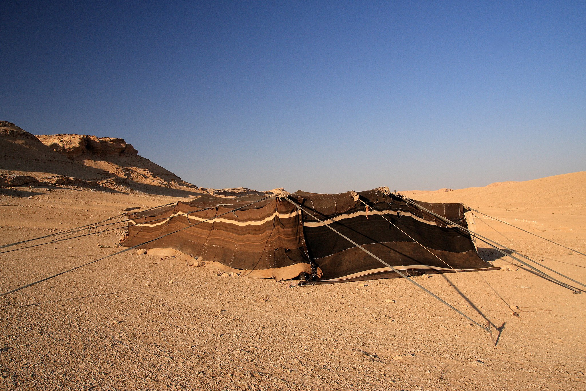
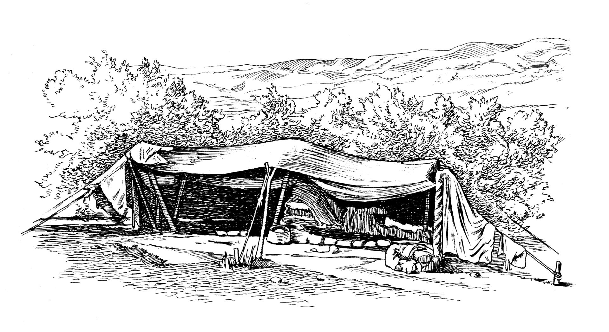

# Human-made Things in the Bible

## License Information

Human-made Things in the Bible © United Bible Societies, 2025. Adapted from: <cite>The Works of Their Hands: Man-made Things in the Bible</cite>, by Ray Pritz © 2009 United Bible Societies. This work is licensed under Creative Commons Attribution-ShareAlike 4.0 International (<a href="https://creativecommons.org/licenses/by-sa/4.0/">https://creativecommons.org/licenses/by-sa/4.0/</a>).

--------------------------------

## Tent (id: REALIA:3.2)

3\.2 Tent
=========

References:
-----------

Hebrew אהל (’ahal (verb))

[GEN 13:12](https://ref.ly/Gen13:12), [GEN 13:18](https://ref.ly/Gen13:18), [ISA 13:20](https://ref.ly/Isa13:20)

Hebrew אֹהֶל (’ohel)

[GEN 4:20](https://ref.ly/Gen4:20), [GEN 9:21](https://ref.ly/Gen9:21), [GEN 9:27](https://ref.ly/Gen9:27), [GEN 12:8](https://ref.ly/Gen12:8), [GEN 13:3](https://ref.ly/Gen13:3), [GEN 13:5](https://ref.ly/Gen13:5), [GEN 18:1](https://ref.ly/Gen18:1), [GEN 18:2](https://ref.ly/Gen18:2), [GEN 18:6](https://ref.ly/Gen18:6), [GEN 18:9](https://ref.ly/Gen18:9), [GEN 18:10](https://ref.ly/Gen18:10), [GEN 24:67](https://ref.ly/Gen24:67), [GEN 25:27](https://ref.ly/Gen25:27), [GEN 26:25](https://ref.ly/Gen26:25), [GEN 31:25](https://ref.ly/Gen31:25), [GEN 31:33](https://ref.ly/Gen31:33), [GEN 31:33](https://ref.ly/Gen31:33), [GEN 31:33](https://ref.ly/Gen31:33), [GEN 31:33](https://ref.ly/Gen31:33), [GEN 31:33](https://ref.ly/Gen31:33), [GEN 31:34](https://ref.ly/Gen31:34), [GEN 33:19](https://ref.ly/Gen33:19), [GEN 35:21](https://ref.ly/Gen35:21), [EXO 18:7](https://ref.ly/Exod18:7), [LEV 14:8](https://ref.ly/Lev14:8), [NUM 11:10](https://ref.ly/Num11:10), [NUM 16:26](https://ref.ly/Num16:26), [NUM 16:27](https://ref.ly/Num16:27), [NUM 19:14](https://ref.ly/Num19:14), [NUM 19:14](https://ref.ly/Num19:14), [NUM 19:14](https://ref.ly/Num19:14), [NUM 19:18](https://ref.ly/Num19:18), [NUM 24:5](https://ref.ly/Num24:5), [DEU 1:27](https://ref.ly/Deut1:27), [DEU 5:30](https://ref.ly/Deut5:30), [DEU 11:6](https://ref.ly/Deut11:6), [DEU 16:7](https://ref.ly/Deut16:7), [JOS 3:14](https://ref.ly/Josh3:14), [JOS 7:21](https://ref.ly/Josh7:21), [JOS 7:22](https://ref.ly/Josh7:22), [JOS 7:22](https://ref.ly/Josh7:22), [JOS 7:23](https://ref.ly/Josh7:23), [JOS 7:24](https://ref.ly/Josh7:24), [JDG 4:11](https://ref.ly/Judg4:11), [JDG 4:17](https://ref.ly/Judg4:17), [JDG 4:18](https://ref.ly/Judg4:18), [JDG 4:20](https://ref.ly/Judg4:20), [JDG 4:21](https://ref.ly/Judg4:21), [JDG 5:24](https://ref.ly/Judg5:24), [JDG 6:5](https://ref.ly/Judg6:5), [JDG 7:13](https://ref.ly/Judg7:13), [JDG 7:13](https://ref.ly/Judg7:13), [JDG 8:11](https://ref.ly/Judg8:11), [1SA 17:54](https://ref.ly/1Sam17:54), [2SA 6:17](https://ref.ly/2Sam6:17), [2SA 7:6](https://ref.ly/2Sam7:6), [2SA 16:22](https://ref.ly/2Sam16:22), [1KI 1:39](https://ref.ly/1Kgs1:39), [2KI 7:7](https://ref.ly/2Kgs7:7), [2KI 7:8](https://ref.ly/2Kgs7:8), [2KI 7:8](https://ref.ly/2Kgs7:8), [2KI 7:10](https://ref.ly/2Kgs7:10), [1CH 4:41](https://ref.ly/1Chr4:41), [1CH 5:10](https://ref.ly/1Chr5:10), [1CH 15:1](https://ref.ly/1Chr15:1), [1CH 16:1](https://ref.ly/1Chr16:1), [1CH 17:5](https://ref.ly/1Chr17:5), [1CH 17:5](https://ref.ly/1Chr17:5), [2CH 1:4](https://ref.ly/2Chr1:4), [2CH 14:14](https://ref.ly/2Chr14:14), [PSA 69:26](https://ref.ly/Ps69:26), [PSA 106:25](https://ref.ly/Ps106:25), [PSA 118:15](https://ref.ly/Ps118:15), [SNG 1:5](https://ref.ly/Song1:5), [ISA 38:12](https://ref.ly/Isa38:12), [ISA 40:22](https://ref.ly/Isa40:22), [ISA 54:2](https://ref.ly/Isa54:2), [JER 6:3](https://ref.ly/Jer6:3), [JER 10:20](https://ref.ly/Jer10:20), [JER 10:20](https://ref.ly/Jer10:20), [JER 35:7](https://ref.ly/Jer35:7), [JER 35:10](https://ref.ly/Jer35:10), [JER 37:10](https://ref.ly/Jer37:10), [JER 49:29](https://ref.ly/Jer49:29), [LAM 2:4](https://ref.ly/Lam2:4), [DAN 11:45](https://ref.ly/Dan11:45), [HOS 12:10](https://ref.ly/Hos12:10), [HAB 3:7](https://ref.ly/Hab3:7)

Hebrew מִשְׁכָּן (mishkan)

[NUM 24:5](https://ref.ly/Num24:5), [PSA 78:28](https://ref.ly/Ps78:28), [SNG 1:8](https://ref.ly/Song1:8), [ISA 54:2](https://ref.ly/Isa54:2), [JER 30:18](https://ref.ly/Jer30:18), [EZK 25:4](https://ref.ly/Ezek25:4)

Hebrew סֻכָּה (sukah)

[2SA 11:11](https://ref.ly/2Sam11:11), [1KI 20:12](https://ref.ly/1Kgs20:12), [1KI 20:16](https://ref.ly/1Kgs20:16)

Hebrew קֻבָּה (qubah)

[NUM 25:8](https://ref.ly/Num25:8)

Greek αὐλή (aulē)

[2MA 13:15](https://ref.ly/2Macc13:15)

Greek προσκήνιον (proskēnion)

[JDT 10:22](https://ref.ly/Jdt10:22)

Greek σκηνή (skēnē)

[HEB 11:9](https://ref.ly/Heb11:9), [JDT 3:3](https://ref.ly/Jdt3:3), [JDT 5:22](https://ref.ly/Jdt5:22), [JDT 6:10](https://ref.ly/Jdt6:10)

Greek σκῆνος (skēnos)

[2CO 5:1](https://ref.ly/2Cor5:1), [2CO 5:4](https://ref.ly/2Cor5:4), [WIS 9:15](https://ref.ly/Wis9:15)

Greek σκήνωμα (skēnōma)

[2PE 1:13](https://ref.ly/2Pet1:13), [2PE 1:14](https://ref.ly/2Pet1:14), [JDT 2:26](https://ref.ly/Jdt2:26), [JDT 9:8](https://ref.ly/Jdt9:8), [JDT 10:18](https://ref.ly/Jdt10:18), [JDT 14:7](https://ref.ly/Jdt14:7), [JDT 15:1](https://ref.ly/Jdt15:1), [1MA 9:66](https://ref.ly/1Macc9:66), [2MA 10:6](https://ref.ly/2Macc10:6), [1ES 1:48](https://ref.ly/1Esd1:48), [ODA 4:7](https://ref.ly/Odes4:7)

Greek σκηνοποιός (skēnopoios (“tentmaker”))

[ACT 18:3](https://ref.ly/Acts18:3)

Description:
------------

*A bedouin tent in the Syrian desert (© yeowatzup, CC BY 2\.0, via Wikimedia Commons)*

The tent was a portable dwelling of cloth and/or skins, held up by poles and secured to the ground by cords tied to stakes. Tents were normally made of cloth woven from the hair of goats.

---

Usage:
------

Tents served as the regular dwelling of nomadic peoples. They could also be used as temporary shelter by soldiers in the field or perhaps by people moving from one permanent house to another.

---

Translation:
------------

*Nomad's tent (© Deutsche Bibelgesellschaft, Stuttgart by United Bible Societies)*

In a number of languages “tent” is rendered “house made of cloth.” Translators should avoid terms that would imply a temporary shelter used only on vacations or holidays. In Old Testament times such tents were permanent dwellings of nomadic groups and were moved from place to place as livestock were transferred from one pasture area to another.

The Hebrew verb *’ahal* means “to pitch a tent” (NIV (New International Version (1984))), “to move a tent” (RSV (Revised Standard Version (1952)), NASB (New American Standard Bible)), “to encamp, camp, set up camp” (GNT (Good News Translation (1992)), TOB (Traduction Oecuménique de la Bible (French, 1975))).

The word *’ohel* serves in Hebrew to describe both dwellings used by nomads and tents used by soldiers on military campaigns (see also [3\.15 Tent of Meeting and Tabernacle\<REALIA:3\.15\>](#)). Where a language distinguishes between the two, the context should be checked carefully. The following passages seem to refer to military tents: [JDG 7:13](https://ref.ly/Judg7:13); [1SA 17:54](https://ref.ly/1Sam17:54); [2KI 7:7](https://ref.ly/2Kgs7:7); [2KI 7:8](https://ref.ly/2Kgs7:8); [2KI 7:9](https://ref.ly/2Kgs7:9); [2KI 7:10](https://ref.ly/2Kgs7:10). It has also been suggested that, in [ACT 18:3](https://ref.ly/Acts18:3) Paul, Aquila and Priscilla made tents for military use, although the Greek word traditionally translated “tentmaker” more properly means “leather worker.”

It should be kept in mind that in Israel’s earlier history, many people lived in tents. The phrase “went to his tent” or “fled to their tents” often means simply “went home”; for example, [2KI 14:12](https://ref.ly/2Kgs14:12) is literally “every man fled to his tent,” but, because the context tells us that they lived in houses, RSV (Revised Standard Version (1952)) says “every man fled to his home.”

The Hebrew word *mishkan* means “dwelling place” and is used most often for the Tabernacle in the wilderness (see [3\.15\.2 Tabernacle\<REALIA:3\.15\.2\>](#)). In the passages listed above it refers specifically to a tent for people to live in (either as nomads or as soldiers). In [NUM 24:5](https://ref.ly/Num24:5); [ISA 54:2](https://ref.ly/Isa54:2); and [JER 30:18](https://ref.ly/Jer30:18)*mishkan* appears in poetic parallelism with a word for “tent.” In these places it will be best to use a general word meaning “dwelling place,” “residence.”

The meaning of the Hebrew word *qubah* in [NUM 25:8](https://ref.ly/Num25:8) is uncertain. Many translations understand it to be a tent, perhaps with a high dome (GNT (Good News Translation (1992)), NIV (New International Version (1984)), KJV (King James Version (1611)), NASB (New American Standard Bible)), while others take it to be a partition or room in a tent (RSV (Revised Standard Version (1952)), NEB (New English Bible (1970))). Some translations (TOB (Traduction Oecuménique de la Bible (French, 1975)), SPCL (Spanish Common Language Version (Dios Habla Hoy))) believe it is a bedroom, but they give a footnote describing it to be a special tent dedicated to pagan religious rites, such as prostitution or divination. There seems no way to be certain which understanding is correct, so the translator will just need to choose one of them.

[2MA 13:15](https://ref.ly/2Macc13:15): Originally the Greek word *aulē* referred to a courtyard and later to the court of a king. The context of this verse speaks of the part of the encampment where the king was located, so GNT (Good News Translation (1992)) says “the area near the king’s tent.” Most others have “the king’s pavilion” (RSV (Revised Standard Version (1952))). At best the word “pavilion” will be obscure; at worst (in British English, for example) it could be misunderstood. Translators should follow GNT (Good News Translation (1992)) or say something like “the camp where Antiochus’ headquarters were located” (ITCL (Italian Common Language Version)).

The Greek word *proskēnion* in [JDT 10:22](https://ref.ly/Jdt10:22) refers to an area just inside the entrance to a tent. GNT (Good News Translation (1992)) renders it “outer part of the tent,” NJB (New Jerusalem Bible (1985)) has “entrance to the tent,” and NAB (New American Bible (1970)) says “antechamber.”

* **Associated Passages:** Genesis 13:12; Genesis 13:18; Isaiah 13:20; Genesis 4:20; Genesis 9:21; Genesis 9:27; Genesis 12:8; Genesis 13:3; Genesis 13:5; Genesis 18:1; Genesis 18:2; Genesis 18:6; Genesis 18:9; Genesis 18:10; Genesis 24:67; Genesis 25:27; Genesis 26:25; Genesis 31:25; Genesis 31:33; Genesis 31:34; Genesis 33:19; Genesis 35:21; Exodus 18:7; Leviticus 14:8; Numbers 11:10; Numbers 16:26; Numbers 16:27; Numbers 19:14; Numbers 19:18; Numbers 24:5; Deuteronomy 1:27; Deuteronomy 5:30; Deuteronomy 11:6; Deuteronomy 16:7; Joshua 3:14; Joshua 7:21; Joshua 7:22; Joshua 7:23; Joshua 7:24; Judges 4:11; Judges 4:17; Judges 4:18; Judges 4:20; Judges 4:21; Judges 5:24; Judges 6:5; Judges 7:13; Judges 8:11; 1 Samuel 17:54; 2 Samuel 6:17; 2 Samuel 7:6; 2 Samuel 16:22; 1 Kings 1:39; 2 Kings 7:7; 2 Kings 7:8; 2 Kings 7:10; 1 Chronicles 4:41; 1 Chronicles 5:10; 1 Chronicles 15:1; 1 Chronicles 16:1; 1 Chronicles 17:5; 2 Chronicles 1:4; 2 Chronicles 14:14; Psalms 69:26; Psalms 106:25; Psalms 118:15; Song of Songs 1:5; Isaiah 38:12; Isaiah 40:22; Isaiah 54:2; Jeremiah 6:3; Jeremiah 10:20; Jeremiah 35:7; Jeremiah 35:10; Jeremiah 37:10; Jeremiah 49:29; Lamentations 2:4; Daniel 11:45; Hosea 12:10; Habakkuk 3:7; Psalms 78:28; Song of Songs 1:8; Jeremiah 30:18; Ezekiel 25:4; 2 Samuel 11:11; 1 Kings 20:12; 1 Kings 20:16; Numbers 25:8; 2 Maccabees 13:15; Judith 10:22; Hebrews 11:9; Judith 3:3; Judith 5:22; Judith 6:10; 2 Corinthians 5:1; 2 Corinthians 5:4; Wisdom of Solomon 9:15; 2 Peter 1:13; 2 Peter 1:14; Judith 2:26; Judith 9:8; Judith 10:18; Judith 14:7; Judith 15:1; 1 Maccabees 9:66; 2 Maccabees 10:6; 1 Esdras (Greek) 1:48; Odae/Odes 4:7; Acts 18:3; 2 Kings 7:9; 2 Kings 14:12

