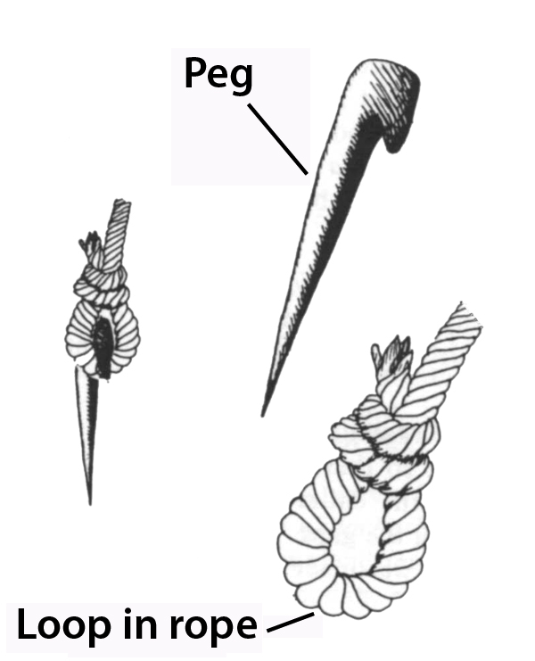
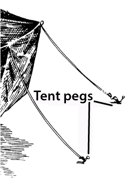

# Human-made Things in the Bible

## License Information

Human-made Things in the Bible © United Bible Societies, 2025. Adapted from: <cite>The Works of Their Hands: Man-made Things in the Bible</cite>, by Ray Pritz © 2009 United Bible Societies. This work is licensed under Creative Commons Attribution-ShareAlike 4.0 International (<a href="https://creativecommons.org/licenses/by-sa/4.0/">https://creativecommons.org/licenses/by-sa/4.0/</a>).

--------------------------------

## Tent peg, stake (id: REALIA:3.2.2)

3\.2\.2 Tent peg, stake
=======================

References:
-----------

Hebrew יָתֵד (yathed)

[EXO 27:19](https://ref.ly/Exod27:19), [EXO 27:19](https://ref.ly/Exod27:19), [EXO 35:18](https://ref.ly/Exod35:18), [EXO 35:18](https://ref.ly/Exod35:18), [EXO 38:20](https://ref.ly/Exod38:20), [EXO 38:31](https://ref.ly/Exod38:31), [EXO 38:31](https://ref.ly/Exod38:31), [EXO 39:40](https://ref.ly/Exod39:40), [NUM 3:37](https://ref.ly/Num3:37), [NUM 4:32](https://ref.ly/Num4:32), [JDG 4:21](https://ref.ly/Judg4:21), [JDG 4:21](https://ref.ly/Judg4:21), [JDG 4:22](https://ref.ly/Judg4:22), [JDG 5:26](https://ref.ly/Judg5:26), [EZR 9:8](https://ref.ly/Ezra9:8), [ISA 33:20](https://ref.ly/Isa33:20), [ISA 54:2](https://ref.ly/Isa54:2), [ZEC 10:4](https://ref.ly/Zech10:4)

Greek πάσσαλος (passalos)

[SIR 14:24](https://ref.ly/Sir14:24), [SIR 26:12](https://ref.ly/Sir26:12), [SIR 27:2](https://ref.ly/Sir27:2)

Description and usage:
----------------------

*Peg, loop in rope (Source unknown)*

The tent peg was a shortened stick, pointed on one end. It was driven into the ground, and tent ropes were tied to it to anchor the tent in place. See the illustrations at [3\.2 Tent\<REALIA:3\.2\>](#).

---

Translation:
------------

The stakes of the Tabernacle, mentioned in Exodus and Numbers, were made of bronze. They were used to anchor the various coverings of the Tabernacle (see [3\.15\.2\.3\.6 Coverings\<REALIA:3\.15\.2\.3\.6\>](#)) and also some of the standing posts (see [3\.15\.2\.3\.3 Upright beam, tenon, crosspiece, rung\<REALIA:3\.15\.2\.3\.3\>](#)).

The tent stake provided security. It guaranteed that the tent would not fall nor be blown out of its place by winds. Thus it is sometimes a symbol of stability and security. This element of security may be reflected in translation in [EZR 9:8](https://ref.ly/Ezra9:8) and [ISA 33:20](https://ref.ly/Isa33:20); for example, in [EZR 9:8](https://ref.ly/Ezra9:8) the literal clause “to give us a tent peg within the place of his holiness” is rendered by RSV (Revised Standard Version (1952)) as “to give us a secure hold within his holy place,” and GNT (Good News Translation (1992)) has “live in safety in this holy place.”

*Tent pegs (Don Ellens, The Tabernacle of Israel, Harris, Jones 1888, Public domain)*

or another sense of the Hebrew word *yathed* in [JDG 16:14](https://ref.ly/Judg16:14), see [1\.5\.3\.5 Beater, batten, pin\<REALIA:1\.5\.3\.5\>](#).

[SIR 14:24](https://ref.ly/Sir14:24): The Greek word *passalos* refers to a tent peg. The Hebrew version of Sirach has a word that, with a very slight emendation of part of one letter, could mean “tent cords” or “tent pegs.” With either reading, the basic meaning remains the same and is expressed well by GNT (Good News Translation (1992)): “Camp as close to her house as you can get.” If translators wish to maintain the image of the tent and the house, they may say “he attaches his tent to the wall of her house.”

* **Associated Passages:** Exodus 27:19; Exodus 35:18; Exodus 38:20; Exodus 38:31; Exodus 39:40; Numbers 3:37; Numbers 4:32; Judges 4:21; Judges 4:22; Judges 5:26; Ezra 9:8; Isaiah 33:20; Isaiah 54:2; Zechariah 10:4; Sirach 14:24; Sirach 26:12; Sirach 27:2; Judges 16:14

