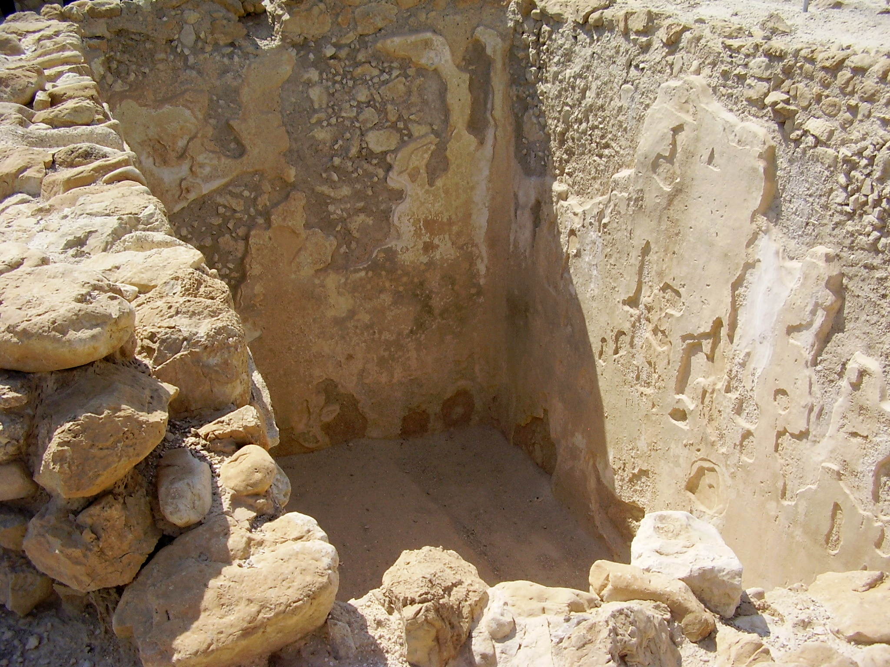

# Human-made Things in the Bible

## License Information

Human-made Things in the Bible © United Bible Societies, 2025. Adapted from: <cite>The Works of Their Hands: Man-made Things in the Bible</cite>, by Ray Pritz © 2009 United Bible Societies. This work is licensed under Creative Commons Attribution-ShareAlike 4.0 International (<a href="https://creativecommons.org/licenses/by-sa/4.0/">https://creativecommons.org/licenses/by-sa/4.0/</a>).

--------------------------------

## Cistern (id: REALIA:3.9)

3\.9 Cistern
============

References:
-----------

Hebrew בֹּאר (bo’r)

2SA 23:20, JER 2:13, JER 2:13

Hebrew בּוֹר (bor)

GEN 37:20, GEN 37:22, GEN 37:24, GEN 37:24, GEN 37:28, GEN 37:29, GEN 37:29, GEN 40:15, GEN 41:14, EXO 12:29, EXO 21:33, EXO 21:33, EXO 21:34, LEV 11:36, DEU 6:11, 1SA 13:6, 1SA 19:22, 2SA 23:15, 2SA 23:16, 2SA 23:20, 2KI 10:14, 2KI 18:31, 1CH 11:17, 1CH 11:18, 1CH 11:22, 2CH 26:10, NEH 9:25, PSA 7:16, PSA 28:1, PSA 30:4, PSA 40:3, PSA 88:5, PSA 88:7, PSA 143:7, PRO 1:12, PRO 5:15, PRO 28:17, ECC 12:6, ISA 14:15, ISA 14:19, ISA 24:22, ISA 36:16, ISA 38:18, ISA 51:1, JER 2:13, JER 2:13, JER 6:7, JER 37:16, JER 38:6, JER 38:6, JER 38:7, JER 38:9, JER 38:10, JER 38:11, JER 38:13, JER 41:7, JER 41:9, LAM 3:53, LAM 3:55, EZK 26:20, EZK 26:20, EZK 31:14, EZK 31:16, EZK 32:18, EZK 32:23, EZK 32:24, EZK 32:25, EZK 32:29, EZK 32:30, ZEC 9:11

Hebrew גֵּב (gev)

JER 14:3

Greek ἀποδοχεῖον (apodocheion)

SIR 50:3

Greek λάκκος (lakkos)

JDT 7:21, JDT 8:31, SIR 50:3, 2MA 10:37

Greek φρέαρ (frear)

1MA 7:19, 2MA 1:19

Description:
------------

*Water cistern with plaster walls (© צילום:ד"ר אבישי טייכר, CC BY 2\.5, via Wikimedia Commons)*

The cistern was a pit hollowed out of solid rock for the purpose of storing water. Cisterns could be 6 meters (20 feet) across and 6 meters (20 feet) deep or even larger. In earliest times they were hewn out of rock that did not allow water to seep through it. With the discovery how to make plaster, cisterns could be dug in many kinds of rock and then lined with plaster, which sealed any holes or cracks.

---

Usage:
------

In the land of Israel, almost all of the annual rain falls between the months of November and March. Cisterns served to store excess rainwater or water from springs that dried up in the summer. The stored water could be used during the dry months of the year.

---

Translation:
------------

A cistern differed from a well in that a cistern received water that flowed to it from a source removed from it at some distance, while the water in a well accumulated from its immediate vicinity. It is not always clear from the context whether a well or a cistern is intended in the passages listed above; for example, in NEH 9:25NIV (New International Version (1984)), TOB (Traduction Oecuménique de la Bible (French, 1975)) and NCV (New Century Version) have “wells,” while RSV (Revised Standard Version (1952)), GNT (Good News Translation (1992)) and CEV (Contemporary English Version) have “cisterns.” Similar uncertainty exists for most of the above references to the Hebrew word *bor*. In some cases *bor* can refer to a “pit” that occurs naturally. This may be true of the *bor* into which Joseph was thrown by his brothers in GEN 37:0. Some translations have “cistern” (NIV (New International Version (1984)), FRCL (French Common Language Version (Bible en français courant)), GECL (German Common Language Version (Gute Nachricht Bibel))), some say “well” (GNT (Good News Translation (1992)), CEV (Contemporary English Version)), while others are noncommittal with “pit” (RSV (Revised Standard Version (1952)), NASB (New American Standard Bible)).

It is possible to render “cistern” with a descriptive phrase such as “hollowed place in a rock for storing water.” In 2CH 26:10CEV (Contemporary English Version) provides a helpful model for the clause “he dug cisterns” by expanding it as follows: “he had cisterns dug there to catch the rainwater.” In JER 2:13CEV (Contemporary English Version) says “you’ve tried to collect water in cracked and leaking pits dug in the ground.”

PRO 5:15: See the comments on this verse at [3\.8 Well\<REALIA:3\.8\>](#).

ECC 12:6: For the last clause in this verse, RSV (Revised Standard Version (1952)) has “the wheel broken at the cistern.” This rendering is uncertain and translations differ. At the end of this verse the Hebrew text has two parallel clauses, which are literally “the jar will be shattered at the spring, and the wheel will be broken at the cistern.” Most translators and commentators understand the Hebrew word *galgal* (“wheel”) to refer to a kind of pulley that aided in lifting the water container at a well; for example, for the last clause CEV (Contemporary English Version) has “the pulley at the well is shattered” (similarly NJB (New Jerusalem Bible (1985)), NAB (New American Bible (1970)), ITCL (Italian Common Language Version)). Scott points out that the parallelism demands that *galgal* correspond to *kad*, which is a clay pitcher or jar. However, in his own translation he has “the water wheel broken at the cistern” (page 254\). GNT (Good News Translation (1992)) seems to reverse the last two clauses in order to follow the order of events: “the rope at the well will break, and the water jar will be shattered.” It is probably best to treat the “wheel” as a pulley. Where a pulley wheel is unknown, translators may follow the GNT (Good News Translation (1992)) model. However, even if you follow GNT (Good News Translation (1992)), a note may be necessary to explain that the rope was used to pull up a water container attached to it.

* **Associated Passages:** 2 Samuel 23:20; Jeremiah 2:13; Genesis 37:20; Genesis 37:22; Genesis 37:24; Genesis 37:28; Genesis 37:29; Genesis 40:15; Genesis 41:14; Exodus 12:29; Exodus 21:33; Exodus 21:34; Leviticus 11:36; Deuteronomy 6:11; 1 Samuel 13:6; 1 Samuel 19:22; 2 Samuel 23:15; 2 Samuel 23:16; 2 Kings 10:14; 2 Kings 18:31; 1 Chronicles 11:17; 1 Chronicles 11:18; 1 Chronicles 11:22; 2 Chronicles 26:10; Nehemiah 9:25; Psalms 7:16; Psalms 28:1; Psalms 30:4; Psalms 40:3; Psalms 88:5; Psalms 88:7; Psalms 143:7; Proverbs 1:12; Proverbs 5:15; Proverbs 28:17; Ecclesiastes 12:6; Isaiah 14:15; Isaiah 14:19; Isaiah 24:22; Isaiah 36:16; Isaiah 38:18; Isaiah 51:1; Jeremiah 6:7; Jeremiah 37:16; Jeremiah 38:6; Jeremiah 38:7; Jeremiah 38:9; Jeremiah 38:10; Jeremiah 38:11; Jeremiah 38:13; Jeremiah 41:7; Jeremiah 41:9; Lamentations 3:53; Lamentations 3:55; Ezekiel 26:20; Ezekiel 31:14; Ezekiel 31:16; Ezekiel 32:18; Ezekiel 32:23; Ezekiel 32:24; Ezekiel 32:25; Ezekiel 32:29; Ezekiel 32:30; Zechariah 9:11; Jeremiah 14:3; Sirach 50:3; Judith 7:21; Judith 8:31; 2 Maccabees 10:37; 1 Maccabees 7:19; 2 Maccabees 1:19; Genesis 37:0

* **Associated ACAI Concepts:** Pit (ID: `realia:Pit`)
