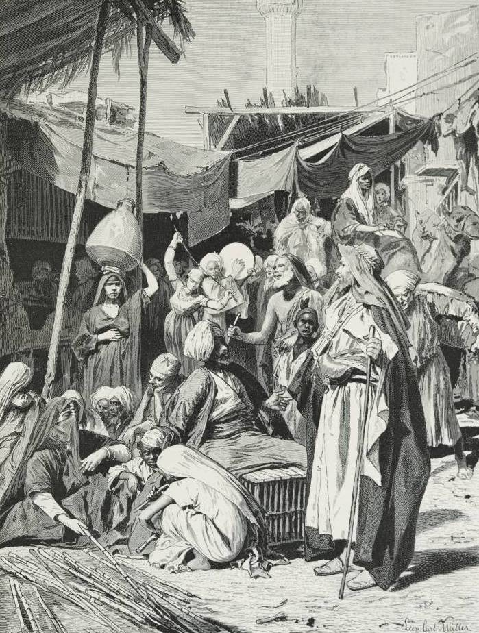

# Human-made Things in the Bible

## License Information

Human-made Things in the Bible © United Bible Societies, 2025. Adapted from: <cite>The Works of Their Hands: Man-made Things in the Bible</cite>, by Ray Pritz © 2009 United Bible Societies. This work is licensed under Creative Commons Attribution-ShareAlike 4.0 International (<a href="https://creativecommons.org/licenses/by-sa/4.0/">https://creativecommons.org/licenses/by-sa/4.0/</a>).

--------------------------------

## Square, marketplace (id: REALIA:3.13.2)

3\.13\.2 Square, marketplace
============================

References:
-----------

Hebrew רְחֹב (rchov)

[GEN 19:2](https://ref.ly/Gen19:2), [DEU 13:17](https://ref.ly/Deut13:17), [JDG 19:15](https://ref.ly/Judg19:15), [JDG 19:17](https://ref.ly/Judg19:17), [JDG 19:20](https://ref.ly/Judg19:20), [2SA 21:12](https://ref.ly/2Sam21:12), [2CH 29:4](https://ref.ly/2Chr29:4), [2CH 32:6](https://ref.ly/2Chr32:6), [EZR 10:9](https://ref.ly/Ezra10:9), [NEH 8:1](https://ref.ly/Neh8:1), [NEH 8:3](https://ref.ly/Neh8:3), [NEH 8:16](https://ref.ly/Neh8:16), [NEH 8:16](https://ref.ly/Neh8:16), [EST 4:6](https://ref.ly/Esth4:6), [EST 6:9](https://ref.ly/Esth6:9), [EST 6:11](https://ref.ly/Esth6:11), [JOB 29:7](https://ref.ly/Job29:7), [PSA 55:12](https://ref.ly/Ps55:12), [PSA 144:14](https://ref.ly/Ps144:14), [PRO 1:20](https://ref.ly/Prov1:20), [PRO 5:16](https://ref.ly/Prov5:16), [PRO 7:12](https://ref.ly/Prov7:12), [PRO 22:13](https://ref.ly/Prov22:13), [PRO 26:13](https://ref.ly/Prov26:13), [SNG 3:2](https://ref.ly/Song3:2), [ISA 15:3](https://ref.ly/Isa15:3), [ISA 59:14](https://ref.ly/Isa59:14), [JER 5:1](https://ref.ly/Jer5:1), [JER 9:20](https://ref.ly/Jer9:20), [JER 48:38](https://ref.ly/Jer48:38), [JER 49:26](https://ref.ly/Jer49:26), [JER 50:30](https://ref.ly/Jer50:30), [LAM 2:11](https://ref.ly/Lam2:11), [LAM 2:12](https://ref.ly/Lam2:12), [LAM 4:18](https://ref.ly/Lam4:18), [EZK 16:24](https://ref.ly/Ezek16:24), [EZK 16:31](https://ref.ly/Ezek16:31), [DAN 9:25](https://ref.ly/Dan9:25), [AMO 5:16](https://ref.ly/Amos5:16), [NAM 2:5](https://ref.ly/Nah2:5), [ZEC 8:4](https://ref.ly/Zech8:4), [ZEC 8:5](https://ref.ly/Zech8:5), [ZEC 8:5](https://ref.ly/Zech8:5)

Greek ἀγορά (agora)

[MAT 11:16](https://ref.ly/Matt11:16), [MAT 20:3](https://ref.ly/Matt20:3), [MAT 23:7](https://ref.ly/Matt23:7), [MRK 6:56](https://ref.ly/Mark6:56), [MRK 7:4](https://ref.ly/Mark7:4), [MRK 12:38](https://ref.ly/Mark12:38), [LUK 7:32](https://ref.ly/Luke7:32), [LUK 11:43](https://ref.ly/Luke11:43), [LUK 20:46](https://ref.ly/Luke20:46), [ACT 16:19](https://ref.ly/Acts16:19), [ACT 17:17](https://ref.ly/Acts17:17), [TOB 2:3](https://ref.ly/Tob2:3), [2MA 10:2](https://ref.ly/2Macc10:2), [1ES 2:14](https://ref.ly/1Esd2:14)

Greek ἀγορανομία (agoranomia)

[2MA 3:4](https://ref.ly/2Macc3:4)

Greek εὐρύχωρος (euruchōros)

[1ES 5:46](https://ref.ly/1Esd5:46), [1ES 9:6](https://ref.ly/1Esd9:6), [1ES 9:38](https://ref.ly/1Esd9:38), [1ES 9:41](https://ref.ly/1Esd9:41)

Description:
------------

*Marketplace inside Tantah (© Leopold Carl Müller \- Wikimedia Commons)*

The square was an open place in a town or city, often formed by the intersection of two or more streets (see [3\.13\.1 Street, road, path, way, track\<REALIA:3\.13\.1\>](#)). Like the streets, the square was usually unpaved, only sometimes paved with stones. The square was open to the sky and often served as a gathering place for the inhabitants of the city. One of the squares of a town usually served as a marketplace, a central location for bartering, buying, and selling.

---

Translation:
------------

Many cultures, where people live in permanent settlements, will know an open place in the middle of a settlement used for public gatherings.

In biblical times one such open area, which was often the most important one in the city, stood inside the city wall, near the gates. In this place, town administration meetings ([DEU 21:19](https://ref.ly/Deut21:19)), legal transactions ([RUT 4:1](https://ref.ly/Ruth4:1), [RUT 4:11](https://ref.ly/Ruth4:11)), and markets ([2KI 7:1](https://ref.ly/2Kgs7:1), [2KI 7:18](https://ref.ly/2Kgs7:18)) were held (see [3\.13\.3\.5 City gate\<REALIA:3\.13\.3\.5\>](#)). It will sometimes be possible in translation to indicate the place by the activity that is taking place there rather than by a word that corresponds to “square.” A good example of this is the way GNT (Good News Translation (1992)) renders [JOB 29:7](https://ref.ly/Job29:7). The Hebrew reads literally “When I went out to the gate of the city, when I prepared my seat in the square” (RSV (Revised Standard Version (1952))); GNT (Good News Translation (1992)) says “Whenever the city elders met and I took my place among them.” Compare also GNT (Good News Translation (1992)) at [PRO 7:12](https://ref.ly/Prov7:12): “or stood waiting at a corner, sometimes in the streets, sometimes in the marketplace.”

While most translations and commentaries understand the Hebrew word *rchov* to mean “city square,” some understand it in the more general sense of “street” in some passages (and this indeed has become its only meaning in modern Hebrew); for example, KJV (King James Version (1611)) renders it “street\[s]” in all but three instances, and NIV (New International Version (1984)), while usually rendering *rchov* as “square\[s],” has “streets” in about one\-third of its appearances. By way of example, most translations render *rchovoth* in [DAN 9:25](https://ref.ly/Dan9:25) as “streets”; some common\-language translations (GECL (German Common Language Version (Gute Nachricht Bibel)), FRCL (French Common Language Version (Bible en français courant)), ITCL (Italian Common Language Version)) avoid a direct translation of *rchovoth* by speaking of “Jerusalem” being reconstructed.

* **Associated Passages:** Genesis 19:2; Deuteronomy 13:17; Judges 19:15; Judges 19:17; Judges 19:20; 2 Samuel 21:12; 2 Chronicles 29:4; 2 Chronicles 32:6; Ezra 10:9; Nehemiah 8:1; Nehemiah 8:3; Nehemiah 8:16; Esther 4:6; Esther 6:9; Esther 6:11; Job 29:7; Psalms 55:12; Psalms 144:14; Proverbs 1:20; Proverbs 5:16; Proverbs 7:12; Proverbs 22:13; Proverbs 26:13; Song of Songs 3:2; Isaiah 15:3; Isaiah 59:14; Jeremiah 5:1; Jeremiah 9:20; Jeremiah 48:38; Jeremiah 49:26; Jeremiah 50:30; Lamentations 2:11; Lamentations 2:12; Lamentations 4:18; Ezekiel 16:24; Ezekiel 16:31; Daniel 9:25; Amos 5:16; Nahum 2:5; Zechariah 8:4; Zechariah 8:5; Matthew 11:16; Matthew 20:3; Matthew 23:7; Mark 6:56; Mark 7:4; Mark 12:38; Luke 7:32; Luke 11:43; Luke 20:46; Acts 16:19; Acts 17:17; Tobit 2:3; 2 Maccabees 10:2; 1 Esdras (Greek) 2:14; 2 Maccabees 3:4; 1 Esdras (Greek) 5:46; 1 Esdras (Greek) 9:6; 1 Esdras (Greek) 9:38; 1 Esdras (Greek) 9:41; Deuteronomy 21:19; Ruth 4:1; Ruth 4:11; 2 Kings 7:1; 2 Kings 7:18

