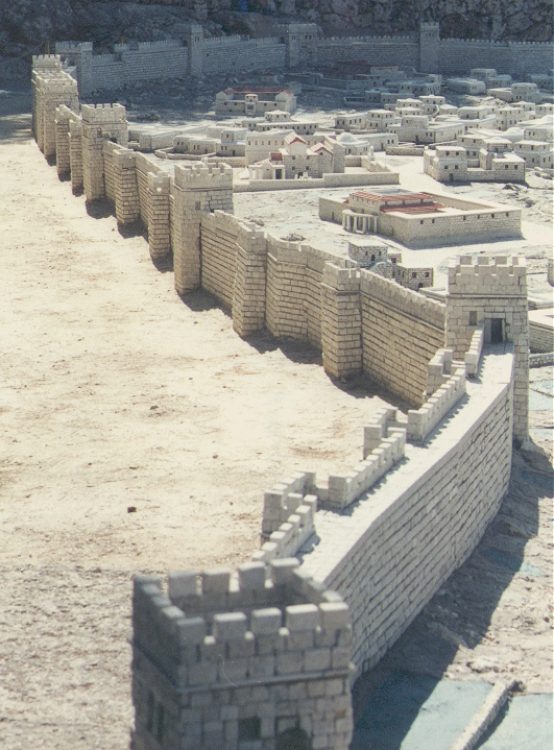
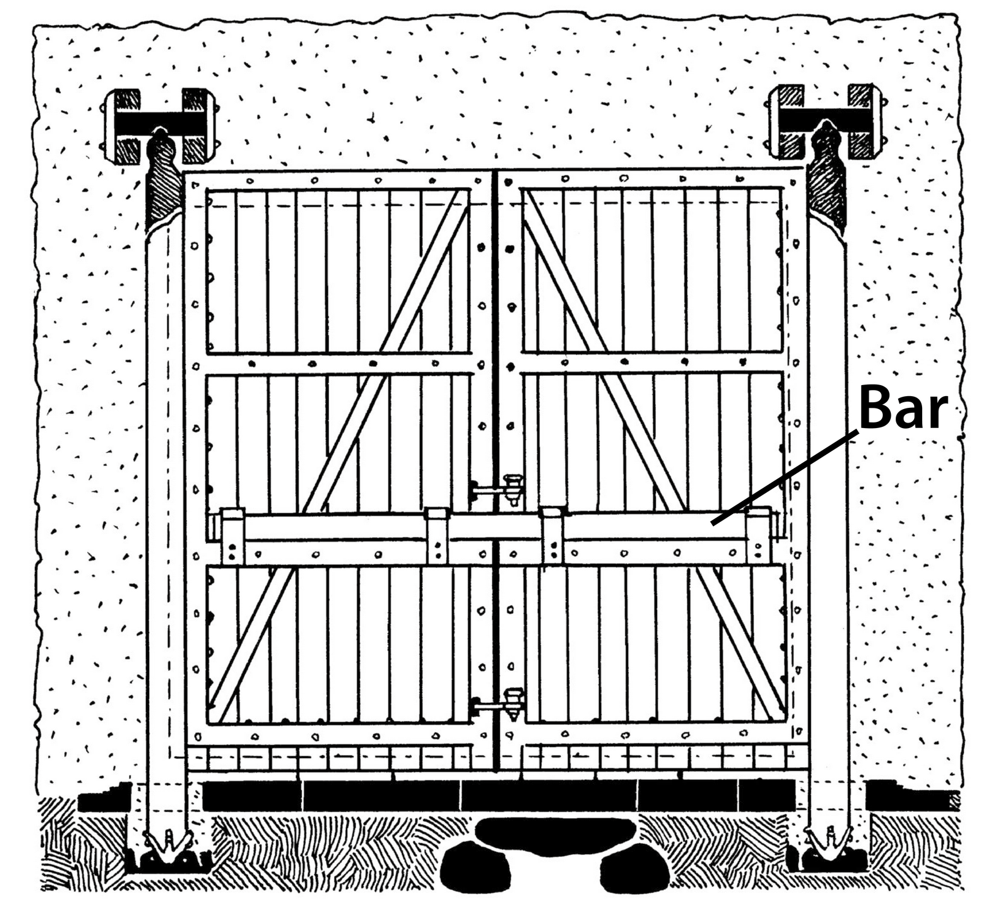

# Human-made Things in the Bible

## License Information

Human-made Things in the Bible © United Bible Societies, 2025. Adapted from: <cite>The Works of Their Hands: Man-made Things in the Bible</cite>, by Ray Pritz © 2009 United Bible Societies. This work is licensed under Creative Commons Attribution-ShareAlike 4.0 International (<a href="https://creativecommons.org/licenses/by-sa/4.0/">https://creativecommons.org/licenses/by-sa/4.0/</a>).

--------------------------------

## City fortifications (id: REALIA:3.13.3)

3\.13\.3 City fortifications
============================

Ancient cities were often built with special fortifications to protect the inhabitants from attacks from the outside. Sometimes the fortifications were natural, for example, on the top of a steep hill or next to a river. Man\-made fortifications included at least a high, thick wall, usually made of bricks or stones. A city wall had one or more entrances, which were closed with gates. The gates were usually made of wood. The entranceway itself was often quite complex, involving one or more turns and several guardrooms. The gate, as well as the rest of the wall, could be supplemented with towers that stood up higher than the wall. These towers served both as vantage points from which to see someone approaching from a distance and also as high points from which missiles could be dropped or thrown on an attacking enemy.
-----------------------------------------------------------------------------------------------------------------------------------------------------------------------------------------------------------------------------------------------------------------------------------------------------------------------------------------------------------------------------------------------------------------------------------------------------------------------------------------------------------------------------------------------------------------------------------------------------------------------------------------------------------------------------------------------------------------------------------------------------------------------------------------------------------------------------------------------------------

## City wall, rampart, battlement (id: REALIA:3.13.3.1)

3\.13\.3\.1 City wall, rampart, battlement
==========================================

References:
-----------

Hebrew גְּבוּל (gvul)

[ISA 54:12](https://ref.ly/Isa54:12)

Hebrew גָּדֵר (gader)

[MIC 7:11](https://ref.ly/Mic7:11)

Hebrew חֵיל, חַיִל (chel, chayil, cheylah)

[2SA 20:15](https://ref.ly/2Sam20:15), [1KI 21:23](https://ref.ly/1Kgs21:23), [PSA 48:14](https://ref.ly/Ps48:14), [PSA 122:7](https://ref.ly/Ps122:7), [ISA 26:1](https://ref.ly/Isa26:1), [LAM 2:8](https://ref.ly/Lam2:8), [NAM 3:8](https://ref.ly/Nah3:8)

Hebrew חוֹמָה (chomah)

[EXO 14:22](https://ref.ly/Exod14:22), [EXO 14:29](https://ref.ly/Exod14:29), [LEV 25:29](https://ref.ly/Lev25:29), [LEV 25:30](https://ref.ly/Lev25:30), [LEV 25:31](https://ref.ly/Lev25:31), [DEU 3:5](https://ref.ly/Deut3:5), [DEU 28:52](https://ref.ly/Deut28:52), [JOS 6:5](https://ref.ly/Josh6:5), [JOS 6:20](https://ref.ly/Josh6:20), [1SA 31:10](https://ref.ly/1Sam31:10), [1SA 31:12](https://ref.ly/1Sam31:12), [2SA 11:20](https://ref.ly/2Sam11:20), [2SA 11:21](https://ref.ly/2Sam11:21), [2SA 11:21](https://ref.ly/2Sam11:21), [2SA 11:24](https://ref.ly/2Sam11:24), [2SA 18:24](https://ref.ly/2Sam18:24), [2SA 20:15](https://ref.ly/2Sam20:15), [2SA 20:21](https://ref.ly/2Sam20:21), [2KI 3:27](https://ref.ly/2Kgs3:27), [2KI 6:26](https://ref.ly/2Kgs6:26), [2KI 6:30](https://ref.ly/2Kgs6:30), [2KI 14:13](https://ref.ly/2Kgs14:13), [2KI 18:26](https://ref.ly/2Kgs18:26), [2KI 18:27](https://ref.ly/2Kgs18:27), [2KI 25:4](https://ref.ly/2Kgs25:4), [2CH 8:5](https://ref.ly/2Chr8:5), [2CH 14:6](https://ref.ly/2Chr14:6), [2CH 25:23](https://ref.ly/2Chr25:23), [2CH 26:6](https://ref.ly/2Chr26:6), [2CH 26:6](https://ref.ly/2Chr26:6), [2CH 26:6](https://ref.ly/2Chr26:6), [2CH 27:3](https://ref.ly/2Chr27:3), [2CH 32:5](https://ref.ly/2Chr32:5), [2CH 32:18](https://ref.ly/2Chr32:18), [2CH 33:14](https://ref.ly/2Chr33:14), [2CH 36:19](https://ref.ly/2Chr36:19), [PSA 51:20](https://ref.ly/Ps51:20), [PSA 55:11](https://ref.ly/Ps55:11), [PRO 25:28](https://ref.ly/Prov25:28), [SNG 5:7](https://ref.ly/Song5:7), [SNG 8:9](https://ref.ly/Song8:9), [SNG 8:10](https://ref.ly/Song8:10), [ISA 2:15](https://ref.ly/Isa2:15), [ISA 22:10](https://ref.ly/Isa22:10), [ISA 22:11](https://ref.ly/Isa22:11), [ISA 26:1](https://ref.ly/Isa26:1), [ISA 30:13](https://ref.ly/Isa30:13), [ISA 36:11](https://ref.ly/Isa36:11), [ISA 36:12](https://ref.ly/Isa36:12), [ISA 49:16](https://ref.ly/Isa49:16), [ISA 56:5](https://ref.ly/Isa56:5), [ISA 60:10](https://ref.ly/Isa60:10), [ISA 60:18](https://ref.ly/Isa60:18), [ISA 62:6](https://ref.ly/Isa62:6), [JER 1:15](https://ref.ly/Jer1:15), [JER 1:18](https://ref.ly/Jer1:18), [JER 15:20](https://ref.ly/Jer15:20), [JER 21:4](https://ref.ly/Jer21:4), [JER 52:7](https://ref.ly/Jer52:7), [JER 52:14](https://ref.ly/Jer52:14), [LAM 2:8](https://ref.ly/Lam2:8), [LAM 2:8](https://ref.ly/Lam2:8), [LAM 2:18](https://ref.ly/Lam2:18), [EZK 26:4](https://ref.ly/Ezek26:4), [EZK 26:9](https://ref.ly/Ezek26:9), [EZK 26:10](https://ref.ly/Ezek26:10), [EZK 26:12](https://ref.ly/Ezek26:12), [EZK 27:11](https://ref.ly/Ezek27:11), [EZK 27:11](https://ref.ly/Ezek27:11), [EZK 38:11](https://ref.ly/Ezek38:11), [EZK 38:20](https://ref.ly/Ezek38:20), [JOL 2:7](https://ref.ly/Joel2:7), [JOL 2:9](https://ref.ly/Joel2:9), [AMO 1:7](https://ref.ly/Amos1:7), [AMO 1:10](https://ref.ly/Amos1:10), [AMO 1:14](https://ref.ly/Amos1:14), [AMO 7:7](https://ref.ly/Amos7:7), [NAM 2:6](https://ref.ly/Nah2:6), [NAM 3:8](https://ref.ly/Nah3:8), [ZEC 2:9](https://ref.ly/Zech2:9)

Hebrew מְצוּרָה (mtsurah)

[NAM 2:2](https://ref.ly/Nah2:2)

Hebrew קִיר (qir)

[NUM 22:25](https://ref.ly/Num22:25), [NUM 22:25](https://ref.ly/Num22:25), [NUM 35:4](https://ref.ly/Num35:4), [JOS 2:15](https://ref.ly/Josh2:15), [ISA 25:4](https://ref.ly/Isa25:4)

Hebrew שׁוּר (shur)

[2SA 22:30](https://ref.ly/2Sam22:30), [EZR 4:12](https://ref.ly/Ezra4:12), [EZR 4:12](https://ref.ly/Ezra4:12), [EZR 4:13](https://ref.ly/Ezra4:13), [EZR 4:16](https://ref.ly/Ezra4:16), [PSA 18:30](https://ref.ly/Ps18:30)

Greek ἔπαλξις (epalxis)

[JDT 14:1](https://ref.ly/Jdt14:1), [SIR 9:13](https://ref.ly/Sir9:13)

Greek προμαχών (promachōn)

[TOB 13:17](https://ref.ly/Tob13:17)

Greek τεῖχος (teichos)

[ACT 9:25](https://ref.ly/Acts9:25), [2CO 11:33](https://ref.ly/2Cor11:33), [HEB 11:30](https://ref.ly/Heb11:30), [REV 21:12](https://ref.ly/Rev21:12), [REV 21:14](https://ref.ly/Rev21:14), [REV 21:15](https://ref.ly/Rev21:15), [REV 21:17](https://ref.ly/Rev21:17), [REV 21:18](https://ref.ly/Rev21:18), [REV 21:19](https://ref.ly/Rev21:19), [TOB 1:17](https://ref.ly/Tob1:17), [TOB 13:17](https://ref.ly/Tob13:17), [JDT 1:2](https://ref.ly/Jdt1:2), [JDT 1:2](https://ref.ly/Jdt1:2), [JDT 7:32](https://ref.ly/Jdt7:32)

Greek χάραξ (charax)

[4MA 3:12](https://ref.ly/4Macc3:12)

Latin murus

[2ES 2:22](https://ref.ly/2Esd2:22), [2ES 11:42](https://ref.ly/2Esd11:42), [2ES 15:42](https://ref.ly/2Esd15:42)

Description:
------------

*Model of the Herodian city wall of Jerusalem (Israel Museum) (© Ray Pritz by United Bible Societies)*

A strong, permanent wall was built around a city or fortress for its protection. Some cities were even surrounded by two walls. The outer wall had to be breached before the inner one could be attacked. This outer wall is sometimes called the rampart. A single wall or the inner one of two walls was most often built of stone, sometimes of mud brick. The outer wall could also be made of one of these materials or simply of piled earth.

The battlement or parapet was the uppermost part of a defensive wall. It was built with openings through which soldiers could look and use their weapons.

---

Translation:
------------

City walls are not part of municipal structures in most parts of the world today, and it is often necessary to employ a descriptive phrase to render “city walls,” for example, “walls that protect the city from its enemies” or “walls that keep the enemy outside the city.” In many areas a fence of bushes, branches, earth, or stones is placed around a house or garden to protect it, and the term used for such a protection may be appropriate. However, such a fence may not be wide enough for people to walk on. Where the text speaks of people walking or doing other things on the city wall, translators should avoid creating a picture that will look impossible or ridiculous to the readers. In such cases, it may be necessary to expand with something like “thick fence made of stones around a city” or “fortified fence around a city.”

The Hebrew words *chel* and *chomah* appear several times parallel to each other. There may be some distinction between them, where *chel* speaks of extra fortification or strengthening of a *chomah*. However, where only one term for a city wall exists, it will usually be possible to treat them as one term. Where *chel* and its related terms stand alone, translators may add a modifier, saying “strong wall” or “fortified wall.”

In a few places ([1SA 25:16](https://ref.ly/1Sam25:16); [PRO 18:11](https://ref.ly/Prov18:11); [SNG 8:9](https://ref.ly/Song8:9); [SNG 8:10](https://ref.ly/Song8:10); [ISA 26:1](https://ref.ly/Isa26:1); [JER 15:20](https://ref.ly/Jer15:20); [ZEC 2:9](https://ref.ly/Zech2:9)) the word *chomah* is used figuratively, signifying strength or protection. In [1SA 25:16](https://ref.ly/1Sam25:16)GNT (Good News Translation (1992)) has dropped the wall figure and begins simply with “They protected us.”

[JOS 2:15](https://ref.ly/Josh2:15) refers to Rahab’s “house built into the city wall” (GNT (Good News Translation (1992))). Archaeological excavations reveal that at one time Jericho had two city walls, an inner one and an outer one, separated by a space of about 3\.5 to 4\.5 meters (11\.5–14\.5 feet). Houses were built on heavy timbers laid from one wall to the other. The window through which Rahab let the men down looked out from the outer wall. The phrase “a house built into the city wall” could possibly be unclear; it may be more satisfactory to translate “a section of the city wall formed the outside wall of Rahab’s house.” Moreover, it may even be necessary to include a footnote, indicating more precisely the relation between the house and the city wall.

[JDT 14:1](https://ref.ly/Jdt14:1): Where a technical term for “parapet” does not exist or is obscure, it is possible to render the literal phrase “the parapet of your wall” in this verse as “the town wall” (GNT (Good News Translation (1992))) or “the top of the town wall” (CEV (Contemporary English Version)).

* **Associated Passages:** Isaiah 54:12; Micah 7:11; 2 Samuel 20:15; 1 Kings 21:23; Psalms 48:14; Psalms 122:7; Isaiah 26:1; Lamentations 2:8; Nahum 3:8; Exodus 14:22; Exodus 14:29; Leviticus 25:29; Leviticus 25:30; Leviticus 25:31; Deuteronomy 3:5; Deuteronomy 28:52; Joshua 6:5; Joshua 6:20; 1 Samuel 31:10; 1 Samuel 31:12; 2 Samuel 11:20; 2 Samuel 11:21; 2 Samuel 11:24; 2 Samuel 18:24; 2 Samuel 20:21; 2 Kings 3:27; 2 Kings 6:26; 2 Kings 6:30; 2 Kings 14:13; 2 Kings 18:26; 2 Kings 18:27; 2 Kings 25:4; 2 Chronicles 8:5; 2 Chronicles 14:6; 2 Chronicles 25:23; 2 Chronicles 26:6; 2 Chronicles 27:3; 2 Chronicles 32:5; 2 Chronicles 32:18; 2 Chronicles 33:14; 2 Chronicles 36:19; Psalms 51:20; Psalms 55:11; Proverbs 25:28; Song of Songs 5:7; Song of Songs 8:9; Song of Songs 8:10; Isaiah 2:15; Isaiah 22:10; Isaiah 22:11; Isaiah 30:13; Isaiah 36:11; Isaiah 36:12; Isaiah 49:16; Isaiah 56:5; Isaiah 60:10; Isaiah 60:18; Isaiah 62:6; Jeremiah 1:15; Jeremiah 1:18; Jeremiah 15:20; Jeremiah 21:4; Jeremiah 52:7; Jeremiah 52:14; Lamentations 2:18; Ezekiel 26:4; Ezekiel 26:9; Ezekiel 26:10; Ezekiel 26:12; Ezekiel 27:11; Ezekiel 38:11; Ezekiel 38:20; Joel 2:7; Joel 2:9; Amos 1:7; Amos 1:10; Amos 1:14; Amos 7:7; Nahum 2:6; Zechariah 2:9; Nahum 2:2; Numbers 22:25; Numbers 35:4; Joshua 2:15; Isaiah 25:4; 2 Samuel 22:30; Ezra 4:12; Ezra 4:13; Ezra 4:16; Psalms 18:30; Judith 14:1; Sirach 9:13; Tobit 13:17; Acts 9:25; 2 Corinthians 11:33; Hebrews 11:30; Revelation 21:12; Revelation 21:14; Revelation 21:15; Revelation 21:17; Revelation 21:18; Revelation 21:19; Tobit 1:17; Judith 1:2; Judith 7:32; 4 Maccabees 3:12; 2 Esdras (Latin) 2:22; 2 Esdras (Latin) 11:42; 2 Esdras (Latin) 15:42; 1 Samuel 25:16; Proverbs 18:11

## Fortress, stronghold, castle, citadel, fort (id: REALIA:3.13.3.2)

3\.13\.3\.2 Fortress, stronghold, castle, citadel, fort
=======================================================

References:
-----------

Hebrew בִּירָה (birah)

[2CH 17:12](https://ref.ly/2Chr17:12), [2CH 27:4](https://ref.ly/2Chr27:4), [NEH 2:8](https://ref.ly/Neh2:8), [NEH 7:2](https://ref.ly/Neh7:2)

Hebrew מִבְצָר (mivtsar)

[2SA 24:7](https://ref.ly/2Sam24:7), [2KI 8:12](https://ref.ly/2Kgs8:12), [PSA 89:41](https://ref.ly/Ps89:41), [ISA 17:3](https://ref.ly/Isa17:3), [ISA 34:13](https://ref.ly/Isa34:13), [JER 48:18](https://ref.ly/Jer48:18), [LAM 2:2](https://ref.ly/Lam2:2), [LAM 2:5](https://ref.ly/Lam2:5), [DAN 11:39](https://ref.ly/Dan11:39), [HOS 10:14](https://ref.ly/Hos10:14), [AMO 5:9](https://ref.ly/Amos5:9), [MIC 5:10](https://ref.ly/Mic5:10), [NAM 3:12](https://ref.ly/Nah3:12), [NAM 3:14](https://ref.ly/Nah3:14), [HAB 1:10](https://ref.ly/Hab1:10)

Hebrew מִגְדַּל־שְׁכֶם (migdal shkem)

[JDG 9:46](https://ref.ly/Judg9:46), [JDG 9:47](https://ref.ly/Judg9:47), [JDG 9:49](https://ref.ly/Judg9:49)

Hebrew מִסְגֶּרֶת (misgereth)

[2SA 22:46](https://ref.ly/2Sam22:46), [PSA 18:46](https://ref.ly/Ps18:46), [MIC 7:17](https://ref.ly/Mic7:17)

Hebrew מָעוֹז (ma‘oz)

[ISA 23:11](https://ref.ly/Isa23:11), [DAN 11:7](https://ref.ly/Dan11:7), [DAN 11:10](https://ref.ly/Dan11:10), [DAN 11:10](https://ref.ly/Dan11:10), [DAN 11:19](https://ref.ly/Dan11:19), [DAN 11:31](https://ref.ly/Dan11:31), [DAN 11:38](https://ref.ly/Dan11:38), [DAN 11:39](https://ref.ly/Dan11:39)

Hebrew מְצָד, מְצוּדָה (mtsad, mtsudah)

[2SA 5:7](https://ref.ly/2Sam5:7), [2SA 5:9](https://ref.ly/2Sam5:9), [1CH 11:5](https://ref.ly/1Chr11:5), [1CH 11:7](https://ref.ly/1Chr11:7), [JER 48:41](https://ref.ly/Jer48:41), [JER 51:30](https://ref.ly/Jer51:30)

Hebrew מָצוֹר (matsor)

[ZEC 9:3](https://ref.ly/Zech9:3)

Hebrew מְצוּרָה (mtsurah)

[2CH 11:11](https://ref.ly/2Chr11:11), [2CH 11:23](https://ref.ly/2Chr11:23), [2CH 12:4](https://ref.ly/2Chr12:4), [2CH 14:5](https://ref.ly/2Chr14:5), [2CH 21:3](https://ref.ly/2Chr21:3)

Hebrew מִשְׂגָּב (misgav)

[2SA 22:3](https://ref.ly/2Sam22:3), [PSA 9:10](https://ref.ly/Ps9:10), [PSA 9:10](https://ref.ly/Ps9:10), [PSA 18:3](https://ref.ly/Ps18:3), [PSA 46:8](https://ref.ly/Ps46:8), [PSA 46:12](https://ref.ly/Ps46:12), [PSA 48:4](https://ref.ly/Ps48:4), [PSA 59:10](https://ref.ly/Ps59:10), [PSA 59:17](https://ref.ly/Ps59:17), [PSA 59:18](https://ref.ly/Ps59:18), [PSA 62:3](https://ref.ly/Ps62:3), [PSA 62:7](https://ref.ly/Ps62:7), [PSA 94:22](https://ref.ly/Ps94:22), [PSA 144:2](https://ref.ly/Ps144:2), [ISA 25:12](https://ref.ly/Isa25:12), [ISA 33:16](https://ref.ly/Isa33:16), [JER 48:1](https://ref.ly/Jer48:1)

Hebrew צְרִיחַ (tsariach)

[JDG 9:46](https://ref.ly/Judg9:46), [JDG 9:49](https://ref.ly/Judg9:49), [JDG 9:49](https://ref.ly/Judg9:49)

Greek ἀκρόπολις (akropolis)

[2MA 4:12](https://ref.ly/2Macc4:12), [2MA 4:28](https://ref.ly/2Macc4:28), [2MA 5:5](https://ref.ly/2Macc5:5)

Greek ἄκρα (akra)

[1MA 1:33](https://ref.ly/1Macc1:33), [1MA 3:45](https://ref.ly/1Macc3:45), [1MA 4:2](https://ref.ly/1Macc4:2), [1MA 4:41](https://ref.ly/1Macc4:41), [1MA 6:18](https://ref.ly/1Macc6:18), [1MA 6:26](https://ref.ly/1Macc6:26), [1MA 6:32](https://ref.ly/1Macc6:32), [1MA 9:52](https://ref.ly/1Macc9:52), [1MA 9:53](https://ref.ly/1Macc9:53), [1MA 10:7](https://ref.ly/1Macc10:7), [1MA 10:7](https://ref.ly/1Macc10:7), [1MA 10:9](https://ref.ly/1Macc10:9), [1MA 10:32](https://ref.ly/1Macc10:32), [1MA 11:21](https://ref.ly/1Macc11:21), [1MA 11:21](https://ref.ly/1Macc11:21), [1MA 11:41](https://ref.ly/1Macc11:41), [1MA 12:36](https://ref.ly/1Macc12:36), [1MA 13:21](https://ref.ly/1Macc13:21), [1MA 13:50](https://ref.ly/1Macc13:50), [1MA 13:50](https://ref.ly/1Macc13:50), [1MA 13:52](https://ref.ly/1Macc13:52), [1MA 14:7](https://ref.ly/1Macc14:7), [1MA 14:36](https://ref.ly/1Macc14:36), [1MA 15:28](https://ref.ly/1Macc15:28), [2MA 15:31](https://ref.ly/2Macc15:31), [2MA 15:35](https://ref.ly/2Macc15:35), [4MA 4:20](https://ref.ly/4Macc4:20)

Greek βάρις (baris)

[1ES 6:22](https://ref.ly/1Esd6:22)

Greek ὀχύρωμα, ὀχυρωμάτιον (ochurōma, ochurōmation)

[2CO 10:4](https://ref.ly/2Cor10:4), [1MA 1:2](https://ref.ly/1Macc1:2), [1MA 4:61](https://ref.ly/1Macc4:61), [1MA 5:9](https://ref.ly/1Macc5:9), [1MA 5:11](https://ref.ly/1Macc5:11), [1MA 5:27](https://ref.ly/1Macc5:27), [1MA 5:29](https://ref.ly/1Macc5:29), [1MA 5:30](https://ref.ly/1Macc5:30), [1MA 5:65](https://ref.ly/1Macc5:65), [1MA 6:61](https://ref.ly/1Macc6:61), [1MA 6:62](https://ref.ly/1Macc6:62), [1MA 8:10](https://ref.ly/1Macc8:10), [1MA 9:50](https://ref.ly/1Macc9:50), [1MA 10:12](https://ref.ly/1Macc10:12), [1MA 10:37](https://ref.ly/1Macc10:37), [1MA 11:18](https://ref.ly/1Macc11:18), [1MA 11:18](https://ref.ly/1Macc11:18), [1MA 11:41](https://ref.ly/1Macc11:41), [1MA 12:33](https://ref.ly/1Macc12:33), [1MA 12:34](https://ref.ly/1Macc12:34), [1MA 12:35](https://ref.ly/1Macc12:35), [1MA 12:45](https://ref.ly/1Macc12:45), [1MA 13:33](https://ref.ly/1Macc13:33), [1MA 13:33](https://ref.ly/1Macc13:33), [1MA 13:38](https://ref.ly/1Macc13:38), [1MA 14:42](https://ref.ly/1Macc14:42), [1MA 15:7](https://ref.ly/1Macc15:7), [1MA 16:8](https://ref.ly/1Macc16:8), [1MA 16:15](https://ref.ly/1Macc16:15), [2MA 8:30](https://ref.ly/2Macc8:30), [2MA 10:15](https://ref.ly/2Macc10:15), [2MA 10:16](https://ref.ly/2Macc10:16), [2MA 10:23](https://ref.ly/2Macc10:23), [2MA 10:32](https://ref.ly/2Macc10:32), [2MA 11:6](https://ref.ly/2Macc11:6), [2MA 12:19](https://ref.ly/2Macc12:19), [3MA 6:25](https://ref.ly/3Macc6:25)

Greek φρούριον (frourion)

[2MA 10:32](https://ref.ly/2Macc10:32), [2MA 10:33](https://ref.ly/2Macc10:33), [2MA 13:19](https://ref.ly/2Macc13:19)

Description:
------------

*Model of the Antonia fortress in Jerusalem (© Ray Pritz by United Bible Societies)*

The fortress was a large fortification, often part of the defense of a town. In the Middle East such fortifications were built of stone. A fortress could consist of one extra strong building or of a complex of buildings surrounded by its own strong wall.

---

Translation:
------------

In some languages the word “fortress” may be rendered in terms of its function, for example, “place for protection” or “place to defend oneself.” Often, however, a fortress is described in terms of its construction, for example, “strong\-walled place.”

The Hebrew word *birah* in [NEH 2:8](https://ref.ly/Neh2:8); [NEH 7:2](https://ref.ly/Neh7:2) refers to a fortified enclosure that stood on the northwest corner of the Temple complex in Jerusalem to guard the Temple on the northern side, from which attacks were most likely to come. It was later expanded and strengthened by Herod the Great and named the Antonia (see [3\.20\.1 Pavement, The Pavement\<REALIA:3\.20\.1\>](#)). In [NEH 2:8](https://ref.ly/Neh2:8)CEV (Contemporary English Version) renders the literal phrase “the fortress of the Temple” as “the fortress near the temple”; GNT (Good News Translation (1992)) has “the fort that guards the Temple”; REB (Revised English Bible (1989)) says “the citadel, which adjoins the temple.”

The Hebrew phrase *migdal shkem* in [JDG 9:47](https://ref.ly/Judg9:47); [JDG 9:47](https://ref.ly/Judg9:47); [JDG 9:49](https://ref.ly/Judg9:49) is understood in various ways. Most English translations consulted have “tower of Shechem” or “fortress of Shechem”; some capitalize “Tower” (RSV (Revised Standard Version (1952))), suggesting that it could be a place name. Many non\-English translations (for example, SPCL (Spanish Common Language Version (Dios Habla Hoy)), FRCL (French Common Language Version (Bible en français courant)), DUCL (Dutch Common Language Version), TOB (Traduction Oecuménique de la Bible (French, 1975))) take it to be a place name and simply transliterate it (DUCL (Dutch Common Language Version) “Migdal\-Sichem”).

In the New Testament the Greek term *ochurōma* occurs only in [2CO 10:4](https://ref.ly/2Cor10:4), where it is used figuratively of the strength of false arguments. In a number of languages it may be more satisfactory to render the word in a simile in order to mark this figurative usage; for example, the verse may be rendered “The weapons we use in our fight are not the world’s weapons but God’s powerful weapons with which to destroy false arguments in the same way that people would destroy fortresses.”

* **Associated Passages:** 2 Chronicles 17:12; 2 Chronicles 27:4; Nehemiah 2:8; Nehemiah 7:2; 2 Samuel 24:7; 2 Kings 8:12; Psalms 89:41; Isaiah 17:3; Isaiah 34:13; Jeremiah 48:18; Lamentations 2:2; Lamentations 2:5; Daniel 11:39; Hosea 10:14; Amos 5:9; Micah 5:10; Nahum 3:12; Nahum 3:14; Habakkuk 1:10; Judges 9:46; Judges 9:47; Judges 9:49; 2 Samuel 22:46; Psalms 18:46; Micah 7:17; Isaiah 23:11; Daniel 11:7; Daniel 11:10; Daniel 11:19; Daniel 11:31; Daniel 11:38; 2 Samuel 5:7; 2 Samuel 5:9; 1 Chronicles 11:5; 1 Chronicles 11:7; Jeremiah 48:41; Jeremiah 51:30; Zechariah 9:3; 2 Chronicles 11:11; 2 Chronicles 11:23; 2 Chronicles 12:4; 2 Chronicles 14:5; 2 Chronicles 21:3; 2 Samuel 22:3; Psalms 9:10; Psalms 18:3; Psalms 46:8; Psalms 46:12; Psalms 48:4; Psalms 59:10; Psalms 59:17; Psalms 59:18; Psalms 62:3; Psalms 62:7; Psalms 94:22; Psalms 144:2; Isaiah 25:12; Isaiah 33:16; Jeremiah 48:1; 2 Maccabees 4:12; 2 Maccabees 4:28; 2 Maccabees 5:5; 1 Maccabees 1:33; 1 Maccabees 3:45; 1 Maccabees 4:2; 1 Maccabees 4:41; 1 Maccabees 6:18; 1 Maccabees 6:26; 1 Maccabees 6:32; 1 Maccabees 9:52; 1 Maccabees 9:53; 1 Maccabees 10:7; 1 Maccabees 10:9; 1 Maccabees 10:32; 1 Maccabees 11:21; 1 Maccabees 11:41; 1 Maccabees 12:36; 1 Maccabees 13:21; 1 Maccabees 13:50; 1 Maccabees 13:52; 1 Maccabees 14:7; 1 Maccabees 14:36; 1 Maccabees 15:28; 2 Maccabees 15:31; 2 Maccabees 15:35; 4 Maccabees 4:20; 1 Esdras (Greek) 6:22; 2 Corinthians 10:4; 1 Maccabees 1:2; 1 Maccabees 4:61; 1 Maccabees 5:9; 1 Maccabees 5:11; 1 Maccabees 5:27; 1 Maccabees 5:29; 1 Maccabees 5:30; 1 Maccabees 5:65; 1 Maccabees 6:61; 1 Maccabees 6:62; 1 Maccabees 8:10; 1 Maccabees 9:50; 1 Maccabees 10:12; 1 Maccabees 10:37; 1 Maccabees 11:18; 1 Maccabees 12:33; 1 Maccabees 12:34; 1 Maccabees 12:35; 1 Maccabees 12:45; 1 Maccabees 13:33; 1 Maccabees 13:38; 1 Maccabees 14:42; 1 Maccabees 15:7; 1 Maccabees 16:8; 1 Maccabees 16:15; 2 Maccabees 8:30; 2 Maccabees 10:15; 2 Maccabees 10:16; 2 Maccabees 10:23; 2 Maccabees 10:32; 2 Maccabees 11:6; 2 Maccabees 12:19; 3 Maccabees 6:25; 2 Maccabees 10:33; 2 Maccabees 13:19

## Watchtower, tower (id: REALIA:3.13.3.3)

3\.13\.3\.3 Watchtower, tower
=============================

References:
-----------

Hebrew אַלְמָן (’alman)

[ISA 13:22](https://ref.ly/Isa13:22)

Hebrew בַּחַן (bachan)

[ISA 32:14](https://ref.ly/Isa32:14)

Hebrew מִגְדָּל, מִגְדֹּל (migdal, migdol)

[JDG 8:9](https://ref.ly/Judg8:9), [JDG 8:17](https://ref.ly/Judg8:17), [JDG 9:51](https://ref.ly/Judg9:51), [JDG 9:51](https://ref.ly/Judg9:51), [JDG 9:52](https://ref.ly/Judg9:52), [JDG 9:52](https://ref.ly/Judg9:52), [2KI 9:17](https://ref.ly/2Kgs9:17), [2KI 17:9](https://ref.ly/2Kgs17:9), [2KI 18:8](https://ref.ly/2Kgs18:8), [1CH 27:25](https://ref.ly/1Chr27:25), [2CH 14:6](https://ref.ly/2Chr14:6), [2CH 26:9](https://ref.ly/2Chr26:9), [2CH 26:15](https://ref.ly/2Chr26:15), [2CH 27:4](https://ref.ly/2Chr27:4), [2CH 32:5](https://ref.ly/2Chr32:5), [NEH 3:1](https://ref.ly/Neh3:1), [NEH 3:1](https://ref.ly/Neh3:1), [NEH 3:11](https://ref.ly/Neh3:11), [NEH 3:25](https://ref.ly/Neh3:25), [NEH 3:26](https://ref.ly/Neh3:26), [NEH 3:27](https://ref.ly/Neh3:27), [NEH 12:38](https://ref.ly/Neh12:38), [NEH 12:39](https://ref.ly/Neh12:39), [NEH 12:39](https://ref.ly/Neh12:39), [PSA 48:13](https://ref.ly/Ps48:13), [PSA 61:4](https://ref.ly/Ps61:4), [PRO 18:10](https://ref.ly/Prov18:10), [SNG 4:4](https://ref.ly/Song4:4), [SNG 5:13](https://ref.ly/Song5:13), [SNG 7:5](https://ref.ly/Song7:5), [SNG 7:5](https://ref.ly/Song7:5), [SNG 8:10](https://ref.ly/Song8:10), [ISA 2:15](https://ref.ly/Isa2:15), [ISA 30:25](https://ref.ly/Isa30:25), [ISA 33:18](https://ref.ly/Isa33:18), [JER 31:38](https://ref.ly/Jer31:38), [EZK 26:4](https://ref.ly/Ezek26:4), [EZK 26:9](https://ref.ly/Ezek26:9), [EZK 27:11](https://ref.ly/Ezek27:11), [ZEC 14:10](https://ref.ly/Zech14:10)

Hebrew מָצוֹר (matsor)

[HAB 2:1](https://ref.ly/Hab2:1)

Hebrew מִצְפֶּה (mitspeh)

[ISA 21:8](https://ref.ly/Isa21:8), [2CH 20:24](https://ref.ly/2Chr20:24)

Hebrew פִּנָּה (pinah)

[2CH 26:15](https://ref.ly/2Chr26:15), [ZEP 1:16](https://ref.ly/Zeph1:16), [ZEP 3:6](https://ref.ly/Zeph3:6)

Hebrew שֶׁמֶשׁ (shemesh)

[ISA 54:12](https://ref.ly/Isa54:12)

Greek πύργος (purgos)

[MAT 21:33](https://ref.ly/Matt21:33), [MRK 12:1](https://ref.ly/Mark12:1), [LUK 13:4](https://ref.ly/Luke13:4), [LUK 14:28](https://ref.ly/Luke14:28), [TOB 13:14](https://ref.ly/Tob13:14), [TOB 13:17](https://ref.ly/Tob13:17), [JDT 1:3](https://ref.ly/Jdt1:3), [JDT 1:14](https://ref.ly/Jdt1:14), [JDT 7:5](https://ref.ly/Jdt7:5), [JDT 7:32](https://ref.ly/Jdt7:32), [1MA 1:33](https://ref.ly/1Macc1:33), [1MA 4:60](https://ref.ly/1Macc4:60), [1MA 5:5](https://ref.ly/1Macc5:5), [1MA 5:5](https://ref.ly/1Macc5:5), [1MA 5:65](https://ref.ly/1Macc5:65), [1MA 13:33](https://ref.ly/1Macc13:33), [1MA 13:43](https://ref.ly/1Macc13:43), [1MA 16:10](https://ref.ly/1Macc16:10), [2MA 10:18](https://ref.ly/2Macc10:18), [2MA 10:20](https://ref.ly/2Macc10:20), [2MA 10:22](https://ref.ly/2Macc10:22), [2MA 10:36](https://ref.ly/2Macc10:36), [2MA 13:5](https://ref.ly/2Macc13:5), [2MA 14:41](https://ref.ly/2Macc14:41), [3MA 2:27](https://ref.ly/3Macc2:27), [4MA 13:6](https://ref.ly/4Macc13:6), [1ES 1:52](https://ref.ly/1Esd1:52), [1ES 4:4](https://ref.ly/1Esd4:4)

Greek σκοπή (skopē)

[SIR 37:14](https://ref.ly/Sir37:14)

Description:
------------

*Model of a watchtower in a city wall (© Ray Pritz by United Bible Societies)*

The watchtower was a tall structure with a lookout at the top.

---

Usage:
------

Watchtowers were placed at intervals along city walls to watch for an approaching enemy. They also allowed the defenders of the city to shoot at an attacker from his flank. Sometimes towers were built on private property to protect it. See also [2\.19\.3 Firing platform, siege tower\<REALIA:2\.19\.3\>](#).

---

Translation:
------------

In a number of languages the expression for “tower” is simply “high building” (though of course not a skyscraper). In other instances it may be more appropriately rendered “high platform” or “high lookout place.”

The Hebrew word *’alman* in [ISA 13:22](https://ref.ly/Isa13:22) means literally “his widows.” It is very similar to a word meaning “palace” (see *’armon* under [3\.4 Palace\<REALIA:3\.4\>](#)). It is not clear if there is a textual corruption here or if the author has deliberately interchanged the letters in order to suggest “desolation” (see de Waard, *A Handbook on Isaiah*, page 61\).

[2CH 20:24](https://ref.ly/2Chr20:24): While some translations (for example, NRSV (New Revised Standard Version (1989)), GNT (Good News Translation (1992)), CEV (Contemporary English Version)) translate the Hebrew word *mitspeh* as “tower” or “watchtower,” it is just as likely that the *mitspeh* was simply a high natural point from which a person had a good view. So where RSV (Revised Standard Version (1952)) has “the watchtower of the wilderness,” NIV (New International Version (1984)) says “the place that overlooks the desert,” NCV (New Century Version) renders “a place where they could see the desert,” and ITCL (Italian Common Language Version) has “a hill from which it was possible to see the desert.”

The Hebrew word *pinah* is literally “corner.” In the references given the word may not necessarily mean a distinct structure but rather just a corner of the city wall. In [ZEP 1:16](https://ref.ly/Zeph1:16) some translations have “corner towers” (NIV (New International Version (1984)), NJPSV (New Jewish Publication Society Version)), while others are more general with “lofty battlements” (RSV (Revised Standard Version (1952)); similarly NLT (New Living Translation)).

Some older translations (for example, KJV (King James Version (1611))) rendered the Hebrew word *tsafith* as “watchtower” in [ISA 21:5](https://ref.ly/Isa21:5). It is now commonly accepted that it means “carpet” (see [5\.17 Carpet, rug\<REALIA:5\.17\>](#)).

In the New Testament the Greek word *purgos* may designate any type of tower, whether employed for military purposes or used by watchmen protecting a harvest (see [1\.1\.11 Watchtower\<REALIA:1\.1\.11\>](#)). In [LUK 13:4](https://ref.ly/Luke13:4) the tower was probably part of the ancient walls of Jerusalem.

* **Associated Passages:** Isaiah 13:22; Isaiah 32:14; Judges 8:9; Judges 8:17; Judges 9:51; Judges 9:52; 2 Kings 9:17; 2 Kings 17:9; 2 Kings 18:8; 1 Chronicles 27:25; 2 Chronicles 14:6; 2 Chronicles 26:9; 2 Chronicles 26:15; 2 Chronicles 27:4; 2 Chronicles 32:5; Nehemiah 3:1; Nehemiah 3:11; Nehemiah 3:25; Nehemiah 3:26; Nehemiah 3:27; Nehemiah 12:38; Nehemiah 12:39; Psalms 48:13; Psalms 61:4; Proverbs 18:10; Song of Songs 4:4; Song of Songs 5:13; Song of Songs 7:5; Song of Songs 8:10; Isaiah 2:15; Isaiah 30:25; Isaiah 33:18; Jeremiah 31:38; Ezekiel 26:4; Ezekiel 26:9; Ezekiel 27:11; Zechariah 14:10; Habakkuk 2:1; Isaiah 21:8; 2 Chronicles 20:24; Zephaniah 1:16; Zephaniah 3:6; Isaiah 54:12; Matthew 21:33; Mark 12:1; Luke 13:4; Luke 14:28; Tobit 13:14; Tobit 13:17; Judith 1:3; Judith 1:14; Judith 7:5; Judith 7:32; 1 Maccabees 1:33; 1 Maccabees 4:60; 1 Maccabees 5:5; 1 Maccabees 5:65; 1 Maccabees 13:33; 1 Maccabees 13:43; 1 Maccabees 16:10; 2 Maccabees 10:18; 2 Maccabees 10:20; 2 Maccabees 10:22; 2 Maccabees 10:36; 2 Maccabees 13:5; 2 Maccabees 14:41; 3 Maccabees 2:27; 4 Maccabees 13:6; 1 Esdras (Greek) 1:52; 1 Esdras (Greek) 4:4; Sirach 37:14; Isaiah 21:5

* **Associated ACAI Concepts:** Tower (ID: `realia:Tower`)

## Moat (id: REALIA:3.13.3.4)

3\.13\.3\.4 Moat
================

Reference:
----------

Hebrew חָרוּץ (charuts)

[DAN 9:25](https://ref.ly/Dan9:25)

Description and usage:
----------------------

*Ruins of a fortress surrounded by a moat (Kokhav Hayarden, Crusader fortress overlooking the Beit Shean valley) (© Ya'acov Sa'ar, Israel Government Press Office)*

The moat was a wide ditch or trench dug outside the walls of a city in order to make the wall a more difficult obstacle for those who would attempt to attack from the outside. A moat could be dry or filled with water, but in the conditions of the land of Israel a dry moat was more likely.

---

Translation:
------------

The Hebrew word *charuts* with the meaning of part of a city’s defenses occurs only in [DAN 9:25](https://ref.ly/Dan9:25). Interpretations have varied widely, but it is most likely that it refers to a moat as defined above. RSV (Revised Standard Version (1952)) and NASB (New American Standard Bible) have “moat”; NIV (New International Version (1984)) says “trench”; CEV (Contemporary English Version) expands to “a trench will be dug around the city for protection.” GNT (Good News Translation (1992)) “strong defenses” may also serve as a model.

See also the note on [ISA 22:11](https://ref.ly/Isa22:11) at [3\.10 Pool\<REALIA:3\.10\>](#).

* **Associated Passages:** Daniel 9:25; Isaiah 22:11

## City gate (id: REALIA:3.13.3.5)

3\.13\.3\.5 City gate
=====================

References:
-----------

Hebrew דֶּלֶת (deleth)

[DEU 3:5](https://ref.ly/Deut3:5), [JOS 6:26](https://ref.ly/Josh6:26), [JDG 16:3](https://ref.ly/Judg16:3), [1SA 21:14](https://ref.ly/1Sam21:14), [1SA 23:7](https://ref.ly/1Sam23:7), [1KI 16:34](https://ref.ly/1Kgs16:34), [2CH 8:5](https://ref.ly/2Chr8:5), [2CH 14:6](https://ref.ly/2Chr14:6), [NEH 3:1](https://ref.ly/Neh3:1), [NEH 3:3](https://ref.ly/Neh3:3), [NEH 3:6](https://ref.ly/Neh3:6), [NEH 3:13](https://ref.ly/Neh3:13), [NEH 3:14](https://ref.ly/Neh3:14), [NEH 3:15](https://ref.ly/Neh3:15), [NEH 6:1](https://ref.ly/Neh6:1), [NEH 7:1](https://ref.ly/Neh7:1), [NEH 7:3](https://ref.ly/Neh7:3), [NEH 13:19](https://ref.ly/Neh13:19), [PSA 107:16](https://ref.ly/Ps107:16), [ISA 45:1](https://ref.ly/Isa45:1), [ISA 45:2](https://ref.ly/Isa45:2), [JER 49:31](https://ref.ly/Jer49:31), [EZK 26:2](https://ref.ly/Ezek26:2), [EZK 38:11](https://ref.ly/Ezek38:11)

Hebrew פֶּתַח, שַׁעַר (pethach, pethach sha‘ar)

[GEN 38:14](https://ref.ly/Gen38:14), [JOS 8:29](https://ref.ly/Josh8:29), [JOS 20:4](https://ref.ly/Josh20:4), [JDG 9:35](https://ref.ly/Judg9:35), [JDG 9:40](https://ref.ly/Judg9:40), [JDG 9:44](https://ref.ly/Judg9:44), [JDG 18:16](https://ref.ly/Judg18:16), [JDG 18:17](https://ref.ly/Judg18:17), [JDG 19:27](https://ref.ly/Judg19:27), [2SA 11:23](https://ref.ly/2Sam11:23), [1KI 17:10](https://ref.ly/1Kgs17:10), [1KI 22:10](https://ref.ly/1Kgs22:10), [2KI 7:3](https://ref.ly/2Kgs7:3), [2KI 10:8](https://ref.ly/2Kgs10:8), [1CH 19:9](https://ref.ly/1Chr19:9), [2CH 18:9](https://ref.ly/2Chr18:9), [PRO 1:21](https://ref.ly/Prov1:21), [PRO 8:3](https://ref.ly/Prov8:3), [JER 1:15](https://ref.ly/Jer1:15), [JER 19:2](https://ref.ly/Jer19:2)

Hebrew שַׁעַר (sha‘ar)

[GEN 19:1](https://ref.ly/Gen19:1), [GEN 22:17](https://ref.ly/Gen22:17), [GEN 23:10](https://ref.ly/Gen23:10), [GEN 23:18](https://ref.ly/Gen23:18), [GEN 24:60](https://ref.ly/Gen24:60), [GEN 34:20](https://ref.ly/Gen34:20), [GEN 34:24](https://ref.ly/Gen34:24), [GEN 34:24](https://ref.ly/Gen34:24), [EXO 20:10](https://ref.ly/Exod20:10), [DEU 12:12](https://ref.ly/Deut12:12), [DEU 12:15](https://ref.ly/Deut12:15), [DEU 12:17](https://ref.ly/Deut12:17), [DEU 12:18](https://ref.ly/Deut12:18), [DEU 12:21](https://ref.ly/Deut12:21), [DEU 14:21](https://ref.ly/Deut14:21), [DEU 14:27](https://ref.ly/Deut14:27), [DEU 14:28](https://ref.ly/Deut14:28), [DEU 14:29](https://ref.ly/Deut14:29), [DEU 15:7](https://ref.ly/Deut15:7), [DEU 15:22](https://ref.ly/Deut15:22), [DEU 16:5](https://ref.ly/Deut16:5), [DEU 16:11](https://ref.ly/Deut16:11), [DEU 16:14](https://ref.ly/Deut16:14), [DEU 16:18](https://ref.ly/Deut16:18), [DEU 17:2](https://ref.ly/Deut17:2), [DEU 17:5](https://ref.ly/Deut17:5), [DEU 17:8](https://ref.ly/Deut17:8), [DEU 18:6](https://ref.ly/Deut18:6), [DEU 22:15](https://ref.ly/Deut22:15), [DEU 22:24](https://ref.ly/Deut22:24), [DEU 23:17](https://ref.ly/Deut23:17), [DEU 24:14](https://ref.ly/Deut24:14), [DEU 25:7](https://ref.ly/Deut25:7), [DEU 26:12](https://ref.ly/Deut26:12), [DEU 28:52](https://ref.ly/Deut28:52), [DEU 28:52](https://ref.ly/Deut28:52), [DEU 28:55](https://ref.ly/Deut28:55), [DEU 28:57](https://ref.ly/Deut28:57), [DEU 31:12](https://ref.ly/Deut31:12), [JOS 2:5](https://ref.ly/Josh2:5), [JOS 2:7](https://ref.ly/Josh2:7), [JOS 7:5](https://ref.ly/Josh7:5), [JDG 5:8](https://ref.ly/Judg5:8), [JDG 5:11](https://ref.ly/Judg5:11), [JDG 9:40](https://ref.ly/Judg9:40), [JDG 16:2](https://ref.ly/Judg16:2), [JDG 16:3](https://ref.ly/Judg16:3), [JDG 18:16](https://ref.ly/Judg18:16), [JDG 18:17](https://ref.ly/Judg18:17), [RUT 4:1](https://ref.ly/Ruth4:1), [RUT 4:10](https://ref.ly/Ruth4:10), [RUT 4:11](https://ref.ly/Ruth4:11), [1SA 4:18](https://ref.ly/1Sam4:18), [1SA 9:18](https://ref.ly/1Sam9:18), [1SA 17:52](https://ref.ly/1Sam17:52), [1SA 21:14](https://ref.ly/1Sam21:14), [2SA 3:27](https://ref.ly/2Sam3:27), [2SA 10:8](https://ref.ly/2Sam10:8), [2SA 11:23](https://ref.ly/2Sam11:23), [2SA 15:2](https://ref.ly/2Sam15:2), [2SA 18:4](https://ref.ly/2Sam18:4), [2SA 18:24](https://ref.ly/2Sam18:24), [2SA 18:24](https://ref.ly/2Sam18:24), [2SA 19:1](https://ref.ly/2Sam19:1), [2SA 19:9](https://ref.ly/2Sam19:9), [2SA 19:9](https://ref.ly/2Sam19:9), [2SA 23:15](https://ref.ly/2Sam23:15), [2SA 23:16](https://ref.ly/2Sam23:16), [1KI 8:37](https://ref.ly/1Kgs8:37), [2KI 7:1](https://ref.ly/2Kgs7:1), [2KI 7:3](https://ref.ly/2Kgs7:3), [2KI 7:17](https://ref.ly/2Kgs7:17), [2KI 7:17](https://ref.ly/2Kgs7:17), [2KI 7:18](https://ref.ly/2Kgs7:18), [2KI 7:20](https://ref.ly/2Kgs7:20), [2KI 9:31](https://ref.ly/2Kgs9:31), [2KI 10:8](https://ref.ly/2Kgs10:8), [2KI 14:13](https://ref.ly/2Kgs14:13), [2KI 14:13](https://ref.ly/2Kgs14:13), [2KI 23:8](https://ref.ly/2Kgs23:8), [1CH 11:17](https://ref.ly/1Chr11:17), [1CH 11:18](https://ref.ly/1Chr11:18), [2CH 6:28](https://ref.ly/2Chr6:28), [2CH 25:23](https://ref.ly/2Chr25:23), [2CH 25:23](https://ref.ly/2Chr25:23), [2CH 26:9](https://ref.ly/2Chr26:9), [2CH 26:9](https://ref.ly/2Chr26:9), [2CH 32:6](https://ref.ly/2Chr32:6), [2CH 33:14](https://ref.ly/2Chr33:14), [NEH 1:3](https://ref.ly/Neh1:3), [NEH 2:3](https://ref.ly/Neh2:3), [NEH 2:13](https://ref.ly/Neh2:13), [NEH 2:13](https://ref.ly/Neh2:13), [NEH 2:13](https://ref.ly/Neh2:13), [NEH 2:14](https://ref.ly/Neh2:14), [NEH 2:15](https://ref.ly/Neh2:15), [NEH 2:17](https://ref.ly/Neh2:17), [NEH 3:1](https://ref.ly/Neh3:1), [NEH 3:3](https://ref.ly/Neh3:3), [NEH 3:13](https://ref.ly/Neh3:13), [NEH 3:13](https://ref.ly/Neh3:13), [NEH 3:14](https://ref.ly/Neh3:14), [NEH 3:15](https://ref.ly/Neh3:15), [NEH 3:26](https://ref.ly/Neh3:26), [NEH 3:28](https://ref.ly/Neh3:28), [NEH 3:29](https://ref.ly/Neh3:29), [NEH 3:31](https://ref.ly/Neh3:31), [NEH 3:32](https://ref.ly/Neh3:32), [NEH 6:1](https://ref.ly/Neh6:1), [NEH 7:3](https://ref.ly/Neh7:3), [NEH 8:1](https://ref.ly/Neh8:1), [NEH 8:3](https://ref.ly/Neh8:3), [NEH 8:16](https://ref.ly/Neh8:16), [NEH 8:16](https://ref.ly/Neh8:16), [NEH 11:19](https://ref.ly/Neh11:19), [NEH 12:25](https://ref.ly/Neh12:25), [NEH 12:30](https://ref.ly/Neh12:30), [NEH 12:31](https://ref.ly/Neh12:31), [NEH 12:37](https://ref.ly/Neh12:37), [NEH 12:37](https://ref.ly/Neh12:37), [NEH 12:39](https://ref.ly/Neh12:39), [NEH 12:39](https://ref.ly/Neh12:39), [NEH 12:39](https://ref.ly/Neh12:39), [NEH 12:39](https://ref.ly/Neh12:39), [NEH 12:39](https://ref.ly/Neh12:39), [NEH 13:19](https://ref.ly/Neh13:19), [NEH 13:19](https://ref.ly/Neh13:19), [NEH 13:22](https://ref.ly/Neh13:22), [JOB 5:4](https://ref.ly/Job5:4), [JOB 29:7](https://ref.ly/Job29:7), [JOB 31:21](https://ref.ly/Job31:21), [PSA 69:13](https://ref.ly/Ps69:13), [PSA 122:2](https://ref.ly/Ps122:2), [PSA 127:5](https://ref.ly/Ps127:5), [PRO 8:3](https://ref.ly/Prov8:3), [PRO 22:22](https://ref.ly/Prov22:22), [PRO 24:7](https://ref.ly/Prov24:7), [PRO 31:23](https://ref.ly/Prov31:23), [PRO 31:31](https://ref.ly/Prov31:31), [SNG 7:5](https://ref.ly/Song7:5), [ISA 14:31](https://ref.ly/Isa14:31), [ISA 22:7](https://ref.ly/Isa22:7), [ISA 24:12](https://ref.ly/Isa24:12), [ISA 26:2](https://ref.ly/Isa26:2), [ISA 28:6](https://ref.ly/Isa28:6), [ISA 29:21](https://ref.ly/Isa29:21), [ISA 45:1](https://ref.ly/Isa45:1), [ISA 54:12](https://ref.ly/Isa54:12), [ISA 60:11](https://ref.ly/Isa60:11), [ISA 60:18](https://ref.ly/Isa60:18), [ISA 62:10](https://ref.ly/Isa62:10), [JER 17:19](https://ref.ly/Jer17:19), [JER 17:19](https://ref.ly/Jer17:19), [JER 17:20](https://ref.ly/Jer17:20), [JER 17:21](https://ref.ly/Jer17:21), [JER 17:24](https://ref.ly/Jer17:24), [JER 17:25](https://ref.ly/Jer17:25), [JER 17:27](https://ref.ly/Jer17:27), [JER 17:27](https://ref.ly/Jer17:27), [JER 22:19](https://ref.ly/Jer22:19), [JER 31:38](https://ref.ly/Jer31:38), [JER 31:40](https://ref.ly/Jer31:40), [JER 39:3](https://ref.ly/Jer39:3), [JER 39:4](https://ref.ly/Jer39:4), [JER 51:58](https://ref.ly/Jer51:58), [JER 52:7](https://ref.ly/Jer52:7), [LAM 1:4](https://ref.ly/Lam1:4), [LAM 2:9](https://ref.ly/Lam2:9), [LAM 4:12](https://ref.ly/Lam4:12), [LAM 5:14](https://ref.ly/Lam5:14), [EZK 21:20](https://ref.ly/Ezek21:20), [EZK 21:27](https://ref.ly/Ezek21:27), [EZK 26:10](https://ref.ly/Ezek26:10), [EZK 48:31](https://ref.ly/Ezek48:31), [EZK 48:31](https://ref.ly/Ezek48:31), [EZK 48:31](https://ref.ly/Ezek48:31), [EZK 48:31](https://ref.ly/Ezek48:31), [EZK 48:31](https://ref.ly/Ezek48:31), [EZK 48:32](https://ref.ly/Ezek48:32), [EZK 48:32](https://ref.ly/Ezek48:32), [EZK 48:32](https://ref.ly/Ezek48:32), [EZK 48:32](https://ref.ly/Ezek48:32), [EZK 48:33](https://ref.ly/Ezek48:33), [EZK 48:33](https://ref.ly/Ezek48:33), [EZK 48:33](https://ref.ly/Ezek48:33), [EZK 48:33](https://ref.ly/Ezek48:33), [EZK 48:34](https://ref.ly/Ezek48:34), [EZK 48:34](https://ref.ly/Ezek48:34), [EZK 48:34](https://ref.ly/Ezek48:34), [EZK 48:34](https://ref.ly/Ezek48:34), [AMO 5:10](https://ref.ly/Amos5:10), [AMO 5:12](https://ref.ly/Amos5:12), [AMO 5:15](https://ref.ly/Amos5:15), [OBA 1:11](https://ref.ly/Obad1:11), [OBA 1:11](https://ref.ly/Obad1:11), [OBA 1:13](https://ref.ly/Obad1:13), [MIC 1:9](https://ref.ly/Mic1:9), [MIC 1:12](https://ref.ly/Mic1:12), [MIC 2:13](https://ref.ly/Mic2:13), [NAM 3:13](https://ref.ly/Nah3:13), [ZEP 1:10](https://ref.ly/Zeph1:10), [ZEC 8:16](https://ref.ly/Zech8:16), [ZEC 14:10](https://ref.ly/Zech14:10), [ZEC 14:10](https://ref.ly/Zech14:10), [ZEC 14:10](https://ref.ly/Zech14:10)

Greek θύρα (thura)

[ACT 3:2](https://ref.ly/Acts3:2), [1MA 4:38](https://ref.ly/1Macc4:38), [1MA 12:38](https://ref.ly/1Macc12:38)

Greek πύλη (pulē)

[MAT 7:13](https://ref.ly/Matt7:13), [MAT 7:13](https://ref.ly/Matt7:13), [MAT 7:14](https://ref.ly/Matt7:14), [MAT 16:18](https://ref.ly/Matt16:18), [LUK 7:12](https://ref.ly/Luke7:12), [ACT 3:10](https://ref.ly/Acts3:10), [ACT 9:24](https://ref.ly/Acts9:24), [ACT 12:10](https://ref.ly/Acts12:10), [ACT 16:13](https://ref.ly/Acts16:13), [HEB 13:12](https://ref.ly/Heb13:12), [TOB 11:15](https://ref.ly/Tob11:15), [TOB 11:16](https://ref.ly/Tob11:16), [JDT 1:3](https://ref.ly/Jdt1:3), [JDT 1:4](https://ref.ly/Jdt1:4), [JDT 1:4](https://ref.ly/Jdt1:4), [JDT 7:22](https://ref.ly/Jdt7:22), [JDT 8:33](https://ref.ly/Jdt8:33), [JDT 10:6](https://ref.ly/Jdt10:6), [JDT 10:9](https://ref.ly/Jdt10:9), [JDT 13:10](https://ref.ly/Jdt13:10), [JDT 13:11](https://ref.ly/Jdt13:11), [JDT 13:11](https://ref.ly/Jdt13:11), [JDT 13:12](https://ref.ly/Jdt13:12), [JDT 13:13](https://ref.ly/Jdt13:13), [SIR 49:13](https://ref.ly/Sir49:13), [1MA 5:22](https://ref.ly/1Macc5:22), [1MA 5:47](https://ref.ly/1Macc5:47), [1MA 9:50](https://ref.ly/1Macc9:50), [1MA 12:48](https://ref.ly/1Macc12:48), [1MA 13:33](https://ref.ly/1Macc13:33), [1MA 15:39](https://ref.ly/1Macc15:39), [2MA 10:36](https://ref.ly/2Macc10:36), [3MA 5:48](https://ref.ly/3Macc5:48)

Greek πυλών (pulōn)

[ACT 14:13](https://ref.ly/Acts14:13), [REV 21:12](https://ref.ly/Rev21:12), [REV 21:12](https://ref.ly/Rev21:12), [REV 21:13](https://ref.ly/Rev21:13), [REV 21:13](https://ref.ly/Rev21:13), [REV 21:13](https://ref.ly/Rev21:13), [REV 21:13](https://ref.ly/Rev21:13), [REV 21:15](https://ref.ly/Rev21:15), [REV 21:21](https://ref.ly/Rev21:21), [REV 21:21](https://ref.ly/Rev21:21), [REV 21:25](https://ref.ly/Rev21:25), [REV 22:14](https://ref.ly/Rev22:14), [2MA 1:8](https://ref.ly/2Macc1:8), [2MA 3:19](https://ref.ly/2Macc3:19), [2MA 8:33](https://ref.ly/2Macc8:33), [1ES 1:15](https://ref.ly/1Esd1:15), [1ES 5:46](https://ref.ly/1Esd5:46), [1ES 7:9](https://ref.ly/1Esd7:9), [1ES 9:38](https://ref.ly/1Esd9:38), [1ES 9:41](https://ref.ly/1Esd9:41)

References:
-----------

### **Gatekeeper**:

Hebrew שׁוֹעֵר (sho‘er)

[2KI 7:10](https://ref.ly/2Kgs7:10), [2KI 7:11](https://ref.ly/2Kgs7:11), [1CH 9:18](https://ref.ly/1Chr9:18), [1CH 9:22](https://ref.ly/1Chr9:22), [1CH 9:24](https://ref.ly/1Chr9:24), [1CH 9:26](https://ref.ly/1Chr9:26), [1CH 15:18](https://ref.ly/1Chr15:18), [1CH 15:23](https://ref.ly/1Chr15:23), [1CH 15:24](https://ref.ly/1Chr15:24), [1CH 16:38](https://ref.ly/1Chr16:38), [1CH 23:5](https://ref.ly/1Chr23:5), [1CH 26:1](https://ref.ly/1Chr26:1), [1CH 26:12](https://ref.ly/1Chr26:12), [1CH 26:19](https://ref.ly/1Chr26:19), [2CH 8:14](https://ref.ly/2Chr8:14), [2CH 23:4](https://ref.ly/2Chr23:4), [2CH 23:19](https://ref.ly/2Chr23:19), [2CH 31:14](https://ref.ly/2Chr31:14), [2CH 34:13](https://ref.ly/2Chr34:13), [2CH 35:15](https://ref.ly/2Chr35:15), [EZR 2:42](https://ref.ly/Ezra2:42), [EZR 2:70](https://ref.ly/Ezra2:70), [EZR 7:7](https://ref.ly/Ezra7:7), [EZR 10:24](https://ref.ly/Ezra10:24), [NEH 7:1](https://ref.ly/Neh7:1), [NEH 7:45](https://ref.ly/Neh7:45), [NEH 7:72](https://ref.ly/Neh7:72), [NEH 10:29](https://ref.ly/Neh10:29), [NEH 10:40](https://ref.ly/Neh10:40), [NEH 11:19](https://ref.ly/Neh11:19), [NEH 12:25](https://ref.ly/Neh12:25), [NEH 12:45](https://ref.ly/Neh12:45), [NEH 12:47](https://ref.ly/Neh12:47), [NEH 13:5](https://ref.ly/Neh13:5)

Aramaic תְּרַע (tara‘)

[DAN 3:26](https://ref.ly/Dan3:26)

Greek θυρωρός (thurōros)

[JHN 10:3](https://ref.ly/John10:3), [1ES 1:15](https://ref.ly/1Esd1:15), [1ES 5:28](https://ref.ly/1Esd5:28), [1ES 5:45](https://ref.ly/1Esd5:45), [1ES 7:9](https://ref.ly/1Esd7:9), [1ES 8:5](https://ref.ly/1Esd8:5), [1ES 8:22](https://ref.ly/1Esd8:22), [1ES 9:25](https://ref.ly/1Esd9:25)

Description and usage:
----------------------

*Reconstructed eastern gate towers of Arad (© Gilabrand, CC BY\-SA 3\.0, via Wikimedia Commons)*

The gate was an entranceway into a city through its defensive wall. Large gates could also be found at the entrances to large complexes such as the Temple or the residences of the rich. Gateway construction varied at different periods, having two, four, or six parallel guardrooms on either side of the gateway. At other times gateways were built having one or more ninety degree turns, usually to the left (in order to expose the side of the attacking soldier which was not covered by his shield). The entrance of the gateway was closed by a thick door, normally made of wood. The door was usually made of two parts, each part hanging on hinges from each side of the gateway. These two parts of the gate were pushed together and then secured in place by one or more heavy wooden bars from the inside (see [3\.13\.3\.5\.1 Gate bar, bolt\<REALIA:3\.13\.3\.5\.1\>](#)).

---

Translation:
------------

*Drawing demonstrating the entrance through an ancient city gate complex (© United Bible Societies, 2001\)*

In most of the passages listed above (for example, [ACT 14:13](https://ref.ly/Acts14:13)), the reference is to the entranceway and not specifically to the gates as objects. In some passages, however (for example, [JDG 16:3](https://ref.ly/Judg16:3)), it is the doors of the entranceway that are in focus. In many cultures walled towns with gates are unknown, and in [JDG 16:3](https://ref.ly/Judg16:3) it may be necessary to expand the literal clause “he took hold of the doors of the gate of the city” as follows: “he took hold of the large doors in the wall that surrounded the city.”

In ancient cities, business and discussion were often conducted in the gateway (see [GEN 23:10](https://ref.ly/Gen23:10); [GEN 23:18](https://ref.ly/Gen23:18); [RUT 4:1](https://ref.ly/Ruth4:1); [RUT 4:11](https://ref.ly/Ruth4:11); see also [3\.13\.2 Square, marketplace\<REALIA:3\.13\.2\>](#)). It was the place where the elders or important men of the city gathered ([JOB 29:7](https://ref.ly/Job29:7)). The city gate could also serve as a place of judgment ([DEU 21:19](https://ref.ly/Deut21:19); [JOS 20:4](https://ref.ly/Josh20:4)) or punishment ([DEU 17:5](https://ref.ly/Deut17:5); [DEU 22:24](https://ref.ly/Deut22:24)). [JOB 31:21](https://ref.ly/Job31:21) probably refers to the city gate as a place of judgment also. The second line of this verse is literally “because I saw my help in the gate.” This refers to having the support and backing of the other officials in the town. If Job had wanted to mistreat anyone, he could have counted on those men who sat on the town council to defend him. GNT (Good News Translation (1992)) “knowing I could win in court” means that Job has the support of the local court system (that met at the city gate) to defend his case. We may also render the whole verse as “I have never threatened to harm an orphan, even though I knew the officials would be on my side if I did.” [PSA 127:5](https://ref.ly/Ps127:5) also refers to the city gate as a court. The second half of this verse is literally “He shall not be put to shame when he speaks with his enemies in the gate” (RSV (Revised Standard Version (1952))). The “enemies in the gate” are a man’s adversaries in a legal dispute; the open space near the inner gate of the city was the place where legal disputes were settled. If he had a number of grown sons with him, a man would be more likely to win in a legal dispute with his adversaries. In some languages there is a term for a designated place in the village where village elders meet for hearings. In cases where there is no such customary place, “in the gate” is sometimes rendered “in the place where men meet to decide matters.” Compare also [PRO 22:22](https://ref.ly/Prov22:22); [PRO 24:7](https://ref.ly/Prov24:7); [PRO 31:23](https://ref.ly/Prov31:23); [ISA 29:21](https://ref.ly/Isa29:21); [LAM 5:14](https://ref.ly/Lam5:14); [AMO 5:10](https://ref.ly/Amos5:10); [AMO 5:12](https://ref.ly/Amos5:12); [AMO 5:15](https://ref.ly/Amos5:15); [ZEC 8:16](https://ref.ly/Zech8:16).

[GEN 22:17](https://ref.ly/Gen22:17); [GEN 24:60](https://ref.ly/Gen24:60): The literal expression “shall possess the gates of their enemies” (RSV (Revised Standard Version (1952))) in [GEN 22:17](https://ref.ly/Gen22:17) is an idiomatic way of saying “will conquer their enemies” (GNT (Good News Translation (1992))) or “will defeat their enemies” (CEV (Contemporary English Version)).

[EXO 20:10](https://ref.ly/Exod20:10): Here a Hebrew idiom speaks of people who are “within your gates” (RSV (Revised Standard Version (1952))). This refers to the territory controlled by someone. So GNT (Good News Translation (1992)) has “in your country,” CEV (Contemporary English Version) uses “in your towns,” and NCV (New Century Version) says “in your cities.” Compare [DEU 5:14](https://ref.ly/Deut5:14); [DEU 12:12](https://ref.ly/Deut12:12); [DEU 12:15](https://ref.ly/Deut12:15); [DEU 12:18](https://ref.ly/Deut12:18); [DEU 12:18](https://ref.ly/Deut12:18); [DEU 12:21](https://ref.ly/Deut12:21); [DEU 14:21](https://ref.ly/Deut14:21); [DEU 14:27](https://ref.ly/Deut14:27); [DEU 14:28](https://ref.ly/Deut14:28); [DEU 14:29](https://ref.ly/Deut14:29); [DEU 15:7](https://ref.ly/Deut15:7). Generally this idiom may be rendered “in your land,” “in your towns,” or “in your cities.” The expression should not be misunderstood as referring to people who, by a different metaphor, “sit in the gate,” that is, are members of the local leadership.

[RUT 3:11](https://ref.ly/Ruth3:11): In the literal expression “the whole gate of my people,” “gate” refers to the city, and “the whole gate” is a reference to the whole city in the sense of “all the people of the city” or “all of the citizens.” It is rare that a translator can use a term for “gate” in reference to a city. [RUT 4:10](https://ref.ly/Ruth4:10) speaks literally of Mahlon’s name not being “cut off … from the gate of his place.” Here again “gate” is a metonym for the whole town. GNT (Good News Translation (1992)) expresses this positively, saying “his family line will continue … in his hometown.” CEV (Contemporary English Version) is also good: “he will be remembered in this town.”

[2SA 18:24](https://ref.ly/2Sam18:24): The literal phrase “between the two gates” (RSV (Revised Standard Version (1952))) reflects the construction of city gates. The stronger walled cities had an outer and an inner gate, with a covered passage or narrow entrance hall between them. Along the sides of the passage were usually rooms occupied by guards (see [3\.13\.3\.5\.2 Guardroom\<REALIA:3\.13\.3\.5\.2\>](#)). The translator can make the picture reasonably clear with an expanded translation, for example, “between the inner and outer gates” (NIV (New International Version (1984))) or “between the inner and outer gates of the city” (GNT (Good News Translation (1992))). CEV (Contemporary English Version) is similar to NIV (New International Version (1984)) and adds the following note: “The city gate was often like a tower in the city wall, with one gate on the outside of the wall and another gate on the inside of the wall.”

[PRO 31:31](https://ref.ly/Prov31:31): “and let her works praise her in the gates” (RSV (Revised Standard Version (1952))). Here “gates” stands for the place where people gather, a public place. CEV (Contemporary English Version) says “praise her in public for what she has done” (similarly NCV (New Century Version)), and GNT (Good News Translation (1992)) has “She deserves the respect of everyone.”

[MAT 16:18](https://ref.ly/Matt16:18): The literal phrase “the gates of Hades” is an idiom for death or the power that death holds over humanity. RSV (Revised Standard Version (1952)) and NEB (New English Bible (1970)) have “the powers of death.” For the last clause of this verse, CEV (Contemporary English Version) says “death itself will not have any power over it.” There is a parallel expression in [ISA 38:10](https://ref.ly/Isa38:10), where Hezekiah complains that the little time he has to live will be dominated by the fact of his impending death: “I had thought: I must depart in the middle of my days; I have been consigned to the gates of Sheol \[meaning ‘world of the dead’] For the rest of my years” (NJPSV (New Jewish Publication Society Version)). Compare GNT (Good News Translation (1992)): “I thought that in the prime of life I was going to the world of the dead, Never to live out my life.” In both passages the translator should not try to retain the reference to gates unless it will be natural in the receptor language; for example, in [ISA 38:10](https://ref.ly/Isa38:10) in English, Hezekiah might speak of being “at death’s door.”

[ACT 3:2](https://ref.ly/Acts3:2): There are two opinions concerning the identification of the gate mentioned only in this passage. Some authorities believe it was the Nicanor Gate, made of polished Corinthian bronze, which according to Josephus exceeded all the other gates in value and which gave access from the Women’s Court to the Court of Israel. But from the context, which says that Peter and John were “going in,” it seems more probable the gate here called “Beautiful” was the Golden Gate, also called Shushan. Jewish tradition knows nothing about a gate called the Beautiful Gate. However, translators do not need to concern themselves with the identification of the gate; it is sufficient to say “the Beautiful Gate” or “the gate called Beautiful.” Translators normally capitalize the name of the gate.

About 40 verses make reference to “gatekeeper\[s].” A gatekeeper was a man who was responsible to sit by a closed gate and identify those desiring to enter. He would open the gate (of the city, the Temple, a palace, or perhaps to the courtyard of a rich man) only for those who were allowed to enter.

* **Associated Passages:** Deuteronomy 3:5; Joshua 6:26; Judges 16:3; 1 Samuel 21:14; 1 Samuel 23:7; 1 Kings 16:34; 2 Chronicles 8:5; 2 Chronicles 14:6; Nehemiah 3:1; Nehemiah 3:3; Nehemiah 3:6; Nehemiah 3:13; Nehemiah 3:14; Nehemiah 3:15; Nehemiah 6:1; Nehemiah 7:1; Nehemiah 7:3; Nehemiah 13:19; Psalms 107:16; Isaiah 45:1; Isaiah 45:2; Jeremiah 49:31; Ezekiel 26:2; Ezekiel 38:11; Genesis 38:14; Joshua 8:29; Joshua 20:4; Judges 9:35; Judges 9:40; Judges 9:44; Judges 18:16; Judges 18:17; Judges 19:27; 2 Samuel 11:23; 1 Kings 17:10; 1 Kings 22:10; 2 Kings 7:3; 2 Kings 10:8; 1 Chronicles 19:9; 2 Chronicles 18:9; Proverbs 1:21; Proverbs 8:3; Jeremiah 1:15; Jeremiah 19:2; Genesis 19:1; Genesis 22:17; Genesis 23:10; Genesis 23:18; Genesis 24:60; Genesis 34:20; Genesis 34:24; Exodus 20:10; Deuteronomy 12:12; Deuteronomy 12:15; Deuteronomy 12:17; Deuteronomy 12:18; Deuteronomy 12:21; Deuteronomy 14:21; Deuteronomy 14:27; Deuteronomy 14:28; Deuteronomy 14:29; Deuteronomy 15:7; Deuteronomy 15:22; Deuteronomy 16:5; Deuteronomy 16:11; Deuteronomy 16:14; Deuteronomy 16:18; Deuteronomy 17:2; Deuteronomy 17:5; Deuteronomy 17:8; Deuteronomy 18:6; Deuteronomy 22:15; Deuteronomy 22:24; Deuteronomy 23:17; Deuteronomy 24:14; Deuteronomy 25:7; Deuteronomy 26:12; Deuteronomy 28:52; Deuteronomy 28:55; Deuteronomy 28:57; Deuteronomy 31:12; Joshua 2:5; Joshua 2:7; Joshua 7:5; Judges 5:8; Judges 5:11; Judges 16:2; Ruth 4:1; Ruth 4:10; Ruth 4:11; 1 Samuel 4:18; 1 Samuel 9:18; 1 Samuel 17:52; 2 Samuel 3:27; 2 Samuel 10:8; 2 Samuel 15:2; 2 Samuel 18:4; 2 Samuel 18:24; 2 Samuel 19:1; 2 Samuel 19:9; 2 Samuel 23:15; 2 Samuel 23:16; 1 Kings 8:37; 2 Kings 7:1; 2 Kings 7:17; 2 Kings 7:18; 2 Kings 7:20; 2 Kings 9:31; 2 Kings 14:13; 2 Kings 23:8; 1 Chronicles 11:17; 1 Chronicles 11:18; 2 Chronicles 6:28; 2 Chronicles 25:23; 2 Chronicles 26:9; 2 Chronicles 32:6; 2 Chronicles 33:14; Nehemiah 1:3; Nehemiah 2:3; Nehemiah 2:13; Nehemiah 2:14; Nehemiah 2:15; Nehemiah 2:17; Nehemiah 3:26; Nehemiah 3:28; Nehemiah 3:29; Nehemiah 3:31; Nehemiah 3:32; Nehemiah 8:1; Nehemiah 8:3; Nehemiah 8:16; Nehemiah 11:19; Nehemiah 12:25; Nehemiah 12:30; Nehemiah 12:31; Nehemiah 12:37; Nehemiah 12:39; Nehemiah 13:22; Job 5:4; Job 29:7; Job 31:21; Psalms 69:13; Psalms 122:2; Psalms 127:5; Proverbs 22:22; Proverbs 24:7; Proverbs 31:23; Proverbs 31:31; Song of Songs 7:5; Isaiah 14:31; Isaiah 22:7; Isaiah 24:12; Isaiah 26:2; Isaiah 28:6; Isaiah 29:21; Isaiah 54:12; Isaiah 60:11; Isaiah 60:18; Isaiah 62:10; Jeremiah 17:19; Jeremiah 17:20; Jeremiah 17:21; Jeremiah 17:24; Jeremiah 17:25; Jeremiah 17:27; Jeremiah 22:19; Jeremiah 31:38; Jeremiah 31:40; Jeremiah 39:3; Jeremiah 39:4; Jeremiah 51:58; Jeremiah 52:7; Lamentations 1:4; Lamentations 2:9; Lamentations 4:12; Lamentations 5:14; Ezekiel 21:20; Ezekiel 21:27; Ezekiel 26:10; Ezekiel 48:31; Ezekiel 48:32; Ezekiel 48:33; Ezekiel 48:34; Amos 5:10; Amos 5:12; Amos 5:15; Obadiah 1:11; Obadiah 1:13; Micah 1:9; Micah 1:12; Micah 2:13; Nahum 3:13; Zephaniah 1:10; Zechariah 8:16; Zechariah 14:10; Acts 3:2; 1 Maccabees 4:38; 1 Maccabees 12:38; Matthew 7:13; Matthew 7:14; Matthew 16:18; Luke 7:12; Acts 3:10; Acts 9:24; Acts 12:10; Acts 16:13; Hebrews 13:12; Tobit 11:15; Tobit 11:16; Judith 1:3; Judith 1:4; Judith 7:22; Judith 8:33; Judith 10:6; Judith 10:9; Judith 13:10; Judith 13:11; Judith 13:12; Judith 13:13; Sirach 49:13; 1 Maccabees 5:22; 1 Maccabees 5:47; 1 Maccabees 9:50; 1 Maccabees 12:48; 1 Maccabees 13:33; 1 Maccabees 15:39; 2 Maccabees 10:36; 3 Maccabees 5:48; Acts 14:13; Revelation 21:12; Revelation 21:13; Revelation 21:15; Revelation 21:21; Revelation 21:25; Revelation 22:14; 2 Maccabees 1:8; 2 Maccabees 3:19; 2 Maccabees 8:33; 1 Esdras (Greek) 1:15; 1 Esdras (Greek) 5:46; 1 Esdras (Greek) 7:9; 1 Esdras (Greek) 9:38; 1 Esdras (Greek) 9:41; 2 Kings 7:10; 2 Kings 7:11; 1 Chronicles 9:18; 1 Chronicles 9:22; 1 Chronicles 9:24; 1 Chronicles 9:26; 1 Chronicles 15:18; 1 Chronicles 15:23; 1 Chronicles 15:24; 1 Chronicles 16:38; 1 Chronicles 23:5; 1 Chronicles 26:1; 1 Chronicles 26:12; 1 Chronicles 26:19; 2 Chronicles 8:14; 2 Chronicles 23:4; 2 Chronicles 23:19; 2 Chronicles 31:14; 2 Chronicles 34:13; 2 Chronicles 35:15; Ezra 2:42; Ezra 2:70; Ezra 7:7; Ezra 10:24; Nehemiah 7:45; Nehemiah 7:72; Nehemiah 10:29; Nehemiah 10:40; Nehemiah 12:45; Nehemiah 12:47; Nehemiah 13:5; Daniel 3:26; John 10:3; 1 Esdras (Greek) 5:28; 1 Esdras (Greek) 5:45; 1 Esdras (Greek) 8:5; 1 Esdras (Greek) 8:22; 1 Esdras (Greek) 9:25; Deuteronomy 21:19; Deuteronomy 5:14; Ruth 3:11; Isaiah 38:10

## Gate bar, bolt (id: REALIA:3.13.3.5.1)

3\.13\.3\.5\.1 Gate bar, bolt
=============================

References:
-----------

Hebrew בַּד (bad)

[HOS 11:6](https://ref.ly/Hos11:6)

Hebrew בְּרִיחַ (briach)

[DEU 3:5](https://ref.ly/Deut3:5), [JDG 16:3](https://ref.ly/Judg16:3), [1SA 23:7](https://ref.ly/1Sam23:7), [1KI 4:13](https://ref.ly/1Kgs4:13), [2CH 8:5](https://ref.ly/2Chr8:5), [2CH 14:6](https://ref.ly/2Chr14:6), [NEH 3:3](https://ref.ly/Neh3:3), [NEH 3:6](https://ref.ly/Neh3:6), [NEH 3:13](https://ref.ly/Neh3:13), [NEH 3:14](https://ref.ly/Neh3:14), [NEH 3:15](https://ref.ly/Neh3:15), [JOB 38:10](https://ref.ly/Job38:10), [PSA 107:16](https://ref.ly/Ps107:16), [PSA 147:13](https://ref.ly/Ps147:13), [PRO 18:19](https://ref.ly/Prov18:19), [ISA 45:2](https://ref.ly/Isa45:2), [JER 49:31](https://ref.ly/Jer49:31), [JER 51:30](https://ref.ly/Jer51:30), [LAM 2:9](https://ref.ly/Lam2:9), [EZK 38:11](https://ref.ly/Ezek38:11), [AMO 1:5](https://ref.ly/Amos1:5), [JON 2:7](https://ref.ly/Jonah2:7), [NAM 3:13](https://ref.ly/Nah3:13)

Hebrew מִנְעָל (min‘al)

[DEU 33:25](https://ref.ly/Deut33:25)

Hebrew מַנְעוּל (man‘ul)

[NEH 3:3](https://ref.ly/Neh3:3), [NEH 3:6](https://ref.ly/Neh3:6), [NEH 3:13](https://ref.ly/Neh3:13), [NEH 3:14](https://ref.ly/Neh3:14), [NEH 3:15](https://ref.ly/Neh3:15)

Greek μοχλός (mochlos)

[SIR 28:25](https://ref.ly/Sir28:25), [SIR 49:13](https://ref.ly/Sir49:13), [LJE 1:17](https://ref.ly/EpJer1:17), [1MA 9:50](https://ref.ly/1Macc9:50), [1MA 12:38](https://ref.ly/1Macc12:38), [1MA 13:33](https://ref.ly/1Macc13:33)

Description:
------------

*Drawing of a gate locked with a bar (© Deutsche Bibelgesellschaft, Stuttgart by United Bible Societies)*

The bars of gates were usually made of wood (see the description of the gate at [3\.13\.3\.5 City gate\<REALIA:3\.13\.3\.5\>](#)). However, there are several specific references to bars made of metal ([1KI 4:13](https://ref.ly/1Kgs4:13); [PSA 107:16](https://ref.ly/Ps107:16); [ISA 45:2](https://ref.ly/Isa45:2)), but even these bars may have been made of wood that was reinforced with metal.

---

Translation:
------------

In some languages it may be necessary to use a descriptive phrase for “bar,” such as “big stick that held the doors closed.” Another model is “bar that bolts the doors of the mouth/opening/entrance in the walls/fences around the city.” Since the bar functioned to secure the gate in much the same way a modern lock would, translators may wish to speak of a “lock” rather than a bar; for example, in [JER 49:31](https://ref.ly/Jer49:31)GNT (Good News Translation (1992)) refers to “locks.” In [DEU 3:5](https://ref.ly/Deut3:5)GNT (Good News Translation (1992)) presents another model: “bars to lock the gates.”

[JOB 38:10](https://ref.ly/Job38:10): See the discussion under [3\.1\.3 Gate or gateway to house or building complex\<REALIA:3\.1\.3\>](#).

In [AMO 1:5](https://ref.ly/Amos1:5)RSV (Revised Standard Version (1952)) renders the Hebrew word *briach* literally in the first line, saying “I will break the bar of Damascus.” Like RSV (Revised Standard Version (1952)), most translations treat the first line as a literal threat to destroy the city of Damascus. NIV (New International Version (1984)) has “I will break down the gate of Damascus,” CEV (Contemporary English Version) says “I will break through the gates of Damascus,” and GNT (Good News Translation (1992)) translates “I will smash the city gates of Damascus.” This is also the only option presented by *A Handbook on The Book of Amos*. It is possible, however, to see a parallelism between the first two lines of the verse and the last two lines, where “gate bar” in the first line is parallel to “scepter” (*shevet* in Hebrew) in the third line. This would mean that the gate bar is a metaphor for the ruler. Of the translations consulted, only REB (Revised English Bible (1989)) comes close to this approach with “I shall crush the nobles of Damascus ... and the sceptred ruler of Beth\-eden.”

[NAM 3:13](https://ref.ly/Nah3:13): It is not clear whether the bars and gates mentioned here are to be taken literally or figuratively. If they are understood figuratively, then the “bars” probably stand for the fortresses that guarded the mountain passes, which are called “gates” earlier in the verse. If they are understood literally, then the “bars” would be the wooden beams that prevented the gates of Nineveh from being opened. GNT (Good News Translation (1992)) follows this interpretation and renders the last half of this verse as “Fire will destroy the bars across your gates.” Probably it is better either to take both the gates and bars as figurative, or both as literal. If translators take both the gates and bars as figurative, a possible translation model is “The borders of your land are wide open to your enemies, and fire will destroy your fortresses.”

[NEH 3:3](https://ref.ly/Neh3:3); [NEH 3:6](https://ref.ly/Neh3:6); [NEH 3:13](https://ref.ly/Neh3:13); [NEH 3:14](https://ref.ly/Neh3:14); [NEH 3:15](https://ref.ly/Neh3:15) lists both *briach* and *man‘ul* as part of the gate. They were in fact parts of the system for securing the gate from the inside so that it could not be opened. The Hebrew word *briach* refers to a pole or bar, while the word *man‘ul* comes from a root meaning “to close.” Most translations render the two objects as “bolts and bars.” CEV (Contemporary English Version) “metal bolts and wooden beams as locks” suggests the materials from which these objects were made and the function they served. The exact structure and function of the *man‘ul* is not clear. The rendering of GECL (German Common Language Version (Gute Nachricht Bibel)) (expanded a bit) may come close: “the bars and the mechanisms that secured them in place.”

* **Associated Passages:** Hosea 11:6; Deuteronomy 3:5; Judges 16:3; 1 Samuel 23:7; 1 Kings 4:13; 2 Chronicles 8:5; 2 Chronicles 14:6; Nehemiah 3:3; Nehemiah 3:6; Nehemiah 3:13; Nehemiah 3:14; Nehemiah 3:15; Job 38:10; Psalms 107:16; Psalms 147:13; Proverbs 18:19; Isaiah 45:2; Jeremiah 49:31; Jeremiah 51:30; Lamentations 2:9; Ezekiel 38:11; Amos 1:5; Jonah 2:7; Nahum 3:13; Deuteronomy 33:25; Sirach 28:25; Sirach 49:13; Letter of Jeremiah 1:17; 1 Maccabees 9:50; 1 Maccabees 12:38; 1 Maccabees 13:33

## Guardroom (id: REALIA:3.13.3.5.2)

3\.13\.3\.5\.2 Guardroom
========================

References:
-----------

Hebrew תָּא (t’a)

[1KI 14:28](https://ref.ly/1Kgs14:28), [2CH 12:11](https://ref.ly/2Chr12:11), [EZK 40:7](https://ref.ly/Ezek40:7), [EZK 40:7](https://ref.ly/Ezek40:7), [EZK 40:10](https://ref.ly/Ezek40:10), [EZK 40:12](https://ref.ly/Ezek40:12), [EZK 40:12](https://ref.ly/Ezek40:12), [EZK 40:13](https://ref.ly/Ezek40:13), [EZK 40:16](https://ref.ly/Ezek40:16), [EZK 40:21](https://ref.ly/Ezek40:21), [EZK 40:21](https://ref.ly/Ezek40:21), [EZK 40:29](https://ref.ly/Ezek40:29), [EZK 40:29](https://ref.ly/Ezek40:29), [EZK 40:33](https://ref.ly/Ezek40:33), [EZK 40:33](https://ref.ly/Ezek40:33), [EZK 40:36](https://ref.ly/Ezek40:36), [EZK 40:36](https://ref.ly/Ezek40:36)

Description:
------------

Ancient city gates were sometimes constructed with guardrooms on either side of the entrance. These usually came in sets of two, four, or six rooms (see [3\.13\.3\.5 City gate\<REALIA:3\.13\.3\.5\>](#)).

---

Translation:
------------

The Hebrew word *t’a* means simply “chamber,” “room,” “cell,” or “compartment.” The purpose of the room in [1KI 14:28](https://ref.ly/1Kgs14:28) and [2CH 12:11](https://ref.ly/2Chr12:11) is different from that in [EZK 40:0](https://ref.ly/Ezek40:0). Many languages will need to use two different words or expressions.

[1KI 14:28](https://ref.ly/1Kgs14:28); [2CH 12:11](https://ref.ly/2Chr12:11): In these verses *t’a* refers to a room where valuable objects were kept under guard, although it is possible that the room in question was not actually designed as a treasury. In this context most translations render it “guardroom” (RSV (Revised Standard Version (1952)), GNT (Good News Translation (1992))). NJPSV (New Jewish Publication Society Version) has “armory of the guards.” GECL (German Common Language Version (Gute Nachricht Bibel)) avoids a technical term and has “their \[bronze shields] place.” This might be expanded to “the place where they were kept” or “the place where they were guarded.”

[EZK 40:0](https://ref.ly/Ezek40:0): In this chapter the prophet Ezekiel describes the gates of an ideal Temple he saw in a vision. Each gate was constructed as a kind of corridor or covered passageway. On each side of this corridor were three small three\-sided rooms (*t’a* in Hebrew) facing each other. In these rooms sat soldiers who guarded the access to the outer and inner courts of the Temple. Here again, most translations have “guardrooms” (GNT (Good News Translation (1992)), CEV (Contemporary English Version)). Luther (followed by GECL (German Common Language Version (Gute Nachricht Bibel))) provides an alternative, translating *t’a* as “niche.” This may actually be more accurate than “room,” since the area had walls on three sides with the side facing the passageway remaining open, making it more of a “recess” or “alcove.”

* **Associated Passages:** 1 Kings 14:28; 2 Chronicles 12:11; Ezekiel 40:7; Ezekiel 40:10; Ezekiel 40:12; Ezekiel 40:13; Ezekiel 40:16; Ezekiel 40:21; Ezekiel 40:29; Ezekiel 40:33; Ezekiel 40:36; Ezekiel 40:0

