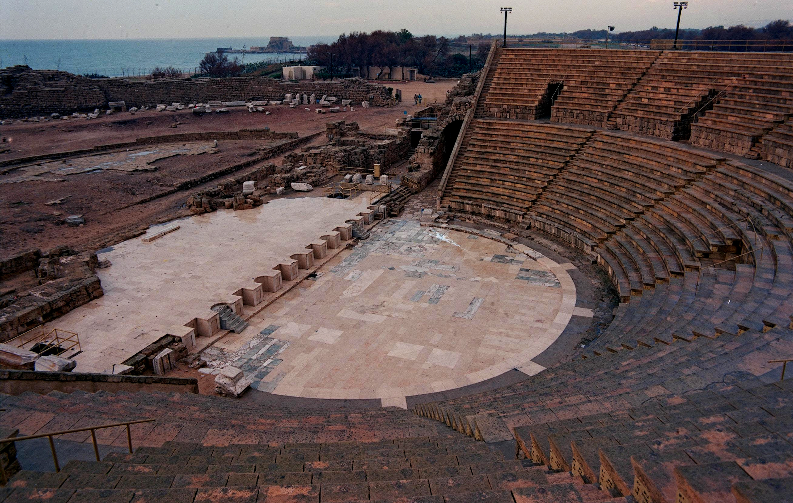

# Human-made Things in the Bible

## License Information

Human-made Things in the Bible © United Bible Societies, 2025. Adapted from: <cite>The Works of Their Hands: Man-made Things in the Bible</cite>, by Ray Pritz © 2009 United Bible Societies. This work is licensed under Creative Commons Attribution-ShareAlike 4.0 International (<a href="https://creativecommons.org/licenses/by-sa/4.0/">https://creativecommons.org/licenses/by-sa/4.0/</a>).

--------------------------------

## Armory, arsenal (id: REALIA:3.13.4)

3\.13\.4 Armory, arsenal
========================

References:
-----------

Hebrew אוֹצָר (’otsar)

[JER 50:25](https://ref.ly/Jer50:25)

Hebrew בַּיִת, כְּלִי (beyth kli)

[2KI 20:13](https://ref.ly/2Kgs20:13), [ISA 39:2](https://ref.ly/Isa39:2)

Hebrew נֶשֶׁק (nesheq)

[NEH 3:19](https://ref.ly/Neh3:19)

Description:
------------

*Reconstructed amphitheater at Caesarea Maritima (© Doron Horovitz, Israel Government Press Office)*

No specific description can be given for the armory. It is to be assumed that it was possible to close the place so that there was limited access.

---

Translation:
------------

Many languages may lack a specific word for a room or a building where many weapons are stored. It should normally be possible to use an expanded phrase, for example, “where he kept his weapons,” (CEV (Contemporary English Version); [2KI 20:13](https://ref.ly/2Kgs20:13)) or “the place where my weapons are stored” (GNT (Good News Translation (1992)); [JER 50:25](https://ref.ly/Jer50:25)). The NCV (New Century Version) rendering of [JER 50:25](https://ref.ly/Jer50:25) shows that a general word for a storage place will work well: “The LORD has opened up his storeroom and brought out the weapons ….”

* **Associated Passages:** Jeremiah 50:25; 2 Kings 20:13; Isaiah 39:2; Nehemiah 3:19

